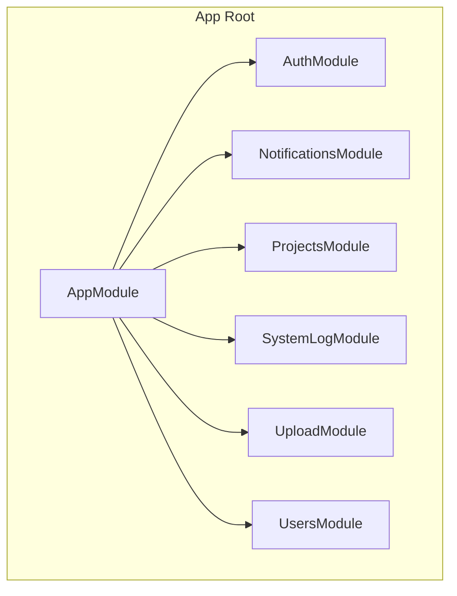
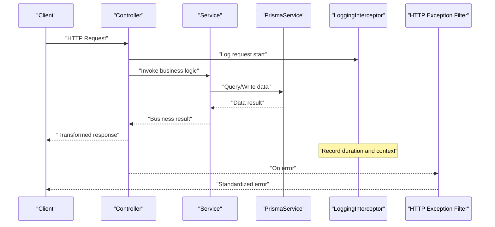

# Backend Architecture

<cite>
**Referenced Files in This Document**
- [app.module.ts](file://API/src/app.module.ts)
- [main.ts](file://API/src/main.ts)
- [auth.module.ts](file://API/src/modules/auth/auth.module.ts)
- [auth.controller.ts](file://API/src/modules/auth/auth.controller.ts)
- [auth.service.ts](file://API/src/modules/auth/auth.service.ts)
- [jwt.strategy.ts](file://API/src/modules/auth/strategies/jwt.strategy.ts)
- [roles.guard.ts](file://API/src/common/guards/roles.guard.ts)
- [roles.decorator.ts](file://API/src/common/decorators/roles.decorator.ts)
- [http-exception.filter.ts](file://API/src/common/filters/http-exception.filter.ts)
- [logging.interceptor.ts](file://API/src/common/interceptors/logging.interceptor.ts)
- [transform.interceptor.ts](file://API/src/common/interceptors/transform.interceptor.ts)
- [env.validation.ts](file://API/src/config/env.validation.ts)
- [prisma.service.ts](file://API/src/database/prisma.service.ts)
- [notification.module.ts](file://API/src/modules/notifications/notification.module.ts)
- [notification.controller.ts](file://API/src/modules/notifications/notification.controller.ts)
- [notification.service.ts](file://API/src/modules/notifications/notification.service.ts)
- [projects.module.ts](file://API/src/modules/projects/projects.module.ts)
- [projects.controller.ts](file://API/src/modules/projects/projects.controller.ts)
- [projects.service.ts](file://API/src/modules/projects/projects.service.ts)
- [system-log.module.ts](file://API/src/modules/system-log/system-log.module.ts)
- [system-log.controller.ts](file://API/src/modules/system-log/system-log.controller.ts)
- [system-log.service.ts](file://API/src/modules/system-log/system-log.service.ts)
- [upload.module.ts](file://API/src/modules/upload/upload.module.ts)
- [upload.controller.ts](file://API/src/modules/upload/upload.controller.ts)
- [upload.service.ts](file://API/src/modules/upload/upload.service.ts)
- [multer.config.ts](file://API/src/modules/upload/multer.config.ts)
- [users.module.ts](file://API/src/modules/users/users.module.ts)
- [users.controller.ts](file://API/src/modules/users/users.controller.ts)
- [users.service.ts](file://API/src/modules/users/users.service.ts)
</cite>

## Table of Contents
- Padrão Modular NestJS
- Anatomia de um Módulo
- Responsabilidade de Cada Arquivo
- Fluxo Interno do Módulo
- Dependências Permitidas

## Padrão Modular NestJS
- O backend segue o padrão modular do NestJS: cada domínio é encapsulado em seu próprio módulo (por exemplo, auth, notifications, projects, system-log, upload, users).
- A raiz da aplicação define o AppModule que importa os módulos de domínio e configura middleware global, interceptors, guards e filtros.
- Os controllers expõem as rotas REST, os services implementam a lógica de negócio e os módulos declaram providers, imports e exports necessários.
- Configurações globais (validação de variáveis de ambiente, Prisma, Swagger/OpenAPI, CORS, etc.) são centralizadas no entry point e no AppModule.

**Section sources**
- [app.module.ts](file://API/src/app.module.ts)
- [main.ts](file://API/src/main.ts)

## Anatomia de um Módulo
Cada módulo de domínio contém:
- Um arquivo .module.ts que declara o módulo, registra controllers e services, e exporta dependências reutilizáveis.
- Um ou mais controllers (.controller.ts) com handlers de rota anotados para mapear métodos HTTP.
- Um service (.service.ts) com a lógica de negócio, acesso a dados e integração com serviços externos.
- Pastas internas organizadas por responsabilidade: dto/, strategies/, types/, etc., conforme necessário.

Exemplos de módulos existentes:
- Auth: autenticação JWT, estratégias e DTOs de login/register.
- Notifications: gerenciamento de notificações.
- Projects: CRUD de projetos.
- System-Log: registro de ações do sistema.
- Upload: upload de arquivos com Multer.
- Users: gestão de usuários.

**Diagram sources**
- [app.module.ts](file://API/src/app.module.ts)
- [auth.module.ts](file://API/src/modules/auth/auth.module.ts)
- [notification.module.ts](file://API/src/modules/notifications/notification.module.ts)
- [projects.module.ts](file://API/src/modules/projects/projects.module.ts)
- [system-log.module.ts](file://API/src/modules/system-log/system-log.module.ts)
- [upload.module.ts](file://API/src/modules/upload/upload.module.ts)
- [users.module.ts](file://API/src/modules/users/users.module.ts)

**Section sources**
- [auth.module.ts](file://API/src/modules/auth/auth.module.ts)
- [notification.module.ts](file://API/src/modules/notifications/notification.module.ts)
- [projects.module.ts](file://API/src/modules/projects/projects.module.ts)
- [system-log.module.ts](file://API/src/modules/system-log/system-log.module.ts)
- [upload.module.ts](file://API/src/modules/upload/upload.module.ts)
- [users.module.ts](file://API/src/modules/users/users.module.ts)

## Responsabilidade de Cada Arquivo
- Controllers (.controller.ts): definem endpoints HTTP, validam entradas via DTOs e delegam operações aos services.
- Services (.service.ts): implementam regras de negócio, interagem com banco de dados (Prisma), chamam APIs externas e retornam dados consistentes.
- Modules (.module.ts): agrupam controllers e services, declaram imports/exports e configuram providers específicos do módulo.
- DTOs (dto/*.ts): definem contratos de entrada/saída e validações com class-validator.
- Strategies (strategies/*.ts): implementam estratégias de autenticação (ex.: JWT Strategy).
- Guards (common/guards/*.ts): aplicam políticas de autorização (ex.: RolesGuard).
- Decorators (common/decorators/*.ts): metadados como @Roles() para RBAC.
- Interceptors (common/interceptors/*.ts): transformam respostas, adicionam logging, medem tempo de execução.
- Filters (common/filters/*.ts): capturam exceções HTTP e padronizam erros.
- Database (database/*.ts): configuração do cliente de banco (PrismaService).
- Config (config/*.ts): validação de variáveis de ambiente e carregamento seguro de configurações.

**Section sources**
- [auth.controller.ts](file://API/src/modules/auth/auth.controller.ts)
- [auth.service.ts](file://API/src/modules/auth/auth.service.ts)
- [jwt.strategy.ts](file://API/src/modules/auth/strategies/jwt.strategy.ts)
- [roles.guard.ts](file://API/src/common/guards/roles.guard.ts)
- [roles.decorator.ts](file://API/src/common/decorators/roles.decorator.ts)
- [logging.interceptor.ts](file://API/src/common/interceptors/logging.interceptor.ts)
- [transform.interceptor.ts](file://API/src/common/interceptors/transform.interceptor.ts)
- [http-exception.filter.ts](file://API/src/common/filters/http-exception.filter.ts)
- [env.validation.ts](file://API/src/config/env.validation.ts)
- [prisma.service.ts](file://API/src/database/prisma.service.ts)

## Fluxo Interno do Módulo
O fluxo típico de uma requisição dentro de um módulo:
1. O controller recebe a requisição HTTP e valida os parâmetros/corpo usando DTOs.
2. O controller chama o service correspondente para executar a lógica de negócio.
3. O service acessa o banco de dados via Prisma ou integra-se com outros serviços.
4. Interceptores globais registram logs e transformam a resposta para o formato padrão.
5. Filtros capturam exceções e retornam erros padronizados.

**Diagram sources**
- [auth.controller.ts](file://API/src/modules/auth/auth.controller.ts)
- [auth.service.ts](file://API/src/modules/auth/auth.service.ts)
- [prisma.service.ts](file://API/src/database/prisma.service.ts)
- [logging.interceptor.ts](file://API/src/common/interceptors/logging.interceptor.ts)
- [http-exception.filter.ts](file://API/src/common/filters/http-exception.filter.ts)

**Section sources**
- [auth.controller.ts](file://API/src/modules/auth/auth.controller.ts)
- [auth.service.ts](file://API/src/modules/auth/auth.service.ts)
- [logging.interceptor.ts](file://API/src/common/interceptors/logging.interceptor.ts)
- [http-exception.filter.ts](file://API/src/common/filters/http-exception.filter.ts)

## Dependências Permitidas
- Módulos internos: cada módulo pode importar outros módulos quando necessário (por exemplo, AuthModule pode usar UsersModule para buscar usuários).
- Serviços compartilhados: utilitários comuns ficam em common/ e podem ser injetados em qualquer módulo.
- Banco de dados: PrismaService é fornecido globalmente e usado pelos services dos módulos.
- Autenticação e autorização: JWT Strategy e RolesGuard devem ser usados em rotas protegidas; @Roles() deve decorar controladores/métodos sensíveis.
- Upload: MulterConfig deve ser aplicado em rotas de upload do módulo upload.
- Validação de ambiente: env.validation.ts garante que variáveis obrigatórias estejam presentes antes da inicialização.

Boas práticas ao criar novos módulos:
- Crie um diretório sob modules/<nome-do-domínio> com controller, service e module.
- Defina DTOs em dto/ para validar entradas e documentar payloads.
- Use decorators de roles e guards para proteger endpoints.
- Registre interceptors e filters globais no AppModule para consistência.
- Exporte apenas o que for necessário do módulo para manter baixo acoplamento.

**Section sources**
- [app.module.ts](file://API/src/app.module.ts)
- [env.validation.ts](file://API/src/config/env.validation.ts)
- [roles.guard.ts](file://API/src/common/guards/roles.guard.ts)
- [roles.decorator.ts](file://API/src/common/decorators/roles.decorator.ts)
- [multer.config.ts](file://API/src/modules/upload/multer.config.ts)