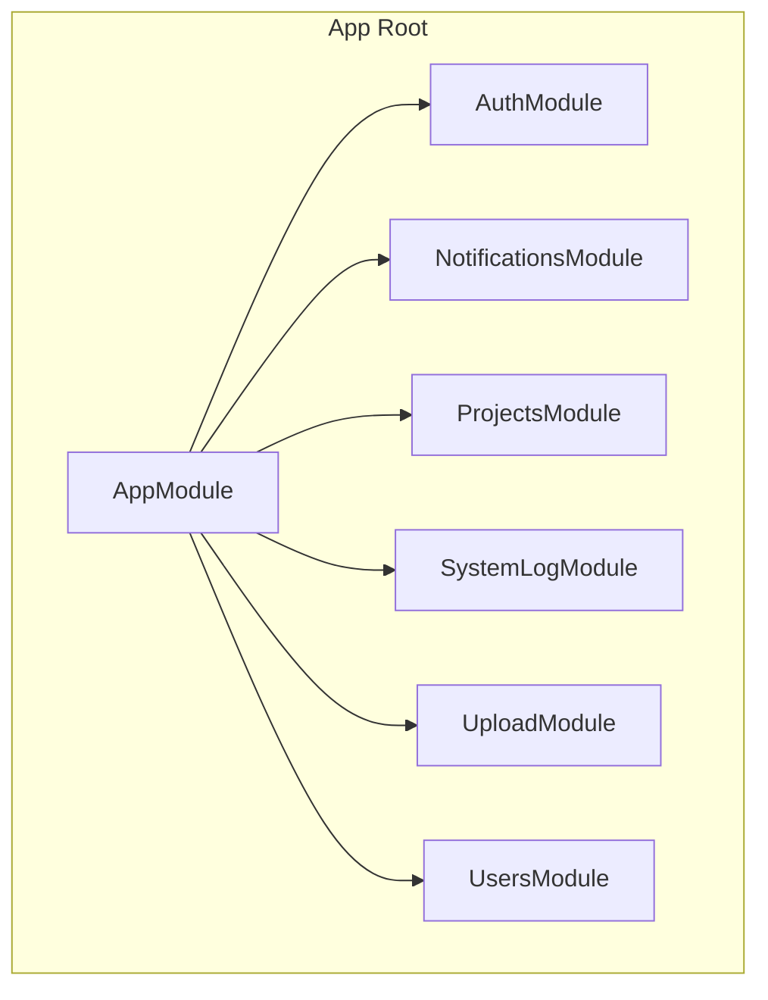
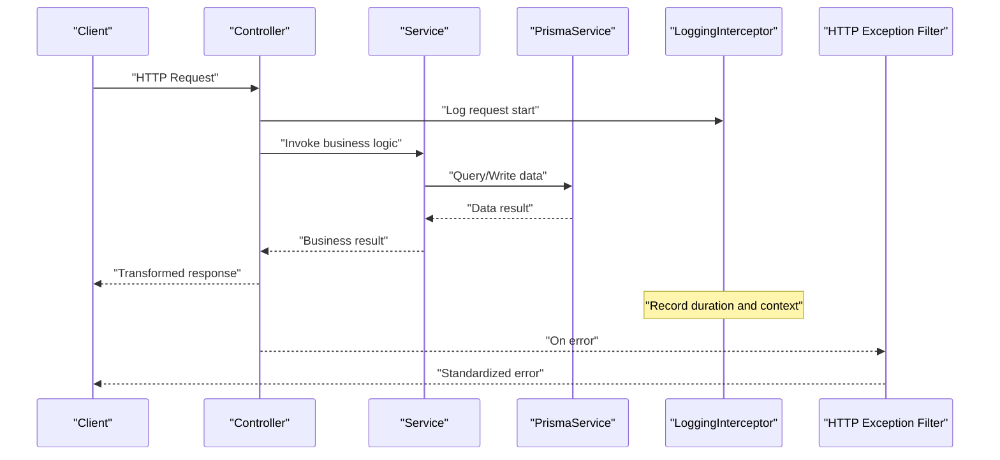
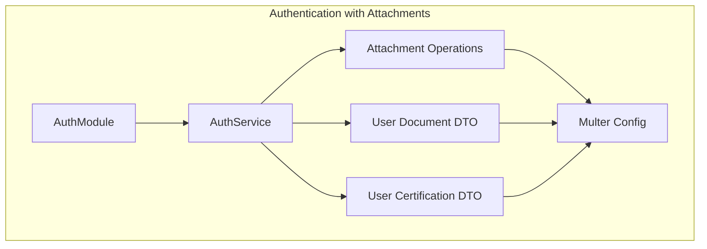

# Backend Architecture

<cite>
**Referenced Files in This Document**
- [app.module.ts](file://API/src/app.module.ts)
- [main.ts](file://API/src/main.ts)
- [auth.module.ts](file://API/src/modules/auth/auth.module.ts)
- [auth.controller.ts](file://API/src/modules/auth/auth.controller.ts)
- [auth.service.ts](file://API/src/modules/auth/auth.service.ts)
- [jwt.strategy.ts](file://API/src/modules/auth/strategies/jwt.strategy.ts)
- [roles.guard.ts](file://API/src/common/guards/roles.guard.ts)
- [roles.decorator.ts](file://API/src/common/decorators/roles.decorator.ts)
- [http-exception.filter.ts](file://API/src/common/filters/http-exception.filter.ts)
- [logging.interceptor.ts](file://API/src/common/interceptors/logging.interceptor.ts)
- [transform.interceptor.ts](file://API/src/common/interceptors/transform.interceptor.ts)
- [env.validation.ts](file://API/src/config/env.validation.ts)
- [prisma.service.ts](file://API/src/database/prisma.service.ts)
- [notification.module.ts](file://API/src/modules/notifications/notification.module.ts)
- [notification.controller.ts](file://API/src/modules/notifications/notification.controller.ts)
- [notification.service.ts](file://API/src/modules/notifications/notification.service.ts)
- [projects.module.ts](file://API/src/modules/projects/projects.module.ts)
- [projects.controller.ts](file://API/src/modules/projects/projects.controller.ts)
- [projects.service.ts](file://API/src/modules/projects/projects.service.ts)
- [system-log.module.ts](file://API/src/modules/system-log/system-log.module.ts)
- [system-log.controller.ts](file://API/src/modules/system-log/system-log.controller.ts)
- [system-log.service.ts](file://API/src/modules/system-log/system-log.service.ts)
- [upload.module.ts](file://API/src/modules/upload/upload.module.ts)
- [upload.controller.ts](file://API/src/modules/upload/upload.controller.ts)
- [upload.service.ts](file://API/src/modules/upload/upload.service.ts)
- [multer.config.ts](file://API/src/modules/upload/multer.config.ts)
- [users.module.ts](file://API/src/modules/users/users.module.ts)
- [users.controller.ts](file://API/src/modules/users/users.controller.ts)
- [users.service.ts](file://API/src/modules/users/users.service.ts)
- [user-document.dto.ts](file://API/src/modules/auth/dto/user-document.dto.ts)
- [user-certification.dto.ts](file://API/src/modules/auth/dto/user-certification.dto.ts)
</cite>

## Table of Contents
- NestJS Modular Pattern
- Module Anatomy
- File Responsibilities
- Internal Module Flow
- Allowed Dependencies
- Enhanced Authentication with Attachments

## Update Summary
**Changes Made**
- Updated authentication service documentation to reflect attachment-related operations
- Added information about extended DTOs for user-document and user-certification with attachment metadata
- Updated multer configuration details to support additional file types (photos and PDFs)
- Enhanced validation rules documentation for attachment handling

## NestJS Modular Pattern
- The backend follows the NestJS modular pattern: each domain is encapsulated in its own module (for example, auth, notifications, projects, system-log, upload, users).
- The application root defines the AppModule that imports domain modules and configures global middleware, interceptors, guards, and filters.
- Controllers expose REST routes, services implement business logic, and modules declare necessary providers, imports, and exports.
- Global configurations (environment variable validation, Prisma, Swagger/OpenAPI, CORS, etc.) are centralized at the entry point and in the AppModule.

**Section sources**
- [app.module.ts](file://API/src/app.module.ts)
- [main.ts](file://API/src/main.ts)

## Module Anatomy
Each domain module contains:
- A .module.ts file that declares the module, registers controllers and services, and exports reusable dependencies.
- One or more controllers (.controller.ts) with route handlers annotated to map HTTP methods.
- A service (.service.ts) with business logic, data access, and integration with external services.
- Internal folders organized by responsibility: dto/, strategies/, types/, etc., as needed.

Examples of existing modules:
- Auth: JWT authentication, strategies, and login/register DTOs.
- Notifications: notification management.
- Projects: project CRUD operations.
- System-Log: system action logging.
- Upload: file upload with Multer.
- Users: user management.

**Diagram sources**
- [app.module.ts](file://API/src/app.module.ts)
- [auth.module.ts](file://API/src/modules/auth/auth.module.ts)
- [notification.module.ts](file://API/src/modules/notifications/notification.module.ts)
- [projects.module.ts](file://API/src/modules/projects/projects.module.ts)
- [system-log.module.ts](file://API/src/modules/system-log/system-log.module.ts)
- [upload.module.ts](file://API/src/modules/upload/upload.module.ts)
- [users.module.ts](file://API/src/modules/users/users.module.ts)

**Section sources**
- [auth.module.ts](file://API/src/modules/auth/auth.module.ts)
- [notification.module.ts](file://API/src/modules/notifications/notification.module.ts)
- [projects.module.ts](file://API/src/modules/projects/projects.module.ts)
- [system-log.module.ts](file://API/src/modules/system-log/system-log.module.ts)
- [upload.module.ts](file://API/src/modules/upload/upload.module.ts)
- [users.module.ts](file://API/src/modules/users/users.module.ts)

## File Responsibilities
- Controllers (.controller.ts): define HTTP endpoints, validate inputs via DTOs, and delegate operations to services.
- Services (.service.ts): implement business rules, interact with database (Prisma), call external APIs, and return consistent data.
- Modules (.module.ts): group controllers and services, declare imports/exports, and configure module-specific providers.
- DTOs (dto/*.ts): define input/output contracts and validations with class-validator.
- Strategies (strategies/*.ts): implement authentication strategies (e.g., JWT Strategy).
- Guards (common/guards/*.ts): apply authorization policies (e.g., RolesGuard).
- Decorators (common/decorators/*.ts): metadata like @Roles() for RBAC.
- Interceptors (common/interceptors/*.ts): transform responses, add logging, measure execution time.
- Filters (common/filters/*.ts): capture HTTP exceptions and standardize errors.
- Database (database/*.ts): database client configuration (PrismaService).
- Config (config/*.ts): environment variable validation and secure configuration loading.

**Section sources**
- [auth.controller.ts](file://API/src/modules/auth/auth.controller.ts)
- [auth.service.ts](file://API/src/modules/auth/auth.service.ts)
- [jwt.strategy.ts](file://API/src/modules/auth/strategies/jwt.strategy.ts)
- [roles.guard.ts](file://API/src/common/guards/roles.guard.ts)
- [roles.decorator.ts](file://API/src/common/decorators/roles.decorator.ts)
- [logging.interceptor.ts](file://API/src/common/interceptors/logging.interceptor.ts)
- [transform.interceptor.ts](file://API/src/common/interceptors/transform.interceptor.ts)
- [http-exception.filter.ts](file://API/src/common/filters/http-exception.filter.ts)
- [env.validation.ts](file://API/src/config/env.validation.ts)
- [prisma.service.ts](file://API/src/database/prisma.service.ts)

## Internal Module Flow
The typical request flow within a module:
1. The controller receives the HTTP request and validates parameters/body using DTOs.
2. The controller calls the corresponding service to execute business logic.
3. The service accesses the database via Prisma or integrates with other services.
4. Global interceptors log requests and transform responses to standard format.
5. Filters capture exceptions and return standardized errors.

**Diagram sources**
- [auth.controller.ts](file://API/src/modules/auth/auth.controller.ts)
- [auth.service.ts](file://API/src/modules/auth/auth.service.ts)
- [prisma.service.ts](file://API/src/database/prisma.service.ts)
- [logging.interceptor.ts](file://API/src/common/interceptors/logging.interceptor.ts)
- [http-exception.filter.ts](file://API/src/common/filters/http-exception.filter.ts)

**Section sources**
- [auth.controller.ts](file://API/src/modules/auth/auth.controller.ts)
- [auth.service.ts](file://API/src/modules/auth/auth.service.ts)
- [logging.interceptor.ts](file://API/src/common/interceptors/logging.interceptor.ts)
- [http-exception.filter.ts](file://API/src/common/filters/http-exception.filter.ts)

## Allowed Dependencies
- Internal modules: each module can import other modules when necessary (for example, AuthModule can use UsersModule to fetch users).
- Shared services: common utilities reside in common/ and can be injected into any module.
- Database: PrismaService is provided globally and used by module services.
- Authentication and authorization: JWT Strategy and RolesGuard should be used on protected routes; @Roles() should decorate sensitive controllers/methods.
- Upload: MulterConfig should be applied to upload routes in the upload module.
- Environment validation: env.validation.ts ensures mandatory variables are present before initialization.

Best practices when creating new modules:
- Create a directory under modules/<domain-name> with controller, service, and module.
- Define DTOs in dto/ to validate inputs and document payloads.
- Use roles decorators and guards to protect endpoints.
- Register global interceptors and filters in AppModule for consistency.
- Export only what is necessary from the module to maintain low coupling.

**Section sources**
- [app.module.ts](file://API/src/app.module.ts)
- [env.validation.ts](file://API/src/config/env.validation.ts)
- [roles.guard.ts](file://API/src/common/guards/roles.guard.ts)
- [roles.decorator.ts](file://API/src/common/decorators/roles.decorator.ts)
- [multer.config.ts](file://API/src/modules/upload/multer.config.ts)

## Enhanced Authentication with Attachments

**Updated** The authentication service has been enhanced with comprehensive attachment-related operations to support document and certification management.

### Attachment Operations in Authentication Service
The auth service now includes specialized methods for handling user attachments:
- Document attachment management with file upload, validation, and metadata tracking
- Certification attachment handling with photo and PDF support
- Integrated file validation and security checks
- Attachment lifecycle management (create, update, delete, retrieve)

### Extended DTOs with Attachment Metadata
User document and certification DTOs have been enhanced with attachment capabilities:

**User Document DTO Enhancements:**
- File type validation (PDF, DOC, DOCX, images)
- Size constraints and security validation
- Attachment metadata tracking (upload date, file size, MIME type)
- Validation rules for required fields and file formats

**User Certification DTO Enhancements:**
- Photo and PDF file support with specific validation rules
- Attachment metadata including file information and validation status
- Enhanced validation for certification-specific requirements
- Support for multiple attachment types per certification

### Multer Configuration Updates
The upload system has been updated to support additional file types:
- **Photos**: JPEG, PNG, GIF formats for profile pictures and certification photos
- **PDFs**: Enhanced PDF support for documents and certifications
- **Documents**: Expanded document format support (DOC, DOCX, TXT)
- Security enhancements with file type validation and size limits

### Attachment Workflow Integration
The authentication module now provides seamless attachment handling:
- Secure file upload through dedicated endpoints
- Automatic file validation and sanitization
- Metadata extraction and storage
- Integration with user profile management
- Access control for attachment viewing and modification

**Diagram sources**
- [auth.module.ts](file://API/src/modules/auth/auth.module.ts)
- [auth.service.ts](file://API/src/modules/auth/auth.service.ts)
- [user-document.dto.ts](file://API/src/modules/auth/dto/user-document.dto.ts)
- [user-certification.dto.ts](file://API/src/modules/auth/dto/user-certification.dto.ts)
- [multer.config.ts](file://API/src/modules/upload/multer.config.ts)

**Section sources**
- [auth.service.ts](file://API/src/modules/auth/auth.service.ts)
- [user-document.dto.ts](file://API/src/modules/auth/dto/user-document.dto.ts)
- [user-certification.dto.ts](file://API/src/modules/auth/dto/user-certification.dto.ts)
- [multer.config.ts](file://API/src/modules/upload/multer.config.ts)