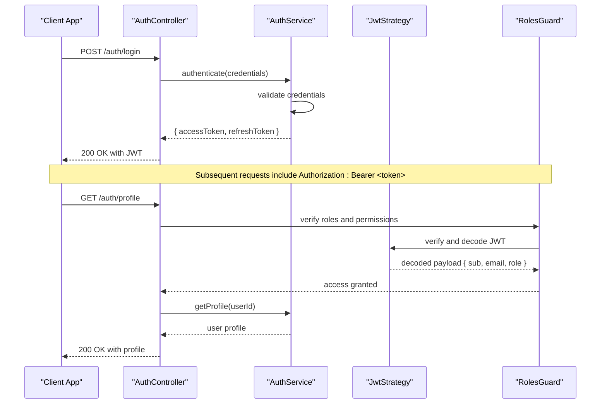
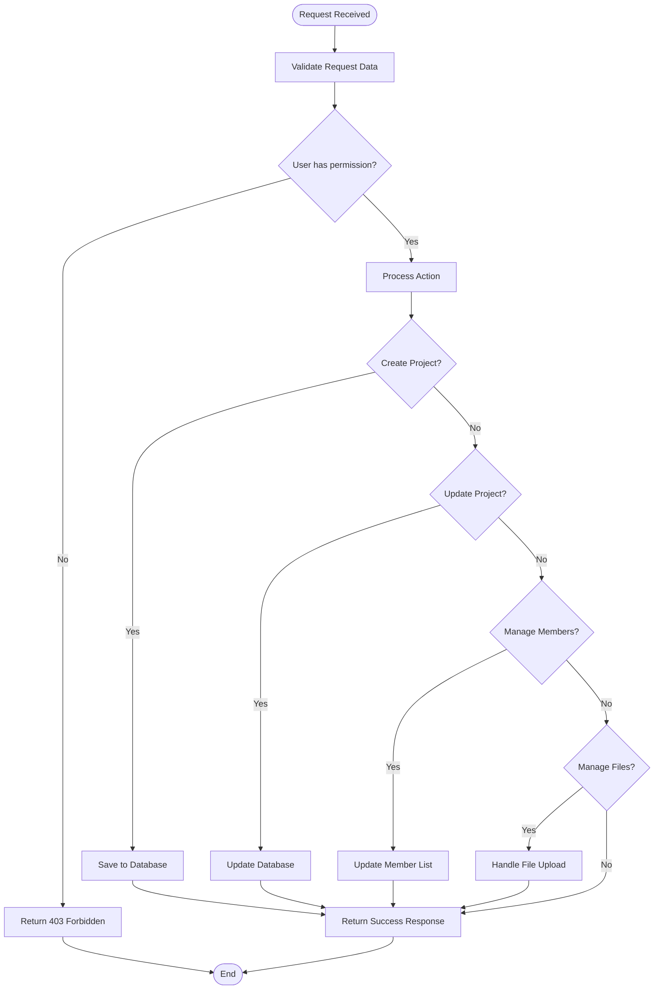
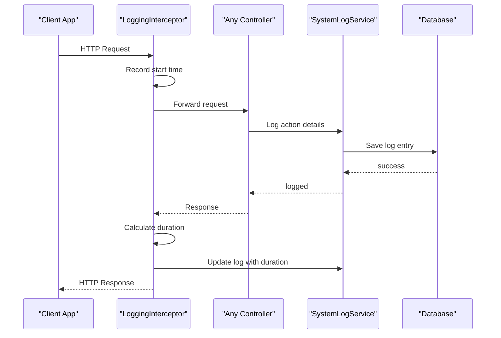
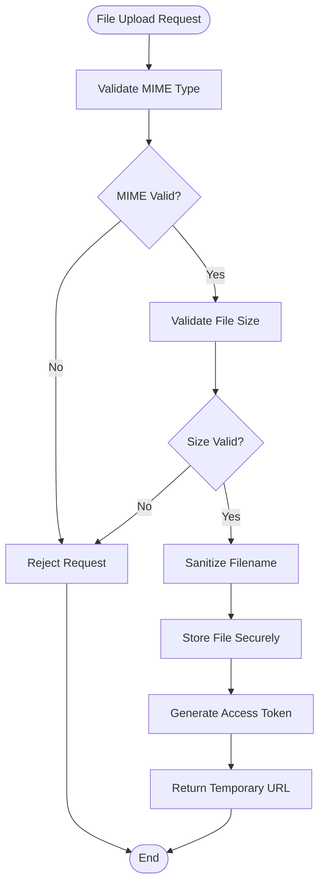
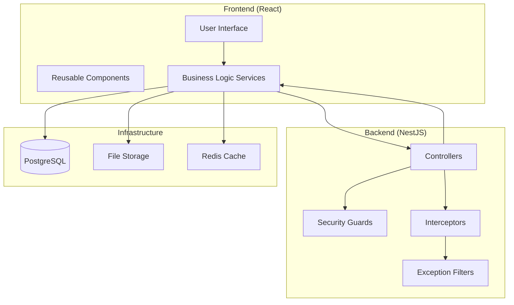

# Módulos do Sistema

<cite>
**Referenced Files in This Document**
- [auth.controller.ts](file://API/src/modules/auth/auth.controller.ts)
- [auth.service.ts](file://API/src/modules/auth/auth.service.ts)
- [auth.module.ts](file://API/src/modules/auth/auth.module.ts)
- [users.controller.ts](file://API/src/modules/users/users.controller.ts)
- [users.service.ts](file://API/src/modules/users/users.service.ts)
- [users.module.ts](file://API/src/modules/users/users.module.ts)
- [projects.controller.ts](file://API/src/modules/projects/projects.controller.ts)
- [projects.service.ts](file://API/src/modules/projects/projects.service.ts)
- [projects.module.ts](file://API/src/modules/projects/projects.module.ts)
- [notification.controller.ts](file://API/src/modules/notifications/notification.controller.ts)
- [notification.service.ts](file://API/src/modules/notifications/notification.service.ts)
- [notification.module.ts](file://API/src/modules/notifications/notification.module.ts)
- [system-log.controller.ts](file://API/src/modules/system-log/system-log.controller.ts)
- [system-log.service.ts](file://API/src/modules/system-log/system-log.service.ts)
- [system-log.module.ts](file://API/src/modules/system-log/system-log.module.ts)
- [upload.controller.ts](file://API/src/modules/upload/upload.controller.ts)
- [upload.service.ts](file://API/src/modules/upload/upload.service.ts)
- [upload.module.ts](file://API/src/modules/upload/upload.module.ts)
- [jwt.strategy.ts](file://API/src/modules/auth/strategies/jwt.strategy.ts)
- [roles.guard.ts](file://API/src/common/guards/roles.guard.ts)
- [logging.interceptor.ts](file://API/src/common/interceptors/logging.interceptor.ts)
- [transform.interceptor.ts](file://API/src/common/interceptors/transform.interceptor.ts)
- [http-exception.filter.ts](file://API/src/common/filters/http-exception.filter.ts)
- [env.validation.ts](file://API/src/config/env.validation.ts)
- [prisma.service.ts](file://API/src/database/prisma.service.ts)
- [app.module.ts](file://API/src/app.module.ts)
- [main.ts](file://API/src/main.ts)
</cite>

## Table of Contents
- Módulo Auth
- Módulo Users
- Módulo Projects
- Módulo Notifications
- Módulo SystemLog
- Módulo Upload

## Módulo Auth
Responsabilidades:
- Autenticação de usuários com login/logout e renovação de sessão.
- Emissão e validação de tokens JWT (Bearer).
- Controle de acesso baseado em papéis (RBAC) via @Roles() e RolesGuard.
- Gerenciamento de perfil básico do usuário (atualização de dados pessoais).

Principais endpoints:
- POST /auth/login — autentica credenciais e retorna token JWT.
- POST /auth/register — cria novo usuário (sujeito a regras de negócio).
- POST /auth/change-temp-password — altera senha temporária na primeira entrada.
- GET /auth/profile — recupera perfil do usuário autenticado.
- PUT /auth/profile — atualiza dados do perfil.

Fluxo de autenticação:

**Diagram sources**
- [auth.controller.ts](file://API/src/modules/auth/auth.controller.ts)
- [auth.service.ts](file://API/src/modules/auth/auth.service.ts)
- [jwt.strategy.ts](file://API/src/modules/auth/strategies/jwt.strategy.ts)
- [roles.guard.ts](file://API/src/common/guards/roles.guard.ts)

Características técnicas:
- Payload JWT contém { sub: userId, email, role }. O campo sub é o ID do usuário — nunca usar user.id.
- RBAC com 3 roles: ADMIN, HR, STANDARD.
- Respostas padronizadas via TransformInterceptor.
- Logging de ações sensíveis via LoggingInterceptor + SystemLogService.

**Section sources**
- [auth.controller.ts](file://API/src/modules/auth/auth.controller.ts)
- [auth.service.ts](file://API/src/modules/auth/auth.service.ts)
- [auth.module.ts](file://API/src/modules/auth/auth.module.ts)
- [jwt.strategy.ts](file://API/src/modules/auth/strategies/jwt.strategy.ts)
- [roles.guard.ts](file://API/src/common/guards/roles.guard.ts)

## Módulo Users
Responsabilidades:
- CRUD completo de usuários (Admin e HR).
- Gestão de perfis avançados (documentos, telefones, idiomas, certificações, contas bancárias).
- Validação de dados e conformidade com regras de negócio.
- Integração com sistema de logs para auditoria.

Principais endpoints:
- GET /users — lista usuários com paginação e filtros.
- GET /users/:id — recupera detalhes de um usuário.
- POST /users — cria novo usuário.
- PUT /users/:id — atualiza dados do usuário.
- DELETE /users/:id — soft delete de usuário.
- PATCH /users/:id/profile — atualiza perfil completo.
- POST /users/:id/documents — adiciona documento ao perfil.
- POST /users/:id/phones — adiciona telefone ao perfil.
- POST /users/:id/languages — adiciona idioma ao perfil.
- POST /users/:id/certifications — adiciona certificação ao perfil.
- POST /users/:id/bank-accounts — adiciona conta bancária ao perfil.

Estrutura de dados:
- UUID como identificador principal.
- Soft delete via campo deletedAt.
- Timestamps em UTC.
- Relacionamento 1:N entre usuário e entidades de perfil.

**Section sources**
- [users.controller.ts](file://API/src/modules/users/users.controller.ts)
- [users.service.ts](file://API/src/modules/users/users.service.ts)
- [users.module.ts](file://API/src/modules/users/users.module.ts)

## Módulo Projects
Responsabilidades:
- Gestão completa de projetos de energia eólica.
- Controle de membros e permissões por projeto.
- Gerenciamento de turbinas eólicos associados aos projetos.
- Upload e gerenciamento de arquivos relacionados a projetos.

Principais endpoints:
- GET /projects — lista projetos com paginação e filtros.
- GET /projects/:id — recupera detalhes do projeto.
- POST /projects — cria novo projeto.
- PUT /projects/:id — atualiza dados do projeto.
- DELETE /projects/:id — soft delete de projeto.
- GET /projects/:id/members — lista membros do projeto.
- POST /projects/:id/members — adiciona membro ao projeto.
- DELETE /projects/:id/members/:userId — remove membro do projeto.
- GET /projects/:id/turbines — lista turbinas do projeto.
- POST /projects/:id/turbines — adiciona nova turbina.
- PUT /projects/:id/turbines/:turbineId — atualiza dados da turbina.
- DELETE /projects/:id/turbines/:turbineId — remove turbina do projeto.
- GET /projects/:id/files — lista arquivos do projeto.
- POST /projects/:id/files — faz upload de arquivo para o projeto.

Fluxo de gerenciamento de projetos:

**Diagram sources**
- [projects.controller.ts](file://API/src/modules/projects/projects.controller.ts)
- [projects.service.ts](file://API/src/modules/projects/projects.service.ts)

**Section sources**
- [projects.controller.ts](file://API/src/modules/projects/projects.controller.ts)
- [projects.service.ts](file://API/src/modules/projects/projects.service.ts)
- [projects.module.ts](file://API/src/modules/projects/projects.module.ts)

## Módulo Notifications
Responsabilidades:
- Gerenciamento de notificações do sistema.
- Criação e leitura de notificações para usuários.
- Marcação de notificações como lidas.
- Filtros e paginação de notificações.

Principais endpoints:
- GET /notifications — lista notificações do usuário autenticado.
- GET /notifications/:id — recupera detalhes de uma notificação.
- PUT /notifications/:id/read — marca notificação como lida.
- DELETE /notifications/:id — remove notificação.
- GET /notifications/unread — lista notificações não lidas.

Características:
- Notificações vinculadas a usuários específicos.
- Suporte a diferentes tipos de notificações.
- Integração com sistema de logs para auditoria.

**Section sources**
- [notification.controller.ts](file://API/src/modules/notifications/notification.controller.ts)
- [notification.service.ts](file://API/src/modules/notifications/notification.service.ts)
- [notification.module.ts](file://API/src/modules/notifications/notification.module.ts)

## Módulo SystemLog
Responsabilidades:
- Registro centralizado de todas as ações do sistema.
- Auditoria completa de operações críticas.
- Consulta e filtragem de logs para análise.
- Exportação de relatórios de atividade.

Principais endpoints:
- GET /system-logs — lista logs com paginação e filtros avançados.
- GET /system-logs/:id — recupera detalhes de um log específico.
- GET /system-logs/stats — estatísticas de uso do sistema.
- DELETE /system-logs/cleanup — limpeza de logs antigos.

Campos de log:
- userId: usuário que realizou a ação.
- action: tipo de ação realizada.
- entity: entidade afetada pela ação.
- ipAddress: endereço IP do cliente.
- duration: tempo de execução da operação.
- metadata: dados contextuais adicionais.

Integração com interceptors:

**Diagram sources**
- [logging.interceptor.ts](file://API/src/common/interceptors/logging.interceptor.ts)
- [system-log.controller.ts](file://API/src/modules/system-log/system-log.controller.ts)
- [system-log.service.ts](file://API/src/modules/system-log/system-log.service.ts)

**Section sources**
- [system-log.controller.ts](file://API/src/modules/system-log/system-log.controller.ts)
- [system-log.service.ts](file://API/src/modules/system-log/system-log.service.ts)
- [system-log.module.ts](file://API/src/modules/system-log/system-log.module.ts)

## Módulo Upload
Responsabilidades:
- Upload seguro de arquivos com validação de MIME type e tamanho.
- Geração de URLs temporárias para acesso controlado.
- Armazenamento organizado por tipo de recurso.
- Exclusão segura de arquivos quando necessário.

Principais endpoints:
- POST /upload — faz upload de arquivo.
- GET /upload/files/:token — acessa arquivo via token temporário.
- DELETE /upload/files/:id — remove arquivo do servidor.

Validações implementadas:
- Tipo MIME permitido (imagens, documentos PDF, etc.).
- Tamanho máximo de arquivo configurável.
- Nome de arquivo sanitizado para segurança.
- Verificação de integridade do arquivo.

Fluxo de upload seguro:

**Diagram sources**
- [upload.controller.ts](file://API/src/modules/upload/upload.controller.ts)
- [upload.service.ts](file://API/src/modules/upload/upload.service.ts)

**Section sources**
- [upload.controller.ts](file://API/src/modules/upload/upload.controller.ts)
- [upload.service.ts](file://API/src/modules/upload/upload.service.ts)
- [upload.module.ts](file://API/src/modules/upload/upload.module.ts)

## Arquitetura Geral do Sistema

**Diagram sources**
- [app.module.ts](file://API/src/app.module.ts)
- [main.ts](file://API/src/main.ts)
- [prisma.service.ts](file://API/src/database/prisma.service.ts)
- [env.validation.ts](file://API/src/config/env.validation.ts)

## Considerações de Segurança
- Autenticação JWT com expiração configurável.
- Validação rigorosa de inputs em todos os endpoints.
- Proteção contra ataques XSS e CSRF.
- Logs detalhados de tentativas de acesso não autorizado.
- Criptografia de dados sensíveis no banco de dados.
- Rate limiting para prevenir abuso de API.

## Performance e Escalabilidade
- Paginação em todas as listas de dados.
- Indexação otimizada no banco de dados.
- Cache estratégico para dados frequentemente acessados.
- Upload assíncrono de arquivos grandes.
- Monitoramento de performance via logs estruturados.