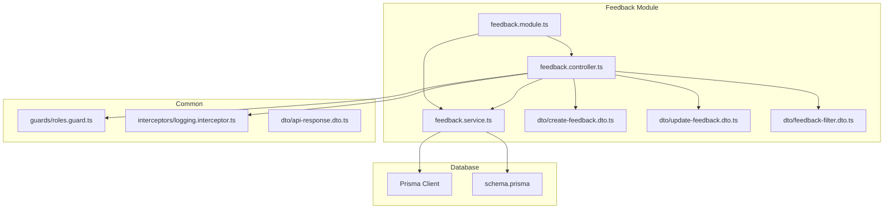
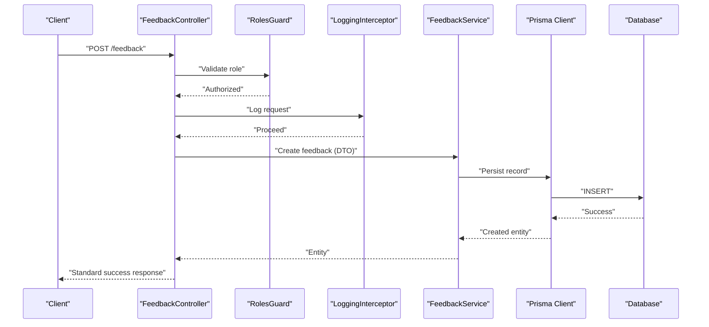
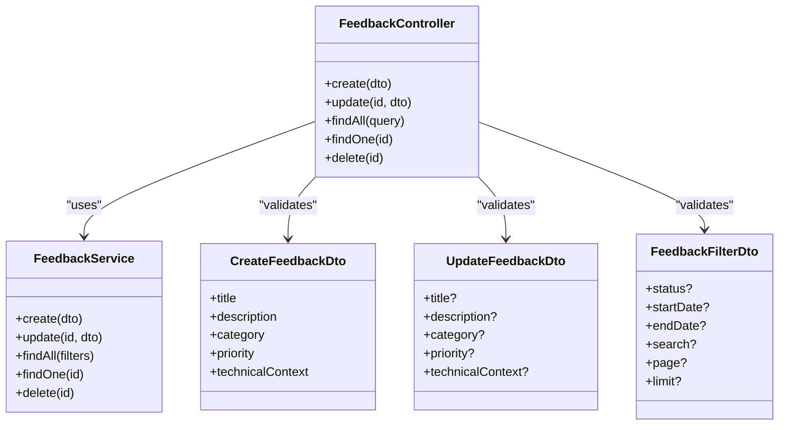
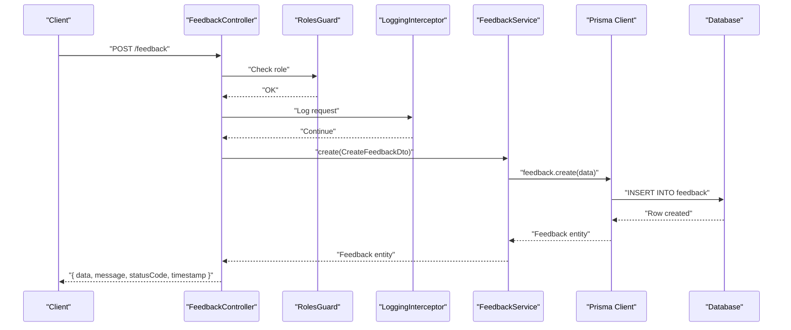
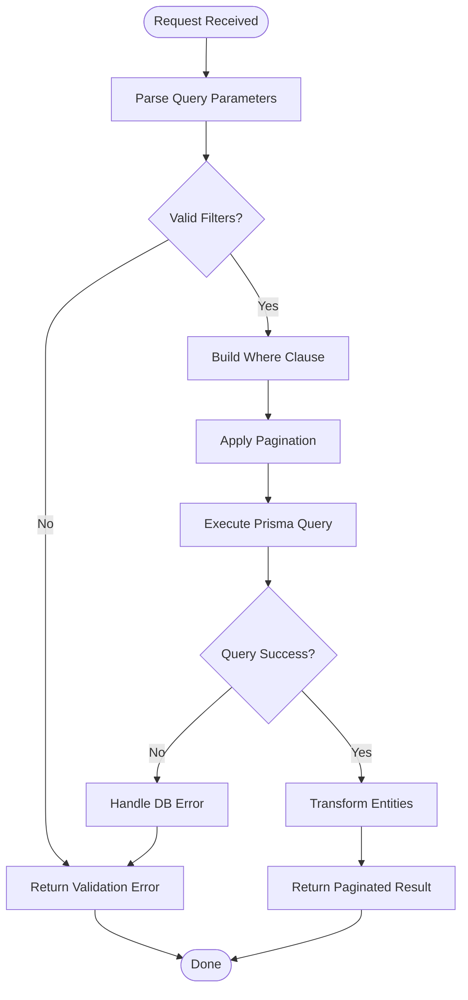
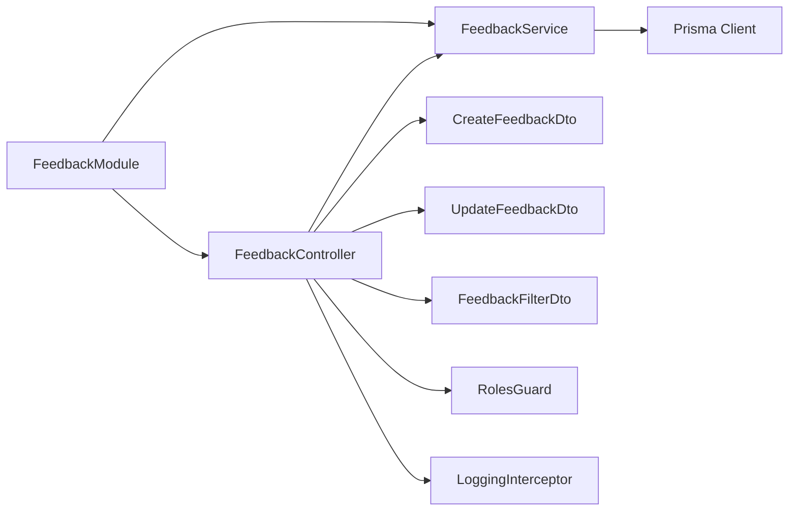

# Feedback Module - Backend

<cite>
**Referenced Files in This Document**
- [feedback.controller.ts](file://API/src/modules/feedback/feedback.controller.ts)
- [feedback.service.ts](file://API/src/modules/feedback/feedback.service.ts)
- [feedback.module.ts](file://API/src/modules/feedback/feedback.module.ts)
- [create-feedback.dto.ts](file://API/src/modules/feedback/dto/create-feedback.dto.ts)
- [update-feedback.dto.ts](file://API/src/modules/feedback/dto/update-feedback.dto.ts)
- [feedback-filter.dto.ts](file://API/src/modules/feedback/dto/feedback-filter.dto.ts)
- [schema.prisma](file://API/prisma/schema.prisma)
- [20260804104206_add_feedback_module/migration.sql](file://API/prisma/migrations/20260804104206_add_feedback_module/migration.sql)
- [20260804105922_add_technical_context_to_feedback/migration.sql](file://API/prisma/migrations/20260804105922_add_technical_context_to_feedback/migration.sql)
- [auth.controller.ts](file://API/src/modules/auth/auth.controller.ts)
- [roles.guard.ts](file://API/src/common/guards/roles.guard.ts)
- [logging.interceptor.ts](file://API/src/common/interceptors/logging.interceptor.ts)
- [api-response.dto.ts](file://API/src/common/dto/api-response.dto.ts)
</cite>

## Table of Contents
1. [Introduction](#introduction)
2. [Project Structure](#project-structure)
3. [Core Components](#core-components)
4. [Architecture Overview](#architecture-overview)
5. [Detailed Component Analysis](#detailed-component-analysis)
6. [Dependency Analysis](#dependency-analysis)
7. [Performance Considerations](#performance-considerations)
8. [Troubleshooting Guide](#troubleshooting-guide)
9. [Conclusion](#conclusion)

## Introduction
This document describes the backend implementation of the Feedback module within the Windlog monorepo. The module provides REST endpoints to create, update, list, and manage feedback records with filtering and pagination support. It integrates with authentication (JWT Bearer), role-based access control (RBAC), logging, and Prisma ORM for data persistence.

Key characteristics:
- NestJS module with controller, service, DTOs, and Prisma integration
- RBAC enforcement via RolesGuard and @Roles() decorator
- Standardized API responses and error handling
- Soft delete and UUID primary keys across entities
- UTC timestamps and Euro currency conventions

## Project Structure
The Feedback module is organized under API/src/modules/feedback with a clear separation of concerns:
- Controller: HTTP endpoints and request validation
- Service: Business logic and database operations
- DTOs: Input validation schemas
- Module: Dependency injection wiring

**Diagram sources**
- [feedback.controller.ts](file://API/src/modules/feedback/feedback.controller.ts)
- [feedback.service.ts](file://API/src/modules/feedback/feedback.service.ts)
- [feedback.module.ts](file://API/src/modules/feedback/feedback.module.ts)
- [create-feedback.dto.ts](file://API/src/modules/feedback/dto/create-feedback.dto.ts)
- [update-feedback.dto.ts](file://API/src/modules/feedback/dto/update-feedback.dto.ts)
- [feedback-filter.dto.ts](file://API/src/modules/feedback/dto/feedback-filter.dto.ts)
- [roles.guard.ts](file://API/src/common/guards/roles.guard.ts)
- [logging.interceptor.ts](file://API/src/common/interceptors/logging.interceptor.ts)
- [api-response.dto.ts](file://API/src/common/dto/api-response.dto.ts)
- [schema.prisma](file://API/prisma/schema.prisma)

**Section sources**
- [feedback.controller.ts](file://API/src/modules/feedback/feedback.controller.ts)
- [feedback.service.ts](file://API/src/modules/feedback/feedback.service.ts)
- [feedback.module.ts](file://API/src/modules/feedback/feedback.module.ts)
- [create-feedback.dto.ts](file://API/src/modules/feedback/dto/create-feedback.dto.ts)
- [update-feedback.dto.ts](file://API/src/modules/feedback/dto/update-feedback.dto.ts)
- [feedback-filter.dto.ts](file://API/src/modules/feedback/dto/feedback-filter.dto.ts)

## Core Components
- FeedbackController: Exposes REST endpoints for CRUD operations on feedback, applies validation via DTOs, and enforces roles.
- FeedbackService: Implements business rules, queries, and mutations through Prisma, including filtering and pagination.
- DTOs: Define input shapes and validation constraints for creating and updating feedback, plus filter parameters.
- FeedbackModule: Wires controller, service, and dependencies; registers guards and interceptors as needed.

Responsibilities:
- Controller handles HTTP layer: route mapping, parameter binding, response formatting.
- Service encapsulates domain logic: validation beyond DTOs, transactions if needed, and data transformations.
- DTOs ensure safe inputs and consistent API contracts.
- Module configures NestJS DI and feature registration.

**Section sources**
- [feedback.controller.ts](file://API/src/modules/feedback/feedback.controller.ts)
- [feedback.service.ts](file://API/src/modules/feedback/feedback.service.ts)
- [feedback.module.ts](file://API/src/modules/feedback/feedback.module.ts)
- [create-feedback.dto.ts](file://API/src/modules/feedback/dto/create-feedback.dto.ts)
- [update-feedback.dto.ts](file://API/src/modules/feedback/dto/update-feedback.dto.ts)
- [feedback-filter.dto.ts](file://API/src/modules/feedback/dto/feedback-filter.dto.ts)

## Architecture Overview
The Feedback module follows a layered architecture:
- HTTP Layer: Controller receives requests, validates inputs, and returns standardized responses.
- Business Layer: Service performs operations using Prisma, enforces business rules, and manages transactions.
- Data Layer: Prisma interacts with the relational database defined by schema.prisma and migrations.

**Diagram sources**
- [feedback.controller.ts](file://API/src/modules/feedback/feedback.controller.ts)
- [roles.guard.ts](file://API/src/common/guards/roles.guard.ts)
- [logging.interceptor.ts](file://API/src/common/interceptors/logging.interceptor.ts)
- [feedback.service.ts](file://API/src/modules/feedback/feedback.service.ts)
- [schema.prisma](file://API/prisma/schema.prisma)

## Detailed Component Analysis

### FeedbackController
- Endpoints: Create, Update, List (with filters/pagination), Get by ID, Delete (soft delete).
- Validation: Uses DTOs for request bodies and query parameters.
- Authorization: Enforced via @Roles() and RolesGuard.
- Response format: Standardized success/error structures.

Key behaviors:
- Maps HTTP methods to service methods.
- Applies class-validator decorators from DTOs.
- Integrates with global interceptors for logging and transformation.

**Section sources**
- [feedback.controller.ts](file://API/src/modules/feedback/feedback.controller.ts)
- [roles.guard.ts](file://API/src/common/guards/roles.guard.ts)
- [api-response.dto.ts](file://API/src/common/dto/api-response.dto.ts)

### FeedbackService
- Operations: Create, Update, FindMany (filters), FindOne, Delete (soft delete).
- Filtering: Supports fields like status, date ranges, user/project context if applicable.
- Pagination: Offset or cursor-based pagination via DTO parameters.
- Transactions: Used when multiple writes are required.
- Error handling: Throws domain-specific exceptions mapped to standard error responses.

Data flow:
- Receives validated DTOs from controller.
- Executes Prisma queries/mutations.
- Returns normalized entities or errors.

**Section sources**
- [feedback.service.ts](file://API/src/modules/feedback/feedback.service.ts)
- [create-feedback.dto.ts](file://API/src/modules/feedback/dto/create-feedback.dto.ts)
- [update-feedback.dto.ts](file://API/src/modules/feedback/dto/update-feedback.dto.ts)
- [feedback-filter.dto.ts](file://API/src/modules/feedback/dto/feedback-filter.dto.ts)

### DTOs
- CreateFeedbackDto: Required fields for creating feedback (e.g., title, description, category, priority, technicalContext).
- UpdateFeedbackDto: Partial updates with optional fields.
- FeedbackFilterDto: Query parameters for filtering and pagination (status, dates, search terms, page, limit).

Validation highlights:
- Type safety and constraints enforced at the HTTP boundary.
- Centralized error messages for invalid inputs.

**Section sources**
- [create-feedback.dto.ts](file://API/src/modules/feedback/dto/create-feedback.dto.ts)
- [update-feedback.dto.ts](file://API/src/modules/feedback/dto/update-feedback.dto.ts)
- [feedback-filter.dto.ts](file://API/src/modules/feedback/dto/feedback-filter.dto.ts)

### Database Schema and Migrations
- Entities: Feedback model with UUID id, timestamps (createdAt, updatedAt), soft delete (deletedAt), and technical context fields.
- Relationships: Links to users and projects if applicable.
- Migrations: Initial schema addition and technical context extension.

Schema evolution:
- Migration adds core feedback table.
- Subsequent migration introduces technical context fields.

**Section sources**
- [schema.prisma](file://API/prisma/schema.prisma)
- [20260804104206_add_feedback_module/migration.sql](file://API/prisma/migrations/20260804104206_add_feedback_module/migration.sql)
- [20260804105922_add_technical_context_to_feedback/migration.sql](file://API/prisma/migrations/20260804105922_add_technical_context_to_feedback/migration.sql)

### Class Diagram

**Diagram sources**
- [feedback.controller.ts](file://API/src/modules/feedback/feedback.controller.ts)
- [feedback.service.ts](file://API/src/modules/feedback/feedback.service.ts)
- [create-feedback.dto.ts](file://API/src/modules/feedback/dto/create-feedback.dto.ts)
- [update-feedback.dto.ts](file://API/src/modules/feedback/dto/update-feedback.dto.ts)
- [feedback-filter.dto.ts](file://API/src/modules/feedback/dto/feedback-filter.dto.ts)

### Sequence Diagram: Create Feedback

**Diagram sources**
- [feedback.controller.ts](file://API/src/modules/feedback/feedback.controller.ts)
- [roles.guard.ts](file://API/src/common/guards/roles.guard.ts)
- [logging.interceptor.ts](file://API/src/common/interceptors/logging.interceptor.ts)
- [feedback.service.ts](file://API/src/modules/feedback/feedback.service.ts)
- [schema.prisma](file://API/prisma/schema.prisma)

### Flowchart: Filter and Paginate Feedback

**Diagram sources**
- [feedback.service.ts](file://API/src/modules/feedback/feedback.service.ts)
- [feedback-filter.dto.ts](file://API/src/modules/feedback/dto/feedback-filter.dto.ts)

## Dependency Analysis
- Controller depends on Service and DTOs for validation.
- Service depends on Prisma Client and database schema.
- Global Guards and Interceptors apply across controllers.
- Module wires dependencies and registers features.

**Diagram sources**
- [feedback.controller.ts](file://API/src/modules/feedback/feedback.controller.ts)
- [feedback.service.ts](file://API/src/modules/feedback/feedback.service.ts)
- [feedback.module.ts](file://API/src/modules/feedback/feedback.module.ts)
- [roles.guard.ts](file://API/src/common/guards/roles.guard.ts)
- [logging.interceptor.ts](file://API/src/common/interceptors/logging.interceptor.ts)

**Section sources**
- [feedback.module.ts](file://API/src/modules/feedback/feedback.module.ts)
- [roles.guard.ts](file://API/src/common/guards/roles.guard.ts)
- [logging.interceptor.ts](file://API/src/common/interceptors/logging.interceptor.ts)

## Performance Considerations
- Use efficient Prisma queries with selective field projection.
- Implement indexes on frequently filtered columns (e.g., status, createdAt).
- Avoid N+1 queries by using include/select appropriately.
- Cache read-heavy endpoints if appropriate (e.g., Redis) with invalidation strategies.
- Ensure pagination limits are bounded to prevent large payloads.

[No sources needed since this section provides general guidance]

## Troubleshooting Guide
Common issues and resolutions:
- Authentication failures: Verify JWT Bearer token presence and validity. Check payload contains sub, email, role.
- Authorization errors: Confirm user role matches @Roles() requirements.
- Validation errors: Inspect DTO constraints and request payloads.
- Database errors: Review Prisma logs and migration status.
- Logging gaps: Ensure LoggingInterceptor is active and SystemLogService is configured.

**Section sources**
- [auth.controller.ts](file://API/src/modules/auth/auth.controller.ts)
- [roles.guard.ts](file://API/src/common/guards/roles.guard.ts)
- [logging.interceptor.ts](file://API/src/common/interceptors/logging.interceptor.ts)

## Conclusion
The Feedback module delivers a robust, secure, and maintainable backend feature set aligned with Windlog’s architectural standards. It leverages NestJS best practices, Prisma for data access, and centralized guards/interceptors for cross-cutting concerns. Adhering to standardized responses, RBAC, and comprehensive logging ensures reliability and observability.

[No sources needed since this section summarizes without analyzing specific files]