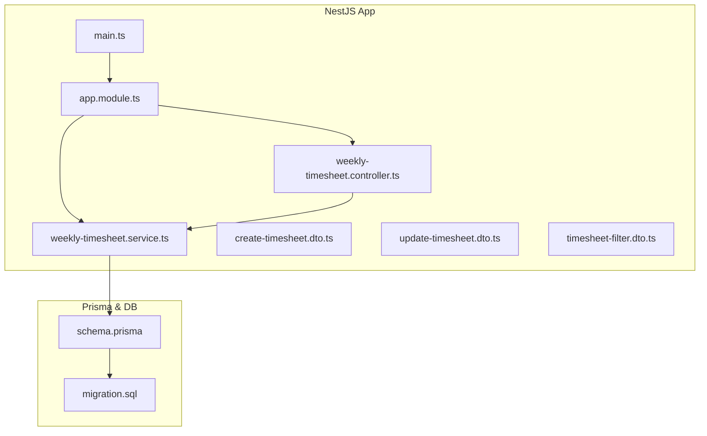
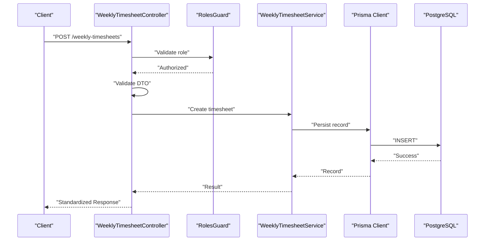
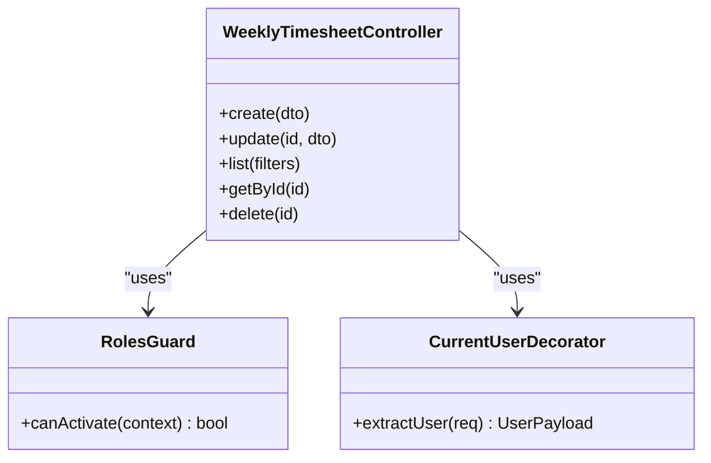
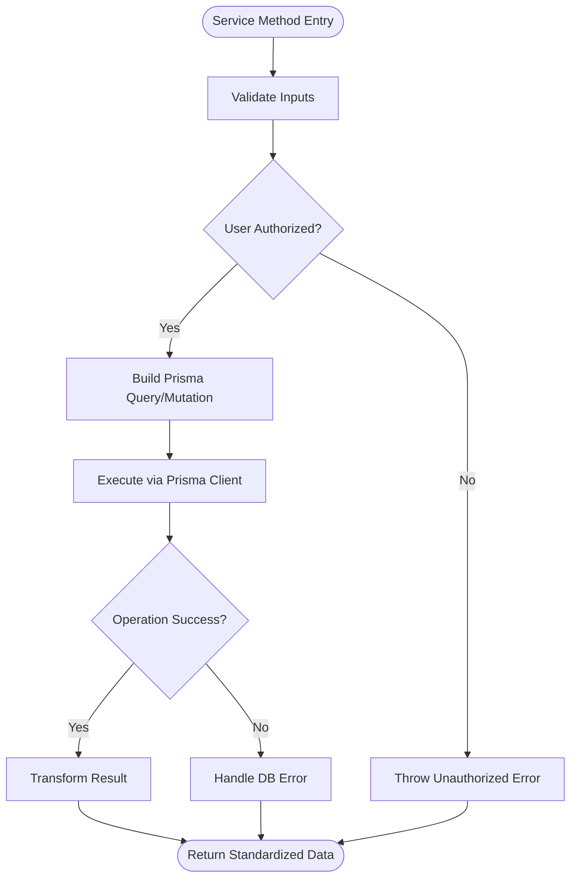
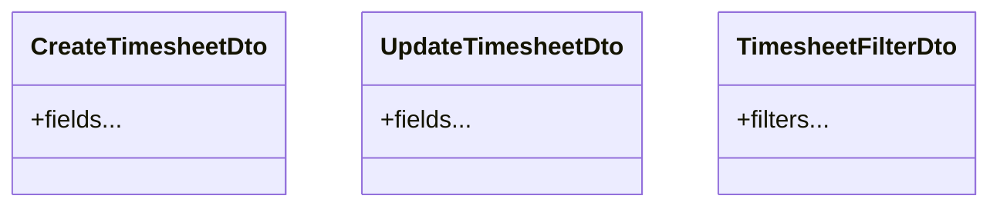
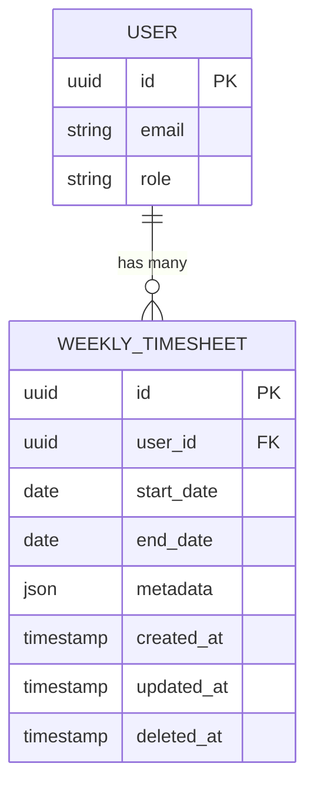
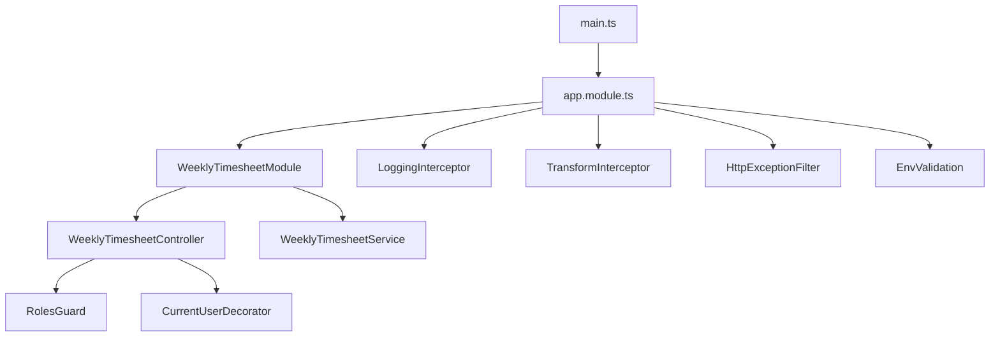

# Timesheet Semanal - Módulo Backend

<cite>
**Referenced Files in This Document**
- [weekly-timesheet.controller.ts](file://API/src/modules/weekly-timesheet/weekly-timesheet.controller.ts)
- [weekly-timesheet.service.ts](file://API/src/modules/weekly-timesheet/weekly-timesheet.service.ts)
- [create-timesheet.dto.ts](file://API/src/modules/weekly-timesheet/dto/create-timesheet.dto.ts)
- [update-timesheet.dto.ts](file://API/src/modules/weekly-timesheet/dto/update-timesheet.dto.ts)
- [timesheet-filter.dto.ts](file://API/src/modules/weekly-timesheet/dto/timesheet-filter.dto.ts)
- [schema.prisma](file://API/prisma/schema.prisma)
- [20260802222130_add_weekly_timesheet/migration.sql](file://API/prisma/migrations/20260802222130_add_weekly_timesheet/migration.sql)
- [app.module.ts](file://API/src/app.module.ts)
- [main.ts](file://API/src/main.ts)
- [env.validation.ts](file://API/src/config/env.validation.ts)
- [logging.interceptor.ts](file://API/src/common/interceptors/logging.interceptor.ts)
- [transform.interceptor.ts](file://API/src/common/interceptors/transform.interceptor.ts)
- [http-exception.filter.ts](file://API/src/common/filters/http-exception.filter.ts)
- [roles.guard.ts](file://API/src/common/guards/roles.guard.ts)
- [current-user.decorator.ts](file://API/src/common/decorators/current-user.decorator.ts)
- [roles.decorator.ts](file://API/src/common/decorators/roles.decorator.ts)
</cite>

## Table of Contents
1. [Introduction](#introduction)
2. [Project Structure](#project-structure)
3. [Core Components](#core-components)
4. [Architecture Overview](#architecture-overview)
5. [Detailed Component Analysis](#detailed-component-analysis)
6. [Dependency Analysis](#dependency-analysis)
7. [Performance Considerations](#performance-considerations)
8. [Troubleshooting Guide](#troubleshooting-guide)
9. [Conclusion](#conclusion)

## Introduction
This document describes the backend implementation of the Weekly Timesheet (Timesheet Semanal) module within the Windlog system. It explains how weekly timesheets are modeled, created, updated, filtered, and persisted using NestJS, Prisma, and a PostgreSQL database. It also covers authentication, authorization, validation, logging, and error handling patterns used by this module.

## Project Structure
The Weekly Timesheet module is implemented as a NestJS feature module under API/src/modules/weekly-timesheet with:
- Controller: HTTP endpoints for creating, updating, listing, filtering, and managing weekly timesheets.
- Service: Business logic for data operations, validations, and interactions with the database via Prisma.
- DTOs: Request/response schemas for input validation and Swagger documentation.

Database schema and migrations are defined under API/prisma, including the migration that introduces the weekly timesheet entities.

**Diagram sources**
- [app.module.ts](file://API/src/app.module.ts)
- [main.ts](file://API/src/main.ts)
- [weekly-timesheet.controller.ts](file://API/src/modules/weekly-timesheet/weekly-timesheet.controller.ts)
- [weekly-timesheet.service.ts](file://API/src/modules/weekly-timesheet/weekly-timesheet.service.ts)
- [create-timesheet.dto.ts](file://API/src/modules/weekly-timesheet/dto/create-timesheet.dto.ts)
- [update-timesheet.dto.ts](file://API/src/modules/weekly-timesheet/dto/update-timesheet.dto.ts)
- [timesheet-filter.dto.ts](file://API/src/modules/weekly-timesheet/dto/timesheet-filter.dto.ts)
- [schema.prisma](file://API/prisma/schema.prisma)
- [20260802222130_add_weekly_timesheet/migration.sql](file://API/prisma/migrations/20260802222130_add_weekly_timesheet/migration.sql)

**Section sources**
- [weekly-timesheet.controller.ts](file://API/src/modules/weekly-timesheet/weekly-timesheet.controller.ts)
- [weekly-timesheet.service.ts](file://API/src/modules/weekly-timesheet/weekly-timesheet.service.ts)
- [create-timesheet.dto.ts](file://API/src/modules/weekly-timesheet/dto/create-timesheet.dto.ts)
- [update-timesheet.dto.ts](file://API/src/modules/weekly-timesheet/dto/update-timesheet.dto.ts)
- [timesheet-filter.dto.ts](file://API/src/modules/weekly-timesheet/dto/timesheet-filter.dto.ts)
- [schema.prisma](file://API/prisma/schema.prisma)
- [20260802222130_add_weekly_timesheet/migration.sql](file://API/prisma/migrations/20260802222130_add_weekly_timesheet/migration.sql)

## Core Components
- Controller: Exposes REST endpoints for weekly timesheet operations. Uses decorators for roles and current user context. Validates request payloads with class-validator and returns standardized responses.
- Service: Encapsulates business rules for weekly timesheet creation, updates, queries, and filters. Interacts with Prisma client to persist and retrieve data.
- DTOs: Define strict request shapes for create, update, and filter operations. Used for validation and OpenAPI docs.

Key responsibilities:
- Input validation and sanitization via DTOs.
- Authorization checks using roles guard and decorator.
- Database operations through Prisma service.
- Consistent response formatting and error handling.

**Section sources**
- [weekly-timesheet.controller.ts](file://API/src/modules/weekly-timesheet/weekly-timesheet.controller.ts)
- [weekly-timesheet.service.ts](file://API/src/modules/weekly-timesheet/weekly-timesheet.service.ts)
- [create-timesheet.dto.ts](file://API/src/modules/weekly-timesheet/dto/create-timesheet.dto.ts)
- [update-timesheet.dto.ts](file://API/src/modules/weekly-timesheet/dto/update-timesheet.dto.ts)
- [timesheet-filter.dto.ts](file://API/src/modules/weekly-timesheet/dto/timesheet-filter.dto.ts)

## Architecture Overview
The Weekly Timesheet module follows NestJS modular architecture:
- HTTP requests enter via the controller.
- The controller delegates to the service after validating inputs and checking roles.
- The service performs business logic and uses Prisma to interact with the database.
- Global interceptors and filters standardize logging, response transformation, and error formatting.

**Diagram sources**
- [weekly-timesheet.controller.ts](file://API/src/modules/weekly-timesheet/weekly-timesheet.controller.ts)
- [weekly-timesheet.service.ts](file://API/src/modules/weekly-timesheet/weekly-timesheet.service.ts)
- [roles.guard.ts](file://API/src/common/guards/roles.guard.ts)
- [schema.prisma](file://API/prisma/schema.prisma)

**Section sources**
- [weekly-timesheet.controller.ts](file://API/src/modules/weekly-timesheet/weekly-timesheet.controller.ts)
- [weekly-timesheet.service.ts](file://API/src/modules/weekly-timesheet/weekly-timesheet.service.ts)
- [roles.guard.ts](file://API/src/common/guards/roles.guard.ts)

## Detailed Component Analysis

### Controller Analysis
Responsibilities:
- Define REST endpoints for weekly timesheet CRUD and filtering.
- Use @Roles() to enforce RBAC.
- Inject @CurrentUser() to access authenticated user context from JWT payload.
- Validate request bodies with DTOs.
- Return standardized responses handled by global transform interceptor.

Common patterns:
- Role-based access control via RolesGuard.
- Current user extraction from JWT into a typed object.
- Validation errors propagated through HTTP exception filter.

**Diagram sources**
- [weekly-timesheet.controller.ts](file://API/src/modules/weekly-timesheet/weekly-timesheet.controller.ts)
- [roles.guard.ts](file://API/src/common/guards/roles.guard.ts)
- [current-user.decorator.ts](file://API/src/common/decorators/current-user.decorator.ts)

**Section sources**
- [weekly-timesheet.controller.ts](file://API/src/modules/weekly-timesheet/weekly-timesheet.controller.ts)
- [roles.guard.ts](file://API/src/common/guards/roles.guard.ts)
- [current-user.decorator.ts](file://API/src/common/decorators/current-user.decorator.ts)

### Service Analysis
Responsibilities:
- Implement business rules for weekly timesheet creation, updates, and queries.
- Validate constraints such as date ranges, user permissions, and data integrity.
- Use Prisma client for efficient database operations.
- Handle soft delete semantics if applicable.

Data flow:
- Controller calls service methods with validated DTOs.
- Service constructs Prisma queries or mutations.
- Service returns domain objects or transformed results.

**Diagram sources**
- [weekly-timesheet.service.ts](file://API/src/modules/weekly-timesheet/weekly-timesheet.service.ts)

**Section sources**
- [weekly-timesheet.service.ts](file://API/src/modules/weekly-timesheet/weekly-timesheet.service.ts)

### DTOs Analysis
- CreateTimesheetDto: Defines required fields for creating a weekly timesheet entry.
- UpdateTimesheetDto: Partial fields for updating existing entries.
- TimesheetFilterDto: Query parameters for filtering lists (e.g., date range, user, status).

Validation strategy:
- Class-validator decorators ensure type safety and constraints.
- Errors are caught and formatted by global exception filter.

**Diagram sources**
- [create-timesheet.dto.ts](file://API/src/modules/weekly-timesheet/dto/create-timesheet.dto.ts)
- [update-timesheet.dto.ts](file://API/src/modules/weekly-timesheet/dto/update-timesheet.dto.ts)
- [timesheet-filter.dto.ts](file://API/src/modules/weekly-timesheet/dto/timesheet-filter.dto.ts)

**Section sources**
- [create-timesheet.dto.ts](file://API/src/modules/weekly-timesheet/dto/create-timesheet.dto.ts)
- [update-timesheet.dto.ts](file://API/src/modules/weekly-timesheet/dto/update-timesheet.dto.ts)
- [timesheet-filter.dto.ts](file://API/src/modules/weekly-timesheet/dto/timesheet-filter.dto.ts)

### Database Schema and Migrations
- The schema defines the weekly timesheet entities and relationships.
- Migration adds necessary tables and indexes for performance and integrity.
- Soft delete and timestamps are applied consistently across entities.

**Diagram sources**
- [schema.prisma](file://API/prisma/schema.prisma)
- [20260802222130_add_weekly_timesheet/migration.sql](file://API/prisma/migrations/20260802222130_add_weekly_timesheet/migration.sql)

**Section sources**
- [schema.prisma](file://API/prisma/schema.prisma)
- [20260802222130_add_weekly_timesheet/migration.sql](file://API/prisma/migrations/20260802222130_add_weekly_timesheet/migration.sql)

## Dependency Analysis
Module registration and application bootstrap:
- app.module.ts registers feature modules, including weekly-timesheet.
- main.ts configures global interceptors, filters, and environment validation.

Global cross-cutting concerns:
- LoggingInterceptor logs all requests/responses with duration and context.
- TransformInterceptor standardizes response envelopes.
- HttpExceptionFilter formats errors uniformly.
- RolesGuard enforces RBAC based on JWT payload.
- Env validation ensures required configuration variables exist.

**Diagram sources**
- [main.ts](file://API/src/main.ts)
- [app.module.ts](file://API/src/app.module.ts)
- [weekly-timesheet.controller.ts](file://API/src/modules/weekly-timesheet/weekly-timesheet.controller.ts)
- [weekly-timesheet.service.ts](file://API/src/modules/weekly-timesheet/weekly-timesheet.service.ts)
- [roles.guard.ts](file://API/src/common/guards/roles.guard.ts)
- [current-user.decorator.ts](file://API/src/common/decorators/current-user.decorator.ts)
- [logging.interceptor.ts](file://API/src/common/interceptors/logging.interceptor.ts)
- [transform.interceptor.ts](file://API/src/common/interceptors/transform.interceptor.ts)
- [http-exception.filter.ts](file://API/src/common/filters/http-exception.filter.ts)
- [env.validation.ts](file://API/src/config/env.validation.ts)

**Section sources**
- [main.ts](file://API/src/main.ts)
- [app.module.ts](file://API/src/app.module.ts)
- [logging.interceptor.ts](file://API/src/common/interceptors/logging.interceptor.ts)
- [transform.interceptor.ts](file://API/src/common/interceptors/transform.interceptor.ts)
- [http-exception.filter.ts](file://API/src/common/filters/http-exception.filter.ts)
- [roles.guard.ts](file://API/src/common/guards/roles.guard.ts)
- [current-user.decorator.ts](file://API/src/common/decorators/current-user.decorator.ts)
- [env.validation.ts](file://API/src/config/env.validation.ts)

## Performance Considerations
- Use Prisma query optimization: select only needed fields, avoid N+1 queries by leveraging relations and include/select appropriately.
- Index frequently queried columns (e.g., user_id, dates) to speed up filtering and listing.
- Apply pagination on list endpoints to limit result sets.
- Cache read-heavy operations where appropriate (e.g., static lookup data).
- Ensure DTO validation occurs early to fail fast on invalid inputs.

[No sources needed since this section provides general guidance]

## Troubleshooting Guide
Common issues and resolutions:
- Authentication failures: Verify JWT token presence and validity; ensure sub field contains userId.
- Authorization errors: Confirm user role matches @Roles() expectations; check RolesGuard behavior.
- Validation errors: Inspect DTO constraints; ensure request body matches expected shape.
- Database errors: Review Prisma logs and migration status; verify foreign key constraints and unique indexes.
- Logging and tracing: Use LoggingInterceptor output to identify slow endpoints and failed requests.

**Section sources**
- [roles.guard.ts](file://API/src/common/guards/roles.guard.ts)
- [current-user.decorator.ts](file://API/src/common/decorators/current-user.decorator.ts)
- [logging.interceptor.ts](file://API/src/common/interceptors/logging.interceptor.ts)
- [http-exception.filter.ts](file://API/src/common/filters/http-exception.filter.ts)

## Conclusion
The Weekly Timesheet module integrates cleanly with the Windlog backend’s established patterns: NestJS modularity, Prisma ORM, JWT-based authentication, RBAC, standardized responses, and comprehensive logging. By following the documented structure and best practices, developers can extend and maintain the module effectively while ensuring security, performance, and reliability.

[No sources needed since this section summarizes without analyzing specific files]