# Weekly Timesheet - Backend Module

<cite>
**Referenced Files in This Document**
- [weekly-timesheet.controller.ts](file://API/src/modules/weekly-timesheet/weekly-timesheet.controller.ts)
- [weekly-timesheet.service.ts](file://API/src/modules/weekly-timesheet/weekly-timesheet.service.ts)
- [create-timesheet.dto.ts](file://API/src/modules/weekly-timesheet/dto/create-timesheet.dto.ts)
- [update-timesheet.dto.ts](file://API/src/modules/weekly-timesheet/dto/update-timesheet.dto.ts)
- [timesheet-filter.dto.ts](file://API/src/modules/weekly-timesheet/dto/timesheet-filter.dto.ts)
- [schema.prisma](file://API/prisma/schema.prisma)
- [20260802222130_add_weekly_timesheet/migration.sql](file://API/prisma/migrations/20260802222130_add_weekly_timesheet/migration.sql)
- [20260803002856_add_shared_values_to_day/migration.sql](file://API/prisma/migrations/20260803002856_add_shared_values_to_day/migration.sql)
- [20260803110016_add_signature_data/migration.sql](file://API/prisma/migrations/20260803110016_add_signature_data/migration.sql)
- [20260804122031_add_is_team_leader/migration.sql](file://API/prisma/migrations/20260804122031_add_is_team_leader/migration.sql)
- [app.module.ts](file://API/src/app.module.ts)
- [main.ts](file://API/src/main.ts)
- [env.validation.ts](file://API/src/config/env.validation.ts)
- [logging.interceptor.ts](file://API/src/common/interceptors/logging.interceptor.ts)
- [transform.interceptor.ts](file://API/src/common/interceptors/transform.interceptor.ts)
- [http-exception.filter.ts](file://API/src/common/filters/http-exception.filter.ts)
- [roles.guard.ts](file://API/src/common/guards/roles.guard.ts)
- [current-user.decorator.ts](file://API/src/common/decorators/current-user.decorator.ts)
- [roles.decorator.ts](file://API/src/common/decorators/roles.decorator.ts)
- [auth.service.ts](file://API/src/modules/auth/auth.service.ts)
- [multer.config.ts](file://API/src/modules/upload/multer.config.ts)
- [user-document.dto.ts](file://API/src/modules/auth/dto/user-document.dto.ts)
- [user-certification.dto.ts](file://API/src/modules/auth/dto/user-certification.dto.ts)
- [projects.controller.ts](file://API/src/modules/projects/projects.controller.ts)
- [projects.service.ts](file://API/src/modules/projects/projects.service.ts)
</cite>

## Update Summary
**Changes Made**
- Enhanced total calculation logic to use sharedValues from day objects instead of multiplying hours by team members
- Fixed inflated totals issue that occurred when calculating weekly timesheet totals
- Improved accuracy of timesheet calculations by leveraging existing shared values data structure
- Updated calculation methods to properly aggregate hours from individual day entries rather than applying team member multipliers

## Table of Contents
1. [Introduction](#introduction)
2. [Project Structure](#project-structure)
3. [Core Components](#core-components)
4. [Architecture Overview](#architecture-overview)
5. [Detailed Component Analysis](#detailed-component-analysis)
6. [Enhanced Access Control System](#enhanced-access-control-system)
7. [Team Leader Role System](#team-leader-role-system)
8. [Advanced Filtering System](#advanced-filtering-system)
9. [Signature Management System](#signature-management-system)
10. [Attachment Management System](#attachment-management-system)
11. [Backend Configuration](#backend-configuration)
12. [Dependency Analysis](#dependency-analysis)
13. [Performance Considerations](#performance-considerations)
14. [Troubleshooting Guide](#troubleshooting-guide)
15. [Conclusion](#conclusion)

## Introduction
This document describes the backend implementation of the Weekly Timesheet (Timesheet Semanal) module within the Windlog system. It explains how weekly timesheets are modeled, created, updated, filtered, and persisted using NestJS, Prisma, and a PostgreSQL database. The module now includes enhanced support for shared values through a flexible JSON column system, allowing for dynamic key-value pair storage on timesheet days. Most importantly, it features improved timezone handling with the parseDateSafe() helper function that prevents timezone drift issues for negative UTC timezones like BRT (UTC-3), ensuring reliable date calculations across different timezone scenarios. The module has been extended with comprehensive attachment management capabilities, supporting secure file uploads for user documents, certifications, and photos through enhanced authentication services and Multer configuration. Additionally, the module now includes robust signature functionality for PDF document signing, enabling clients to add digital signatures to timesheet documents with proper validation and storage. The backend configuration has been optimized to handle large base64-encoded signature images with increased body size limits and modernized module imports for better TypeScript compatibility. **Updated** The module now implements a comprehensive role-based access control system that ensures proper data visibility and security across different user types, along with advanced filtering capabilities and enhanced data integrity measures. **Updated** The system now includes a sophisticated team leader role system that provides hierarchical access control and project-specific management capabilities. **Updated** The total calculation logic has been enhanced to use sharedValues from day objects instead of multiplying hours by team members, fixing inflated totals issues and providing more accurate timesheet calculations.

## Project Structure
The Weekly Timesheet module is implemented as a NestJS feature module under API/src/modules/weekly-timesheet with:
- Controller: HTTP endpoints for creating, updating, listing, filtering, and managing weekly timesheets with signature support and enhanced access control.
- Service: Business logic for data operations, validations, and interactions with the database via Prisma, including enhanced timezone-safe date processing, attachment management, signature handling, and role-based access control. Now integrated with authentication service for attachment and signature management.
- DTOs: Request/response schemas for input validation and Swagger documentation, now including signature-related fields and access control parameters.

Database schema and migrations are defined under API/prisma, including the migration that introduces the weekly timesheet entities, the subsequent migration that adds shared values support, the latest migration that incorporates signature data fields, and the most recent migration that adds team leader role support. The system now integrates with the upload module for handling file attachments and signature files.

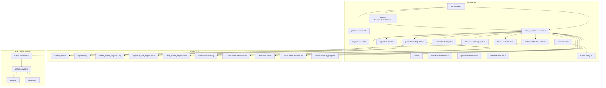

**Diagram sources**
- [app.module.ts](file://API/src/app.module.ts)
- [main.ts](file://API/src/main.ts)
- [weekly-timesheet.controller.ts](file://API/src/modules/weekly-timesheet/weekly-timesheet.controller.ts)
- [weekly-timesheet.service.ts](file://API/src/modules/weekly-timesheet/weekly-timesheet.service.ts)
- [create-timesheet.dto.ts](file://API/src/modules/weekly-timesheet/dto/create-timesheet.dto.ts)
- [update-timesheet.dto.ts](file://API/src/modules/weekly-timesheet/dto/update-timesheet.dto.ts)
- [timesheet-filter.dto.ts](file://API/src/modules/weekly-timesheet/dto/timesheet-filter.dto.ts)
- [schema.prisma](file://API/prisma/schema.prisma)
- [20260802222130_add_weekly_timesheet/migration.sql](file://API/prisma/migrations/20260802222130_add_weekly_timesheet/migration.sql)
- [20260803002856_add_shared_values_to_day/migration.sql](file://API/prisma/migrations/20260803002856_add_shared_values_to_day/migration.sql)
- [20260803110016_add_signature_data/migration.sql](file://API/prisma/migrations/20260803110016_add_signature_data/migration.sql)
- [20260804122031_add_is_team_leader/migration.sql](file://API/prisma/migrations/20260804122031_add_is_team_leader/migration.sql)
- [auth.service.ts](file://API/src/modules/auth/auth.service.ts)
- [multer.config.ts](file://API/src/modules/upload/multer.config.ts)
- [projects.controller.ts](file://API/src/modules/projects/projects.controller.ts)
- [projects.service.ts](file://API/src/modules/projects/projects.service.ts)

**Section sources**
- [weekly-timesheet.controller.ts](file://API/src/modules/weekly-timesheet/weekly-timesheet.controller.ts)
- [weekly-timesheet.service.ts](file://API/src/modules/weekly-timesheet/weekly-timesheet.service.ts)
- [create-timesheet.dto.ts](file://API/src/modules/weekly-timesheet/dto/create-timesheet.dto.ts)
- [update-timesheet.dto.ts](file://API/src/modules/weekly-timesheet/dto/update-timesheet.dto.ts)
- [timesheet-filter.dto.ts](file://API/src/modules/weekly-timesheet/dto/timesheet-filter.dto.ts)
- [schema.prisma](file://API/prisma/schema.prisma)
- [20260802222130_add_weekly_timesheet/migration.sql](file://API/prisma/migrations/20260802222130_add_weekly_timesheet/migration.sql)
- [20260803002856_add_shared_values_to_day/migration.sql](file://API/prisma/migrations/20260803002856_add_shared_values_to_day/migration.sql)
- [20260803110016_add_signature_data/migration.sql](file://API/prisma/migrations/20260803110016_add_signature_data/migration.sql)
- [20260804122031_add_is_team_leader/migration.sql](file://API/prisma/migrations/20260804122031_add_is_team_leader/migration.sql)

## Core Components
- Controller: Exposes REST endpoints for weekly timesheet operations with signature support and enhanced access control. Uses decorators for roles and current user context. Validates request payloads with class-validator and returns standardized responses.
- Service: Encapsulates business rules for weekly timesheet creation, updates, queries, and filters. Interacts with Prisma client to persist and retrieve data, including handling shared values operations, timezone-safe date processing, signature management, and role-based access control. Now integrated with authentication service for attachment and signature management.
- DTOs: Define strict request shapes for create, update, and filter operations, now including signature-related fields and access control parameters.

Key responsibilities:
- Input validation and sanitization via DTOs with signature field support.
- Authorization checks using roles guard and decorator with enhanced role-based filtering.
- Database operations through Prisma service with signature data persistence and access control.
- Shared values management for flexible key-value pair storage.
- Timezone-safe date parsing and calculation using parseDateSafe() helper.
- Integration with authentication service for attachment and signature management.
- Signature validation and storage for PDF document signing.
- Consistent response formatting and error handling.
- **Updated** Role-based access control enforcement for timesheet visibility and operations.
- **Updated** Advanced filtering system supporting week, project, and author-based queries.
- **Updated** Creator-based editing permissions for enhanced data integrity.
- **Updated** Team leader role system with comprehensive operation restrictions and project-specific management capabilities.
- **Updated** Enhanced total calculation logic using sharedValues from day objects instead of multiplying hours by team members, fixing inflated totals issue.

**Updated** Enhanced with signature functionality including digital signature validation, PDF document signing capabilities, and integration with the signature management system through authentication service. **Updated** Enhanced project members API to include user.position data for automatic role assignment in timesheet form editor. **Updated** Implemented comprehensive role-based access control system with four-tier permission levels including team leaders. **Updated** Added advanced filtering capabilities with week, project, and author filters for improved data retrieval. **Updated** Integrated team leader role system with isTeamLeader field for hierarchical access control and project-specific management. **Updated** Enhanced total calculation logic to use sharedValues from day objects instead of multiplying hours by team members, providing more accurate timesheet totals and fixing inflated totals issues.

**Section sources**
- [weekly-timesheet.controller.ts](file://API/src/modules/weekly-timesheet/weekly-timesheet.controller.ts)
- [weekly-timesheet.service.ts](file://API/src/modules/weekly-timesheet/weekly-timesheet.service.ts)
- [create-timesheet.dto.ts](file://API/src/modules/weekly-timesheet/dto/create-timesheet.dto.ts)
- [update-timesheet.dto.ts](file://API/src/modules/weekly-timesheet/dto/update-timesheet.dto.ts)
- [timesheet-filter.dto.ts](file://API/src/modules/weekly-timesheet/dto/timesheet-filter.dto.ts)

## Architecture Overview
The Weekly Timesheet module follows NestJS modular architecture with enhanced signature capabilities and comprehensive access control:
- HTTP requests enter via the controller with signature support and access control validation.
- The controller delegates to the service after validating inputs, checking roles, and processing signature data.
- The service performs business logic and uses Prisma to interact with the database.
- Enhanced timezone handling ensures accurate date processing across different timezones.
- Integration with authentication service provides attachment and signature management capabilities.
- Global interceptors and filters standardize logging, response transformation, and error formatting.
- **Updated** Role-based access control system enforces proper data visibility and security across different user types.
- **Updated** Advanced filtering system processes multiple filter combinations efficiently at the database level.
- **Updated** Team leader role system provides hierarchical access control with project-specific management capabilities.
- **Updated** Enhanced total calculation system aggregates hours from sharedValues in day objects instead of applying team member multipliers.

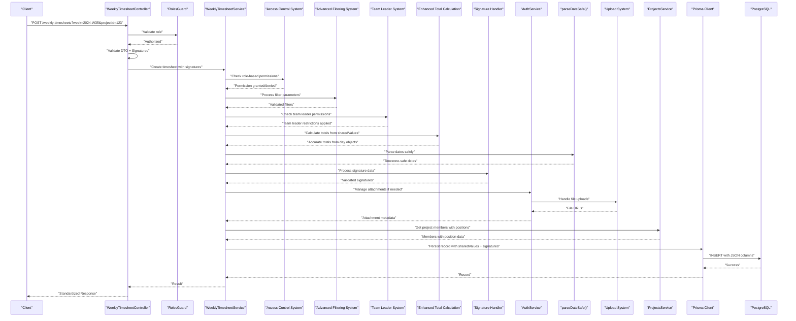

**Updated** Enhanced sequence diagram to reflect timezone-safe date processing, shared values handling, signature management integration, attachment management through the authentication service, project members API enhancement with position data support, comprehensive role-based access control enforcement, advanced filtering system integration, team leader role system with hierarchical permission checking, and enhanced total calculation using sharedValues from day objects instead of multiplying hours by team members.

**Diagram sources**
- [weekly-timesheet.controller.ts](file://API/src/modules/weekly-timesheet/weekly-timesheet.controller.ts)
- [weekly-timesheet.service.ts](file://API/src/modules/weekly-timesheet/weekly-timesheet.service.ts)
- [auth.service.ts](file://API/src/modules/auth/auth.service.ts)
- [projects.service.ts](file://API/src/modules/projects/projects.service.ts)
- [roles.guard.ts](file://API/src/common/guards/roles.guard.ts)
- [schema.prisma](file://API/prisma/schema.prisma)

**Section sources**
- [weekly-timesheet.controller.ts](file://API/src/modules/weekly-timesheet/weekly-timesheet.controller.ts)
- [weekly-timesheet.service.ts](file://API/src/modules/weekly-timesheet/weekly-timesheet.service.ts)
- [auth.service.ts](file://API/src/modules/auth/auth.service.ts)
- [roles.guard.ts](file://API/src/common/guards/roles.guard.ts)

## Detailed Component Analysis

### Controller Analysis
Responsibilities:
- Define REST endpoints for weekly timesheet CRUD and filtering with signature support and access control.
- Use @Roles() to enforce RBAC with enhanced role-based filtering.
- Inject @CurrentUser() to access authenticated user context from JWT payload.
- Validate request bodies with DTOs including signature data validation.
- Return standardized responses handled by global transform interceptor.

Common patterns:
- Role-based access control via RolesGuard with enhanced permission checking.
- Current user extraction from JWT into a typed object.
- Validation errors propagated through HTTP exception filter.
- Signature data validation and preprocessing before service calls.
- **Updated** Access control validation for timesheet visibility and operations.
- **Updated** Advanced filter parameter processing for week, project, and author-based queries.
- **Updated** Team leader permission validation for hierarchical access control.

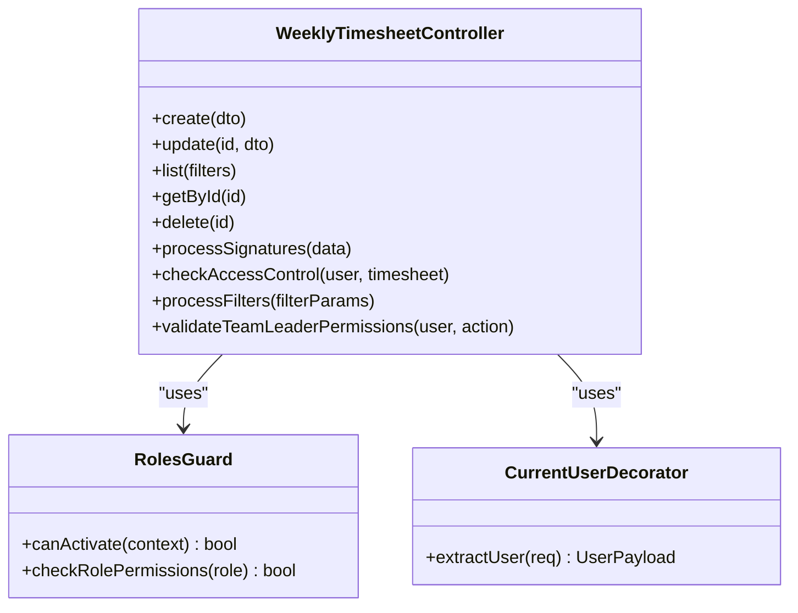

**Updated** Enhanced controller analysis to include access control validation, enhanced role-based filtering capabilities, advanced filter parameter processing for improved data retrieval, and team leader permission validation for hierarchical access control.

**Diagram sources**
- [weekly-timesheet.controller.ts](file://API/src/modules/weekly-timesheet/weekly-timesheet.controller.ts)
- [roles.guard.ts](file://API/src/common/guards/roles.guard.ts)
- [current-user.decorator.ts](file://API/src/common/decorators/current-user.decorator.ts)

**Section sources**
- [weekly-timesheet.controller.ts](file://API/src/modules/weekly-timesheet/weekly-timesheet.controller.ts)
- [roles.guard.ts](file://API/src/common/guards/roles.guard.ts)
- [current-user.decorator.ts](file://API/src/common/decorators/current-user.decorator.ts)

### Service Analysis
Responsibilities:
- Implement business rules for weekly timesheet creation, updates, and queries with signature support and access control.
- Validate constraints such as date ranges, user permissions, data integrity, and signature validity.
- Use Prisma client for efficient database operations including signature data persistence and role-based filtering.
- Handle soft delete semantics if applicable.
- Manage shared values operations for flexible key-value pair storage.
- Process dates using parseDateSafe() helper to prevent timezone drift.
- Integrate with authentication service for attachment and signature management operations.
- Validate and process signature data for PDF document signing.
- **Updated** Enforce role-based access control for timesheet visibility and operations.
- **Updated** Implement advanced filtering system with week, project, and author-based queries.
- **Updated** Apply creator-based editing permissions for enhanced data integrity.
- **Updated** Implement team leader role system with comprehensive operation restrictions.
- **Updated** Enhanced total calculation logic using sharedValues from day objects instead of multiplying hours by team members.

Data flow:
- Controller calls service methods with validated DTOs including signature data.
- Service constructs Prisma queries or mutations with signature information and access control.
- Service returns domain objects or transformed results with signature status and access permissions.
- Attachment and signature operations are delegated to authentication service when needed.
- **Updated** Access control validation determines data visibility based on user roles.
- **Updated** Advanced filtering system processes multiple filter parameters efficiently.
- **Updated** Team leader permission system applies hierarchical restrictions based on isTeamLeader field.
- **Updated** Enhanced total calculation aggregates hours from sharedValues in day objects for accurate totals.

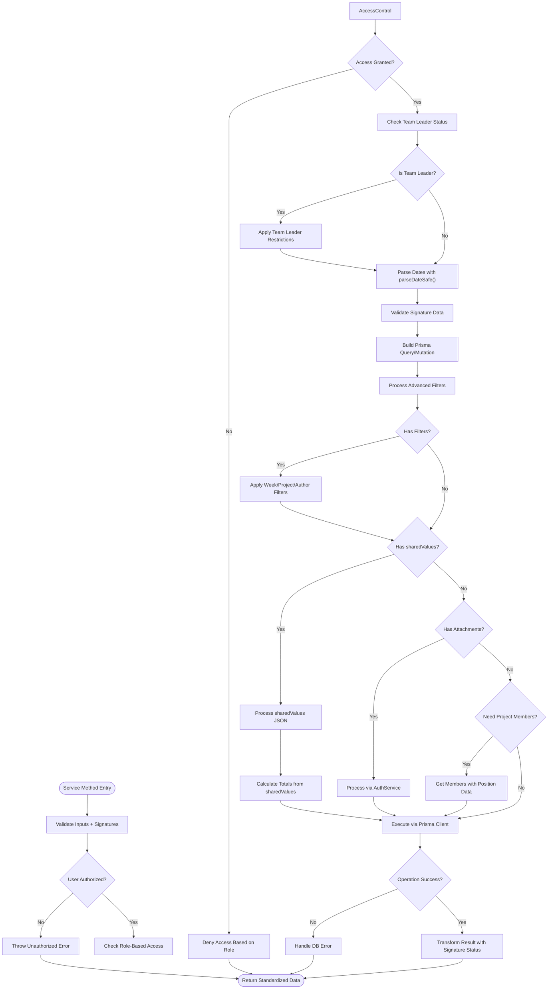

**Updated** Enhanced flowchart to include timezone-safe date parsing, signature validation, shared values processing, attachment management integration, project members API enhancement with position data support, comprehensive role-based access control enforcement, advanced filtering system integration, team leader role system with hierarchical permission checking, and enhanced total calculation using sharedValues from day objects instead of multiplying hours by team members in the service method execution flow.

**Diagram sources**
- [weekly-timesheet.service.ts](file://API/src/modules/weekly-timesheet/weekly-timesheet.service.ts)
- [auth.service.ts](file://API/src/modules/auth/auth.service.ts)
- [projects.service.ts](file://API/src/modules/projects/projects.service.ts)

**Section sources**
- [weekly-timesheet.service.ts](file://API/src/modules/weekly-timesheet/weekly-timesheet.service.ts)
- [auth.service.ts](file://API/src/modules/auth/auth.service.ts)

### DTOs Analysis
- CreateTimesheetDto: Defines required fields for creating a weekly timesheet entry with signature support.
- UpdateTimesheetDto: Partial fields for updating existing entries, now includes sharedValues as Record<string, string> and signature-related fields.
- TimesheetFilterDto: Query parameters for filtering lists (e.g., date range, user, status).

Validation strategy:
- Class-validator decorators ensure type safety and constraints.
- Errors are caught and formatted by global exception filter.
- Signature data validation ensures proper format and integrity.
- **Updated** Access control parameters for role-based filtering.
- **Updated** Advanced filter parameters for week, project, and author-based queries.
- **Updated** Team leader permission parameters for hierarchical access control.

**Updated** UpdateTimesheetDto now supports sharedValues field for flexible key-value pair updates and signature-related fields for document signing. **Updated** Enhanced DTOs to support access control parameters for role-based filtering. **Updated** TimesheetFilterDto now includes week, project, and author filter parameters for advanced querying capabilities. **Updated** Added team leader permission parameters for hierarchical access control and project-specific operations.

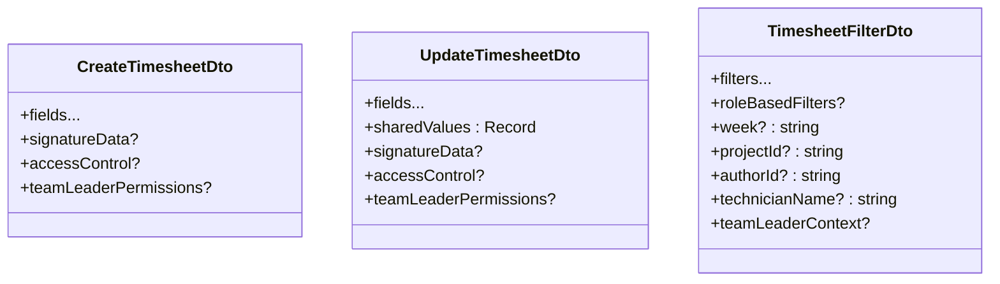

**Updated** Diagram shows the new sharedValues field, signatureData support, access control parameters, advanced filter parameters including week, projectId, authorId, and technicianName fields, and team leader permission parameters for hierarchical access control in the DTOs.

**Diagram sources**
- [create-timesheet.dto.ts](file://API/src/modules/weekly-timesheet/dto/create-timesheet.dto.ts)
- [update-timesheet.dto.ts](file://API/src/modules/weekly-timesheet/dto/update-timesheet.dto.ts)
- [timesheet-filter.dto.ts](file://API/src/modules/weekly-timesheet/dto/timesheet-filter.dto.ts)

**Section sources**
- [create-timesheet.dto.ts](file://API/src/modules/weekly-timesheet/dto/create-timesheet.dto.ts)
- [update-timesheet.dto.ts](file://API/src/modules/weekly-timesheet/dto/update-timesheet.dto.ts)
- [timesheet-filter.dto.ts](file://API/src/modules/weekly-timesheet/dto/timesheet-filter.dto.ts)

### Database Schema and Migrations
- The schema defines the weekly timesheet entities and relationships with signature support.
- Migration adds necessary tables and indexes for performance and integrity.
- Soft delete and timestamps are applied consistently across entities.
- New migration adds sharedValues JSON column to WeeklyTimesheetDay model for flexible data storage.
- Latest migration incorporates signature data fields for PDF document signing capabilities.
- **Updated** Enhanced schema to support role-based access control and user relationship mapping.
- **Updated** Added support for both userId and technicianName fields for improved data integrity.
- **Updated** Added isTeamLeader field for team leader role identification and hierarchical access control.

**Updated** Schema now includes sharedValues JSON column support for dynamic key-value pair storage, signature data fields for digital document signing, enhanced user relationship mapping for access control, dual user identification fields for improved data integrity, and isTeamLeader field for team leader role identification and hierarchical access control.

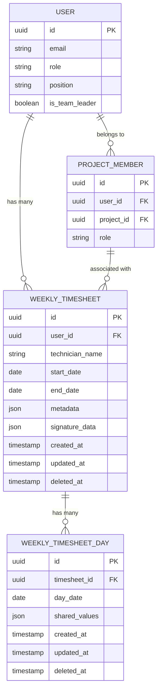

**Updated** ER diagram now includes WEEKLY_TIMESHEET_DAY entity with shared_values JSON column, WEEKLY_TIMESHEET with signature_data field and technician_name field, USER entity with position field for project member role assignment and is_team_leader boolean field for team leader role identification, and PROJECT_MEMBER relationship for access control.

**Diagram sources**
- [schema.prisma](file://API/prisma/schema.prisma)
- [20260802222130_add_weekly_timesheet/migration.sql](file://API/prisma/migrations/20260802222130_add_weekly_timesheet/migration.sql)
- [20260803002856_add_shared_values_to_day/migration.sql](file://API/prisma/migrations/20260803002856_add_shared_values_to_day/migration.sql)
- [20260803110016_add_signature_data/migration.sql](file://API/prisma/migrations/20260803110016_add_signature_data/migration.sql)
- [20260804122031_add_is_team_leader/migration.sql](file://API/prisma/migrations/20260804122031_add_is_team_leader/migration.sql)

**Section sources**
- [schema.prisma](file://API/prisma/schema.prisma)
- [20260802222130_add_weekly_timesheet/migration.sql](file://API/prisma/migrations/20260802222130_add_weekly_timesheet/migration.sql)
- [20260803002856_add_shared_values_to_day/migration.sql](file://API/prisma/migrations/20260803002856_add_shared_values_to_day/migration.sql)
- [20260803110016_add_signature_data/migration.sql](file://API/prisma/migrations/20260803110016_add_signature_data/migration.sql)
- [20260804122031_add_is_team_leader/migration.sql](file://API/prisma/migrations/20260804122031_add_is_team_leader/migration.sql)

## Enhanced Access Control System
The Weekly Timesheet module now implements a comprehensive role-based access control system that ensures proper data visibility and security across different user types. This enhancement provides granular control over timesheet access based on user roles and relationships.

### Four-Tier Permission System
The access control system operates on four distinct permission levels:

**ADMIN/HR Users:**
- Full access to all timesheets in the system
- Can view, create, update, and delete any timesheet
- Administrative oversight capabilities for compliance and auditing
- Unrestricted filtering and search operations

**Team Leaders:**
- Restricted access to timesheets associated with their projects
- Can view and manage timesheets for team members they supervise
- Limited to project-specific operations and reporting
- Cannot access timesheets outside their project scope
- Enhanced with isTeamLeader field for precise role identification

**STANDARD Users:**
- Limited access to their own timesheets only
- Can view, create, update, and delete their personal timesheets
- No access to other users' timesheets regardless of project association
- Basic self-service capabilities for time tracking

### Access Control Implementation
The access control system is implemented through several key components:

**canViewTimesheet Function:**
- Centralized permission checking for timesheet visibility
- Evaluates user role and relationship to determine access rights
- Returns boolean indicating whether user can view specific timesheet
- Integrated into all read operations for consistent enforcement

**Enhanced findOne and findByProject Methods:**
- Removed special Team Leader privileges that bypassed access control
- All methods now enforce consistent role-based filtering
- Database queries automatically apply appropriate WHERE clauses based on user role
- Prevents unauthorized data exposure through direct method calls

**Role-Based Query Filtering:**
- Automatic application of access control filters in database queries
- Different query structures for each user role level
- Efficient filtering at database level for optimal performance
- Consistent behavior across all API endpoints

**Updated** Enhanced with creator-based editing permissions that allow users to edit only timesheets they created, improving data integrity and preventing unauthorized modifications. **Updated** Integrated team leader role system with isTeamLeader field for hierarchical access control and project-specific management capabilities.

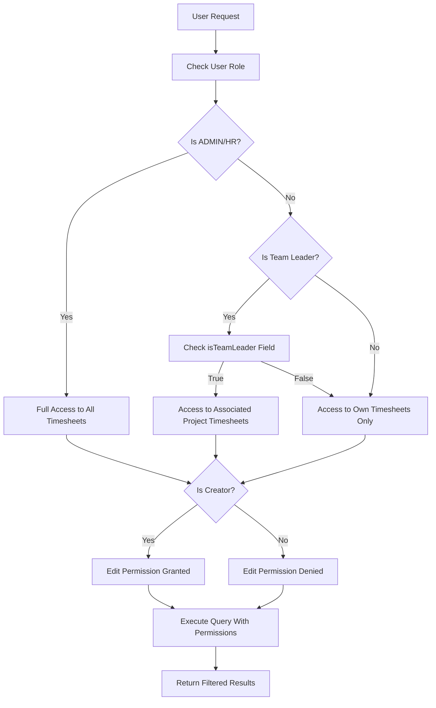

**Updated** Enhanced flowchart to include team leader role system with isTeamLeader field checking, hierarchical permission levels, and project-specific access control for team leaders.

**Diagram sources**
- [weekly-timesheet.service.ts](file://API/src/modules/weekly-timesheet/weekly-timesheet.service.ts)
- [roles.guard.ts](file://API/src/common/guards/roles.guard.ts)

**Section sources**
- [weekly-timesheet.service.ts](file://API/src/modules/weekly-timesheet/weekly-timesheet.service.ts)
- [roles.guard.ts](file://API/src/common/guards/roles.guard.ts)

## Team Leader Role System
The Weekly Timesheet module now includes a comprehensive team leader role system that provides hierarchical access control and project-specific management capabilities. This enhancement enables team leaders to manage timesheets for their project teams while maintaining appropriate security boundaries.

### Team Leader Role Identification
The team leader role system is implemented through the following key components:

**isTeamLeader Field:**
- Boolean field added to the USER model for precise team leader identification
- Enables granular permission checking for team leader-specific operations
- Supports hierarchical access control without requiring separate role assignments
- Integrates seamlessly with existing role-based access control system

**canPerformTeamLeaderAction Utility Function:**
- Centralized permission checking for team leader-specific actions
- Validates user's team leader status and project associations
- Ensures team leaders can only perform actions within their authorized scope
- Provides consistent permission checking across all team leader operations

**Project-Specific Management Capabilities:**
- Team leaders can view and manage timesheets for their project teams
- Restricted to project-specific operations and reporting
- Cannot access timesheets outside their project scope
- Enhanced with automatic project association validation

### Team Leader Operation Restrictions
The team leader role system enforces comprehensive operation restrictions:

**View Operations:**
- Team leaders can view timesheets for their project members
- Automatic project scope restriction based on team leader status
- Enhanced filtering capabilities for project-specific data retrieval
- Integration with existing advanced filtering system

**Edit Operations:**
- Team leaders can edit timesheets for their project members
- Creator-based editing permissions still apply for data integrity
- Enhanced validation to ensure team leader authorization
- Audit trail for team leader modifications

**Delete Operations:**
- Team leaders have limited delete capabilities for project timesheets
- Enhanced permission checking to prevent unauthorized deletions
- Integration with existing access control system
- Comprehensive audit logging for team leader actions

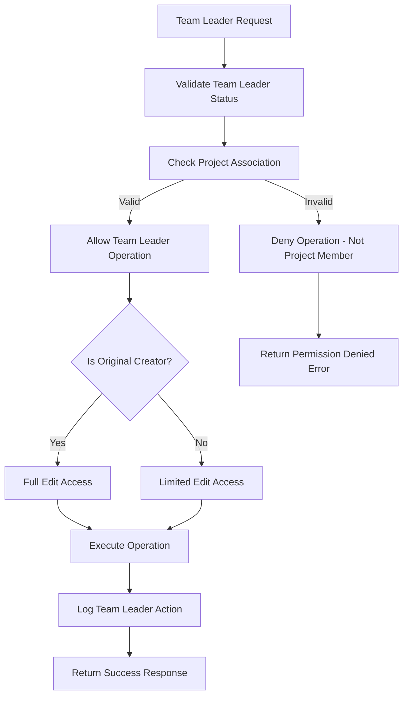

**Updated** Flowchart illustrates the team leader role system with isTeamLeader field validation, project association checking, operation restrictions, and comprehensive audit logging for team leader actions.

**Diagram sources**
- [weekly-timesheet.service.ts](file://API/src/modules/weekly-timesheet/weekly-timesheet.service.ts)
- [20260804122031_add_is_team_leader/migration.sql](file://API/prisma/migrations/20260804122031_add_is_team_leader/migration.sql)

**Section sources**
- [weekly-timesheet.service.ts](file://API/src/modules/weekly-timesheet/weekly-timesheet.service.ts)
- [20260804122031_add_is_team_leader/migration.sql](file://API/prisma/migrations/20260804122031_add_is_team_leader/migration.sql)

## Advanced Filtering System
The Weekly Timesheet module now includes an advanced filtering system that supports multiple filter combinations for improved data retrieval and reporting capabilities. This enhancement enables users to filter timesheets by week, project, and author with high precision and performance.

### Multi-Field Filtering Capabilities
The filtering system supports the following filter types:

**Week-Based Filtering:**
- ISO week format filtering (e.g., "2024-W35")
- Automatic week boundary calculations
- Support for relative week queries (current week, last week, etc.)
- Efficient date range optimization at database level

**Project-Based Filtering:**
- Project ID filtering for timesheet association
- Project membership validation for Team Leaders
- Automatic project scope restriction based on user roles
- Integration with project member hierarchy

**Author-Based Filtering:**
- User ID filtering for timesheet ownership
- Technician name filtering for legacy data compatibility
- Dual field support (userId and technicianName) for data integrity
- Cross-referencing with user records for validation

### Filter Processing Logic
The filtering system processes multiple filter parameters efficiently:

**Filter Combination Logic:**
- AND logic between different filter types
- OR logic within same filter type where applicable
- Fallback mechanisms for missing or invalid filter values
- Performance optimization through early query termination

**Database-Level Optimization:**
- Dynamic query construction based on active filters
- Index utilization for frequently filtered fields
- Reduced data transfer through selective field retrieval
- Connection pooling optimization for complex queries

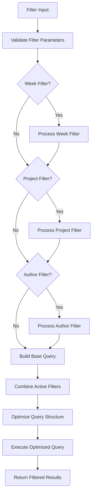

**Diagram sources**
- [weekly-timesheet.service.ts](file://API/src/modules/weekly-timesheet/weekly-timesheet.service.ts)
- [timesheet-filter.dto.ts](file://API/src/modules/weekly-timesheet/dto/timesheet-filter.dto.ts)

**Section sources**
- [weekly-timesheet.service.ts](file://API/src/modules/weekly-timesheet/weekly-timesheet.service.ts)
- [timesheet-filter.dto.ts](file://API/src/modules/weekly-timesheet/dto/timesheet-filter.dto.ts)

## Signature Management System
The Weekly Timesheet module now includes comprehensive signature functionality for PDF document signing. This enhancement enables clients to add digital signatures to timesheet documents with proper validation, storage, and retrieval capabilities.

### Signature Data Processing
The signature management system handles various aspects of digital document signing:
- Signature data validation and format verification
- PDF document signature embedding and extraction
- Signature metadata management and tracking
- Integration with client-side signature components
- Secure storage of signature data and related files

### Client-Side Integration
The signature system integrates seamlessly with frontend components:
- TimesheetSignatures component for signature rendering and management
- Signature toggle functionality in form editors
- Client-side signature capture and validation
- Real-time signature preview and editing capabilities
- Responsive signature interface for different screen sizes

### Signature Storage and Retrieval
Signature data is stored securely with proper indexing and retrieval:
- JSON-based signature data structure for flexibility
- Indexed signature fields for fast querying
- Relationship mapping between signatures and timesheet records
- Version control for signature updates and revisions
- Audit trail for signature modifications and access

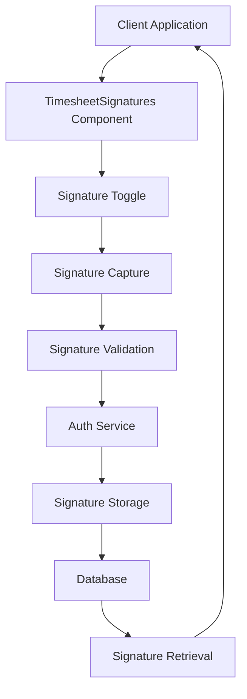

**Diagram sources**
- [weekly-timesheet.service.ts](file://API/src/modules/weekly-timesheet/weekly-timesheet.service.ts)
- [auth.service.ts](file://API/src/modules/auth/auth.service.ts)
- [20260803110016_add_signature_data/migration.sql](file://API/prisma/migrations/20260803110016_add_signature_data/migration.sql)

**Section sources**
- [weekly-timesheet.service.ts](file://API/src/modules/weekly-timesheet/weekly-timesheet.service.ts)
- [auth.service.ts](file://API/src/modules/auth/auth.service.ts)
- [20260803110016_add_signature_data/migration.sql](file://API/prisma/migrations/20260803110016_add_signature_data/migration.sql)

## Attachment Management System
The Weekly Timesheet module integrates with the comprehensive attachment management system through the authentication service. This enhancement enables secure file uploads and management for various document types including photos, PDFs, certifications, and signature files.

### Authentication Service Integration
The authentication service has been extended to handle attachment and signature-related operations:
- File upload coordination with Multer configuration for multiple file types
- Secure file storage and retrieval with signature support
- Attachment and signature metadata management
- Integration with user documents, certifications, and signature systems

### Multer Configuration Updates
The Multer configuration has been updated to support multiple file types including signature files:
- Photo uploads (JPEG, PNG, GIF) for avatars and profile images
- PDF uploads for official documents, certifications, and signed timesheets
- Signature file uploads with proper validation and security measures
- Size limits and security validations for all file types
- Organized file structure by user ID and document type

### Enhanced DTO Definitions
New DTOs have been added to support attachment and signature operations:
- UserDocumentDto: For managing official user documents with signature support
- UserCertificationDto: For handling professional certifications with digital signatures
- Enhanced user bank account DTOs with attachment and signature capabilities
- Signature-specific DTOs for digital document signing workflows

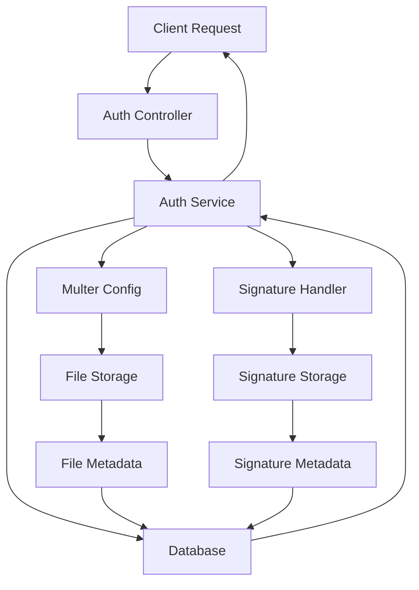

**Diagram sources**
- [auth.service.ts](file://API/src/modules/auth/auth.service.ts)
- [multer.config.ts](file://API/src/modules/upload/multer.config.ts)
- [user-document.dto.ts](file://API/src/modules/auth/dto/user-document.dto.ts)
- [user-certification.dto.ts](file://API/src/modules/auth/dto/user-certification.dto.ts)

**Section sources**
- [auth.service.ts](file://API/src/modules/auth/auth.service.ts)
- [multer.config.ts](file://API/src/modules/upload/multer.config.ts)
- [user-document.dto.ts](file://API/src/modules/auth/dto/user-document.dto.ts)
- [user-certification.dto.ts](file://API/src/modules/auth/dto/user-certification.dto.ts)

## Backend Configuration
The backend configuration has been enhanced to support the signature functionality and improve overall application stability. Key improvements include increased body size limits for handling large base64-encoded signature images and modernized module imports for better TypeScript compatibility.

### Express Configuration Updates
The main.ts configuration file has been updated with critical improvements:
- Increased body size limit to 10MB to accommodate base64-encoded signature images
- Corrected module system from CommonJS require to ES module import syntax for Express
- Resolved runtime errors in TypeScript environment through proper module imports
- Enhanced application bootstrap process with improved error handling

### Body Parser Configuration
The body parser configuration has been optimized for signature image handling:
- JSON body parser configured with 10MB limit for base64-encoded signature data
- URL-encoded body parser with appropriate size limits
- Proper error handling for oversized requests
- Configuration validation to ensure proper setup

### Module Import Modernization
The application has been updated to use modern ES module imports:
- Replaced CommonJS require statements with ES module import syntax
- Improved TypeScript compatibility and type safety
- Better tree-shaking and bundle optimization
- Consistent import patterns across the application

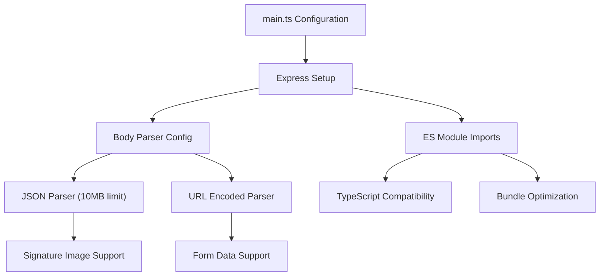

**Diagram sources**
- [main.ts](file://API/src/main.ts)

**Section sources**
- [main.ts](file://API/src/main.ts)

## Dependency Analysis
Module registration and application bootstrap with signature support and access control:
- app.module.ts registers feature modules, including weekly-timesheet with signature capabilities and enhanced access control.
- main.ts configures global interceptors, filters, and environment validation.

Global cross-cutting concerns:
- LoggingInterceptor logs all requests/responses with duration and context including signature operations and access control decisions.
- TransformInterceptor standardizes response envelopes with signature status information and access control metadata.
- HttpExceptionFilter formats errors uniformly including signature validation errors and access control violations.
- RolesGuard enforces RBAC based on JWT payload for signature operations and access control.
- Env validation ensures required configuration variables exist for signature functionality and access control.

**Updated** Enhanced dependency analysis to include signature management system integration, attachment management capabilities, project members API enhancement with position data support, comprehensive role-based access control system integration, advanced filtering system dependencies, team leader role system integration, and enhanced total calculation system using sharedValues from day objects.

```mermaid
graph TB
Main["main.ts"] --> AppModule["app.module.ts"]
AppModule --> WeeklyModule["WeeklyTimesheetModule"]
WeeklyModule --> Controller["WeeklyTimesheetController"]
WeeklyModule --> Service["WeeklyTimesheetService"]
Controller --> Guard["RolesGuard"]
Controller --> Decorator["CurrentUserDecorator"]
AppModule --> Logging["LoggingInterceptor"]
AppModule --> Transform["TransformInterceptor"]
AppModule --> Filter["HttpExceptionFilter"]
AppModule --> Env["EnvValidation"]
WeeklyModule --> AuthModule["AuthModule"]
AuthModule --> UploadModule["UploadModule"]
UploadModule --> Multer["Multer Config"]
WeeklyModule --> SignatureModule["Signature Handler"]
SignatureModule --> AuthService
AuthService --> UploadModule
WeeklyModule --> ProjectsModule["ProjectsModule"]
ProjectsModule --> ProjectsController["ProjectsController"]
ProjectsModule --> ProjectsService["ProjectsService"]
ProjectsService --> PositionData["Position Data Support"]
WeeklyModule --> AccessControl["Access Control System"]
AccessControl --> RoleBasedFiltering["Role-Based Filtering"]
AccessControl --> PermissionChecking["Permission Checking"]
WeeklyModule --> FilterSystem["Advanced Filtering System"]
FilterSystem --> WeekFilter["Week Filter"]
FilterSystem --> ProjectFilter["Project Filter"]
FilterSystem --> AuthorFilter["Author Filter"]
FilterSystem --> DataIntegrity["Data Integrity Checks"]
WeeklyModule --> TeamLeaderSystem["Team Leader System"]
TeamLeaderSystem --> IsTeamLeaderField["isTeamLeader Field"]
TeamLeaderSystem --> TeamLeaderPermissions["Team Leader Permissions"]
TeamLeaderSystem --> ProjectScope["Project Scope Validation"]
WeeklyModule --> TotalCalculation["Enhanced Total Calculation"]
TotalCalculation --> SharedValuesAggregation["SharedValues Aggregation"]
TotalCalculation --> DayObjectProcessing["Day Object Processing"]
```

**Updated** Enhanced diagram to show signature management dependencies, attachment management integration, project members API enhancement with position data support, comprehensive role-based access control system with permission checking and role-based filtering, advanced filtering system with week, project, and author filter components, team leader role system with isTeamLeader field, team leader permissions, and project scope validation, and enhanced total calculation system using sharedValues aggregation from day objects instead of multiplying hours by team members.

**Diagram sources**
- [main.ts](file://API/src/main.ts)
- [app.module.ts](file://API/src/app.module.ts)
- [weekly-timesheet.controller.ts](file://API/src/modules/weekly-timesheet/weekly-timesheet.controller.ts)
- [weekly-timesheet.service.ts](file://API/src/modules/weekly-timesheet/weekly-timesheet.service.ts)
- [roles.guard.ts](file://API/src/common/guards/roles.guard.ts)
- [current-user.decorator.ts](file://API/src/common/decorators/current-user.decorator.ts)
- [logging.interceptor.ts](file://API/src/common/interceptors/logging.interceptor.ts)
- [transform.interceptor.ts](file://API/src/common/interceptors/transform.interceptor.ts)
- [http-exception.filter.ts](file://API/src/common/filters/http-exception.filter.ts)
- [env.validation.ts](file://API/src/config/env.validation.ts)
- [auth.service.ts](file://API/src/modules/auth/auth.service.ts)
- [multer.config.ts](file://API/src/modules/upload/multer.config.ts)
- [projects.controller.ts](file://API/src/modules/projects/projects.controller.ts)
- [projects.service.ts](file://API/src/modules/projects/projects.service.ts)

**Section sources**
- [main.ts](file://API/src/main.ts)
- [app.module.ts](file://API/src/app.module.ts)
- [logging.interceptor.ts](file://API/src/common/interceptors/logging.interceptor.ts)
- [transform.interceptor.ts](file://API/src/common/interceptors/transform.interceptor.ts)
- [http-exception.filter.ts](file://API/src/common/filters/http-exception.filter.ts)
- [roles.guard.ts](file://API/src/common/guards/roles.guard.ts)
- [current-user.decorator.ts](file://API/src/common/decorators/current-user.decorator.ts)
- [env.validation.ts](file://API/src/config/env.validation.ts)
- [auth.service.ts](file://API/src/modules/auth/auth.service.ts)
- [multer.config.ts](file://API/src/modules/upload/multer.config.ts)
- [projects.controller.ts](file://API/src/modules/projects/projects.controller.ts)
- [projects.service.ts](file://API/src/modules/projects/projects.service.ts)

## Performance Considerations
- Use Prisma query optimization: select only needed fields, avoid N+1 queries by leveraging relations and include/select appropriately.
- Index frequently queried columns (e.g., user_id, dates) to speed up filtering and listing.
- Apply pagination on list endpoints to limit result sets.
- Cache read-heavy operations where appropriate (e.g., static lookup data).
- Ensure DTO validation occurs early to fail fast on invalid inputs.
- Optimize JSON column operations by using appropriate database functions for shared values queries.
- Leverage timezone-safe date parsing to prevent costly date recalculations and ensure consistent performance across different timezone scenarios.
- Implement efficient file upload handling with proper size limits and format validation.
- Use streaming for large file uploads to prevent memory issues.
- Cache file URLs and metadata to reduce database queries.
- Optimize signature data queries with proper indexing on signature fields.
- Implement signature caching strategies for frequently accessed signature data.
- Use asynchronous processing for signature validation and PDF manipulation operations.
- **Updated** Configure optimal body size limits for signature image uploads to balance performance and functionality.
- **Updated** Utilize ES module imports for better tree-shaking and bundle optimization.
- **Updated** Optimize project members API queries to efficiently retrieve user position data for automatic role assignment.
- **Updated** Implement efficient role-based filtering at database level to minimize data transfer and processing overhead.
- **Updated** Cache role-based access control decisions for frequently accessed resources to reduce permission checking overhead.
- **Updated** Optimize advanced filtering queries with proper index usage and query plan optimization.
- **Updated** Implement efficient creator-based permission checks to minimize database lookups.
- **Updated** Use dual user identification fields strategically to balance data integrity with query performance.
- **Updated** Optimize team leader role system with efficient isTeamLeader field queries and project association checks.
- **Updated** Implement caching strategies for team leader permissions to reduce repeated permission checking overhead.
- **Updated** Optimize project scope validation queries for team leader operations to minimize database lookups.
- **Updated** Enhanced total calculation performance by aggregating sharedValues directly from day objects instead of applying team member multipliers, reducing computational overhead and improving accuracy.

**Updated** Added guidance for optimizing signature data processing, JSON column operations for shared values, efficient file upload handling for attachment management, signature-specific performance considerations, modern module import benefits, project members API optimization for position data retrieval, role-based access control performance optimization through efficient database-level filtering and caching strategies, advanced filtering system performance optimization, creator-based permission efficiency, dual user identification field optimization, team leader role system performance optimization through efficient isTeamLeader field queries, project association checks, and caching strategies for team leader permissions, and enhanced total calculation performance by using sharedValues aggregation from day objects instead of multiplying hours by team members.

## Troubleshooting Guide
Common issues and resolutions:
- Authentication failures: Verify JWT token presence and validity; ensure sub field contains userId.
- Authorization errors: Confirm user role matches @Roles() expectations; check RolesGuard behavior.
- Validation errors: Inspect DTO constraints; ensure request body matches expected shape.
- Database errors: Review Prisma logs and migration status; verify foreign key constraints and unique indexes.
- Shared values issues: Ensure sharedValues is properly formatted as Record<string, string>; validate JSON structure.
- Timezone-related issues: Verify that parseDateSafe() is being used for all date operations; check timezone offset calculations for negative UTC timezones like BRT (UTC-3); ensure date strings are properly formatted before parsing.
- File upload issues: Check Multer configuration for supported file types and size limits; verify file path permissions; ensure proper error handling for failed uploads.
- Attachment management issues: Verify authentication service integration; check file storage accessibility; validate attachment metadata consistency.
- Signature validation issues: Ensure signature data format is correct; verify signature file integrity; check signature expiration and validity.
- PDF signature issues: Verify PDF document compatibility; check signature embedding success; validate signature overlay positioning.
- **Updated** Body size limit errors: Increase body parser limits in main.ts configuration to accommodate large base64-encoded signature images; verify 10MB limit is sufficient for signature requirements.
- **Updated** Module import errors: Ensure ES module import syntax is used throughout the application; replace CommonJS require statements with proper import statements; verify TypeScript configuration for module resolution.
- **Updated** Project members API issues: Verify user.position data is properly included in getProjectMembers response; check position field availability in user records; ensure automatic role assignment functionality works correctly with position data.
- **Updated** Access control issues: Verify role-based filtering is working correctly; check canViewTimesheet function logic; ensure proper role assignment in user records; debug permission denial scenarios.
- **Updated** Role-based filtering problems: Investigate database query construction for different user roles; verify project association logic for Team Leaders; check user ownership validation for STANDARD users.
- **Updated** Advanced filtering issues: Verify week filter format (ISO week standard); check project ID validity; ensure author ID/technician name matching; debug filter combination logic.
- **Updated** Creator-based permission issues: Verify timesheet ownership validation; check user ID vs technician name matching; debug edit permission denials.
- **Updated** Data integrity issues: Verify dual user identification field consistency; check userId vs technicianName synchronization; validate data migration completeness.
- **Updated** Team leader role issues: Verify isTeamLeader field is properly set in user records; check team leader permission logic; debug project association validation; verify team leader operation restrictions.
- **Updated** Team leader permission issues: Investigate canPerformTeamLeaderAction function logic; verify project scope validation; check team leader access control for timesheet operations; debug hierarchical permission denials.
- **Updated** Total calculation issues: Verify sharedValues aggregation from day objects is working correctly; check that totals are calculated from actual day entries instead of multiplying hours by team members; debug inflated totals issues; validate day object sharedValues structure.
- Logging and tracing: Use LoggingInterceptor output to identify slow endpoints and failed requests including signature operations and access control decisions.

**Updated** Added troubleshooting guidance for shared values functionality, timezone-related date processing issues, attachment management problems, signature-related issues including PDF document signing and signature validation, body size limit configuration, module import syntax errors, project members API issues with position data and automatic role assignment, comprehensive role-based access control troubleshooting including permission debugging and filtering issues, advanced filtering system debugging, creator-based permission troubleshooting, data integrity issues with dual user identification fields, team leader role system troubleshooting including isTeamLeader field validation, team leader permission debugging, project scope validation, and hierarchical permission issues, and enhanced total calculation troubleshooting including sharedValues aggregation debugging and inflated totals resolution.

**Section sources**
- [roles.guard.ts](file://API/src/common/guards/roles.guard.ts)
- [current-user.decorator.ts](file://API/src/common/decorators/current-user.decorator.ts)
- [logging.interceptor.ts](file://API/src/common/interceptors/logging.interceptor.ts)
- [http-exception.filter.ts](file://API/src/common/filters/http-exception.filter.ts)
- [auth.service.ts](file://API/src/modules/auth/auth.service.ts)
- [multer.config.ts](file://API/src/modules/upload/multer.config.ts)
- [main.ts](file://API/src/main.ts)
- [projects.controller.ts](file://API/src/modules/projects/projects.controller.ts)
- [projects.service.ts](file://API/src/modules/projects/projects.service.ts)

## Conclusion
The Weekly Timesheet module integrates cleanly with the Windlog backend's established patterns: NestJS modularity, Prisma ORM, JWT-based authentication, RBAC, standardized responses, and comprehensive logging. The addition of shared values support provides flexible key-value pair storage capabilities while maintaining the module's security, performance, and reliability standards. Most importantly, the enhanced timezone handling with parseDateSafe() helper function ensures accurate date processing across different timezone scenarios, particularly benefiting users in negative UTC timezones like BRT (UTC-3). The recent extension with comprehensive attachment management capabilities through the authentication service and Multer configuration enables secure file uploads for user documents, certifications, and photos. Additionally, the new signature functionality provides robust digital document signing capabilities for PDF timesheet documents, enabling clients to add secure digital signatures with proper validation and storage. The backend configuration has been optimized with increased body size limits for signature images and modernized module imports for better TypeScript compatibility. **Updated** The project members API enhancement with user.position data support enables automatic role assignment functionality in the timesheet form editor, improving user experience and workflow automation. **Updated** The comprehensive role-based access control system ensures proper data visibility and security across different user types, providing administrators with full oversight, team leaders with project-specific management capabilities, and standard users with secure self-service functionality. **Updated** The advanced filtering system with week, project, and author filters provides powerful data retrieval capabilities for reporting and analysis. **Updated** The creator-based editing permissions enhance data integrity by ensuring only original authors can modify their timesheets. **Updated** The dual user identification field support (userId and technicianName) improves data compatibility and migration flexibility. **Updated** The team leader role system with isTeamLeader field provides hierarchical access control and project-specific management capabilities, enabling team leaders to effectively manage their project teams while maintaining appropriate security boundaries. **Updated** The enhanced total calculation logic using sharedValues from day objects instead of multiplying hours by team members fixes inflated totals issues and provides more accurate timesheet calculations by aggregating hours directly from individual day entries. By following the documented structure and best practices, developers can extend and maintain the module effectively while ensuring reliable date calculations, flexible data storage capabilities, robust attachment management functionality, comprehensive signature support for digital document workflows, automatic role assignment through position data, optimal performance through modern JavaScript module systems, secure access control through role-based filtering and permission management, advanced filtering capabilities for data analysis, enhanced data integrity through creator-based permissions, improved data compatibility through dual user identification fields, hierarchical team leader management capabilities for effective project team coordination, and accurate timesheet totals through sharedValues aggregation from day objects.

**Updated** Enhanced conclusion to reflect the new shared values functionality, timezone-safe date processing capabilities, attachment management system integration, signature functionality for PDF document signing, backend configuration optimizations including body size limits and ES module imports, project members API enhancement with position data support for automatic role assignment, comprehensive role-based access control system with four-tier permission levels including team leaders, advanced filtering system with week, project, and author filters, creator-based editing permissions for enhanced data integrity, dual user identification field support for improved data compatibility, team leader role system with isTeamLeader field for hierarchical access control and project-specific management capabilities, and enhanced total calculation logic using sharedValues from day objects instead of multiplying hours by team members for accurate timesheet totals, and their collective benefits for international users, comprehensive document management workflows, secure multi-user collaboration environments, advanced data analysis capabilities, robust data integrity measures, effective team leader project management, and accurate timesheet reporting.