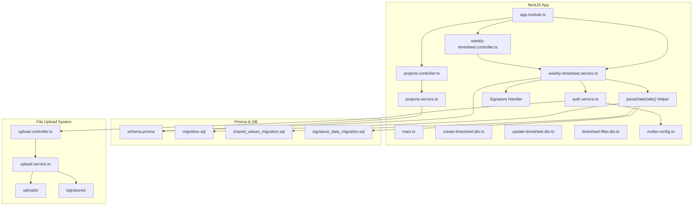
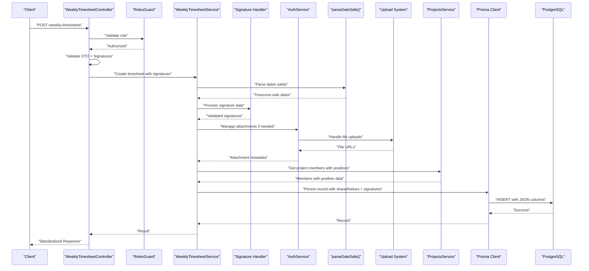
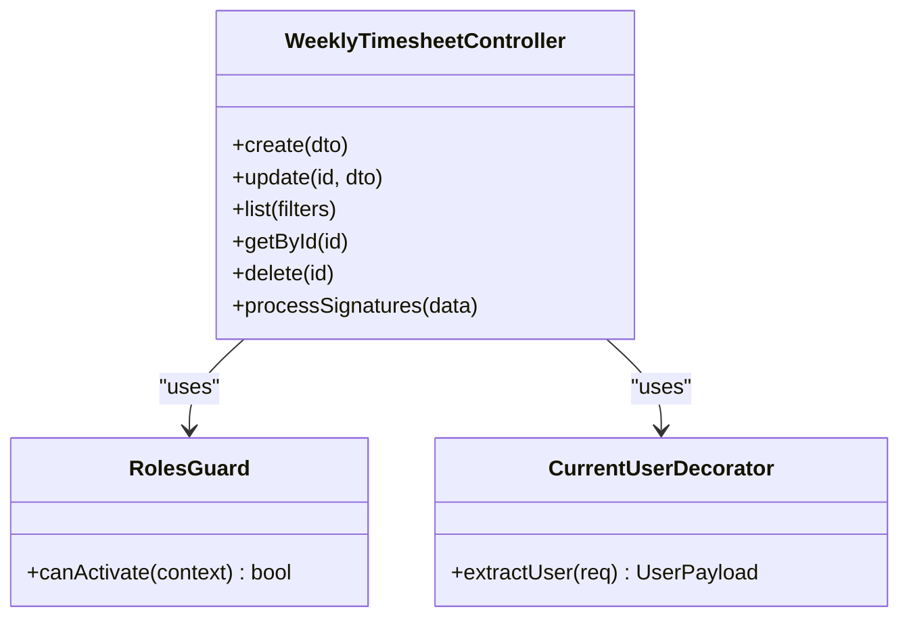
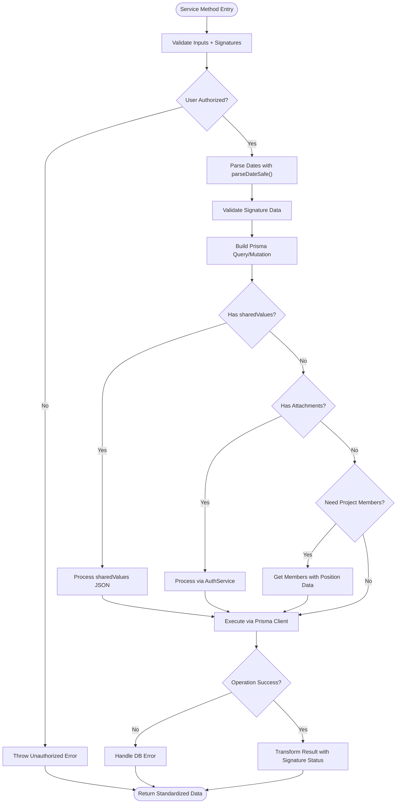
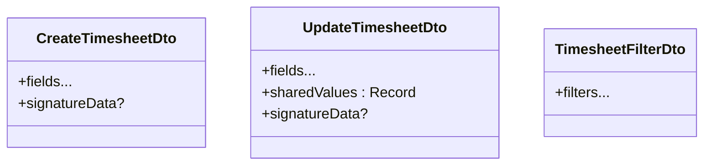
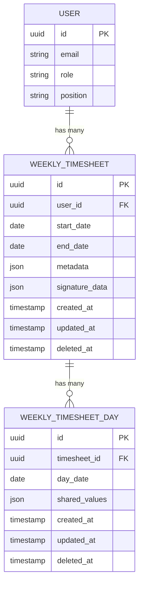
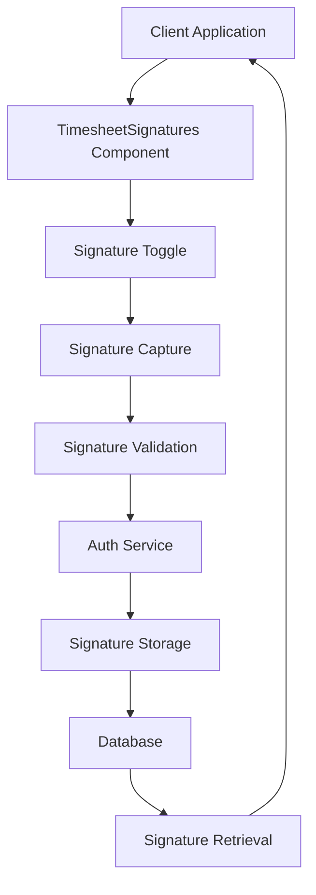
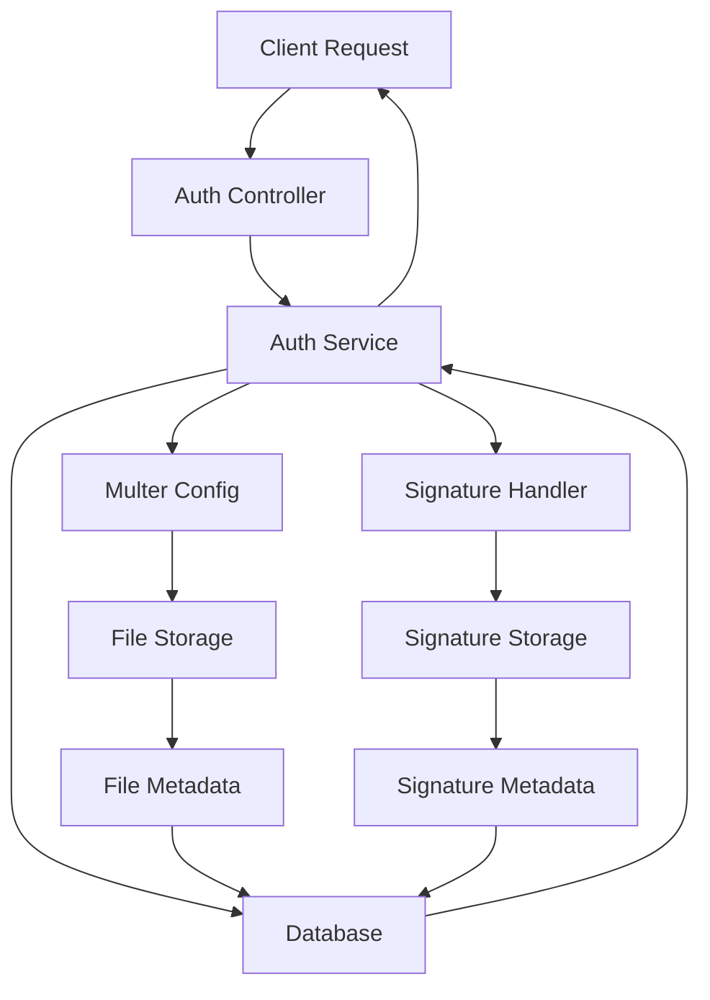
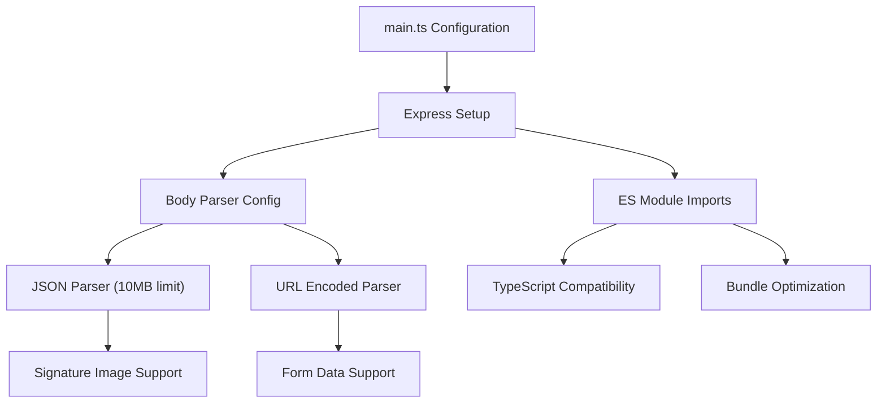
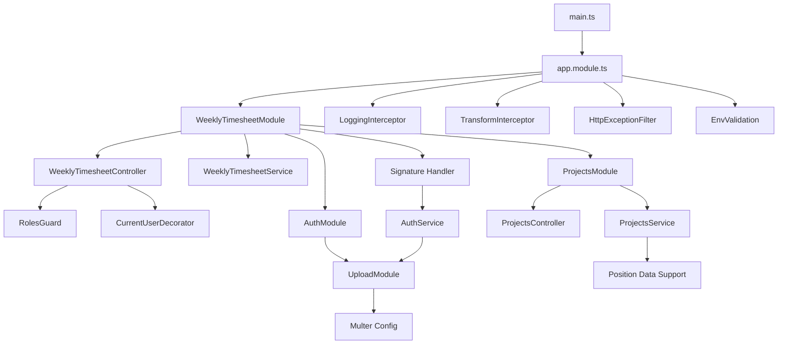

# Weekly Timesheet - Backend Module

<cite>
**Referenced Files in This Document**
- [weekly-timesheet.controller.ts](file://API/src/modules/weekly-timesheet/weekly-timesheet.controller.ts)
- [weekly-timesheet.service.ts](file://API/src/modules/weekly-timesheet/weekly-timesheet.service.ts)
- [create-timesheet.dto.ts](file://API/src/modules/weekly-timesheet/dto/create-timesheet.dto.ts)
- [update-timesheet.dto.ts](file://API/src/modules/weekly-timesheet/dto/update-timesheet.dto.ts)
- [timesheet-filter.dto.ts](file://API/src/modules/weekly-timesheet/dto/timesheet-filter.dto.ts)
- [schema.prisma](file://API/prisma/schema.prisma)
- [20260802222130_add_weekly_timesheet/migration.sql](file://API/prisma/migrations/20260802222130_add_weekly_timesheet/migration.sql)
- [20260803002856_add_shared_values_to_day/migration.sql](file://API/prisma/migrations/20260803002856_add_shared_values_to_day/migration.sql)
- [20260803110016_add_signature_data/migration.sql](file://API/prisma/migrations/20260803110016_add_signature_data/migration.sql)
- [app.module.ts](file://API/src/app.module.ts)
- [main.ts](file://API/src/main.ts)
- [env.validation.ts](file://API/src/config/env.validation.ts)
- [logging.interceptor.ts](file://API/src/common/interceptors/logging.interceptor.ts)
- [transform.interceptor.ts](file://API/src/common/interceptors/transform.interceptor.ts)
- [http-exception.filter.ts](file://API/src/common/filters/http-exception.filter.ts)
- [roles.guard.ts](file://API/src/common/guards/roles.guard.ts)
- [current-user.decorator.ts](file://API/src/common/decorators/current-user.decorator.ts)
- [roles.decorator.ts](file://API/src/common/decorators/roles.decorator.ts)
- [auth.service.ts](file://API/src/modules/auth/auth.service.ts)
- [multer.config.ts](file://API/src/modules/upload/multer.config.ts)
- [user-document.dto.ts](file://API/src/modules/auth/dto/user-document.dto.ts)
- [user-certification.dto.ts](file://API/src/modules/auth/dto/user-certification.dto.ts)
- [projects.controller.ts](file://API/src/modules/projects/projects.controller.ts)
- [projects.service.ts](file://API/src/modules/projects/projects.service.ts)
</cite>

## Update Summary
**Changes Made**
- Enhanced backend API to include user.position data in getProjectMembers response, supporting automatic role assignment in timesheet form editor
- Updated project members endpoint to return comprehensive user information including position field
- Integrated position data into the timesheet form editor for automatic role assignment functionality
- Enhanced project service methods to handle user position data in member responses
- Updated DTOs and response structures to support position field inclusion

## Table of Contents
1. [Introduction](#introduction)
2. [Project Structure](#project-structure)
3. [Core Components](#core-components)
4. [Architecture Overview](#architecture-overview)
5. [Detailed Component Analysis](#detailed-component-analysis)
6. [Signature Management System](#signature-management-system)
7. [Attachment Management System](#attachment-management-system)
8. [Backend Configuration](#backend-configuration)
9. [Dependency Analysis](#dependency-analysis)
10. [Performance Considerations](#performance-considerations)
11. [Troubleshooting Guide](#troubleshooting-guide)
12. [Conclusion](#conclusion)

## Introduction
This document describes the backend implementation of the Weekly Timesheet (Timesheet Semanal) module within the Windlog system. It explains how weekly timesheets are modeled, created, updated, filtered, and persisted using NestJS, Prisma, and a PostgreSQL database. The module now includes enhanced support for shared values through a flexible JSON column system, allowing for dynamic key-value pair storage on timesheet days. Most importantly, it features improved timezone handling with the parseDateSafe() helper function that prevents timezone drift issues for negative UTC timezones like BRT (UTC-3), ensuring reliable date calculations across different timezone scenarios. The module has been extended with comprehensive attachment management capabilities, supporting secure file uploads for user documents, certifications, and photos through enhanced authentication services and Multer configuration. Additionally, the module now includes robust signature functionality for PDF document signing, enabling clients to add digital signatures to timesheet documents with proper validation and storage. The backend configuration has been optimized to handle large base64-encoded signature images with increased body size limits and modernized module imports for better TypeScript compatibility. **Updated** The project members API has been enhanced to include user.position data in responses, enabling automatic role assignment functionality in the timesheet form editor.

## Project Structure
The Weekly Timesheet module is implemented as a NestJS feature module under API/src/modules/weekly-timesheet with:
- Controller: HTTP endpoints for creating, updating, listing, filtering, and managing weekly timesheets with signature support.
- Service: Business logic for data operations, validations, and interactions with the database via Prisma, including enhanced timezone-safe date processing, attachment management, and signature handling.
- DTOs: Request/response schemas for input validation and Swagger documentation, now including signature-related fields.

Database schema and migrations are defined under API/prisma, including the migration that introduces the weekly timesheet entities, the subsequent migration that adds shared values support, and the latest migration that incorporates signature data fields. The system now integrates with the upload module for handling file attachments and signature files.

**Diagram sources**
- [app.module.ts](file://API/src/app.module.ts)
- [main.ts](file://API/src/main.ts)
- [weekly-timesheet.controller.ts](file://API/src/modules/weekly-timesheet/weekly-timesheet.controller.ts)
- [weekly-timesheet.service.ts](file://API/src/modules/weekly-timesheet/weekly-timesheet.service.ts)
- [create-timesheet.dto.ts](file://API/src/modules/weekly-timesheet/dto/create-timesheet.dto.ts)
- [update-timesheet.dto.ts](file://API/src/modules/weekly-timesheet/dto/update-timesheet.dto.ts)
- [timesheet-filter.dto.ts](file://API/src/modules/weekly-timesheet/dto/timesheet-filter.dto.ts)
- [schema.prisma](file://API/prisma/schema.prisma)
- [20260802222130_add_weekly_timesheet/migration.sql](file://API/prisma/migrations/20260802222130_add_weekly_timesheet/migration.sql)
- [20260803002856_add_shared_values_to_day/migration.sql](file://API/prisma/migrations/20260803002856_add_shared_values_to_day/migration.sql)
- [20260803110016_add_signature_data/migration.sql](file://API/prisma/migrations/20260803110016_add_signature_data/migration.sql)
- [auth.service.ts](file://API/src/modules/auth/auth.service.ts)
- [multer.config.ts](file://API/src/modules/upload/multer.config.ts)
- [projects.controller.ts](file://API/src/modules/projects/projects.controller.ts)
- [projects.service.ts](file://API/src/modules/projects/projects.service.ts)

**Section sources**
- [weekly-timesheet.controller.ts](file://API/src/modules/weekly-timesheet/weekly-timesheet.controller.ts)
- [weekly-timesheet.service.ts](file://API/src/modules/weekly-timesheet/weekly-timesheet.service.ts)
- [create-timesheet.dto.ts](file://API/src/modules/weekly-timesheet/dto/create-timesheet.dto.ts)
- [update-timesheet.dto.ts](file://API/src/modules/weekly-timesheet/dto/update-timesheet.dto.ts)
- [timesheet-filter.dto.ts](file://API/src/modules/weekly-timesheet/dto/timesheet-filter.dto.ts)
- [schema.prisma](file://API/prisma/schema.prisma)
- [20260802222130_add_weekly_timesheet/migration.sql](file://API/prisma/migrations/20260802222130_add_weekly_timesheet/migration.sql)
- [20260803002856_add_shared_values_to_day/migration.sql](file://API/prisma/migrations/20260803002856_add_shared_values_to_day/migration.sql)
- [20260803110016_add_signature_data/migration.sql](file://API/prisma/migrations/20260803110016_add_signature_data/migration.sql)

## Core Components
- Controller: Exposes REST endpoints for weekly timesheet operations with signature support. Uses decorators for roles and current user context. Validates request payloads with class-validator and returns standardized responses.
- Service: Encapsulates business rules for weekly timesheet creation, updates, queries, and filters. Interacts with Prisma client to persist and retrieve data, including handling shared values operations, timezone-safe date processing, and signature management. Now integrated with authentication service for attachment and signature management.
- DTOs: Define strict request shapes for create, update, and filter operations, now including signature-related fields for digital document signing.

Key responsibilities:
- Input validation and sanitization via DTOs with signature field support.
- Authorization checks using roles guard and decorator.
- Database operations through Prisma service with signature data persistence.
- Shared values management for flexible key-value pair storage.
- Timezone-safe date parsing and calculation using parseDateSafe() helper.
- Integration with authentication service for attachment and signature management.
- Signature validation and storage for PDF document signing.
- Consistent response formatting and error handling.

**Updated** Enhanced with signature functionality including digital signature validation, PDF document signing capabilities, and integration with the signature management system through authentication service. **Updated** Enhanced project members API to include user.position data for automatic role assignment in timesheet form editor.

**Section sources**
- [weekly-timesheet.controller.ts](file://API/src/modules/weekly-timesheet/weekly-timesheet.controller.ts)
- [weekly-timesheet.service.ts](file://API/src/modules/weekly-timesheet/weekly-timesheet.service.ts)
- [create-timesheet.dto.ts](file://API/src/modules/weekly-timesheet/dto/create-timesheet.dto.ts)
- [update-timesheet.dto.ts](file://API/src/modules/weekly-timesheet/dto/update-timesheet.dto.ts)
- [timesheet-filter.dto.ts](file://API/src/modules/weekly-timesheet/dto/timesheet-filter.dto.ts)

## Architecture Overview
The Weekly Timesheet module follows NestJS modular architecture with enhanced signature capabilities:
- HTTP requests enter via the controller with signature support.
- The controller delegates to the service after validating inputs, checking roles, and processing signature data.
- The service performs business logic and uses Prisma to interact with the database.
- Enhanced timezone handling ensures accurate date processing across different timezones.
- Integration with authentication service provides attachment and signature management capabilities.
- Global interceptors and filters standardize logging, response transformation, and error formatting.

**Updated** Enhanced sequence diagram to reflect timezone-safe date processing, shared values handling, signature management integration, attachment management through the authentication service, and project members API enhancement with position data support.

**Diagram sources**
- [weekly-timesheet.controller.ts](file://API/src/modules/weekly-timesheet/weekly-timesheet.controller.ts)
- [weekly-timesheet.service.ts](file://API/src/modules/weekly-timesheet/weekly-timesheet.service.ts)
- [auth.service.ts](file://API/src/modules/auth/auth.service.ts)
- [projects.service.ts](file://API/src/modules/projects/projects.service.ts)
- [roles.guard.ts](file://API/src/common/guards/roles.guard.ts)
- [schema.prisma](file://API/prisma/schema.prisma)

**Section sources**
- [weekly-timesheet.controller.ts](file://API/src/modules/weekly-timesheet/weekly-timesheet.controller.ts)
- [weekly-timesheet.service.ts](file://API/src/modules/weekly-timesheet/weekly-timesheet.service.ts)
- [auth.service.ts](file://API/src/modules/auth/auth.service.ts)
- [roles.guard.ts](file://API/src/common/guards/roles.guard.ts)

## Detailed Component Analysis

### Controller Analysis
Responsibilities:
- Define REST endpoints for weekly timesheet CRUD and filtering with signature support.
- Use @Roles() to enforce RBAC.
- Inject @CurrentUser() to access authenticated user context from JWT payload.
- Validate request bodies with DTOs including signature data validation.
- Return standardized responses handled by global transform interceptor.

Common patterns:
- Role-based access control via RolesGuard.
- Current user extraction from JWT into a typed object.
- Validation errors propagated through HTTP exception filter.
- Signature data validation and preprocessing before service calls.

**Diagram sources**
- [weekly-timesheet.controller.ts](file://API/src/modules/weekly-timesheet/weekly-timesheet.controller.ts)
- [roles.guard.ts](file://API/src/common/guards/roles.guard.ts)
- [current-user.decorator.ts](file://API/src/common/decorators/current-user.decorator.ts)

**Section sources**
- [weekly-timesheet.controller.ts](file://API/src/modules/weekly-timesheet/weekly-timesheet.controller.ts)
- [roles.guard.ts](file://API/src/common/guards/roles.guard.ts)
- [current-user.decorator.ts](file://API/src/common/decorators/current-user.decorator.ts)

### Service Analysis
Responsibilities:
- Implement business rules for weekly timesheet creation, updates, and queries with signature support.
- Validate constraints such as date ranges, user permissions, data integrity, and signature validity.
- Use Prisma client for efficient database operations including signature data persistence.
- Handle soft delete semantics if applicable.
- Manage shared values operations for flexible key-value pair storage.
- Process dates using parseDateSafe() helper to prevent timezone drift.
- Integrate with authentication service for attachment and signature management operations.
- Validate and process signature data for PDF document signing.

Data flow:
- Controller calls service methods with validated DTOs including signature data.
- Service constructs Prisma queries or mutations with signature information.
- Service returns domain objects or transformed results with signature status.
- Attachment and signature operations are delegated to authentication service when needed.

**Updated** Enhanced flowchart to include timezone-safe date parsing, signature validation, shared values processing, attachment management integration, and project members API enhancement with position data support in the service method execution flow.

**Diagram sources**
- [weekly-timesheet.service.ts](file://API/src/modules/weekly-timesheet/weekly-timesheet.service.ts)
- [auth.service.ts](file://API/src/modules/auth/auth.service.ts)
- [projects.service.ts](file://API/src/modules/projects/projects.service.ts)

**Section sources**
- [weekly-timesheet.service.ts](file://API/src/modules/weekly-timesheet/weekly-timesheet.service.ts)
- [auth.service.ts](file://API/src/modules/auth/auth.service.ts)

### DTOs Analysis
- CreateTimesheetDto: Defines required fields for creating a weekly timesheet entry with signature support.
- UpdateTimesheetDto: Partial fields for updating existing entries, now includes sharedValues as Record<string, string> and signature-related fields.
- TimesheetFilterDto: Query parameters for filtering lists (e.g., date range, user, status).

Validation strategy:
- Class-validator decorators ensure type safety and constraints.
- Errors are caught and formatted by global exception filter.
- Signature data validation ensures proper format and integrity.

**Updated** UpdateTimesheetDto now supports sharedValues field for flexible key-value pair updates and signature-related fields for document signing.

**Updated** Diagram shows the new sharedValues field and signatureData support in UpdateTimesheetDto.

**Diagram sources**
- [create-timesheet.dto.ts](file://API/src/modules/weekly-timesheet/dto/create-timesheet.dto.ts)
- [update-timesheet.dto.ts](file://API/src/modules/weekly-timesheet/dto/update-timesheet.dto.ts)
- [timesheet-filter.dto.ts](file://API/src/modules/weekly-timesheet/dto/timesheet-filter.dto.ts)

**Section sources**
- [create-timesheet.dto.ts](file://API/src/modules/weekly-timesheet/dto/create-timesheet.dto.ts)
- [update-timesheet.dto.ts](file://API/src/modules/weekly-timesheet/dto/update-timesheet.dto.ts)
- [timesheet-filter.dto.ts](file://API/src/modules/weekly-timesheet/dto/timesheet-filter.dto.ts)

### Database Schema and Migrations
- The schema defines the weekly timesheet entities and relationships with signature support.
- Migration adds necessary tables and indexes for performance and integrity.
- Soft delete and timestamps are applied consistently across entities.
- New migration adds sharedValues JSON column to WeeklyTimesheetDay model for flexible data storage.
- Latest migration incorporates signature data fields for PDF document signing capabilities.

**Updated** Schema now includes sharedValues JSON column support for dynamic key-value pair storage and signature data fields for digital document signing.

**Updated** ER diagram now includes WEEKLY_TIMESHEET_DAY entity with shared_values JSON column, WEEKLY_TIMESHEET with signature_data field, and USER entity with position field for project member role assignment.

**Diagram sources**
- [schema.prisma](file://API/prisma/schema.prisma)
- [20260802222130_add_weekly_timesheet/migration.sql](file://API/prisma/migrations/20260802222130_add_weekly_timesheet/migration.sql)
- [20260803002856_add_shared_values_to_day/migration.sql](file://API/prisma/migrations/20260803002856_add_shared_values_to_day/migration.sql)
- [20260803110016_add_signature_data/migration.sql](file://API/prisma/migrations/20260803110016_add_signature_data/migration.sql)

**Section sources**
- [schema.prisma](file://API/prisma/schema.prisma)
- [20260802222130_add_weekly_timesheet/migration.sql](file://API/prisma/migrations/20260802222130_add_weekly_timesheet/migration.sql)
- [20260803002856_add_shared_values_to_day/migration.sql](file://API/prisma/migrations/20260803002856_add_shared_values_to_day/migration.sql)
- [20260803110016_add_signature_data/migration.sql](file://API/prisma/migrations/20260803110016_add_signature_data/migration.sql)

## Signature Management System
The Weekly Timesheet module now includes comprehensive signature functionality for PDF document signing. This enhancement enables clients to add digital signatures to timesheet documents with proper validation, storage, and retrieval capabilities.

### Signature Data Processing
The signature management system handles various aspects of digital document signing:
- Signature data validation and format verification
- PDF document signature embedding and extraction
- Signature metadata management and tracking
- Integration with client-side signature components
- Secure storage of signature data and related files

### Client-Side Integration
The signature system integrates seamlessly with frontend components:
- TimesheetSignatures component for signature rendering and management
- Signature toggle functionality in form editors
- Client-side signature capture and validation
- Real-time signature preview and editing capabilities
- Responsive signature interface for different screen sizes

### Signature Storage and Retrieval
Signature data is stored securely with proper indexing and retrieval:
- JSON-based signature data structure for flexibility
- Indexed signature fields for fast querying
- Relationship mapping between signatures and timesheet records
- Version control for signature updates and revisions
- Audit trail for signature modifications and access

**Diagram sources**
- [weekly-timesheet.service.ts](file://API/src/modules/weekly-timesheet/weekly-timesheet.service.ts)
- [auth.service.ts](file://API/src/modules/auth/auth.service.ts)
- [20260803110016_add_signature_data/migration.sql](file://API/prisma/migrations/20260803110016_add_signature_data/migration.sql)

**Section sources**
- [weekly-timesheet.service.ts](file://API/src/modules/weekly-timesheet/weekly-timesheet.service.ts)
- [auth.service.ts](file://API/src/modules/auth/auth.service.ts)
- [20260803110016_add_signature_data/migration.sql](file://API/prisma/migrations/20260803110016_add_signature_data/migration.sql)

## Attachment Management System
The Weekly Timesheet module integrates with the comprehensive attachment management system through the authentication service. This enhancement enables secure file uploads and management for various document types including photos, PDFs, certifications, and signature files.

### Authentication Service Integration
The authentication service has been extended to handle attachment and signature-related operations:
- File upload coordination with Multer configuration for multiple file types
- Secure file storage and retrieval with signature support
- Attachment and signature metadata management
- Integration with user documents, certifications, and signature systems

### Multer Configuration Updates
The Multer configuration has been updated to support multiple file types including signature files:
- Photo uploads (JPEG, PNG, GIF) for avatars and profile images
- PDF uploads for official documents, certifications, and signed timesheets
- Signature file uploads with proper validation and security measures
- Size limits and security validations for all file types
- Organized file structure by user ID and document type

### Enhanced DTO Definitions
New DTOs have been added to support attachment and signature operations:
- UserDocumentDto: For managing official user documents with signature support
- UserCertificationDto: For handling professional certifications with digital signatures
- Enhanced user bank account DTOs with attachment and signature capabilities
- Signature-specific DTOs for digital document signing workflows

**Diagram sources**
- [auth.service.ts](file://API/src/modules/auth/auth.service.ts)
- [multer.config.ts](file://API/src/modules/upload/multer.config.ts)
- [user-document.dto.ts](file://API/src/modules/auth/dto/user-document.dto.ts)
- [user-certification.dto.ts](file://API/src/modules/auth/dto/user-certification.dto.ts)

**Section sources**
- [auth.service.ts](file://API/src/modules/auth/auth.service.ts)
- [multer.config.ts](file://API/src/modules/upload/multer.config.ts)
- [user-document.dto.ts](file://API/src/modules/auth/dto/user-document.dto.ts)
- [user-certification.dto.ts](file://API/src/modules/auth/dto/user-certification.dto.ts)

## Backend Configuration
The backend configuration has been enhanced to support the signature functionality and improve overall application stability. Key improvements include increased body size limits for handling large base64-encoded signature images and modernized module imports for better TypeScript compatibility.

### Express Configuration Updates
The main.ts configuration file has been updated with critical improvements:
- Increased body size limit to 10MB to accommodate base64-encoded signature images
- Corrected module system from CommonJS require to ES module import syntax for Express
- Resolved runtime errors in TypeScript environment through proper module imports
- Enhanced application bootstrap process with improved error handling

### Body Parser Configuration
The body parser configuration has been optimized for signature image handling:
- JSON body parser configured with 10MB limit for base64-encoded signature data
- URL-encoded body parser with appropriate size limits
- Proper error handling for oversized requests
- Configuration validation to ensure proper setup

### Module Import Modernization
The application has been updated to use modern ES module imports:
- Replaced CommonJS require statements with ES module import syntax
- Improved TypeScript compatibility and type safety
- Better tree-shaking and bundle optimization
- Consistent import patterns across the application

**Diagram sources**
- [main.ts](file://API/src/main.ts)

**Section sources**
- [main.ts](file://API/src/main.ts)

## Dependency Analysis
Module registration and application bootstrap with signature support:
- app.module.ts registers feature modules, including weekly-timesheet with signature capabilities.
- main.ts configures global interceptors, filters, and environment validation.

Global cross-cutting concerns:
- LoggingInterceptor logs all requests/responses with duration and context including signature operations.
- TransformInterceptor standardizes response envelopes with signature status information.
- HttpExceptionFilter formats errors uniformly including signature validation errors.
- RolesGuard enforces RBAC based on JWT payload for signature operations.
- Env validation ensures required configuration variables exist for signature functionality.

**Updated** Enhanced dependency analysis to include signature management system integration, attachment management capabilities, and project members API enhancement with position data support.

**Updated** Enhanced diagram to show signature management dependencies, attachment management integration, and project members API enhancement with position data support.

**Diagram sources**
- [main.ts](file://API/src/main.ts)
- [app.module.ts](file://API/src/app.module.ts)
- [weekly-timesheet.controller.ts](file://API/src/modules/weekly-timesheet/weekly-timesheet.controller.ts)
- [weekly-timesheet.service.ts](file://API/src/modules/weekly-timesheet/weekly-timesheet.service.ts)
- [roles.guard.ts](file://API/src/common/guards/roles.guard.ts)
- [current-user.decorator.ts](file://API/src/common/decorators/current-user.decorator.ts)
- [logging.interceptor.ts](file://API/src/common/interceptors/logging.interceptor.ts)
- [transform.interceptor.ts](file://API/src/common/interceptors/transform.interceptor.ts)
- [http-exception.filter.ts](file://API/src/common/filters/http-exception.filter.ts)
- [env.validation.ts](file://API/src/config/env.validation.ts)
- [auth.service.ts](file://API/src/modules/auth/auth.service.ts)
- [multer.config.ts](file://API/src/modules/upload/multer.config.ts)
- [projects.controller.ts](file://API/src/modules/projects/projects.controller.ts)
- [projects.service.ts](file://API/src/modules/projects/projects.service.ts)

**Section sources**
- [main.ts](file://API/src/main.ts)
- [app.module.ts](file://API/src/app.module.ts)
- [logging.interceptor.ts](file://API/src/common/interceptors/logging.interceptor.ts)
- [transform.interceptor.ts](file://API/src/common/interceptors/transform.interceptor.ts)
- [http-exception.filter.ts](file://API/src/common/filters/http-exception.filter.ts)
- [roles.guard.ts](file://API/src/common/guards/roles.guard.ts)
- [current-user.decorator.ts](file://API/src/common/decorators/current-user.decorator.ts)
- [env.validation.ts](file://API/src/config/env.validation.ts)
- [auth.service.ts](file://API/src/modules/auth/auth.service.ts)
- [multer.config.ts](file://API/src/modules/upload/multer.config.ts)
- [projects.controller.ts](file://API/src/modules/projects/projects.controller.ts)
- [projects.service.ts](file://API/src/modules/projects/projects.service.ts)

## Performance Considerations
- Use Prisma query optimization: select only needed fields, avoid N+1 queries by leveraging relations and include/select appropriately.
- Index frequently queried columns (e.g., user_id, dates) to speed up filtering and listing.
- Apply pagination on list endpoints to limit result sets.
- Cache read-heavy operations where appropriate (e.g., static lookup data).
- Ensure DTO validation occurs early to fail fast on invalid inputs.
- Optimize JSON column operations by using appropriate database functions for shared values queries.
- Leverage timezone-safe date parsing to prevent costly date recalculations and ensure consistent performance across different timezone scenarios.
- Implement efficient file upload handling with proper size limits and format validation.
- Use streaming for large file uploads to prevent memory issues.
- Cache file URLs and metadata to reduce database queries.
- Optimize signature data queries with proper indexing on signature fields.
- Implement signature caching strategies for frequently accessed signature data.
- Use asynchronous processing for signature validation and PDF manipulation operations.
- **Updated** Configure optimal body size limits for signature image uploads to balance performance and functionality.
- **Updated** Utilize ES module imports for better tree-shaking and bundle optimization.
- **Updated** Optimize project members API queries to efficiently retrieve user position data for automatic role assignment.

**Updated** Added guidance for optimizing signature data processing, JSON column operations for shared values, efficient file upload handling for attachment management, signature-specific performance considerations, modern module import benefits, and project members API optimization for position data retrieval.

## Troubleshooting Guide
Common issues and resolutions:
- Authentication failures: Verify JWT token presence and validity; ensure sub field contains userId.
- Authorization errors: Confirm user role matches @Roles() expectations; check RolesGuard behavior.
- Validation errors: Inspect DTO constraints; ensure request body matches expected shape.
- Database errors: Review Prisma logs and migration status; verify foreign key constraints and unique indexes.
- Shared values issues: Ensure sharedValues is properly formatted as Record<string, string>; validate JSON structure.
- Timezone-related issues: Verify that parseDateSafe() is being used for all date operations; check timezone offset calculations for negative UTC timezones like BRT (UTC-3); ensure date strings are properly formatted before parsing.
- File upload issues: Check Multer configuration for supported file types and size limits; verify file path permissions; ensure proper error handling for failed uploads.
- Attachment management issues: Verify authentication service integration; check file storage accessibility; validate attachment metadata consistency.
- Signature validation issues: Ensure signature data format is correct; verify signature file integrity; check signature expiration and validity.
- PDF signature issues: Verify PDF document compatibility; check signature embedding success; validate signature overlay positioning.
- **Updated** Body size limit errors: Increase body parser limits in main.ts configuration to accommodate large base64-encoded signature images; verify 10MB limit is sufficient for signature requirements.
- **Updated** Module import errors: Ensure ES module import syntax is used throughout the application; replace CommonJS require statements with proper import statements; verify TypeScript configuration for module resolution.
- **Updated** Project members API issues: Verify user.position data is properly included in getProjectMembers response; check position field availability in user records; ensure automatic role assignment functionality works correctly with position data.
- Logging and tracing: Use LoggingInterceptor output to identify slow endpoints and failed requests including signature operations.

**Updated** Added troubleshooting guidance for shared values functionality, timezone-related date processing issues, attachment management problems, signature-related issues including PDF document signing and signature validation, body size limit configuration, module import syntax errors, and project members API issues with position data and automatic role assignment.

**Section sources**
- [roles.guard.ts](file://API/src/common/guards/roles.guard.ts)
- [current-user.decorator.ts](file://API/src/common/decorators/current-user.decorator.ts)
- [logging.interceptor.ts](file://API/src/common/interceptors/logging.interceptor.ts)
- [http-exception.filter.ts](file://API/src/common/filters/http-exception.filter.ts)
- [auth.service.ts](file://API/src/modules/auth/auth.service.ts)
- [multer.config.ts](file://API/src/modules/upload/multer.config.ts)
- [main.ts](file://API/src/main.ts)
- [projects.controller.ts](file://API/src/modules/projects/projects.controller.ts)
- [projects.service.ts](file://API/src/modules/projects/projects.service.ts)

## Conclusion
The Weekly Timesheet module integrates cleanly with the Windlog backend's established patterns: NestJS modularity, Prisma ORM, JWT-based authentication, RBAC, standardized responses, and comprehensive logging. The addition of shared values support provides flexible key-value pair storage capabilities while maintaining the module's security, performance, and reliability standards. Most importantly, the enhanced timezone handling with parseDateSafe() helper function ensures accurate date processing across different timezone scenarios, particularly benefiting users in negative UTC timezones like BRT (UTC-3). The recent extension with comprehensive attachment management capabilities through the authentication service and Multer configuration enables secure file uploads for user documents, certifications, and photos. Additionally, the new signature functionality provides robust digital document signing capabilities for PDF timesheet documents, enabling clients to add secure digital signatures with proper validation and storage. The backend configuration has been optimized with increased body size limits for signature images and modernized module imports for better TypeScript compatibility. **Updated** The project members API enhancement with user.position data support enables automatic role assignment functionality in the timesheet form editor, improving user experience and workflow automation. By following the documented structure and best practices, developers can extend and maintain the module effectively while ensuring reliable date calculations, flexible data storage capabilities, robust attachment management functionality, comprehensive signature support for digital document workflows, automatic role assignment through position data, and optimal performance through modern JavaScript module systems.

**Updated** Enhanced conclusion to reflect the new shared values functionality, timezone-safe date processing capabilities, attachment management system integration, signature functionality for PDF document signing, backend configuration optimizations including body size limits and ES module imports, project members API enhancement with position data support for automatic role assignment, and their benefits for international users and comprehensive document management workflows.