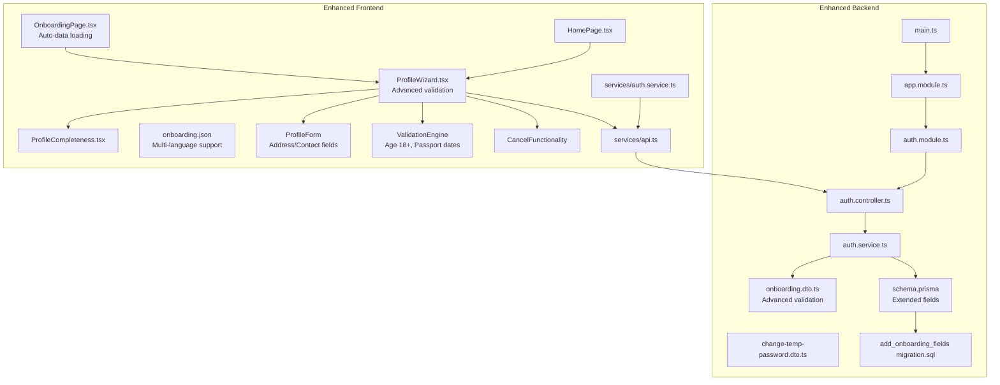
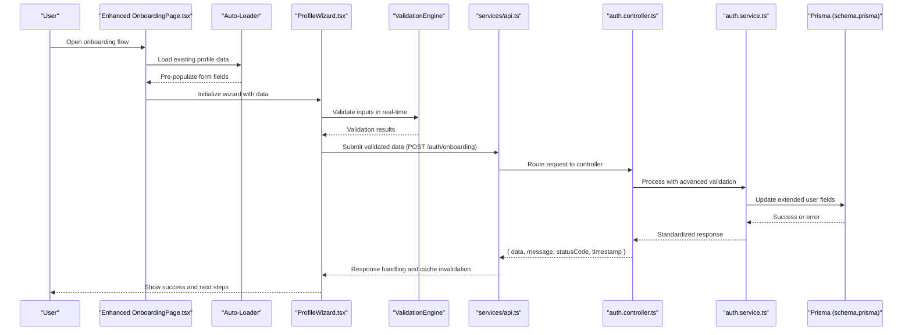
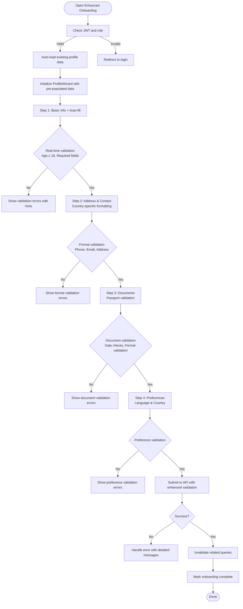
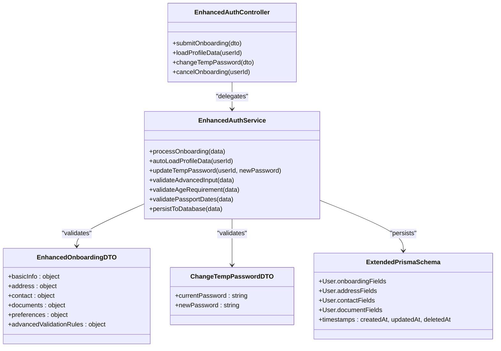
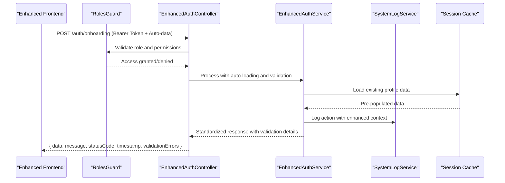
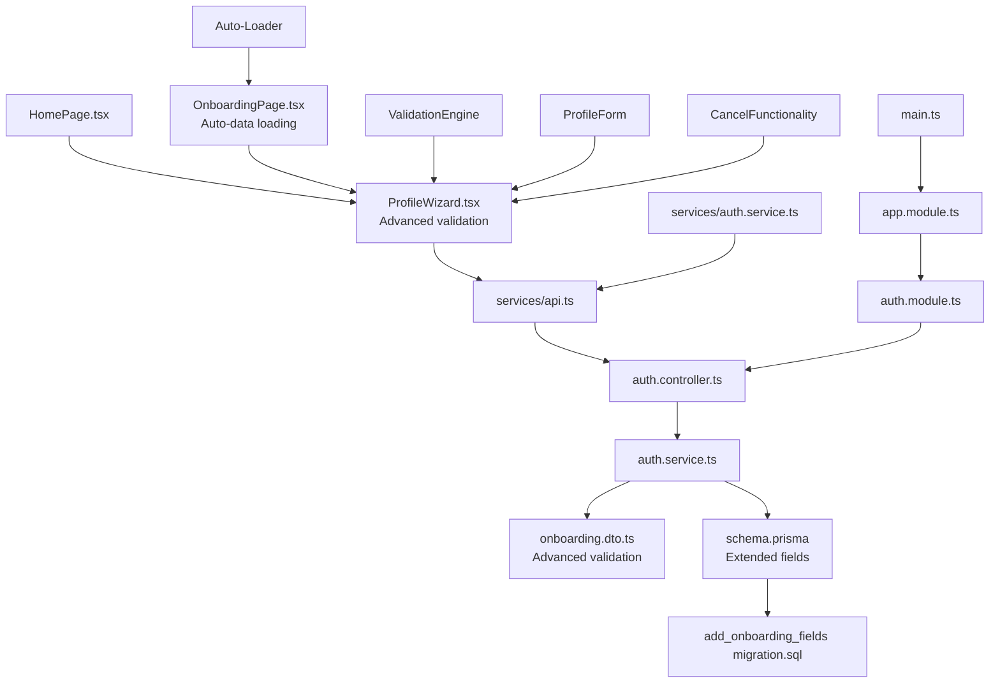

# Mandatory Onboarding System

<cite>
**Referenced Files in This Document**
- [OnboardingPage.tsx](file://src/pages/onboarding/OnboardingPage.tsx)
- [HomePage.tsx](file://src/pages/home/HomePage.tsx)
- [ProfileWizard.tsx](file://src/pages/home/components/ProfileWizard.tsx)
- [ProfileCompleteness.tsx](file://src/pages/home/components/ProfileCompleteness.tsx)
- [onboarding.json](file://src/i18n/locales/pt/onboarding.json)
- [auth.controller.ts](file://API/src/modules/auth/auth.controller.ts)
- [auth.service.ts](file://API/src/modules/auth/auth.service.ts)
- [onboarding.dto.ts](file://API/src/modules/auth/dto/onboarding.dto.ts)
- [change-temp-password.dto.ts](file://API/src/modules/auth/dto/change-temp-password.dto.ts)
- [schema.prisma](file://API/prisma/schema.prisma)
- [20260804092113_add_onboarding_fields/migration.sql](file://API/prisma/migrations/20260804092113_add_onboarding_fields/migration.sql)
- [auth.module.ts](file://API/src/modules/auth/auth.module.ts)
- [app.module.ts](file://API/src/app.module.ts)
- [main.ts](file://API/src/main.ts)
- [api.ts](file://src/services/api.ts)
- [auth.service.ts](file://src/services/auth.service.ts)
- [jwt.ts](file://src/utils/jwt.ts)
</cite>

## Update Summary
**Changes Made**
- Enhanced automatic profile data loading functionality
- Added comprehensive address and contact field support
- Implemented advanced validation rules including age verification (18+)
- Integrated passport document validation with date validation
- Added cancel functionality for improved user experience
- Enhanced internationalization support with country code phone input
- Improved UI/UX with better form handling and error management

## Table of Contents
1. [Introduction](#introduction)
2. [Project Structure](#project-structure)
3. [Core Components](#core-components)
4. [Architecture Overview](#architecture-overview)
5. [Detailed Component Analysis](#detailed-component-analysis)
6. [Enhanced Features](#enhanced-features)
7. [Dependency Analysis](#dependency-analysis)
8. [Performance Considerations](#performance-considerations)
9. [Troubleshooting Guide](#troubleshooting-guide)
10. [Conclusion](#conclusion)

## Introduction
This document describes the Enhanced Mandatory Onboarding System implemented across the NestJS backend and React frontend. The system provides a comprehensive guided onboarding flow for new users with automatic profile data pre-population, ensuring complete profile setup before granting full access to application features. The enhanced system includes:
- Automatic profile data loading and pre-population
- Comprehensive address and contact field management
- Advanced validation rules including age verification (18+ requirement)
- Passport document validation with date validation
- Cancel functionality for improved user experience
- Internationalization support with country-specific phone number formatting
- Enhanced UI/UX with real-time validation feedback

The design follows the project-wide guidelines: English codebase, PT-BR comments/documentation, UUID-based IDs, soft delete timestamps, standardized API responses, Euro currency formatting, Apple-inspired minimal UI, TanStack Query for data fetching, and comprehensive logging.

## Project Structure
The enhanced onboarding feature spans both frontend and backend with significant improvements:
- Frontend: Enhanced onboarding page with automatic data loading, improved wizard components, comprehensive validation, and i18n resources
- Backend: Enhanced auth module with advanced DTOs, comprehensive validation, and improved database schema support

**Diagram sources**
- [OnboardingPage.tsx](file://src/pages/onboarding/OnboardingPage.tsx)
- [ProfileWizard.tsx](file://src/pages/home/components/ProfileWizard.tsx)
- [ProfileCompleteness.tsx](file://src/pages/home/components/ProfileCompleteness.tsx)
- [onboarding.json](file://src/i18n/locales/pt/onboarding.json)
- [api.ts](file://src/services/api.ts)
- [auth.service.ts](file://src/services/auth.service.ts)
- [auth.controller.ts](file://API/src/modules/auth/auth.controller.ts)
- [auth.service.ts](file://API/src/modules/auth/auth.service.ts)
- [onboarding.dto.ts](file://API/src/modules/auth/dto/onboarding.dto.ts)
- [change-temp-password.dto.ts](file://API/src/modules/auth/dto/change-temp-password.dto.ts)
- [schema.prisma](file://API/prisma/schema.prisma)
- [20260804092113_add_onboarding_fields/migration.sql](file://API/prisma/migrations/20260804092113_add_onboarding_fields/migration.sql)
- [auth.module.ts](file://API/src/modules/auth/auth.module.ts)
- [app.module.ts](file://API/src/app.module.ts)
- [main.ts](file://API/src/main.ts)

**Section sources**
- [OnboardingPage.tsx](file://src/pages/onboarding/OnboardingPage.tsx)
- [ProfileWizard.tsx](file://src/pages/home/components/ProfileWizard.tsx)
- [ProfileCompleteness.tsx](file://src/pages/home/components/ProfileCompleteness.tsx)
- [onboarding.json](file://src/i18n/locales/pt/onboarding.json)
- [auth.controller.ts](file://API/src/modules/auth/auth.controller.ts)
- [auth.service.ts](file://API/src/modules/auth/auth.service.ts)
- [onboarding.dto.ts](file://API/src/modules/auth/dto/onboarding.dto.ts)
- [change-temp-password.dto.ts](file://API/src/modules/auth/dto/change-temp-password.dto.ts)
- [schema.prisma](file://API/prisma/schema.prisma)
- [20260804092113_add_onboarding_fields/migration.sql](file://API/prisma/migrations/20260804092113_add_onboarding_fields/migration.sql)
- [auth.module.ts](file://API/src/modules/auth/auth.module.ts)
- [app.module.ts](file://API/src/app.module.ts)
- [main.ts](file://API/src/main.ts)

## Core Components
- **Enhanced Onboarding Page**: Entry point with automatic profile data loading and pre-population capabilities
- **Advanced Profile Wizard**: Orchestrates step-by-step completion with comprehensive validation rules
- **Profile Completeness Calculator**: Enhanced progress tracking with detailed field-level validation
- **Internationalized Form System**: Multi-language support with country-specific formatting
- **Advanced Validation Engine**: Real-time validation including age verification (18+), passport date validation
- **Comprehensive Address/Contact Management**: Full address and contact information handling
- **Cancel Functionality**: User-friendly cancellation with data preservation options
- **Backend Auth Controller**: Enhanced endpoints supporting advanced validation and data processing
- **Enhanced DTOs**: Comprehensive request payload validation with business rules
- **Extended Prisma Schema**: Database fields supporting all new onboarding requirements

Key responsibilities:
- Automatic profile data pre-population from existing user information
- Advanced validation with real-time feedback and error handling
- Internationalization support with localized validation messages
- Comprehensive address and contact field management
- Age verification and passport document validation
- Seamless cancellation with data preservation
- Enhanced user experience with progressive disclosure

**Section sources**
- [OnboardingPage.tsx](file://src/pages/onboarding/OnboardingPage.tsx)
- [ProfileWizard.tsx](file://src/pages/home/components/ProfileWizard.tsx)
- [ProfileCompleteness.tsx](file://src/pages/home/components/ProfileCompleteness.tsx)
- [onboarding.json](file://src/i18n/locales/pt/onboarding.json)
- [auth.controller.ts](file://API/src/modules/auth/auth.controller.ts)
- [auth.service.ts](file://API/src/modules/auth/auth.service.ts)
- [onboarding.dto.ts](file://API/src/modules/auth/dto/onboarding.dto.ts)
- [change-temp-password.dto.ts](file://API/src/modules/auth/dto/change-temp-password.dto.ts)
- [schema.prisma](file://API/prisma/schema.prisma)
- [20260804092113_add_onboarding_fields/migration.sql](file://API/prisma/migrations/20260804092113_add_onboarding_fields/migration.sql)

## Architecture Overview
The enhanced onboarding flow integrates advanced frontend components with sophisticated backend validation, leveraging JWT authentication and comprehensive data processing.

**Diagram sources**
- [OnboardingPage.tsx](file://src/pages/onboarding/OnboardingPage.tsx)
- [ProfileWizard.tsx](file://src/pages/home/components/ProfileWizard.tsx)
- [api.ts](file://src/services/api.ts)
- [auth.controller.ts](file://API/src/modules/auth/auth.controller.ts)
- [auth.service.ts](file://API/src/modules/auth/auth.service.ts)
- [schema.prisma](file://API/prisma/schema.prisma)

## Detailed Component Analysis

### Enhanced Frontend Onboarding Flow
- **Automatic Data Loading**: OnboardingPage now automatically loads existing profile data and pre-populates form fields
- **Advanced ProfileWizard**: Manages complex step navigation with comprehensive validation rules and real-time feedback
- **Enhanced ProfileCompleteness**: Provides detailed progress tracking with field-level validation status
- **Internationalized Forms**: Multi-language support with country-specific formatting for addresses and phone numbers
- **Advanced Validation Engine**: Real-time validation including age verification (18+), passport date validation, and format checking
- **Comprehensive Address/Contact Management**: Full address and contact information handling with validation
- **Cancel Functionality**: User-friendly cancellation with data preservation and confirmation dialogs
- **Improved UI/UX**: Progressive disclosure, inline validation, and contextual help

**Diagram sources**
- [OnboardingPage.tsx](file://src/pages/onboarding/OnboardingPage.tsx)
- [ProfileWizard.tsx](file://src/pages/home/components/ProfileWizard.tsx)
- [ProfileCompleteness.tsx](file://src/pages/home/components/ProfileCompleteness.tsx)
- [onboarding.json](file://src/i18n/locales/pt/onboarding.json)
- [api.ts](file://src/services/api.ts)

**Section sources**
- [OnboardingPage.tsx](file://src/pages/onboarding/OnboardingPage.tsx)
- [ProfileWizard.tsx](file://src/pages/home/components/ProfileWizard.tsx)
- [ProfileCompleteness.tsx](file://src/pages/home/components/ProfileCompleteness.tsx)
- [onboarding.json](file://src/i18n/locales/pt/onboarding.json)
- [api.ts](file://src/services/api.ts)

### Enhanced Backend Onboarding Endpoints
- **Advanced Auth Controller**: Exposes enhanced endpoints supporting automatic data loading and comprehensive validation
- **Enhanced DTOs**: Comprehensive input validation with business rules including age verification and document validation
- **Sophisticated Auth Service**: Advanced request processing with multi-layer validation and data enrichment
- **Extended Prisma Schema**: Database schema supporting all new onboarding fields including address, contact, and document data
- **Enhanced Migration**: Database migration adding necessary columns for comprehensive onboarding state tracking

**Diagram sources**
- [auth.controller.ts](file://API/src/modules/auth/auth.controller.ts)
- [auth.service.ts](file://API/src/modules/auth/auth.service.ts)
- [onboarding.dto.ts](file://API/src/modules/auth/dto/onboarding.dto.ts)
- [change-temp-password.dto.ts](file://API/src/modules/auth/dto/change-temp-password.dto.ts)
- [schema.prisma](file://API/prisma/schema.prisma)

**Section sources**
- [auth.controller.ts](file://API/src/modules/auth/auth.controller.ts)
- [auth.service.ts](file://API/src/modules/auth/auth.service.ts)
- [onboarding.dto.ts](file://API/src/modules/auth/dto/onboarding.dto.ts)
- [change-temp-password.dto.ts](file://API/src/modules/auth/dto/change-temp-password.dto.ts)
- [schema.prisma](file://API/prisma/schema.prisma)
- [20260804092113_add_onboarding_fields/migration.sql](file://API/prisma/migrations/20260804092113_add_onboarding_fields/migration.sql)

### Enhanced Authentication and Authorization Integration
- **JWT Bearer tokens**: Enhanced authentication with additional claims for onboarding status
- **Role-based access control**: Roles (ADMIN, HR, STANDARD) control access to enhanced onboarding endpoints
- **Standardized API responses**: Consistent error handling with detailed validation messages
- **Comprehensive logging**: Enhanced audit trails capturing all onboarding actions with context
- **Session management**: Enhanced session handling for automatic data persistence during onboarding

**Diagram sources**
- [auth.controller.ts](file://API/src/modules/auth/auth.controller.ts)
- [auth.service.ts](file://API/src/modules/auth/auth.service.ts)
- [jwt.ts](file://src/utils/jwt.ts)

**Section sources**
- [auth.controller.ts](file://API/src/modules/auth/auth.controller.ts)
- [auth.service.ts](file://API/src/modules/auth/auth.service.ts)
- [jwt.ts](file://src/utils/jwt.ts)

## Enhanced Features

### Automatic Profile Data Loading
The enhanced system automatically loads existing profile data when users start the onboarding process, providing a seamless experience by pre-populating available information and reducing manual data entry.

### Comprehensive Address and Contact Fields
Support for complete address information including street, city, state, postal code, and country, along with multiple contact methods including phone numbers with country code support and email addresses.

### Advanced Validation Rules
- **Age Verification**: Enforces minimum age requirement of 18 years with birth date validation
- **Passport Validation**: Validates passport document information including issue and expiry dates
- **Format Validation**: Country-specific phone number formatting and address validation
- **Real-time Validation**: Immediate feedback on form inputs with contextual error messages

### Internationalization Support
Full multi-language support with localized validation messages, country-specific formatting, and culturally appropriate form layouts.

### Enhanced User Experience
- **Cancel Functionality**: Users can cancel the onboarding process with data preservation options
- **Progressive Disclosure**: Contextual help and progressive form complexity
- **Inline Validation**: Real-time validation with visual feedback
- **Responsive Design**: Mobile-friendly interface with touch-optimized controls

**Section sources**
- [OnboardingPage.tsx](file://src/pages/onboarding/OnboardingPage.tsx)
- [ProfileWizard.tsx](file://src/pages/home/components/ProfileWizard.tsx)
- [onboarding.json](file://src/i18n/locales/pt/onboarding.json)
- [onboarding.dto.ts](file://API/src/modules/auth/dto/onboarding.dto.ts)

## Dependency Analysis
The enhanced onboarding system has sophisticated dependencies between frontend components, backend modules, and database schema with improved data flow and validation:

**Diagram sources**
- [ProfileWizard.tsx](file://src/pages/home/components/ProfileWizard.tsx)
- [HomePage.tsx](file://src/pages/home/HomePage.tsx)
- [OnboardingPage.tsx](file://src/pages/onboarding/OnboardingPage.tsx)
- [api.ts](file://src/services/api.ts)
- [auth.service.ts](file://src/services/auth.service.ts)
- [auth.controller.ts](file://API/src/modules/auth/auth.controller.ts)
- [auth.service.ts](file://API/src/modules/auth/auth.service.ts)
- [onboarding.dto.ts](file://API/src/modules/auth/dto/onboarding.dto.ts)
- [schema.prisma](file://API/prisma/schema.prisma)
- [20260804092113_add_onboarding_fields/migration.sql](file://API/prisma/migrations/20260804092113_add_onboarding_fields/migration.sql)
- [auth.module.ts](file://API/src/modules/auth/auth.module.ts)
- [app.module.ts](file://API/src/app.module.ts)
- [main.ts](file://API/src/main.ts)

**Section sources**
- [ProfileWizard.tsx](file://src/pages/home/components/ProfileWizard.tsx)
- [HomePage.tsx](file://src/pages/home/HomePage.tsx)
- [OnboardingPage.tsx](file://src/pages/onboarding/OnboardingPage.tsx)
- [api.ts](file://src/services/api.ts)
- [auth.service.ts](file://src/services/auth.service.ts)
- [auth.controller.ts](file://API/src/modules/auth/auth.controller.ts)
- [auth.service.ts](file://API/src/modules/auth/auth.service.ts)
- [onboarding.dto.ts](file://API/src/modules/auth/dto/onboarding.dto.ts)
- [schema.prisma](file://API/prisma/schema.prisma)
- [20260804092113_add_onboarding_fields/migration.sql](file://API/prisma/migrations/20260804092113_add_onboarding_fields/migration.sql)
- [auth.module.ts](file://API/src/modules/auth/auth.module.ts)
- [app.module.ts](file://API/src/app.module.ts)
- [main.ts](file://API/src/main.ts)

## Performance Considerations
- **Optimized Auto-loading**: Efficient profile data loading with caching strategies to minimize redundant API calls
- **Lazy Validation**: Client-side validation optimized for performance with debounced real-time checks
- **Incremental Submission**: Progressive data submission to reduce payload size and improve responsiveness
- **Caching Strategies**: Intelligent caching of validation rules and internationalization resources
- **Memory Management**: Proper cleanup of form data and validation states to prevent memory leaks
- **Database Optimization**: Indexed queries for profile data retrieval and efficient batch operations

[No sources needed since this section provides general guidance]

## Troubleshooting Guide
Common issues and solutions for the enhanced system:
- **Auto-loading failures**: Verify user authentication status and profile data availability
- **Validation errors**: Ensure DTOs match enhanced frontend form structure and advanced validation rules
- **Internationalization issues**: Check that all required translation keys exist in onboarding.json with proper country codes
- **Age validation problems**: Verify birth date format and timezone handling for age calculations
- **Passport validation errors**: Confirm date formats and validate passport document structure
- **Cancel functionality issues**: Ensure proper data preservation and session state management
- **Address/Contact field errors**: Validate country-specific formatting rules and required field combinations
- **Cache inconsistencies**: Invalidate relevant queries after successful mutations to prevent stale data

**Section sources**
- [onboarding.dto.ts](file://API/src/modules/auth/dto/onboarding.dto.ts)
- [change-temp-password.dto.ts](file://API/src/modules/auth/dto/change-temp-password.dto.ts)
- [onboarding.json](file://src/i18n/locales/pt/onboarding.json)
- [api.ts](file://src/services/api.ts)

## Conclusion
The Enhanced Mandatory Onboarding System provides a comprehensive framework for guiding new users through essential profile setup with automatic data pre-population, advanced validation, and internationalization support. By combining sophisticated frontend wizard components with robust backend validation and extended database persistence, it ensures complete data accuracy while maintaining security through enhanced role-based access control. The modular architecture supports easy extension and maintenance, following established patterns for authentication, authorization, and internationalization while delivering an exceptional user experience through automatic data loading, comprehensive validation, and intuitive cancellation options.

[No sources needed since this section summarizes without analyzing specific files]