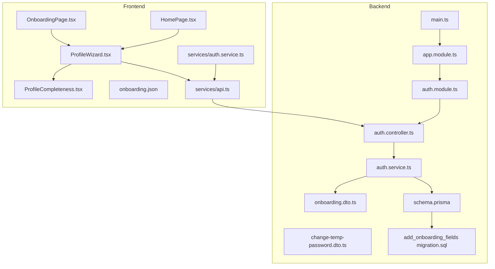
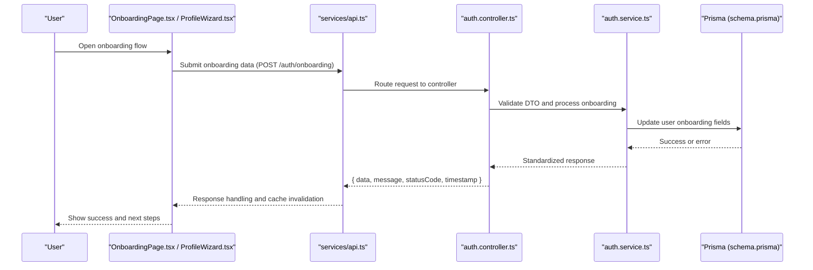
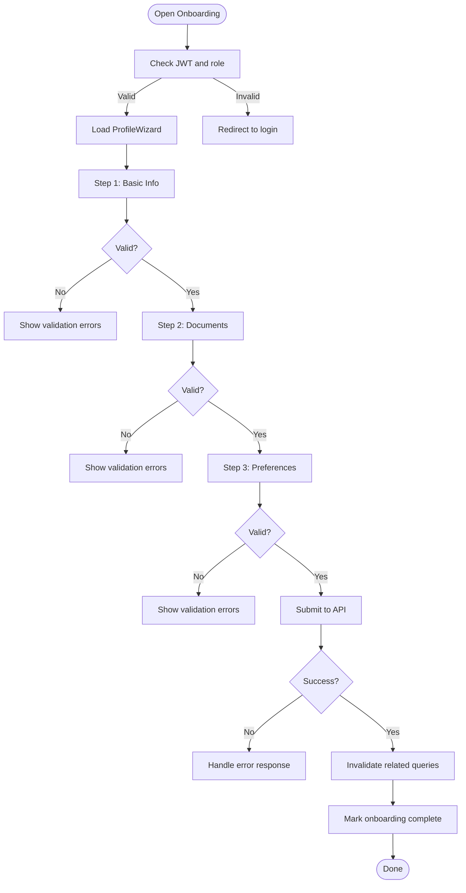
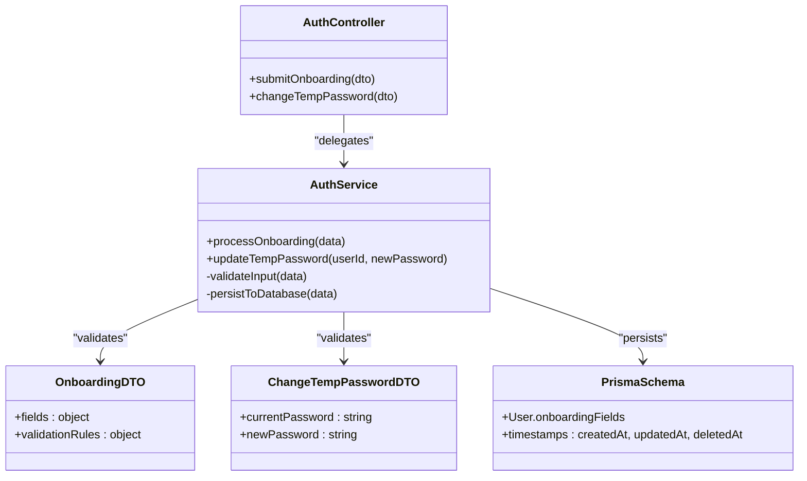
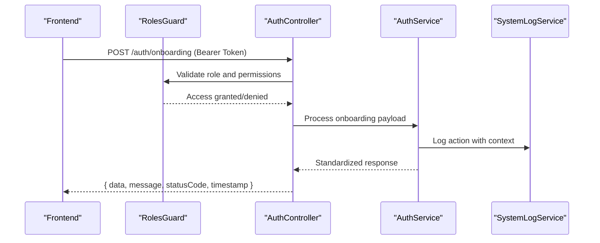
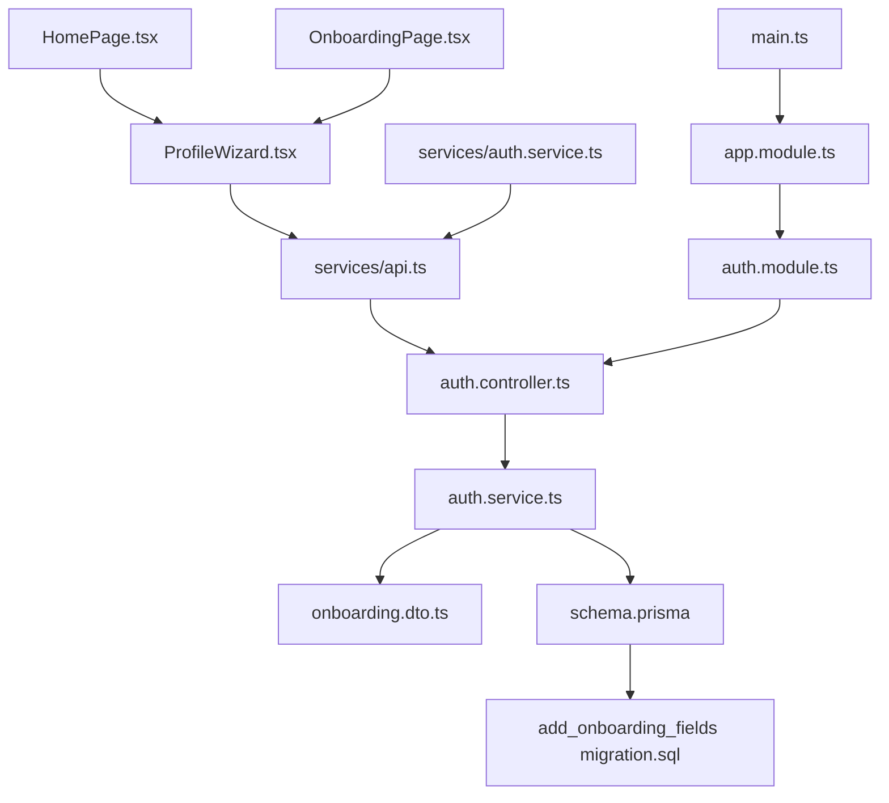

# Mandatory Onboarding System

<cite>
**Referenced Files in This Document**
- [OnboardingPage.tsx](file://src/pages/onboarding/OnboardingPage.tsx)
- [HomePage.tsx](file://src/pages/home/HomePage.tsx)
- [ProfileWizard.tsx](file://src/pages/home/components/ProfileWizard.tsx)
- [ProfileCompleteness.tsx](file://src/pages/home/components/ProfileCompleteness.tsx)
- [onboarding.json](file://src/i18n/locales/pt/onboarding.json)
- [auth.controller.ts](file://API/src/modules/auth/auth.controller.ts)
- [auth.service.ts](file://API/src/modules/auth/auth.service.ts)
- [onboarding.dto.ts](file://API/src/modules/auth/dto/onboarding.dto.ts)
- [change-temp-password.dto.ts](file://API/src/modules/auth/dto/change-temp-password.dto.ts)
- [schema.prisma](file://API/prisma/schema.prisma)
- [20260804092113_add_onboarding_fields/migration.sql](file://API/prisma/migrations/20260804092113_add_onboarding_fields/migration.sql)
- [auth.module.ts](file://API/src/modules/auth/auth.module.ts)
- [app.module.ts](file://API/src/app.module.ts)
- [main.ts](file://API/src/main.ts)
- [api.ts](file://src/services/api.ts)
- [auth.service.ts](file://src/services/auth.service.ts)
- [jwt.ts](file://src/utils/jwt.ts)
</cite>

## Table of Contents
1. [Introduction](#introduction)
2. [Project Structure](#project-structure)
3. [Core Components](#core-components)
4. [Architecture Overview](#architecture-overview)
5. [Detailed Component Analysis](#detailed-component-analysis)
6. [Dependency Analysis](#dependency-analysis)
7. [Performance Considerations](#performance-considerations)
8. [Troubleshooting Guide](#troubleshooting-guide)
9. [Conclusion](#conclusion)

## Introduction
This document describes the Mandatory Onboarding System implemented across the NestJS backend and React frontend. The system enforces a guided onboarding flow for new users, ensuring profile completeness before granting full access to application features. It includes:
- Backend DTOs and endpoints for onboarding data submission and temporary password changes
- Database schema fields supporting onboarding state tracking
- Frontend pages and components that guide users through required steps
- Internationalization (i18n) support for user-facing text
- Integration with authentication via JWT Bearer tokens

The design follows the project-wide guidelines: English codebase, PT-BR comments/documentation, UUID-based IDs, soft delete timestamps, standardized API responses, Euro currency formatting, Apple-inspired minimal UI, TanStack Query for data fetching, and comprehensive logging.

## Project Structure
The onboarding feature spans both frontend and backend:
- Frontend: Onboarding page and home page wizard components, i18n resources, and services for API calls
- Backend: Auth module controllers, services, DTOs, Prisma schema, and migrations

**Diagram sources**
- [OnboardingPage.tsx](file://src/pages/onboarding/OnboardingPage.tsx)
- [HomePage.tsx](file://src/pages/home/HomePage.tsx)
- [ProfileWizard.tsx](file://src/pages/home/components/ProfileWizard.tsx)
- [ProfileCompleteness.tsx](file://src/pages/home/components/ProfileCompleteness.tsx)
- [onboarding.json](file://src/i18n/locales/pt/onboarding.json)
- [api.ts](file://src/services/api.ts)
- [auth.service.ts](file://src/services/auth.service.ts)
- [auth.controller.ts](file://API/src/modules/auth/auth.controller.ts)
- [auth.service.ts](file://API/src/modules/auth/auth.service.ts)
- [onboarding.dto.ts](file://API/src/modules/auth/dto/onboarding.dto.ts)
- [change-temp-password.dto.ts](file://API/src/modules/auth/dto/change-temp-password.dto.ts)
- [schema.prisma](file://API/prisma/schema.prisma)
- [20260804092113_add_onboarding_fields/migration.sql](file://API/prisma/migrations/20260804092113_add_onboarding_fields/migration.sql)
- [auth.module.ts](file://API/src/modules/auth/auth.module.ts)
- [app.module.ts](file://API/src/app.module.ts)
- [main.ts](file://API/src/main.ts)

**Section sources**
- [OnboardingPage.tsx](file://src/pages/onboarding/OnboardingPage.tsx)
- [HomePage.tsx](file://src/pages/home/HomePage.tsx)
- [ProfileWizard.tsx](file://src/pages/home/components/ProfileWizard.tsx)
- [ProfileCompleteness.tsx](file://src/pages/home/components/ProfileCompleteness.tsx)
- [onboarding.json](file://src/i18n/locales/pt/onboarding.json)
- [auth.controller.ts](file://API/src/modules/auth/auth.controller.ts)
- [auth.service.ts](file://API/src/modules/auth/auth.service.ts)
- [onboarding.dto.ts](file://API/src/modules/auth/dto/onboarding.dto.ts)
- [change-temp-password.dto.ts](file://API/src/modules/auth/dto/change-temp-password.dto.ts)
- [schema.prisma](file://API/prisma/schema.prisma)
- [20260804092113_add_onboarding_fields/migration.sql](file://API/prisma/migrations/20260804092113_add_onboarding_fields/migration.sql)
- [auth.module.ts](file://API/src/modules/auth/auth.module.ts)
- [app.module.ts](file://API/src/app.module.ts)
- [main.ts](file://API/src/main.ts)

## Core Components
- Onboarding Page: Entry point for mandatory onboarding flow; guides users through required profile sections
- Profile Wizard: Orchestrates step-by-step completion of profile fields and validations
- Profile Completeness: Calculates and displays progress toward full profile completion
- Backend Auth Controller: Exposes REST endpoints for onboarding submissions and temporary password changes
- Backend Auth Service: Implements business logic for onboarding data processing and validation
- DTOs: Define request payloads for onboarding and temporary password updates
- Prisma Schema and Migration: Add onboarding-related fields to persist user state
- Services and Utilities: Handle API communication, JWT token management, and query invalidation

Key responsibilities:
- Enforce mandatory fields before allowing access to protected routes
- Validate inputs using DTOs and return standardized error responses
- Track onboarding progress and update database records accordingly
- Provide localized messages for user guidance

**Section sources**
- [OnboardingPage.tsx](file://src/pages/onboarding/OnboardingPage.tsx)
- [ProfileWizard.tsx](file://src/pages/home/components/ProfileWizard.tsx)
- [ProfileCompleteness.tsx](file://src/pages/home/components/ProfileCompleteness.tsx)
- [auth.controller.ts](file://API/src/modules/auth/auth.controller.ts)
- [auth.service.ts](file://API/src/modules/auth/auth.service.ts)
- [onboarding.dto.ts](file://API/src/modules/auth/dto/onboarding.dto.ts)
- [change-temp-password.dto.ts](file://API/src/modules/auth/dto/change-temp-password.dto.ts)
- [schema.prisma](file://API/prisma/schema.prisma)
- [20260804092113_add_onboarding_fields/migration.sql](file://API/prisma/migrations/20260804092113_add_onboarding_fields/migration.sql)

## Architecture Overview
The onboarding flow integrates frontend components with backend endpoints, leveraging JWT authentication and standardized API responses.

**Diagram sources**
- [OnboardingPage.tsx](file://src/pages/onboarding/OnboardingPage.tsx)
- [ProfileWizard.tsx](file://src/pages/home/components/ProfileWizard.tsx)
- [api.ts](file://src/services/api.ts)
- [auth.controller.ts](file://API/src/modules/auth/auth.controller.ts)
- [auth.service.ts](file://API/src/modules/auth/auth.service.ts)
- [schema.prisma](file://API/prisma/schema.prisma)

## Detailed Component Analysis

### Frontend Onboarding Flow
- OnboardingPage serves as the entry point, rendering the wizard and progress indicators
- ProfileWizard manages step navigation, field validation, and submission orchestration
- ProfileCompleteness computes completion percentage based on required fields
- i18n resource provides localized strings for labels, hints, and messages
- Services handle API calls and invalidate queries upon successful mutations

**Diagram sources**
- [OnboardingPage.tsx](file://src/pages/onboarding/OnboardingPage.tsx)
- [ProfileWizard.tsx](file://src/pages/home/components/ProfileWizard.tsx)
- [ProfileCompleteness.tsx](file://src/pages/home/components/ProfileCompleteness.tsx)
- [onboarding.json](file://src/i18n/locales/pt/onboarding.json)
- [api.ts](file://src/services/api.ts)

**Section sources**
- [OnboardingPage.tsx](file://src/pages/onboarding/OnboardingPage.tsx)
- [ProfileWizard.tsx](file://src/pages/home/components/ProfileWizard.tsx)
- [ProfileCompleteness.tsx](file://src/pages/home/components/ProfileCompleteness.tsx)
- [onboarding.json](file://src/i18n/locales/pt/onboarding.json)
- [api.ts](file://src/services/api.ts)

### Backend Onboarding Endpoints
- Auth Controller exposes endpoints for onboarding data submission and temporary password changes
- DTOs enforce input validation rules for onboarding payloads
- Auth Service processes requests, validates data, and interacts with Prisma
- Prisma Schema includes onboarding-related fields for user entities
- Migration adds necessary columns to support onboarding state tracking

**Diagram sources**
- [auth.controller.ts](file://API/src/modules/auth/auth.controller.ts)
- [auth.service.ts](file://API/src/modules/auth/auth.service.ts)
- [onboarding.dto.ts](file://API/src/modules/auth/dto/onboarding.dto.ts)
- [change-temp-password.dto.ts](file://API/src/modules/auth/dto/change-temp-password.dto.ts)
- [schema.prisma](file://API/prisma/schema.prisma)

**Section sources**
- [auth.controller.ts](file://API/src/modules/auth/auth.controller.ts)
- [auth.service.ts](file://API/src/modules/auth/auth.service.ts)
- [onboarding.dto.ts](file://API/src/modules/auth/dto/onboarding.dto.ts)
- [change-temp-password.dto.ts](file://API/src/modules/auth/dto/change-temp-password.dto.ts)
- [schema.prisma](file://API/prisma/schema.prisma)
- [20260804092113_add_onboarding_fields/migration.sql](file://API/prisma/migrations/20260804092113_add_onboarding_fields/migration.sql)

### Authentication and Authorization Integration
- JWT Bearer tokens are used for authentication, containing user ID, email, and role
- Roles (ADMIN, HR, STANDARD) control access to onboarding endpoints
- Standardized API responses ensure consistent error handling and status codes
- Logging captures all onboarding actions with context for audit trails

**Diagram sources**
- [auth.controller.ts](file://API/src/modules/auth/auth.controller.ts)
- [auth.service.ts](file://API/src/modules/auth/auth.service.ts)
- [jwt.ts](file://src/utils/jwt.ts)

**Section sources**
- [auth.controller.ts](file://API/src/modules/auth/auth.controller.ts)
- [auth.service.ts](file://API/src/modules/auth/auth.service.ts)
- [jwt.ts](file://src/utils/jwt.ts)

## Dependency Analysis
The onboarding system has clear dependencies between frontend components, backend modules, and database schema:

**Diagram sources**
- [ProfileWizard.tsx](file://src/pages/home/components/ProfileWizard.tsx)
- [HomePage.tsx](file://src/pages/home/HomePage.tsx)
- [OnboardingPage.tsx](file://src/pages/onboarding/OnboardingPage.tsx)
- [api.ts](file://src/services/api.ts)
- [auth.service.ts](file://src/services/auth.service.ts)
- [auth.controller.ts](file://API/src/modules/auth/auth.controller.ts)
- [auth.service.ts](file://API/src/modules/auth/auth.service.ts)
- [onboarding.dto.ts](file://API/src/modules/auth/dto/onboarding.dto.ts)
- [schema.prisma](file://API/prisma/schema.prisma)
- [20260804092113_add_onboarding_fields/migration.sql](file://API/prisma/migrations/20260804092113_add_onboarding_fields/migration.sql)
- [auth.module.ts](file://API/src/modules/auth/auth.module.ts)
- [app.module.ts](file://API/src/app.module.ts)
- [main.ts](file://API/src/main.ts)

**Section sources**
- [ProfileWizard.tsx](file://src/pages/home/components/ProfileWizard.tsx)
- [HomePage.tsx](file://src/pages/home/HomePage.tsx)
- [OnboardingPage.tsx](file://src/pages/onboarding/OnboardingPage.tsx)
- [api.ts](file://src/services/api.ts)
- [auth.service.ts](file://src/services/auth.service.ts)
- [auth.controller.ts](file://API/src/modules/auth/auth.controller.ts)
- [auth.service.ts](file://API/src/modules/auth/auth.service.ts)
- [onboarding.dto.ts](file://API/src/modules/auth/dto/onboarding.dto.ts)
- [schema.prisma](file://API/prisma/schema.prisma)
- [20260804092113_add_onboarding_fields/migration.sql](file://API/prisma/migrations/20260804092113_add_onboarding_fields/migration.sql)
- [auth.module.ts](file://API/src/modules/auth/auth.module.ts)
- [app.module.ts](file://API/src/app.module.ts)
- [main.ts](file://API/src/main.ts)

## Performance Considerations
- Use TanStack Query caching to minimize redundant API calls during onboarding steps
- Implement optimistic updates for better perceived performance when submitting onboarding data
- Validate inputs client-side first to reduce server load and provide immediate feedback
- Avoid heavy computations in the main thread; use Web Workers if complex calculations are needed
- Optimize image uploads by compressing files before sending to the server
- Monitor database query performance for onboarding data persistence operations

[No sources needed since this section provides general guidance]

## Troubleshooting Guide
Common issues and solutions:
- Validation errors: Ensure DTOs match frontend form structure and validation rules
- Authentication failures: Verify JWT token is properly attached to requests and contains valid role claims
- Database migration issues: Confirm all migrations are applied and schema matches expected state
- i18n missing keys: Check that all required translation keys exist in onboarding.json
- Cache inconsistencies: Invalidate relevant queries after successful mutations to prevent stale data

**Section sources**
- [onboarding.dto.ts](file://API/src/modules/auth/dto/onboarding.dto.ts)
- [change-temp-password.dto.ts](file://API/src/modules/auth/dto/change-temp-password.dto.ts)
- [onboarding.json](file://src/i18n/locales/pt/onboarding.json)
- [api.ts](file://src/services/api.ts)

## Conclusion
The Mandatory Onboarding System provides a robust framework for guiding new users through essential profile setup. By combining frontend wizard components with backend validation and database persistence, it ensures data completeness while maintaining security through role-based access control. The modular architecture allows for easy extension and maintenance, following established patterns for authentication, authorization, and internationalization.

[No sources needed since this section summarizes without analyzing specific files]