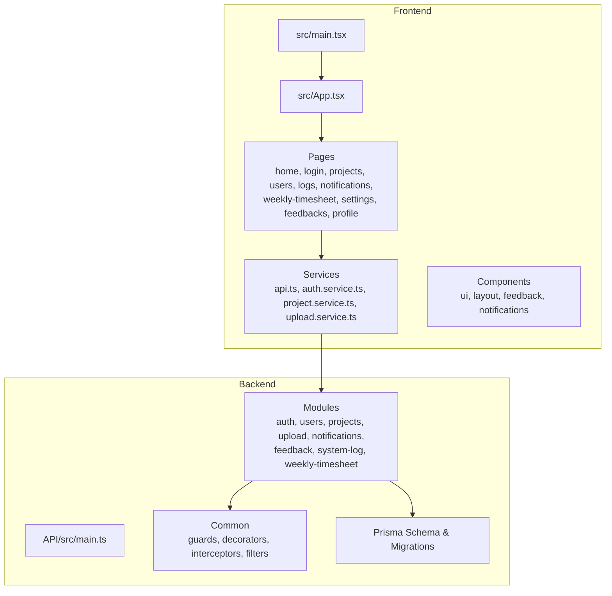
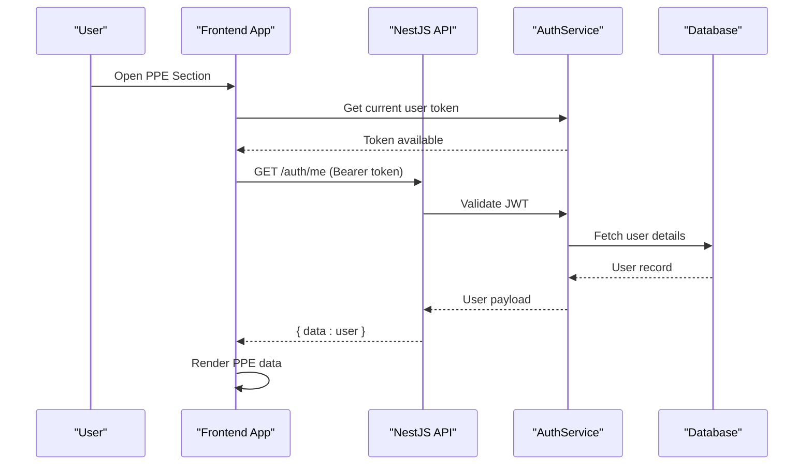
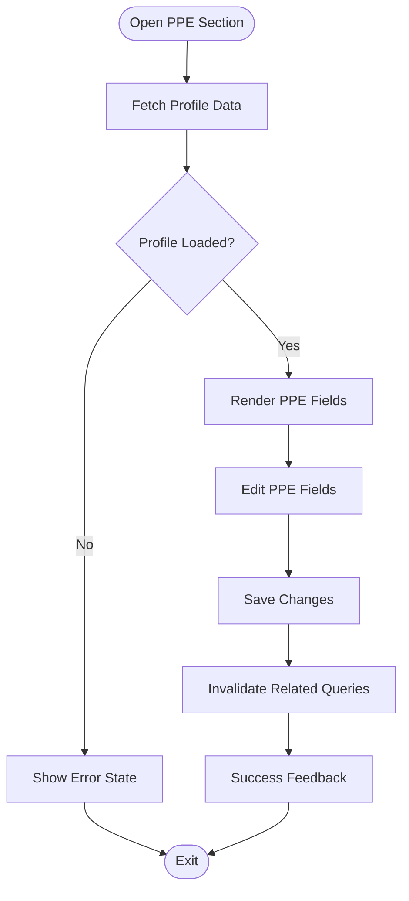
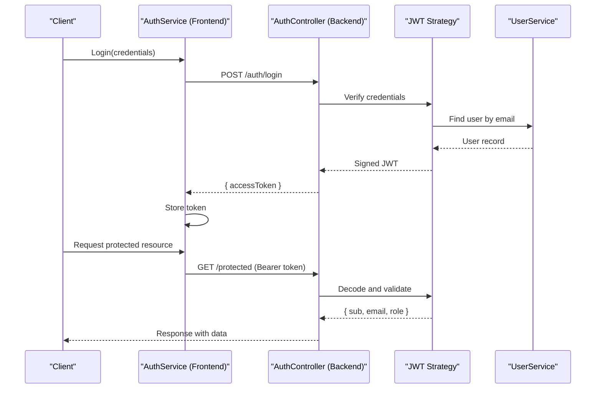
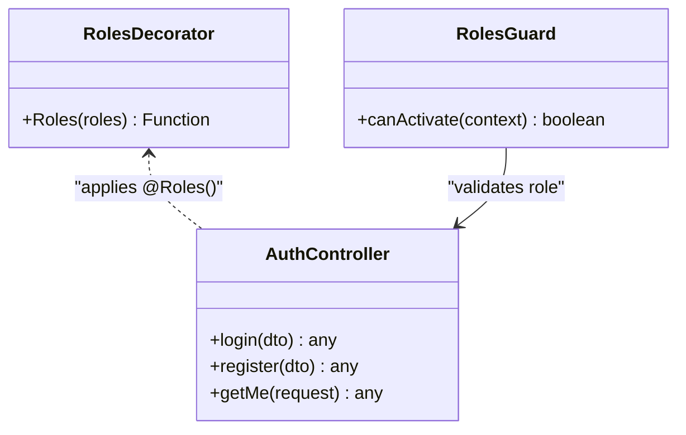
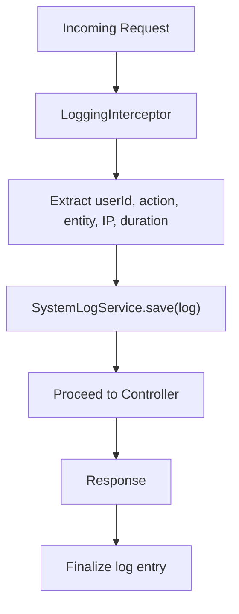
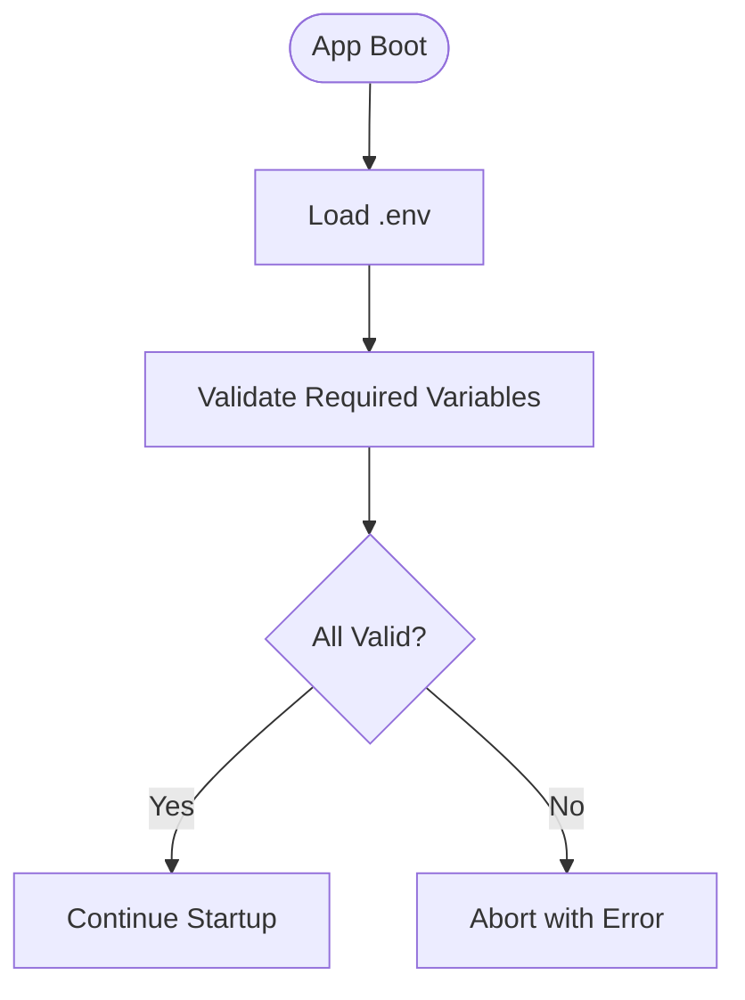
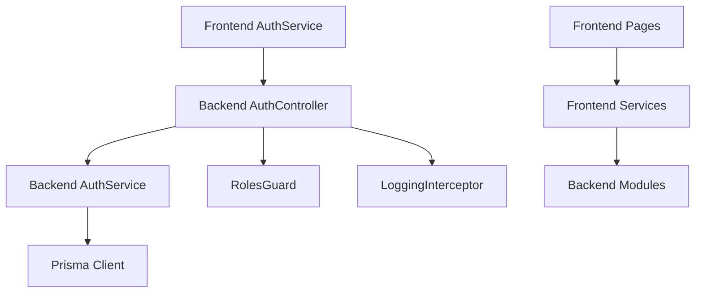

# Sistema de Gestão de EPI (Equipamento de Proteção Individual)

<cite>
**Referenced Files in This Document**
- [README.md](file://README.md)
- [package.json](file://package.json)
- [vite.config.ts](file://vite.config.ts)
- [src/main.tsx](file://src/main.tsx)
- [src/App.tsx](file://src/App.tsx)
- [src/pages/home/components/PpeSection.tsx](file://src/pages/home/components/PpeSection.tsx)
- [src/services/auth.service.ts](file://src/services/auth.service.ts)
- [API/src/app.module.ts](file://API/src/app.module.ts)
- [API/src/modules/auth/auth.controller.ts](file://API/src/modules/auth/auth.controller.ts)
- [API/src/modules/auth/auth.service.ts](file://API/src/modules/auth/auth.service.ts)
- [API/prisma/schema.prisma](file://API/prisma/schema.prisma)
- [API/src/common/guards/roles.guard.ts](file://API/src/common/guards/roles.guard.ts)
- [API/src/common/decorators/roles.decorator.ts](file://API/src/common/decorators/roles.decorator.ts)
- [API/src/common/interceptors/logging.interceptor.ts](file://API/src/common/interceptors/logging.interceptor.ts)
- [API/src/config/env.validation.ts](file://API/src/config/env.validation.ts)
</cite>

## Table of Contents
1. [Introduction](#introduction)
2. [Project Structure](#project-structure)
3. [Core Components](#core-components)
4. [Architecture Overview](#architecture-overview)
5. [Detailed Component Analysis](#detailed-component-analysis)
6. [Dependency Analysis](#dependency-analysis)
7. [Performance Considerations](#performance-considerations)
8. [Troubleshooting Guide](#troubleshooting-guide)
9. [Conclusion](#conclusion)

## Introduction
This document describes the Windlog PPE (Personal Protective Equipment, “EPI” in Portuguese) Management System. It is a web application for wind energy technicians that combines a React frontend with a NestJS backend communicating via REST API. The system implements role-based access control (RBAC), standardized responses, secure file uploads, and comprehensive logging. The PPE module allows users to manage their personal protective equipment records as part of profile management.

Key characteristics:
- Monorepo with separate frontend (Vite + React) and backend (NestJS).
- JWT Bearer authentication; payload includes sub (userId), email, and role.
- RBAC roles: ADMIN, HR, STANDARD.
- UUID primary keys and soft delete on core entities.
- Standardized success/error response format.
- Euro currency and pt-PT locale defaults.
- Apple-inspired design system using Tailwind CSS v4.
- Data fetching and caching via TanStack Query.
- i18n required for all user-facing text.
- Full audit logging per user action.

[No sources needed since this section provides general context]

## Project Structure
The repository is organized into two main parts:
- Frontend under src/: React pages, components, services, hooks, types, utilities, and i18n locales.
- Backend under API/: NestJS modules, Prisma schema, migrations, common guards/interceptors, and configuration.

High-level structure:
- Frontend entry points: src/main.tsx, src/App.tsx.
- Pages include home, login, projects, users, logs, notifications, weekly-timesheet, settings, feedbacks, and profile.
- Services encapsulate API calls (auth, project, upload, etc.).
- Backend modules implement controllers, services, DTOs, and database interactions via Prisma.
- Common utilities provide guards, decorators, interceptors, filters, and validation.

**Diagram sources**
- [src/main.tsx](file://src/main.tsx)
- [src/App.tsx](file://src/App.tsx)
- [API/src/app.module.ts](file://API/src/app.module.ts)

**Section sources**
- [README.md](file://README.md)
- [package.json](file://package.json)
- [vite.config.ts](file://vite.config.ts)

## Core Components
- Authentication Service (frontend): Handles JWT token storage, retrieval, and HTTP headers for authenticated requests.
- Auth Module (backend): Provides login, registration, profile updates, and JWT issuance/validation.
- Roles Guard and Decorators: Enforce RBAC at controller endpoints.
- Logging Interceptor: Captures request/response metadata and persists audit logs.
- Environment Validation: Ensures required environment variables are present and valid.

PPE-related functionality:
- Frontend PPE Section component integrates with profile management to display and edit user PPE data.
- Backend supports user PPE fields through Prisma schema and related migrations.

**Section sources**
- [src/services/auth.service.ts](file://src/services/auth.service.ts)
- [API/src/modules/auth/auth.controller.ts](file://API/src/modules/auth/auth.controller.ts)
- [API/src/modules/auth/auth.service.ts](file://API/src/modules/auth/auth.service.ts)
- [API/src/common/guards/roles.guard.ts](file://API/src/common/guards/roles.guard.ts)
- [API/src/common/decorators/roles.decorator.ts](file://API/src/common/decorators/roles.decorator.ts)
- [API/src/common/interceptors/logging.interceptor.ts](file://API/src/common/interceptors/logging.interceptor.ts)
- [API/src/config/env.validation.ts](file://API/src/config/env.validation.ts)
- [API/prisma/schema.prisma](file://API/prisma/schema.prisma)
- [src/pages/home/components/PpeSection.tsx](file://src/pages/home/components/PpeSection.tsx)

## Architecture Overview
Windlog follows a layered architecture:
- Presentation Layer: React UI with TanStack Query for data fetching and caching.
- API Layer: NestJS controllers exposing REST endpoints.
- Business Logic: Services implementing domain operations.
- Data Access: Prisma ORM interacting with the database.
- Cross-cutting concerns: Guards, interceptors, decorators, and validation.

**Diagram sources**
- [src/services/auth.service.ts](file://src/services/auth.service.ts)
- [API/src/modules/auth/auth.controller.ts](file://API/src/modules/auth/auth.controller.ts)
- [API/src/modules/auth/auth.service.ts](file://API/src/modules/auth/auth.service.ts)
- [API/prisma/schema.prisma](file://API/prisma/schema.prisma)

## Detailed Component Analysis

### PPE Section (Frontend)
The PPE Section component displays and edits user PPE information within the profile flow. It integrates with TanStack Query for state synchronization and uses i18n for localized labels.

Responsibilities:
- Fetch user profile including PPE fields.
- Present editable fields for PPE items.
- Submit updates via service layer.
- Invalidate queries after mutations.

**Diagram sources**
- [src/pages/home/components/PpeSection.tsx](file://src/pages/home/components/PpeSection.tsx)

**Section sources**
- [src/pages/home/components/PpeSection.tsx](file://src/pages/home/components/PpeSection.tsx)

### Authentication Flow (JWT)
Authentication uses JWT Bearer tokens. The frontend stores and attaches tokens to requests; the backend validates them and returns user payloads.

**Diagram sources**
- [src/services/auth.service.ts](file://src/services/auth.service.ts)
- [API/src/modules/auth/auth.controller.ts](file://API/src/modules/auth/auth.controller.ts)
- [API/src/modules/auth/auth.service.ts](file://API/src/modules/auth/auth.service.ts)

**Section sources**
- [src/services/auth.service.ts](file://src/services/auth.service.ts)
- [API/src/modules/auth/auth.controller.ts](file://API/src/modules/auth/auth.controller.ts)
- [API/src/modules/auth/auth.service.ts](file://API/src/modules/auth/auth.service.ts)

### Role-Based Access Control (RBAC)
RBAC enforces permissions based on roles defined in the JWT payload. Controllers use @Roles() decorator and RolesGuard validates access.

**Diagram sources**
- [API/src/common/guards/roles.guard.ts](file://API/src/common/guards/roles.guard.ts)
- [API/src/common/decorators/roles.decorator.ts](file://API/src/common/decorators/roles.decorator.ts)
- [API/src/modules/auth/auth.controller.ts](file://API/src/modules/auth/auth.controller.ts)

**Section sources**
- [API/src/common/guards/roles.guard.ts](file://API/src/common/guards/roles.guard.ts)
- [API/src/common/decorators/roles.decorator.ts](file://API/src/common/decorators/roles.decorator.ts)
- [API/src/modules/auth/auth.controller.ts](file://API/src/modules/auth/auth.controller.ts)

### Logging and Audit Trail
LoggingInterceptor captures request metadata and duration, while SystemLogService persists logs. Every user action should be logged with full context.

**Diagram sources**
- [API/src/common/interceptors/logging.interceptor.ts](file://API/src/common/interceptors/logging.interceptor.ts)

**Section sources**
- [API/src/common/interceptors/logging.interceptor.ts](file://API/src/common/interceptors/logging.interceptor.ts)

### Environment Configuration and Validation
Environment variables are validated at startup to ensure required configuration is present.

**Diagram sources**
- [API/src/config/env.validation.ts](file://API/src/config/env.validation.ts)

**Section sources**
- [API/src/config/env.validation.ts](file://API/src/config/env.validation.ts)

## Dependency Analysis
The system’s dependencies can be visualized as follows:
- Frontend depends on services for API communication and TanStack Query for caching.
- Backend modules depend on Prisma for data access and common utilities for cross-cutting concerns.
- Authentication flows connect frontend auth service with backend auth controller and strategy.

**Diagram sources**
- [src/services/auth.service.ts](file://src/services/auth.service.ts)
- [API/src/modules/auth/auth.controller.ts](file://API/src/modules/auth/auth.controller.ts)
- [API/src/modules/auth/auth.service.ts](file://API/src/modules/auth/auth.service.ts)
- [API/prisma/schema.prisma](file://API/prisma/schema.prisma)
- [API/src/common/guards/roles.guard.ts](file://API/src/common/guards/roles.guard.ts)
- [API/src/common/interceptors/logging.interceptor.ts](file://API/src/common/interceptors/logging.interceptor.ts)

**Section sources**
- [src/services/auth.service.ts](file://src/services/auth.service.ts)
- [API/src/modules/auth/auth.controller.ts](file://API/src/modules/auth/auth.controller.ts)
- [API/src/modules/auth/auth.service.ts](file://API/src/modules/auth/auth.service.ts)
- [API/prisma/schema.prisma](file://API/prisma/schema.prisma)
- [API/src/common/guards/roles.guard.ts](file://API/src/common/guards/roles.guard.ts)
- [API/src/common/interceptors/logging.interceptor.ts](file://API/src/common/interceptors/logging.interceptor.ts)

## Performance Considerations
- Use TanStack Query effectively: cache responses, invalidate on mutations, and avoid unnecessary refetches.
- Keep JWT payloads minimal; only include necessary claims (sub, email, role).
- Implement pagination and filtering on list endpoints to reduce payload sizes.
- Optimize database queries with selective field selection and proper indexing.
- Avoid synchronous heavy operations in request handlers; offload to background jobs if needed.
- Leverage browser caching and CDN for static assets.

[No sources needed since this section provides general guidance]

## Troubleshooting Guide
Common issues and resolutions:
- Authentication failures: Ensure JWT is correctly attached as Bearer token and not expired. Check server-side validation and secret configuration.
- Permission denied errors: Verify user role in JWT matches @Roles() requirements and RolesGuard logic.
- Missing environment variables: Confirm all required variables are set and validated at startup.
- Upload errors: Validate MIME type and size constraints; check Multer configuration and storage paths.
- Logging gaps: Ensure LoggingInterceptor is enabled and SystemLogService is configured to persist entries.

**Section sources**
- [API/src/common/guards/roles.guard.ts](file://API/src/common/guards/roles.guard.ts)
- [API/src/common/decorators/roles.decorator.ts](file://API/src/common/decorators/roles.decorator.ts)
- [API/src/config/env.validation.ts](file://API/src/config/env.validation.ts)
- [API/src/common/interceptors/logging.interceptor.ts](file://API/src/common/interceptors/logging.interceptor.ts)

## Conclusion
The Windlog PPE Management System provides a robust foundation for managing personal protective equipment data within a secure, auditable, and scalable architecture. By adhering to RBAC, standardized responses, comprehensive logging, and modern frontend practices, it ensures reliability and maintainability. Future enhancements may include advanced PPE lifecycle tracking, integration with external safety systems, and enhanced analytics for compliance reporting.

[No sources needed since this section summarizes without analyzing specific files]