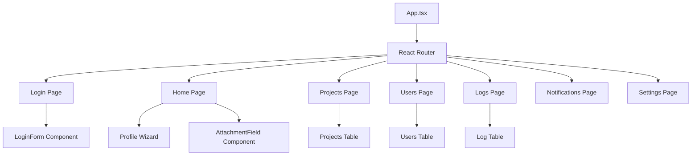
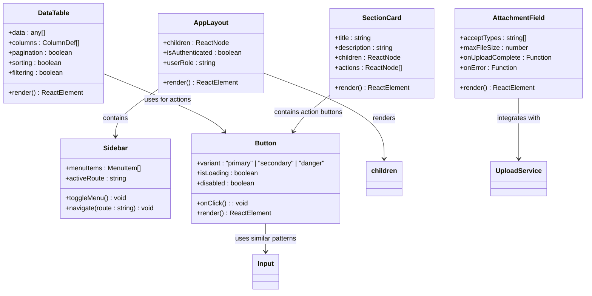
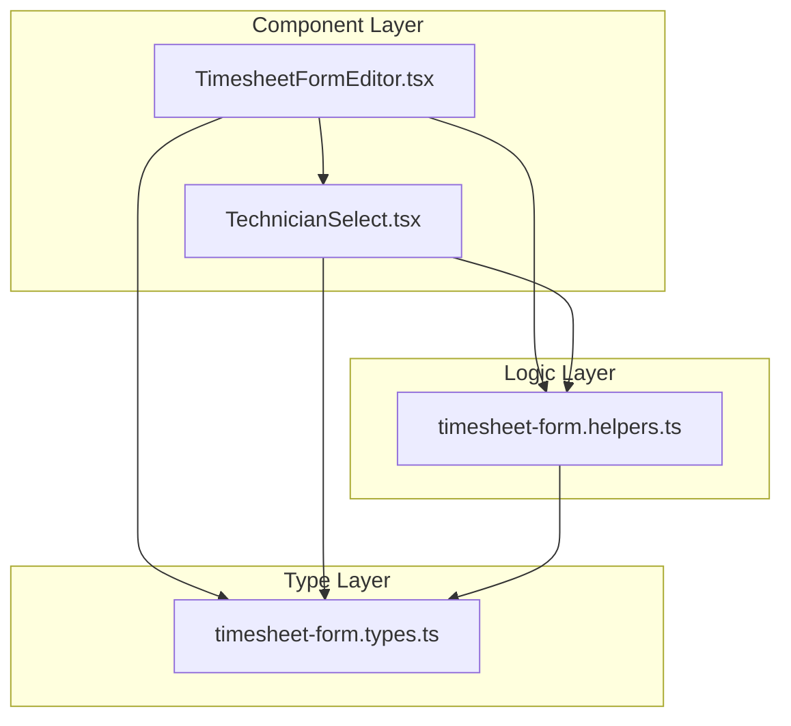
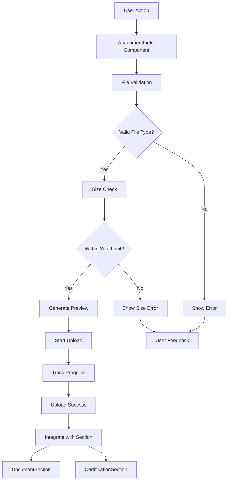
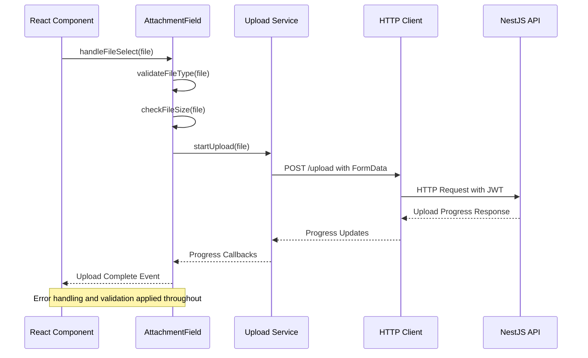
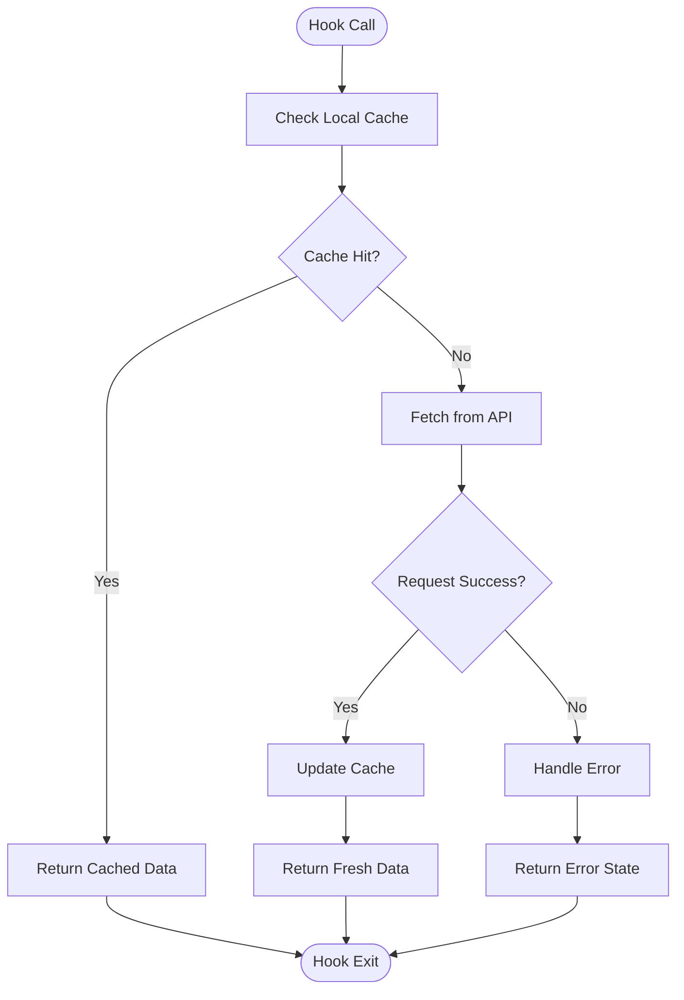
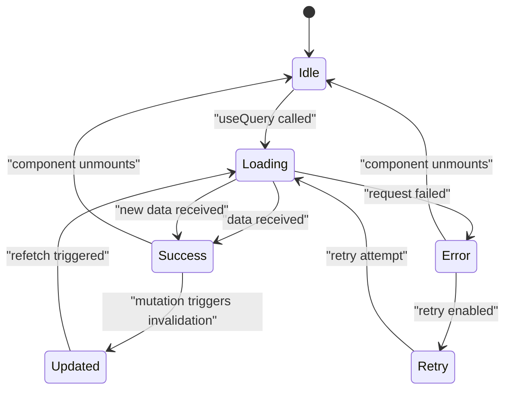
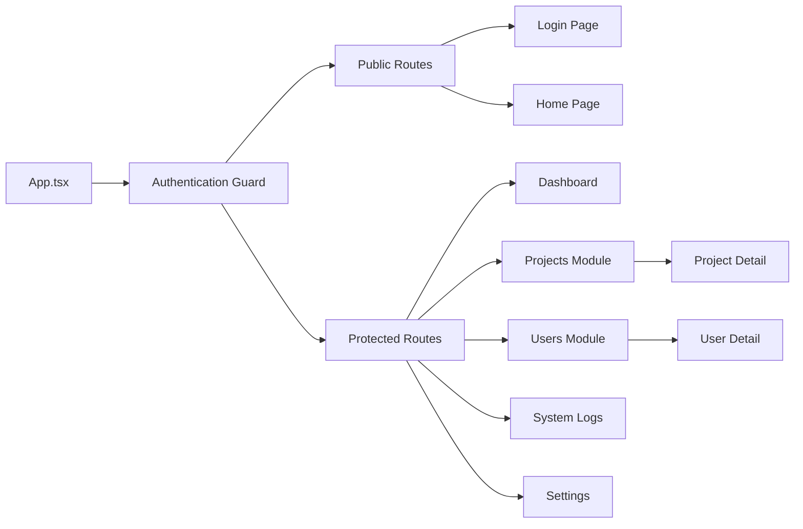

# Frontend Architecture

<cite>
**Referenced Files in This Document**
- [App.tsx](file://src/App.tsx)
- [main.tsx](file://src/main.tsx)
- [api.ts](file://src/services/api.ts)
- [auth.service.ts](file://src/services/auth.service.ts)
- [notification.service.ts](file://src/services/notification.service.ts)
- [project.service.ts](file://src/services/project.service.ts)
- [system-log.service.ts](file://src/services/system-log.service.ts)
- [upload.service.ts](file://src/services/upload.service.ts)
- [user.service.ts](file://src/services/user.service.ts)
- [useFileUrl.ts](file://src/hooks/useFileUrl.ts)
- [AttachmentField.tsx](file://src/pages/home/components/AttachmentField.tsx)
- [DocumentSection.tsx](file://src/pages/home/components/DocumentSection.tsx)
- [CertificationSection.tsx](file://src/pages/home/components/CertificationSection.tsx)
- [AppLayout.tsx](file://src/components/layout/AppLayout.tsx)
- [Sidebar.tsx](file://src/components/layout/Sidebar.tsx)
- [NotificationBell.tsx](file://src/components/notifications/NotificationBell.tsx)
- [Button.tsx](file://src/components/ui/Button.tsx)
- [DataTable.tsx](file://src/components/ui/DataTable.tsx)
- [Input.tsx](file://src/components/ui/Input.tsx)
- [SectionCard.tsx](file://src/components/ui/SectionCard.tsx)
- [TechnicianSelect.tsx](file://src/pages/weekly-timesheet/components/TechnicianSelect.tsx)
- [timesheet-form.helpers.ts](file://src/pages/weekly-timesheet/helpers/timesheet-form.helpers.ts)
- [timesheet-form.types.ts](file://src/pages/weekly-timesheet/types/timesheet-form.types.ts)
- [HomePage.tsx](file://src/pages/home/HomePage.tsx)
- [LoginPage.tsx](file://src/pages/login/LoginPage.tsx)
- [LogsPage.tsx](file://src/pages/logs/LogsPage.tsx)
- [NotificationsPage.tsx](file://src/pages/notifications/NotificationsPage.tsx)
- [ProfilePage.tsx](file://src/pages/profile/ProfilePage.tsx)
- [ProjectsPage.tsx](file://src/pages/projects/ProjectsPage.tsx)
- [SettingsPage.tsx](file://src/pages/settings/SettingsPage.tsx)
- [UsersPage.tsx](file://src/pages/users/UsersPage.tsx)
</cite>

## Update Summary
**Changes Made**
- Added new SectionCard component section documenting standardized card layout patterns
- Updated Weekly Timesheet Components section to reflect major refactoring of TimesheetFormEditor.tsx
- Enhanced Component Architecture section to document the new modular patterns established during refactoring
- Updated architectural diagrams to reflect the improved separation of concerns in timesheet components

## Table of Contents
1. Page Organization
2. Shared Components
3. Services (API Layer)
4. Custom Hooks
5. State and Cache (TanStack Query)
6. Routing

## Page Organization

The React application follows a feature-based page organization structure where each major feature has its own dedicated directory containing both the main page component and related sub-components.

### Core Pages Structure

The application is organized into distinct feature modules:

**Authentication & User Management:**
- `pages/login/` - Login functionality with form handling
- `pages/change-password/` - Temporary password change workflow
- `pages/profile/` - User profile management with mutations hook
- `pages/users/` - User administration interface

**Business Features:**
- `pages/home/` - Dashboard with profile completeness tracking and enhanced attachment handling
- `pages/projects/` - Project management with detailed views
- `pages/notifications/` - Notification system with detail pages
- `pages/logs/` - System logging and monitoring interface
- `pages/settings/` - Application settings and configuration

**Error Handling:**
- `pages/error/` - Centralized error display component

### Page Component Architecture

Each page follows a consistent pattern:
- Main page component handles routing and layout
- Feature-specific components are organized in subdirectories
- Page-level hooks manage business logic and state
- Form validation and data fetching are encapsulated within page components



**Section sources**
- [HomePage.tsx](file://src/pages/home/HomePage.tsx)
- [LoginPage.tsx](file://src/pages/login/LoginPage.tsx)
- [ProjectsPage.tsx](file://src/pages/projects/ProjectsPage.tsx)
- [UsersPage.tsx](file://src/pages/users/UsersPage.tsx)
- [LogsPage.tsx](file://src/pages/logs/LogsPage.tsx)
- [NotificationsPage.tsx](file://src/pages/notifications/NotificationsPage.tsx)
- [SettingsPage.tsx](file://src/pages/settings/SettingsPage.tsx)

## Shared Components

The component library is organized into three main categories: layout components, UI primitives, and feature-specific shared components.

### Layout Components

**AppLayout.tsx** - Main application wrapper providing:
- Consistent page structure and spacing
- Integration with sidebar navigation
- Responsive design handling
- Authentication context integration

**Sidebar.tsx** - Navigation component featuring:
- Role-based menu visibility
- Active route highlighting
- Collapsible navigation for mobile
- Icon integration with text labels

### UI Component Library

The UI components follow a consistent API design pattern:

**Form Components:**
- `Button.tsx` - Reusable button with loading states and variants
- `Input.tsx` - Form input with validation feedback and accessibility features

**Data Display Components:**
- `DataTable.tsx` - Advanced table with sorting, filtering, and pagination
- `Accordion.tsx` - Expandable content sections

**Security Components:**
- `SecureImage.tsx` - Image component with JWT authentication
- `SecureFileLink.tsx` - File download link with temporary token generation

**Layout Components:**
- `SectionCard.tsx` - Standardized card container for organizing content sections with consistent styling and spacing

### Attachment Management Components

**AttachmentField.tsx** - Standardized file upload component:
- Unified interface for photo and PDF document uploads
- Drag-and-drop file selection with visual feedback
- File type validation (images and PDFs only)
- Progress tracking during upload
- Preview support for images before upload
- Error handling for invalid file types and sizes
- Integration with upload service for secure file handling

### Notification Components

**NotificationBell.tsx** - Real-time notification system:
- WebSocket connection for live updates
- Badge counter for unread notifications
- Dropdown notification list with actions
- Mark as read functionality



**Diagram sources**
- [AppLayout.tsx](file://src/components/layout/AppLayout.tsx)
- [Sidebar.tsx](file://src/components/layout/Sidebar.tsx)
- [Button.tsx](file://src/components/ui/Button.tsx)
- [DataTable.tsx](file://src/components/ui/DataTable.tsx)
- [AttachmentField.tsx](file://src/pages/home/components/AttachmentField.tsx)
- [SectionCard.tsx](file://src/components/ui/SectionCard.tsx)

**Section sources**
- [AppLayout.tsx](file://src/components/layout/AppLayout.tsx)
- [Sidebar.tsx](file://src/components/layout/Sidebar.tsx)
- [NotificationBell.tsx](file://src/components/notifications/NotificationBell.tsx)
- [Button.tsx](file://src/components/ui/Button.tsx)
- [DataTable.tsx](file://src/components/ui/DataTable.tsx)
- [Input.tsx](file://src/components/ui/Input.tsx)
- [SecureFileLink.tsx](file://src/components/ui/SecureFileLink.tsx)
- [SecureImage.tsx](file://src/components/ui/SecureImage.tsx)
- [AttachmentField.tsx](file://src/pages/home/components/AttachmentField.tsx)
- [SectionCard.tsx](file://src/components/ui/SectionCard.tsx)

## Weekly Timesheet Components Refactoring

The weekly timesheet module has undergone significant refactoring to improve code organization and maintainability through the extraction of complex components into focused, reusable parts.

### Modular Component Architecture

**TimesheetFormEditor.tsx** - Now serves as a coordinator component that orchestrates the following extracted components:

**TechnicianSelect.tsx** - Specialized technician selection component:
- Dedicated dropdown for technician assignment
- Search and filtering capabilities
- Integration with user management system
- Validation for technician availability

**Helper Functions Module** - Centralized utility functions:
- `timesheet-form.helpers.ts` - Contains form validation, data transformation, and calculation utilities
- Reusable logic for time calculations and formatting
- Common validation rules for timesheet entries

**Type Definitions Module** - Centralized TypeScript definitions:
- `timesheet-form.types.ts` - Defines all interfaces and types used across timesheet components
- Ensures type safety throughout the timesheet module
- Facilitates better code completion and error detection

### Architectural Benefits

This refactoring establishes several key architectural patterns:

**Separation of Concerns:**
- Each component has a single, well-defined responsibility
- Helper functions encapsulate business logic
- Type definitions provide clear contracts between components

**Reusability:**
- TechnicianSelect can be reused across different forms
- Helper functions are available to other timesheet-related components
- Type definitions ensure consistency across the module

**Maintainability:**
- Smaller, focused components are easier to test and debug
- Changes to business logic are isolated in helper functions
- Type definitions prevent runtime errors through compile-time checking



**Diagram sources**
- [TechnicianSelect.tsx](file://src/pages/weekly-timesheet/components/TechnicianSelect.tsx)
- [timesheet-form.helpers.ts](file://src/pages/weekly-timesheet/helpers/timesheet-form.helpers.ts)
- [timesheet-form.types.ts](file://src/pages/weekly-timesheet/types/timesheet-form.types.ts)

**Section sources**
- [TechnicianSelect.tsx](file://src/pages/weekly-timesheet/components/TechnicianSelect.tsx)
- [timesheet-form.helpers.ts](file://src/pages/weekly-timesheet/helpers/timesheet-form.helpers.ts)
- [timesheet-form.types.ts](file://src/pages/weekly-timesheet/types/timesheet-form.types.ts)

## Profile Management Enhancement

The profile management system has been significantly enhanced with standardized attachment handling capabilities through the new AttachmentField component.

### Enhanced Profile Sections

**DocumentSection.tsx** - Professional document management:
- Integrated with AttachmentField for standardized uploads
- Support for professional certifications and licenses
- Document categorization and metadata management
- Bulk upload capabilities for multiple documents

**CertificationSection.tsx** - Certification tracking:
- Specialized attachment handling for certification documents
- Expiration date tracking and renewal reminders
- Verification status management
- Integration with AttachmentField for consistent user experience

### Attachment Workflow Integration

The AttachmentField component provides a unified approach to file handling across all profile sections:
- Consistent drag-and-drop interface
- Standardized validation rules for photos and PDFs
- Unified error handling and user feedback
- Seamless integration with backend upload services



**Section sources**
- [AttachmentField.tsx](file://src/pages/home/components/AttachmentField.tsx)
- [DocumentSection.tsx](file://src/pages/home/components/DocumentSection.tsx)
- [CertificationSection.tsx](file://src/pages/home/components/CertificationSection.tsx)

## Services (API Layer)

The service layer provides a clean abstraction over HTTP requests with centralized error handling, authentication, and response formatting.

### Core API Service

**api.ts** - Base HTTP client configuration:
- Axios instance with interceptors
- Automatic JWT token attachment
- Request/response transformation
- Error handling and retry logic
- Base URL configuration

### Domain-Specific Services

Each business domain has its own service module following consistent patterns:

**Authentication Service:**
- Login/logout functionality
- Token management
- User session handling
- Password change operations

**User Management Service:**
- CRUD operations for user entities
- Profile updates and validation
- Bank account and certification management
- Phone number and document handling

**Project Service:**
- Project lifecycle management
- Member assignment and permissions
- File upload integration
- Turbine data management

**Notification Service:**
- Real-time notification delivery
- Read/unread status management
- Notification categorization
- Bulk operations

**System Log Service:**
- Audit trail collection
- Filtered log retrieval
- Statistics aggregation
- Export functionality

**Upload Service:**
- File upload with progress tracking
- MIME type validation
- Temporary token generation
- Secure file access
- Enhanced integration with AttachmentField component



**Diagram sources**
- [api.ts](file://src/services/api.ts)
- [auth.service.ts](file://src/services/auth.service.ts)
- [user.service.ts](file://src/services/user.service.ts)
- [upload.service.ts](file://src/services/upload.service.ts)
- [AttachmentField.tsx](file://src/pages/home/components/AttachmentField.tsx)

**Section sources**
- [api.ts](file://src/services/api.ts)
- [auth.service.ts](file://src/services/auth.service.ts)
- [notification.service.ts](file://src/services/notification.service.ts)
- [project.service.ts](file://src/services/project.service.ts)
- [system-log.service.ts](file://src/services/system-log.service.ts)
- [upload.service.ts](file://src/services/upload.service.ts)
- [user.service.ts](file://src/services/user.service.ts)

## Custom Hooks

Custom hooks encapsulate reusable logic and provide clean abstractions over complex state management patterns.

### Data Fetching Hooks

**useFileUrl.ts** - File URL management:
- Generates secure temporary URLs for file downloads
- Handles token expiration and refresh
- Caches generated URLs for performance
- Provides loading and error states

### Business Logic Hooks

The application includes several specialized hooks for complex business logic:

**Profile Mutations Hook:**
- Manages profile update workflows
- Handles multiple entity updates atomically
- Provides optimistic updates
- Implements rollback on failure

**Project Mutations Hook:**
- Encapsulates project CRUD operations
- Manages member assignments
- Handles file uploads during project creation
- Provides real-time synchronization

### State Management Patterns

Hooks follow consistent patterns:
- Return objects with data, loading, and error states
- Provide mutation functions with proper error handling
- Implement automatic cache invalidation
- Support optimistic updates where appropriate



**Section sources**
- [useFileUrl.ts](file://src/hooks/useFileUrl.ts)
- [useProfileMutations.ts](file://src/pages/profile/hooks/useProfileMutations.ts)
- [useProjectMutations.ts](file://src/pages/projects/detail/hooks/useProjectMutations.ts)

## Estado e Cache (TanStack Query)

The application leverages TanStack Query (React Query) for efficient data fetching, caching, and synchronization with the backend API.

### Query Configuration

**Global Query Client Setup:**
- Automatic retry logic with exponential backoff
- Stale time configuration for optimal caching
- Background refetch strategies
- Error boundary integration

**Query Key Strategy:**
- Hierarchical query keys for effective cache management
- Automatic cache invalidation on mutations
- Optimistic updates support
- Pagination and infinite query support

### Data Fetching Patterns

**Standard Queries:**
```typescript
// Example pattern for data fetching
const { data, isLoading, error } = useQuery({
  queryKey: ['users', userId],
  queryFn: () => userService.getUser(userId),
  staleTime: 5 * 60 * 1000, // 5 minutes
  retry: 3
})
```

**Mutation Patterns:**
```typescript
// Example pattern for data mutations
const mutation = useMutation({
  mutationFn: (userData) => userService.updateUser(userData),
  onSuccess: () => {
    queryClient.invalidateQueries(['users'])
  },
  onError: (error) => {
    // Error handling logic
  }
})
```

### Cache Invalidation Strategies

**Automatic Invalidation:**
- Mutations trigger related query invalidation
- Optimistic updates provide immediate feedback
- Background refetch ensures data consistency
- Manual invalidation for specific scenarios

**Performance Optimizations:**
- Deduplication of identical requests
- Memory-efficient cache management
- Prefetching for improved UX
- Pagination with cursor-based navigation



**Section sources**
- [api.ts](file://src/services/api.ts)
- [useProfileMutations.ts](file://src/pages/profile/hooks/useProfileMutations.ts)
- [useProjectMutations.ts](file://src/pages/projects/detail/hooks/useProjectMutations.ts)

## Roteamento

The routing layer provides structured navigation between application features with role-based access control and lazy loading optimization.

### Route Structure

**Protected Routes:**
- Authentication guard for protected routes
- Role-based authorization using @Roles decorator
- Redirect logic for unauthorized access
- Loading states during authentication checks

**Feature-Based Routing:**
- Lazy-loaded route components for performance
- Nested routing for complex feature layouts
- Dynamic route parameters for resource management
- Query parameter handling for filters and search

### Navigation Flow



### Route Guards and Authorization

**Authentication Guard:**
- Validates JWT token presence and validity
- Checks user session state
- Redirects to login if unauthorized
- Maintains redirect URL for post-login navigation

**Authorization Guard:**
- Evaluates user roles against route requirements
- Uses @Roles decorator metadata
- Provides role-based menu visibility
- Handles permission denials gracefully

### Performance Optimizations

**Lazy Loading:**
- Route components loaded on demand
- Code splitting for better initial load
- Preloading strategies for critical routes
- Bundle size optimization

**Navigation Caching:**
- Route state preservation
- Back button support with state restoration
- Smooth transitions between routes
- Memory management for unused routes

**Section sources**
- [App.tsx](file://src/App.tsx)
- [main.tsx](file://src/main.tsx)