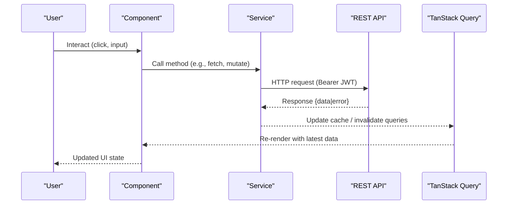
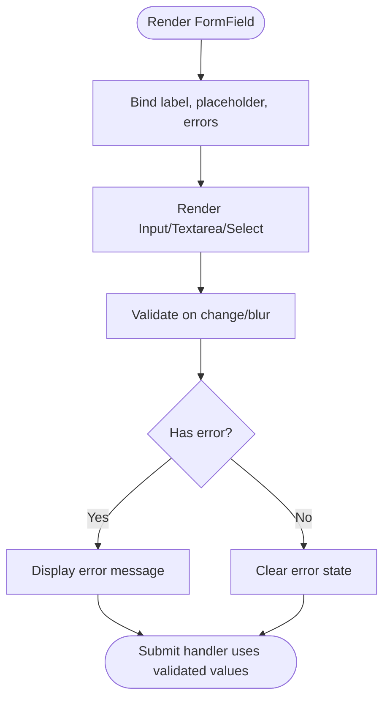
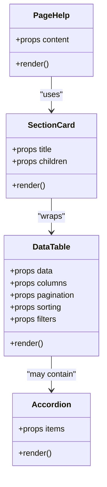
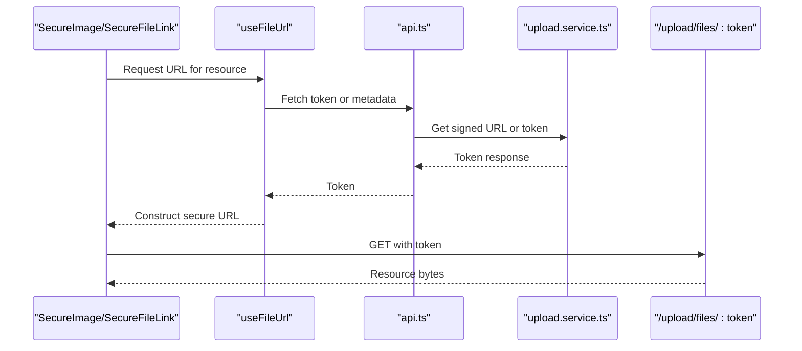
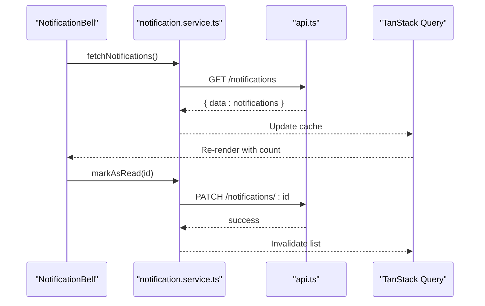
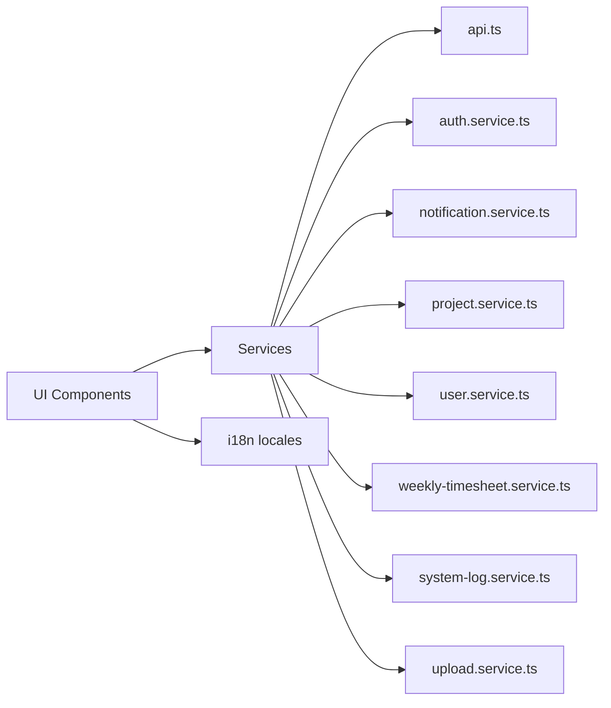

# Standardized UI Components

<cite>
**Referenced Files in This Document**
- [App.tsx](file://src/App.tsx)
- [main.tsx](file://src/main.tsx)
- [index.css](file://src/index.css)
- [Button.tsx](file://src/components/ui/Button.tsx)
- [Input.tsx](file://src/components/ui/Input.tsx)
- [Textarea.tsx](file://src/components/ui/Textarea.tsx)
- [Select.tsx](file://src/components/ui/Select.tsx)
- [FormField.tsx](file://src/components/ui/FormField.tsx)
- [DataTable.tsx](file://src/components/ui/DataTable.tsx)
- [Accordion.tsx](file://src/components/ui/Accordion.tsx)
- [DatePicker.tsx](file://src/components/ui/DatePicker.tsx)
- [SignaturePad.tsx](file://src/components/ui/SignaturePad.tsx)
- [SecureImage.tsx](file://src/components/ui/SecureImage.tsx)
- [SecureFileLink.tsx](file://src/components/ui/SecureFileLink.tsx)
- [SectionCard.tsx](file://src/components/ui/SectionCard.tsx)
- [PageHelp.tsx](file://src/components/ui/PageHelp.tsx)
- [NotificationBell.tsx](file://src/components/notifications/NotificationBell.tsx)
- [FeedbackButton.tsx](file://src/components/feedback/FeedbackButton.tsx)
- [FeedbackModal.tsx](file://src/components/feedback/FeedbackModal.tsx)
- [AppLayout.tsx](file://src/components/layout/AppLayout.tsx)
- [Sidebar.tsx](file://src/components/layout/Sidebar.tsx)
- [SettingsContext.tsx](file://src/contexts/SettingsContext.tsx)
- [useFileUrl.ts](file://src/hooks/useFileUrl.ts)
- [api.ts](file://src/services/api.ts)
- [auth.service.ts](file://src/services/auth.service.ts)
- [notification.service.ts](file://src/services/notification.service.ts)
- [project.service.ts](file://src/services/project.service.ts)
- [user.service.ts](file://src/services/user.service.ts)
- [weekly-timesheet.service.ts](file://src/services/weekly-timesheet.service.ts)
- [system-log.service.ts](file://src/services/system-log.service.ts)
- [upload.service.ts](file://src/services/upload.service.ts)
- [common.json](file://src/i18n/locales/pt/common.json)
- [home.json](file://src/i18n/locales/pt/home.json)
- [login.json](file://src/i18n/locales/pt/login.json)
- [projects.json](file://src/i18n/locales/pt/projects.json)
- [users.json](file://src/i18n/locales/pt/users.json)
- [timesheet.json](file://src/i18n/locales/pt/timesheet.json)
- [settings.json](file://src/i18n/locales/pt/settings.json)
- [logs.json](file://src/i18n/locales/pt/logs.json)
- [notifications.json](file://src/i18n/locales/pt/notifications.json)
- [onboarding.json](file://src/i18n/locales/pt/onboarding.json)
- [feedback.json](file://src/i18n/locales/pt/feedback.json)
</cite>

## Table of Contents
1. [Introduction](#introduction)
2. [Project Structure](#project-structure)
3. [Core Components](#core-components)
4. [Architecture Overview](#architecture-overview)
5. [Detailed Component Analysis](#detailed-component-analysis)
6. [Dependency Analysis](#dependency-analysis)
7. [Performance Considerations](#performance-considerations)
8. [Troubleshooting Guide](#troubleshooting-guide)
9. [Conclusion](#conclusion)

## Introduction
This document describes the standardized UI components used across the Windlog frontend. It explains how shared UI primitives are organized, styled, and integrated with services, internationalization, and security patterns. The goal is to provide a clear reference for developers building consistent, accessible, and maintainable user interfaces aligned with the project’s design system and backend contracts.

## Project Structure
The frontend follows a feature-oriented structure with a dedicated folder for reusable UI components under src/components/ui. Layouts, notifications, feedback, and other cross-cutting concerns live alongside pages and services. Global styles and theme tokens are centralized, while i18n resources are grouped by locale namespaces.

```mermaid
graph TB
subgraph "UI Primitives"
Button["Button.tsx"]
Input["Input.tsx"]
Textarea["Textarea.tsx"]
Select["Select.tsx"]
FormField["FormField.tsx"]
DataTable["DataTable.tsx"]
Accordion["Accordion.tsx"]
DatePicker["DatePicker.tsx"]
SignaturePad["SignaturePad.tsx"]
SecureImage["SecureImage.tsx"]
SecureFileLink["SecureFileLink.tsx"]
SectionCard["SectionCard.tsx"]
PageHelp["PageHelp.tsx"]
end
subgraph "Cross-cutting UI"
NotificationBell["NotificationBell.tsx"]
FeedbackButton["FeedbackButton.tsx"]
FeedbackModal["FeedbackModal.tsx"]
AppLayout["AppLayout.tsx"]
Sidebar["Sidebar.tsx"]
end
subgraph "Services & Hooks"
Api["api.ts"]
AuthSvc["auth.service.ts"]
NotifSvc["notification.service.ts"]
ProjSvc["project.service.ts"]
UserSvc["user.service.ts"]
TimesheetSvc["weekly-timesheet.service.ts"]
SysLogSvc["system-log.service.ts"]
UploadSvc["upload.service.ts"]
UseFileUrl["useFileUrl.ts"]
end
subgraph "i18n"
Common["common.json"]
Home["home.json"]
Login["login.json"]
Projects["projects.json"]
Users["users.json"]
Timesheet["timesheet.json"]
Settings["settings.json"]
Logs["logs.json"]
Notifications["notifications.json"]
Onboarding["onboarding.json"]
Feedback["feedback.json"]
end
Button --> Api
Input --> Api
DataTable --> Api
SecureImage --> UploadSvc
SecureFileLink --> UploadSvc
NotificationBell --> NotifSvc
FeedbackButton --> Api
FeedbackModal --> Api
AppLayout --> Sidebar
AppLayout --> Api
SectionCard --> Common
PageHelp --> Common
```

**Diagram sources**
- [Button.tsx](file://src/components/ui/Button.tsx)
- [Input.tsx](file://src/components/ui/Input.tsx)
- [Textarea.tsx](file://src/components/ui/Textarea.tsx)
- [Select.tsx](file://src/components/ui/Select.tsx)
- [FormField.tsx](file://src/components/ui/FormField.tsx)
- [DataTable.tsx](file://src/components/ui/DataTable.tsx)
- [Accordion.tsx](file://src/components/ui/Accordion.tsx)
- [DatePicker.tsx](file://src/components/ui/DatePicker.tsx)
- [SignaturePad.tsx](file://src/components/ui/SignaturePad.tsx)
- [SecureImage.tsx](file://src/components/ui/SecureImage.tsx)
- [SecureFileLink.tsx](file://src/components/ui/SecureFileLink.tsx)
- [SectionCard.tsx](file://src/components/ui/SectionCard.tsx)
- [PageHelp.tsx](file://src/components/ui/PageHelp.tsx)
- [NotificationBell.tsx](file://src/components/notifications/NotificationBell.tsx)
- [FeedbackButton.tsx](file://src/components/feedback/FeedbackButton.tsx)
- [FeedbackModal.tsx](file://src/components/feedback/FeedbackModal.tsx)
- [AppLayout.tsx](file://src/components/layout/AppLayout.tsx)
- [Sidebar.tsx](file://src/components/layout/Sidebar.tsx)
- [api.ts](file://src/services/api.ts)
- [auth.service.ts](file://src/services/auth.service.ts)
- [notification.service.ts](file://src/services/notification.service.ts)
- [project.service.ts](file://src/services/project.service.ts)
- [user.service.ts](file://src/services/user.service.ts)
- [weekly-timesheet.service.ts](file://src/services/weekly-timesheet.service.ts)
- [system-log.service.ts](file://src/services/system-log.service.ts)
- [upload.service.ts](file://src/services/upload.service.ts)
- [useFileUrl.ts](file://src/hooks/useFileUrl.ts)
- [common.json](file://src/i18n/locales/pt/common.json)
- [home.json](file://src/i18n/locales/pt/home.json)
- [login.json](file://src/i18n/locales/pt/login.json)
- [projects.json](file://src/i18n/locales/pt/projects.json)
- [users.json](file://src/i18n/locales/pt/users.json)
- [timesheet.json](file://src/i18n/locales/pt/timesheet.json)
- [settings.json](file://src/i18n/locales/pt/settings.json)
- [logs.json](file://src/i18n/locales/pt/logs.json)
- [notifications.json](file://src/i18n/locales/pt/notifications.json)
- [onboarding.json](file://src/i18n/locales/pt/onboarding.json)
- [feedback.json](file://src/i18n/locales/pt/feedback.json)

**Section sources**
- [App.tsx](file://src/App.tsx)
- [main.tsx](file://src/main.tsx)
- [index.css](file://src/index.css)

## Core Components
The UI primitive library provides consistent building blocks for forms, data presentation, media handling, and layout. Each component adheres to the project’s design system (minimalist, generous spacing, neutral colors with blue accents) and integrates with Tailwind CSS v4 utilities.

Key responsibilities:
- Forms: Input, Textarea, Select, FormField, DatePicker, SignaturePad
- Data display: DataTable, Accordion, SectionCard, PageHelp
- Media and files: SecureImage, SecureFileLink
- Cross-cutting: NotificationBell, FeedbackButton, FeedbackModal
- Layout: AppLayout, Sidebar

Design principles:
- Accessibility-first: semantic elements, keyboard navigation, ARIA attributes where needed
- Internationalization: all visible text via i18n namespaces
- Security: secure file/image access through tokenized endpoints
- Consistency: shared props, variants, and styling tokens

**Section sources**
- [Button.tsx](file://src/components/ui/Button.tsx)
- [Input.tsx](file://src/components/ui/Input.tsx)
- [Textarea.tsx](file://src/components/ui/Textarea.tsx)
- [Select.tsx](file://src/components/ui/Select.tsx)
- [FormField.tsx](file://src/components/ui/FormField.tsx)
- [DataTable.tsx](file://src/components/ui/DataTable.tsx)
- [Accordion.tsx](file://src/components/ui/Accordion.tsx)
- [DatePicker.tsx](file://src/components/ui/DatePicker.tsx)
- [SignaturePad.tsx](file://src/components/ui/SignaturePad.tsx)
- [SecureImage.tsx](file://src/components/ui/SecureImage.tsx)
- [SecureFileLink.tsx](file://src/components/ui/SecureFileLink.tsx)
- [SectionCard.tsx](file://src/components/ui/SectionCard.tsx)
- [PageHelp.tsx](file://src/components/ui/PageHelp.tsx)
- [NotificationBell.tsx](file://src/components/notifications/NotificationBell.tsx)
- [FeedbackButton.tsx](file://src/components/feedback/FeedbackButton.tsx)
- [FeedbackModal.tsx](file://src/components/feedback/FeedbackModal.tsx)
- [AppLayout.tsx](file://src/components/layout/AppLayout.tsx)
- [Sidebar.tsx](file://src/components/layout/Sidebar.tsx)

## Architecture Overview
The UI layer composes primitives into pages and features, consuming services for data operations and using context for global settings. Authentication and authorization are enforced at the service layer, while UI components remain stateless or minimally stateful, delegating side effects to services and TanStack Query.

**Diagram sources**
- [api.ts](file://src/services/api.ts)
- [auth.service.ts](file://src/services/auth.service.ts)
- [notification.service.ts](file://src/services/notification.service.ts)
- [project.service.ts](file://src/services/project.service.ts)
- [user.service.ts](file://src/services/user.service.ts)
- [weekly-timesheet.service.ts](file://src/services/weekly-timesheet.service.ts)
- [system-log.service.ts](file://src/services/system-log.service.ts)
- [upload.service.ts](file://src/services/upload.service.ts)

## Detailed Component Analysis

### Form Inputs and Field Wrapper
- Input, Textarea, Select: Provide consistent styling, validation hooks integration, and accessibility attributes. They accept labels, placeholders, error messages, and disabled states.
- FormField: Wraps inputs with label, helper text, and error display, ensuring consistent form UX.
- DatePicker: Date selection with localization and formatting aligned to pt-PT conventions.
- SignaturePad: Captures signatures as image data for submission to upload endpoints.

Best practices:
- Always use FormField for consistent labeling and error messaging.
- Integrate with TanStack Form or similar libraries for robust validation.
- Ensure keyboard navigation and screen reader support.

**Diagram sources**
- [FormField.tsx](file://src/components/ui/FormField.tsx)
- [Input.tsx](file://src/components/ui/Input.tsx)
- [Textarea.tsx](file://src/components/ui/Textarea.tsx)
- [Select.tsx](file://src/components/ui/Select.tsx)
- [DatePicker.tsx](file://src/components/ui/DatePicker.tsx)
- [SignaturePad.tsx](file://src/components/ui/SignaturePad.tsx)

**Section sources**
- [FormField.tsx](file://src/components/ui/FormField.tsx)
- [Input.tsx](file://src/components/ui/Input.tsx)
- [Textarea.tsx](file://src/components/ui/Textarea.tsx)
- [Select.tsx](file://src/components/ui/Select.tsx)
- [DatePicker.tsx](file://src/components/ui/DatePicker.tsx)
- [SignaturePad.tsx](file://src/components/ui/SignaturePad.tsx)

### Data Presentation Components
- DataTable: Tabular data with sorting, filtering, pagination, and row actions. Integrates with TanStack Query for caching and invalidation.
- Accordion: Expandable sections for grouping content without cluttering the page.
- SectionCard: Card-like container for grouping related fields or information.
- PageHelp: Contextual help panel providing guidance within the current page.

Usage guidelines:
- Keep rows lightweight; virtualize large datasets if necessary.
- Use stable keys and avoid unnecessary re-renders.
- Provide empty states and loading indicators.

**Diagram sources**
- [DataTable.tsx](file://src/components/ui/DataTable.tsx)
- [Accordion.tsx](file://src/components/ui/Accordion.tsx)
- [SectionCard.tsx](file://src/components/ui/SectionCard.tsx)
- [PageHelp.tsx](file://src/components/ui/PageHelp.tsx)

**Section sources**
- [DataTable.tsx](file://src/components/ui/DataTable.tsx)
- [Accordion.tsx](file://src/components/ui/Accordion.tsx)
- [SectionCard.tsx](file://src/components/ui/SectionCard.tsx)
- [PageHelp.tsx](file://src/components/ui/PageHelp.tsx)

### Media and File Handling
- SecureImage: Displays images via secure tokenized URLs, preventing unauthorized access.
- SecureFileLink: Generates safe download links for files stored behind authentication.

Security considerations:
- Always use tokenized endpoints for sensitive assets.
- Handle expired tokens gracefully and prompt re-authentication if needed.
- Respect MIME type validation from the backend.

**Diagram sources**
- [SecureImage.tsx](file://src/components/ui/SecureImage.tsx)
- [SecureFileLink.tsx](file://src/components/ui/SecureFileLink.tsx)
- [useFileUrl.ts](file://src/hooks/useFileUrl.ts)
- [api.ts](file://src/services/api.ts)
- [upload.service.ts](file://src/services/upload.service.ts)

**Section sources**
- [SecureImage.tsx](file://src/components/ui/SecureImage.tsx)
- [SecureFileLink.tsx](file://src/components/ui/SecureFileLink.tsx)
- [useFileUrl.ts](file://src/hooks/useFileUrl.ts)
- [upload.service.ts](file://src/services/upload.service.ts)

### Cross-cutting UI Components
- NotificationBell: Displays unread counts and opens notification details. Integrates with notification service for fetching and marking as read.
- FeedbackButton and FeedbackModal: Collect user feedback and submit it via the feedback service.
- AppLayout and Sidebar: Provide consistent application shell, navigation, and responsive behavior.

Integration points:
- Use TanStack Query for notifications and feedback lists.
- Invalidate relevant queries after mutations to keep UI in sync.
- Ensure RBAC checks before rendering admin-only sections.

**Diagram sources**
- [NotificationBell.tsx](file://src/components/notifications/NotificationBell.tsx)
- [notification.service.ts](file://src/services/notification.service.ts)
- [api.ts](file://src/services/api.ts)

**Section sources**
- [NotificationBell.tsx](file://src/components/notifications/NotificationBell.tsx)
- [FeedbackButton.tsx](file://src/components/feedback/FeedbackButton.tsx)
- [FeedbackModal.tsx](file://src/components/feedback/FeedbackModal.tsx)
- [AppLayout.tsx](file://src/components/layout/AppLayout.tsx)
- [Sidebar.tsx](file://src/components/layout/Sidebar.tsx)

### Layout and Navigation
- AppLayout: Centralizes header, sidebar, and main content area. Handles responsive breakpoints and accessibility landmarks.
- Sidebar: Provides navigation links with active states and role-based visibility.

Accessibility tips:
- Use semantic HTML (<nav>, <main>, <aside>).
- Ensure focus management when toggling menus.
- Provide skip-to-content links for keyboard users.

**Section sources**
- [AppLayout.tsx](file://src/components/layout/AppLayout.tsx)
- [Sidebar.tsx](file://src/components/layout/Sidebar.tsx)

### Context and Global Settings
- SettingsContext: Holds global preferences such as language, currency, and theme. Components consume this context to adapt behavior and formatting.

Recommendations:
- Persist settings to local storage or backend preferences.
- Trigger query invalidations when settings change (e.g., locale updates).

**Section sources**
- [SettingsContext.tsx](file://src/contexts/SettingsContext.tsx)

## Dependency Analysis
Components depend on services for data operations and on i18n for localized strings. Services encapsulate HTTP requests, error handling, and cache management.

**Diagram sources**
- [api.ts](file://src/services/api.ts)
- [auth.service.ts](file://src/services/auth.service.ts)
- [notification.service.ts](file://src/services/notification.service.ts)
- [project.service.ts](file://src/services/project.service.ts)
- [user.service.ts](file://src/services/user.service.ts)
- [weekly-timesheet.service.ts](file://src/services/weekly-timesheet.service.ts)
- [system-log.service.ts](file://src/services/system-log.service.ts)
- [upload.service.ts](file://src/services/upload.service.ts)
- [common.json](file://src/i18n/locales/pt/common.json)
- [home.json](file://src/i18n/locales/pt/home.json)
- [login.json](file://src/i18n/locales/pt/login.json)
- [projects.json](file://src/i18n/locales/pt/projects.json)
- [users.json](file://src/i18n/locales/pt/users.json)
- [timesheet.json](file://src/i18n/locales/pt/timesheet.json)
- [settings.json](file://src/i18n/locales/pt/settings.json)
- [logs.json](file://src/i18n/locales/pt/logs.json)
- [notifications.json](file://src/i18n/locales/pt/notifications.json)
- [onboarding.json](file://src/i18n/locales/pt/onboarding.json)
- [feedback.json](file://src/i18n/locales/pt/feedback.json)

**Section sources**
- [api.ts](file://src/services/api.ts)
- [auth.service.ts](file://src/services/auth.service.ts)
- [notification.service.ts](file://src/services/notification.service.ts)
- [project.service.ts](file://src/services/project.service.ts)
- [user.service.ts](file://src/services/user.service.ts)
- [weekly-timesheet.service.ts](file://src/services/weekly-timesheet.service.ts)
- [system-log.service.ts](file://src/services/system-log.service.ts)
- [upload.service.ts](file://src/services/upload.service.ts)
- [common.json](file://src/i18n/locales/pt/common.json)
- [home.json](file://src/i18n/locales/pt/home.json)
- [login.json](file://src/i18n/locales/pt/login.json)
- [projects.json](file://src/i18n/locales/pt/projects.json)
- [users.json](file://src/i18n/locales/pt/users.json)
- [timesheet.json](file://src/i18n/locales/pt/timesheet.json)
- [settings.json](file://src/i18n/locales/pt/settings.json)
- [logs.json](file://src/i18n/locales/pt/logs.json)
- [notifications.json](file://src/i18n/locales/pt/notifications.json)
- [onboarding.json](file://src/i18n/locales/pt/onboarding.json)
- [feedback.json](file://src/i18n/locales/pt/feedback.json)

## Performance Considerations
- Prefer memoization for expensive computations and derived data.
- Use TanStack Query caching and invalidation to minimize network calls.
- Virtualize large tables and lists to reduce DOM size.
- Defer non-critical work (e.g., analytics logging) to background tasks.
- Optimize images and use lazy loading for off-screen media.

[No sources needed since this section provides general guidance]

## Troubleshooting Guide
Common issues and resolutions:
- Unauthorized access to secure files: Ensure JWT is present and not expired; refresh tokens as needed.
- Missing i18n keys: Verify namespace usage and ensure keys exist in the corresponding JSON files.
- Stale data after mutations: Invalidate related queries explicitly after successful mutations.
- Form validation errors: Check that FormField error messages map to field names correctly.
- Notification bell not updating: Confirm service fetches and cache invalidations are triggered.

Debugging tips:
- Use browser dev tools to inspect network payloads and responses.
- Log TanStack Query cache state to verify updates.
- Validate MIME types and file sizes server-side to prevent client errors.

[No sources needed since this section provides general guidance]

## Conclusion
The standardized UI components in Windlog provide a cohesive, accessible, and secure foundation for building feature-rich interfaces. By adhering to the design system, integrating with services and i18n, and leveraging TanStack Query for data flow, teams can deliver consistent experiences across the application. Maintain strict separation of concerns, prioritize accessibility, and enforce security best practices to sustain long-term quality and performance.

[No sources needed since this section summarizes without analyzing specific files]