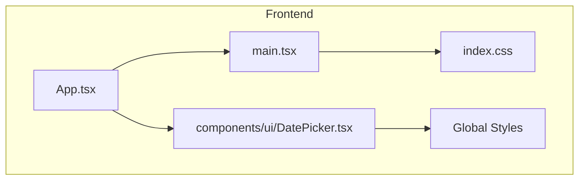
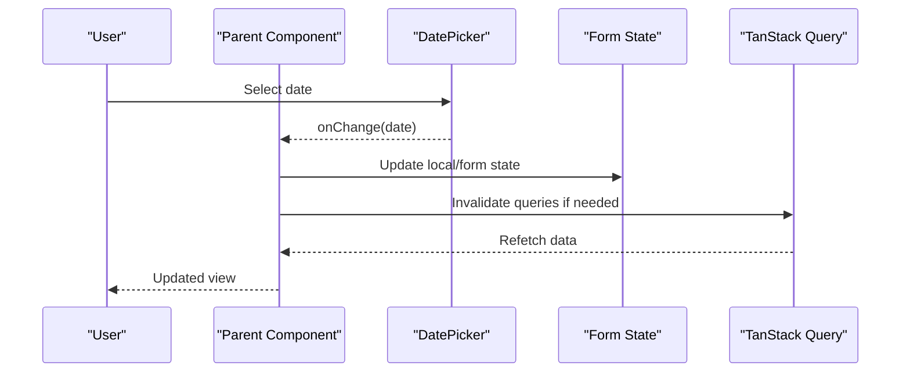
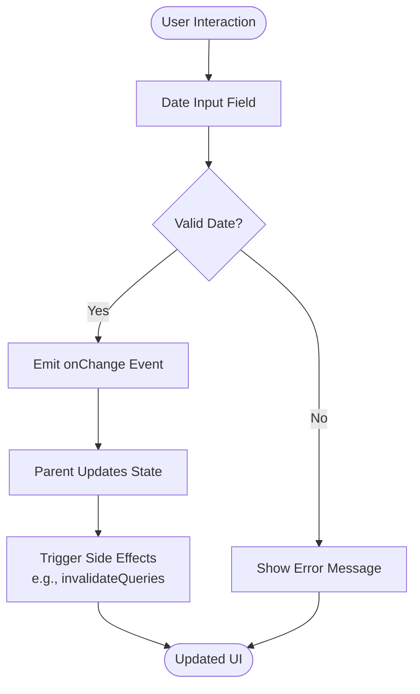
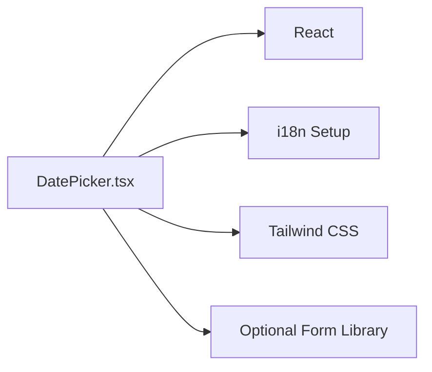

# Date Picker Component

<cite>
**Referenced Files in This Document**
- [DatePicker.tsx](file://src/components/ui/DatePicker.tsx)
- [App.tsx](file://src/App.tsx)
- [main.tsx](file://src/main.tsx)
- [index.css](file://src/index.css)
- [vite.config.ts](file://vite.config.ts)
</cite>

## Table of Contents
1. [Introduction](#introduction)
2. [Project Structure](#project-structure)
3. [Core Components](#core-components)
4. [Architecture Overview](#architecture-overview)
5. [Detailed Component Analysis](#detailed-component-analysis)
6. [Dependency Analysis](#dependency-analysis)
7. [Performance Considerations](#performance-considerations)
8. [Troubleshooting Guide](#troubleshooting-guide)
9. [Conclusion](#conclusion)

## Introduction
This document explains the Date Picker component used across the application’s frontend. It covers purpose, usage patterns, integration points, and best practices aligned with the project’s design system (Apple-inspired minimalism), internationalization requirements, and data handling conventions.

## Project Structure
The Date Picker is implemented as a reusable UI primitive under the shared components directory and consumed by feature pages and modals where date input is required.

**Diagram sources**
- [App.tsx](file://src/App.tsx)
- [main.tsx](file://src/main.tsx)
- [index.css](file://src/index.css)
- [DatePicker.tsx](file://src/components/ui/DatePicker.tsx)

**Section sources**
- [App.tsx](file://src/App.tsx)
- [main.tsx](file://src/main.tsx)
- [index.css](file://src/index.css)
- [DatePicker.tsx](file://src/components/ui/DatePicker.tsx)

## Core Components
- DatePicker: A focused, accessible date input component that integrates with the app’s design system and i18n setup. It exposes props for value binding, formatting, validation, and event callbacks to support forms and filters throughout the application.

Key responsibilities:
- Provide a consistent date selection experience across the app
- Enforce locale-aware formatting and display
- Integrate with form libraries or state management via controlled/uncontrolled patterns
- Surface validation feedback and accessibility attributes

Usage patterns:
- Controlled mode: bind value and onChange to manage state externally
- Uncontrolled mode: manage internal state and expose methods when needed
- Integration with TanStack Query: trigger refetches on date changes using queryClient.invalidateQueries()

Best practices:
- Always provide accessible labels and aria attributes
- Use consistent date formats per locale (pt-PT default)
- Avoid hardcoding strings; rely on i18n namespaces

**Section sources**
- [DatePicker.tsx](file://src/components/ui/DatePicker.tsx)

## Architecture Overview
The Date Picker sits within the UI layer and interacts with parent components through props and events. It does not directly access backend APIs; instead, it emits user actions that are handled by higher-level logic (e.g., form submission, filtering).

[No sources needed since this diagram shows conceptual workflow, not actual code structure]

## Detailed Component Analysis
### DatePicker Component
- Purpose: Render an accessible, styled date picker input that conforms to the app’s design system and i18n standards.
- Props:
  - Value: current selected date
  - onChange: callback invoked on date change
  - placeholder: localized placeholder text
  - label: accessible label for screen readers
  - format: locale-aware date formatter
  - disabled: disables interaction
  - error: validation message
  - className: additional styling hooks
- Behavior:
  - Validates input against expected date formats
  - Emits normalized date values to parent
  - Integrates with keyboard navigation and ARIA attributes
  - Supports localization via i18n namespace 'common'

Integration points:
- Forms: Controlled inputs with form libraries
- Filters: Trigger query invalidation on change
- Modals: Inline date selection with immediate feedback

Accessibility:
- Proper labeling and roles
- Keyboard navigation support
- Screen reader-friendly messages

Validation:
- Rejects invalid dates
- Displays localized error messages
- Prevents form submission when invalid

Styling:
- Tailwind CSS classes aligning with Apple-inspired minimalism
- Consistent spacing and typography
- Responsive behavior across devices

**Section sources**
- [DatePicker.tsx](file://src/components/ui/DatePicker.tsx)

### Conceptual Overview
The Date Picker follows a unidirectional data flow pattern:
- Parent components own state and pass down value and onChange
- DatePicker renders the UI and emits events
- Parent handles side effects (validation, API calls, cache invalidation)

[No sources needed since this diagram shows conceptual workflow, not actual code structure]

## Dependency Analysis
The Date Picker depends on:
- React for component rendering and state management
- i18n for localized strings and date formatting
- Tailwind CSS for styling consistency
- Optional form libraries for advanced validation and submission workflows

**Diagram sources**
- [DatePicker.tsx](file://src/components/ui/DatePicker.tsx)

**Section sources**
- [DatePicker.tsx](file://src/components/ui/DatePicker.tsx)

## Performance Considerations
- Minimize re-renders by memoizing expensive computations in parent components
- Debounce rapid date changes if triggering frequent API calls
- Use controlled components judiciously to avoid unnecessary state updates
- Leverage TanStack Query caching to reduce network requests after initial load

[No sources needed since this section provides general guidance]

## Troubleshooting Guide
Common issues and resolutions:
- Invalid date format: Ensure proper parsing and validation before emitting changes
- Localization errors: Verify i18n configuration and available locales
- Accessibility warnings: Check ARIA attributes and keyboard navigation
- Styling conflicts: Inspect Tailwind class overrides and global styles

Debugging tips:
- Log onChange events to verify data flow
- Use browser dev tools to inspect DOM and accessibility tree
- Test with different locales and screen readers

**Section sources**
- [DatePicker.tsx](file://src/components/ui/DatePicker.tsx)

## Conclusion
The Date Picker component provides a robust, accessible, and localized date selection experience that integrates seamlessly with the application’s architecture. By following the outlined best practices and patterns, developers can ensure consistent behavior across all features while maintaining high performance and accessibility standards.

[No sources needed since this section summarizes without analyzing specific files]