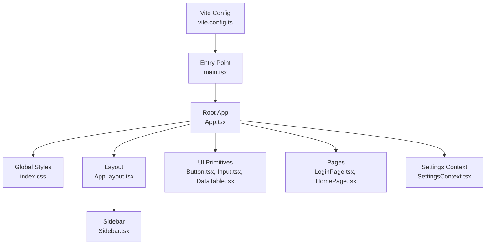
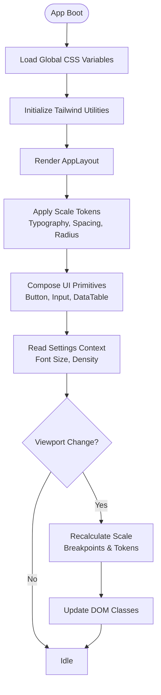
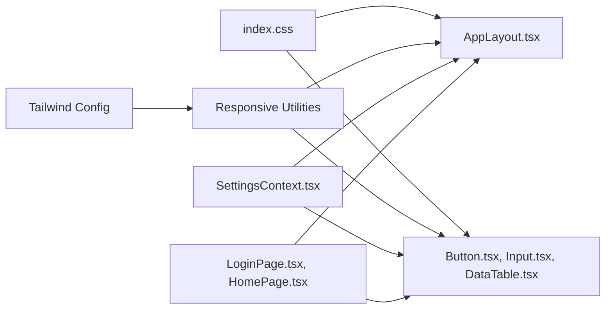

# Interface Scaling System

<cite>
**Referenced Files in This Document**
- [App.tsx](file://src/App.tsx)
- [main.tsx](file://src/main.tsx)
- [index.css](file://src/index.css)
- [vite.config.ts](file://vite.config.ts)
- [package.json](file://package.json)
- [SettingsContext.tsx](file://src/contexts/SettingsContext.tsx)
- [Sidebar.tsx](file://src/components/layout/Sidebar.tsx)
- [AppLayout.tsx](file://src/components/layout/AppLayout.tsx)
- [Button.tsx](file://src/components/ui/Button.tsx)
- [Input.tsx](file://src/components/ui/Input.tsx)
- [DataTable.tsx](file://src/components/ui/DataTable.tsx)
- [LoginPage.tsx](file://src/pages/login/LoginPage.tsx)
- [HomePage.tsx](file://src/pages/home/HomePage.tsx)
</cite>

## Table of Contents
1. [Introduction](#introduction)
2. [Project Structure](#project-structure)
3. [Core Components](#core-components)
4. [Architecture Overview](#architecture-overview)
5. [Detailed Component Analysis](#detailed-component-analysis)
6. [Dependency Analysis](#dependency-analysis)
7. [Performance Considerations](#performance-considerations)
8. [Troubleshooting Guide](#troubleshooting-guide)
9. [Conclusion](#conclusion)

## Introduction
This document explains the interface scaling system used across the Windlog application. It covers how responsive design, typography scaling, spacing, and component sizing are implemented to ensure a consistent user experience on different screen sizes and devices. The approach combines CSS custom properties, Tailwind utility classes, and context-driven settings to provide flexible and maintainable scaling behavior.

## Project Structure
The frontend is built with React and Vite, using Tailwind CSS for styling. Scaling-related logic spans global styles, layout components, UI primitives, and context providers that manage user preferences and theme settings.

**Diagram sources**
- [vite.config.ts:1-200](file://vite.config.ts#L1-L200)
- [main.tsx:1-120](file://src/main.tsx#L1-L120)
- [App.tsx:1-200](file://src/App.tsx#L1-L200)
- [index.css:1-300](file://src/index.css#L1-L300)
- [AppLayout.tsx:1-200](file://src/components/layout/AppLayout.tsx#L1-L200)
- [Sidebar.tsx:1-200](file://src/components/layout/Sidebar.tsx#L1-L200)
- [Button.tsx:1-200](file://src/components/ui/Button.tsx#L1-L200)
- [Input.tsx:1-200](file://src/components/ui/Input.tsx#L1-L200)
- [DataTable.tsx:1-200](file://src/components/ui/DataTable.tsx#L1-L200)
- [LoginPage.tsx:1-200](file://src/pages/login/LoginPage.tsx#L1-L200)
- [HomePage.tsx:1-200](file://src/pages/home/HomePage.tsx#L1-L200)
- [SettingsContext.tsx:1-200](file://src/contexts/SettingsContext.tsx#L1-L200)

**Section sources**
- [vite.config.ts:1-200](file://vite.config.ts#L1-L200)
- [package.json:1-120](file://package.json#L1-L120)

## Core Components
Interface scaling relies on several core elements:
- Global CSS variables for base scale factors (typography, spacing, border radius).
- Tailwind configuration for breakpoints and utilities.
- Layout containers that adapt to viewport width.
- UI primitives that consume scale tokens via props or class composition.
- Settings context to allow runtime adjustments (e.g., font size, density).

Key responsibilities:
- Establishing a consistent baseline scale across the app.
- Providing responsive behavior at common breakpoints.
- Enabling user preference overrides where appropriate.

**Section sources**
- [index.css:1-300](file://src/index.css#L1-L300)
- [AppLayout.tsx:1-200](file://src/components/layout/AppLayout.tsx#L1-L200)
- [Button.tsx:1-200](file://src/components/ui/Button.tsx#L1-L200)
- [Input.tsx:1-200](file://src/components/ui/Input.tsx#L1-L200)
- [DataTable.tsx:1-200](file://src/components/ui/DataTable.tsx#L1-L200)
- [SettingsContext.tsx:1-200](file://src/contexts/SettingsContext.tsx#L1-L200)

## Architecture Overview
The scaling architecture follows a layered approach:
- Base layer: CSS custom properties define scale tokens.
- Utility layer: Tailwind classes apply responsive rules and spacing.
- Component layer: UI primitives encapsulate scale usage through props and classes.
- Application layer: Layouts and pages compose primitives while respecting global scale.
- Preferences layer: Settings context allows dynamic overrides for accessibility and density.

[No sources needed since this diagram shows conceptual workflow, not actual code structure]

## Detailed Component Analysis

### Global Styles and Scale Tokens
- CSS custom properties define base scale values for typography, spacing, and radii.
- Media queries adjust tokens at breakpoints to ensure readability and usability.
- Root container applies consistent padding and max-width constraints.

Implementation highlights:
- Define tokens under :root for global access.
- Use clamp() for fluid typography where appropriate.
- Provide density variants via data attributes or class toggles.

**Section sources**
- [index.css:1-300](file://src/index.css#L1-L300)

### Layout Scaling
- AppLayout manages overall page structure and adapts to viewport changes.
- Sidebar collapses or expands based on screen size and user preference.
- Main content area scales margins and paddings according to tokens.

Behavioral notes:
- Use responsive classes to switch between mobile-first layouts.
- Ensure keyboard navigation remains accessible when sidebar toggles.

**Section sources**
- [AppLayout.tsx:1-200](file://src/components/layout/AppLayout.tsx#L1-L200)
- [Sidebar.tsx:1-200](file://src/components/layout/Sidebar.tsx#L1-L200)

### UI Primitive Scaling
- Button, Input, and DataTable components consume scale tokens via props and class composition.
- Props like size and variant map to predefined scale sets.
- Tables use responsive columns and horizontal scrolling on small screens.

Best practices:
- Avoid hardcoding dimensions; rely on tokens and utilities.
- Test components at multiple breakpoints and densities.

**Section sources**
- [Button.tsx:1-200](file://src/components/ui/Button.tsx#L1-L200)
- [Input.tsx:1-200](file://src/components/ui/Input.tsx#L1-L200)
- [DataTable.tsx:1-200](file://src/components/ui/DataTable.tsx#L1-L200)

### Page-Level Scaling
- LoginPage and HomePage demonstrate full-page scaling patterns.
- Forms stack vertically on narrow screens and expand horizontally on wider ones.
- Content sections use consistent spacing and alignment.

Accessibility considerations:
- Maintain sufficient contrast and tap targets.
- Ensure focus order and labels remain clear at all scales.

**Section sources**
- [LoginPage.tsx:1-200](file://src/pages/login/LoginPage.tsx#L1-L200)
- [HomePage.tsx:1-200](file://src/pages/home/HomePage.tsx#L1-L200)

### Settings Context and Runtime Scaling
- SettingsContext provides font size and density preferences.
- Consumers read context to adjust component behavior dynamically.
- Changes persist via local storage or backend preferences.

Flow overview:
- On load, read saved preferences and initialize context.
- When user updates settings, re-render affected components with new scale tokens.

**Section sources**
- [SettingsContext.tsx:1-200](file://src/contexts/SettingsContext.tsx#L1-L200)

## Dependency Analysis
Scaling dependencies flow from global styles into components and pages. Tailwind utilities depend on configuration, while components depend on both CSS tokens and context.

**Diagram sources**
- [index.css:1-300](file://src/index.css#L1-L300)
- [AppLayout.tsx:1-200](file://src/components/layout/AppLayout.tsx#L1-L200)
- [Button.tsx:1-200](file://src/components/ui/Button.tsx#L1-L200)
- [Input.tsx:1-200](file://src/components/ui/Input.tsx#L1-L200)
- [DataTable.tsx:1-200](file://src/components/ui/DataTable.tsx#L1-L200)
- [LoginPage.tsx:1-200](file://src/pages/login/LoginPage.tsx#L1-L200)
- [HomePage.tsx:1-200](file://src/pages/home/HomePage.tsx#L1-L200)
- [SettingsContext.tsx:1-200](file://src/contexts/SettingsContext.tsx#L1-L200)

**Section sources**
- [package.json:1-120](file://package.json#L1-L120)

## Performance Considerations
- Prefer CSS variables and Tailwind utilities over inline styles to minimize reflows.
- Debounce resize handlers if recalculating layout frequently.
- Lazy-load heavy components to reduce initial bundle size.
- Use memoization for components that recompute scale-dependent styles often.

[No sources needed since this section provides general guidance]

## Troubleshooting Guide
Common issues and resolutions:
- Inconsistent spacing across components: verify token usage and avoid overriding with hardcoded values.
- Text overflow on small screens: check line-clamp and text truncation utilities.
- Sidebar overlap on mobile: ensure proper z-index and collapse behavior.
- Font size not updating: confirm context provider wraps consumers and preferences are persisted correctly.

Debugging tips:
- Inspect computed styles and CSS variable values in the browser dev tools.
- Log context state changes to track preference updates.
- Test at key breakpoints: 320px, 768px, 1024px, 1280px.

**Section sources**
- [index.css:1-300](file://src/index.css#L1-L300)
- [SettingsContext.tsx:1-200](file://src/contexts/SettingsContext.tsx#L1-L200)

## Conclusion
The interface scaling system in Windlog ensures a cohesive and accessible user experience across devices by combining CSS tokens, Tailwind utilities, and context-driven preferences. Adhering to these patterns maintains consistency, improves performance, and supports future enhancements such as additional density modes or dynamic theming.

[No sources needed since this section summarizes without analyzing specific files]