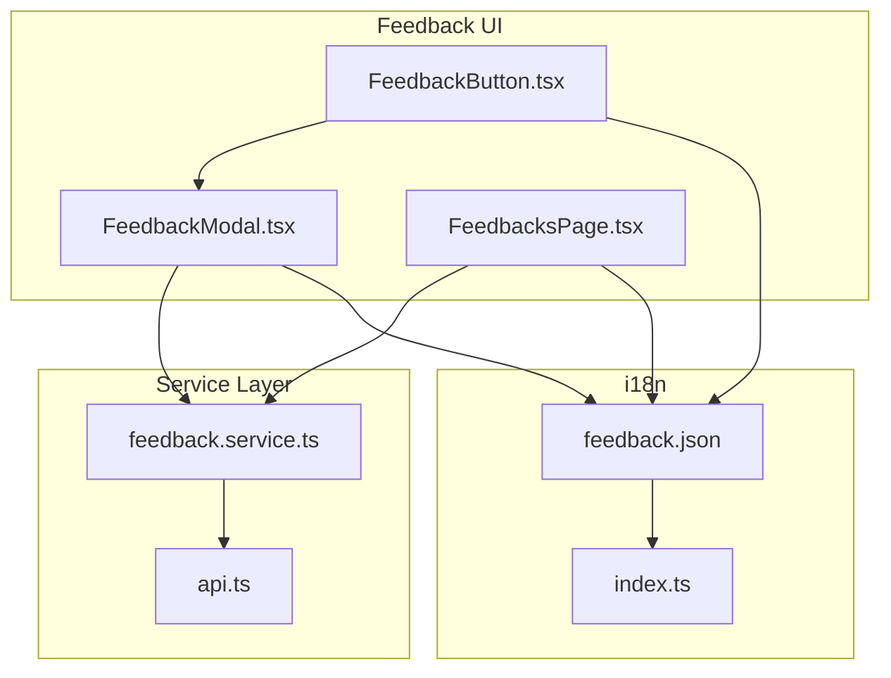
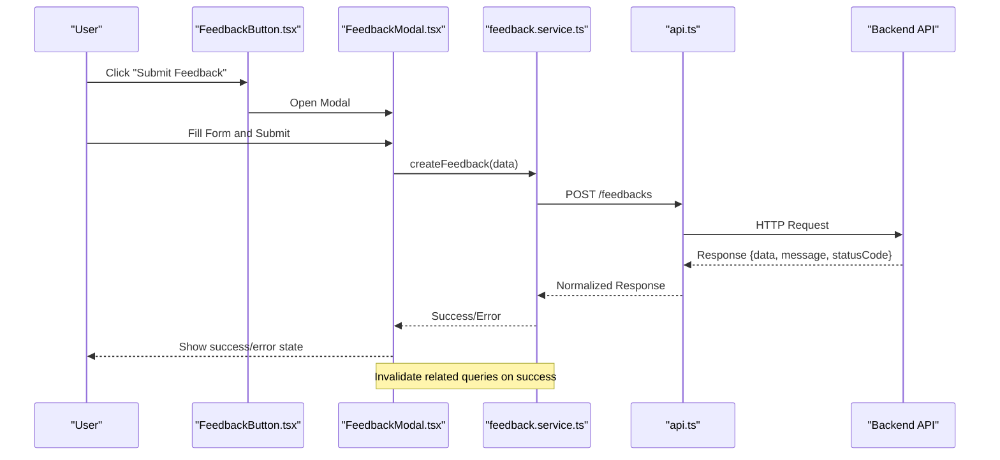
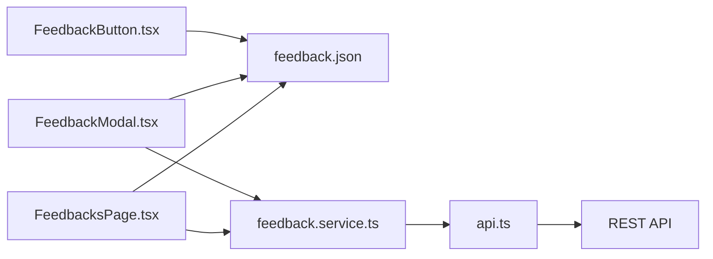

# Feedback Module - Frontend

<cite>
**Referenced Files in This Document**
- [FeedbackButton.tsx](file://src/components/feedback/FeedbackButton.tsx)
- [FeedbackModal.tsx](file://src/components/feedback/FeedbackModal.tsx)
- [FeedbacksPage.tsx](file://src/pages/feedbacks/FeedbacksPage.tsx)
- [feedback.service.ts](file://src/services/feedback.service.ts)
- [api.ts](file://src/services/api.ts)
- [feedback.json](file://src/i18n/locales/pt/feedback.json)
- [index.ts](file://src/i18n/index.ts)
</cite>

## Table of Contents
1. [Introduction](#introduction)
2. [Project Structure](#project-structure)
3. [Core Components](#core-components)
4. [Architecture Overview](#architecture-overview)
5. [Detailed Component Analysis](#detailed-component-analysis)
6. [Dependency Analysis](#dependency-analysis)
7. [Performance Considerations](#performance-considerations)
8. [Troubleshooting Guide](#troubleshooting-guide)
9. [Conclusion](#conclusion)

## Introduction
This document describes the frontend implementation of the Feedback module in Windlog, a web-based management system for wind energy technicians. The feedback feature allows users to submit and manage feedback entries through a React UI that communicates with a NestJS backend via REST API. The frontend uses TanStack Query for data fetching and caching, i18n for internationalization, and Tailwind CSS for styling.

## Project Structure
The feedback-related frontend code is organized into three main areas:
- UI components: reusable elements for user interactions (button and modal)
- Page component: the dedicated page for listing and managing feedback
- Service layer: HTTP client abstraction for API calls

**Diagram sources**
- [FeedbackButton.tsx](file://src/components/feedback/FeedbackButton.tsx)
- [FeedbackModal.tsx](file://src/components/feedback/FeedbackModal.tsx)
- [FeedbacksPage.tsx](file://src/pages/feedbacks/FeedbacksPage.tsx)
- [feedback.service.ts](file://src/services/feedback.service.ts)
- [api.ts](file://src/services/api.ts)
- [feedback.json](file://src/i18n/locales/pt/feedback.json)
- [index.ts](file://src/i18n/index.ts)

**Section sources**
- [FeedbackButton.tsx](file://src/components/feedback/FeedbackButton.tsx)
- [FeedbackModal.tsx](file://src/components/feedback/FeedbackModal.tsx)
- [FeedbacksPage.tsx](file://src/pages/feedbacks/FeedbacksPage.tsx)
- [feedback.service.ts](file://src/services/feedback.service.ts)
- [api.ts](file://src/services/api.ts)
- [feedback.json](file://src/i18n/locales/pt/feedback.json)
- [index.ts](file://src/i18n/index.ts)

## Core Components
- FeedbackButton: A small trigger component that opens the feedback modal. It should be accessible from key areas of the application where quick feedback submission is desired.
- FeedbackModal: A modal form that collects feedback details, validates input, and submits it to the backend via the service layer. It handles loading states, success, and error messages.
- FeedbacksPage: The dedicated page that lists existing feedback entries, supports filtering/searching, and provides actions such as viewing details or deleting entries.

Key responsibilities:
- User interaction handling (open/close modal, form submission)
- Data fetching and mutation using TanStack Query
- Internationalized labels and messages
- Error handling and user feedback

**Section sources**
- [FeedbackButton.tsx](file://src/components/feedback/FeedbackButton.tsx)
- [FeedbackModal.tsx](file://src/components/feedback/FeedbackModal.tsx)
- [FeedbacksPage.tsx](file://src/pages/feedbacks/FeedbacksPage.tsx)

## Architecture Overview
The frontend architecture follows a layered approach:
- UI Layer: React components handle presentation and user interactions
- Service Layer: Encapsulates API calls and request/response transformations
- Data Layer: TanStack Query manages caching, background updates, and mutations
- i18n Layer: Centralized translations for all user-facing text

**Diagram sources**
- [FeedbackButton.tsx](file://src/components/feedback/FeedbackButton.tsx)
- [FeedbackModal.tsx](file://src/components/feedback/FeedbackModal.tsx)
- [feedback.service.ts](file://src/services/feedback.service.ts)
- [api.ts](file://src/services/api.ts)

## Detailed Component Analysis

### FeedbackButton
Purpose:
- Provides a consistent entry point to open the feedback modal
- Displays localized label and optional tooltip
- Integrates with global layout or floating action patterns

Behavior:
- On click, sets modal visibility state in parent or triggers modal open event
- Supports keyboard accessibility and focus management

Integration points:
- Uses i18n keys for button text
- May accept props for positioning and styling

**Section sources**
- [FeedbackButton.tsx](file://src/components/feedback/FeedbackButton.tsx)
- [feedback.json](file://src/i18n/locales/pt/feedback.json)

### FeedbackModal
Purpose:
- Collects feedback content and metadata
- Validates inputs before submission
- Submits feedback via service layer and updates UI state

Data flow:
- Local state holds form values and validation errors
- On submit, calls service method to create feedback
- On success, closes modal and invalidates query cache
- On error, displays user-friendly message

Validation:
- Required fields, length limits, and format checks
- Real-time validation feedback

Accessibility:
- Focus trap within modal
- Escape key to close
- Screen reader announcements for status changes

**Section sources**
- [FeedbackModal.tsx](file://src/components/feedback/FeedbackModal.tsx)
- [feedback.service.ts](file://src/services/feedback.service.ts)
- [feedback.json](file://src/i18n/locales/pt/feedback.json)

### FeedbacksPage
Purpose:
- Lists all feedback entries with pagination and filters
- Allows viewing details and performing destructive actions (e.g., delete)
- Provides search functionality and sorting options

Features:
- Fetches feedback list using TanStack Query
- Handles loading skeletons and error states
- Renders table or card grid depending on screen size
- Integrates with i18n for column headers and actions

State management:
- Query keys include filters and pagination parameters
- Mutations invalidate relevant queries after successful operations

**Section sources**
- [FeedbacksPage.tsx](file://src/pages/feedbacks/FeedbacksPage.tsx)
- [feedback.service.ts](file://src/services/feedback.service.ts)

### Service Layer
Purpose:
- Encapsulates all API calls related to feedback
- Normalizes responses and handles authentication headers
- Exposes typed methods for CRUD operations

Methods:
- getFeedbacks(filters): fetches paginated feedback list
- getFeedback(id): retrieves single feedback by ID
- createFeedback(data): creates new feedback entry
- updateFeedback(id, data): updates existing feedback
- deleteFeedback(id): deletes feedback entry

Error handling:
- Translates HTTP errors to user-friendly messages
- Logs errors for debugging while preserving privacy

**Section sources**
- [feedback.service.ts](file://src/services/feedback.service.ts)
- [api.ts](file://src/services/api.ts)

## Dependency Analysis
The feedback module has clear separation of concerns with minimal coupling between components:

**Diagram sources**
- [FeedbackButton.tsx](file://src/components/feedback/FeedbackButton.tsx)
- [FeedbackModal.tsx](file://src/components/feedback/FeedbackModal.tsx)
- [FeedbacksPage.tsx](file://src/pages/feedbacks/FeedbacksPage.tsx)
- [feedback.service.ts](file://src/services/feedback.service.ts)
- [api.ts](file://src/services/api.ts)
- [feedback.json](file://src/i18n/locales/pt/feedback.json)

**Section sources**
- [FeedbackButton.tsx](file://src/components/feedback/FeedbackButton.tsx)
- [FeedbackModal.tsx](file://src/components/feedback/FeedbackModal.tsx)
- [FeedbacksPage.tsx](file://src/pages/feedbacks/FeedbacksPage.tsx)
- [feedback.service.ts](file://src/services/feedback.service.ts)
- [api.ts](file://src/services/api.ts)
- [feedback.json](file://src/i18n/locales/pt/feedback.json)

## Performance Considerations
- Use TanStack Query's built-in caching to avoid unnecessary re-fetches
- Implement optimistic updates for better perceived performance
- Debounce search inputs to reduce API calls
- Lazy load modal content when possible
- Use virtual scrolling for large feedback lists
- Optimize images and attachments if supported
- Monitor bundle size impact of additional dependencies

[No sources needed since this section provides general guidance]

## Troubleshooting Guide
Common issues and solutions:

Authentication problems:
- Ensure JWT token is properly attached to requests
- Check token expiration and refresh logic
- Verify CORS settings if testing locally

API communication errors:
- Inspect network tab for request/response details
- Validate endpoint URLs and HTTP methods
- Check backend error responses and status codes

Form validation issues:
- Review validation rules and error messages
- Test edge cases like empty strings and special characters
- Ensure proper field types and formats

Internationalization problems:
- Verify translation keys exist in feedback.json
- Check i18n configuration and language switching
- Ensure fallback behavior for missing translations

Cache inconsistencies:
- Clear query cache when needed during development
- Invalidate queries after mutations
- Debug stale-while-revalidate behavior

**Section sources**
- [feedback.service.ts](file://src/services/feedback.service.ts)
- [api.ts](file://src/services/api.ts)
- [feedback.json](file://src/i18n/locales/pt/feedback.json)

## Conclusion
The Feedback module frontend provides a clean, accessible, and maintainable interface for submitting and managing feedback. The modular architecture with clear separation between UI, services, and data layers ensures scalability and ease of maintenance. Following the established patterns and guidelines will help maintain consistency across the application while providing a smooth user experience.

[No sources needed since this section summarizes without analyzing specific files]