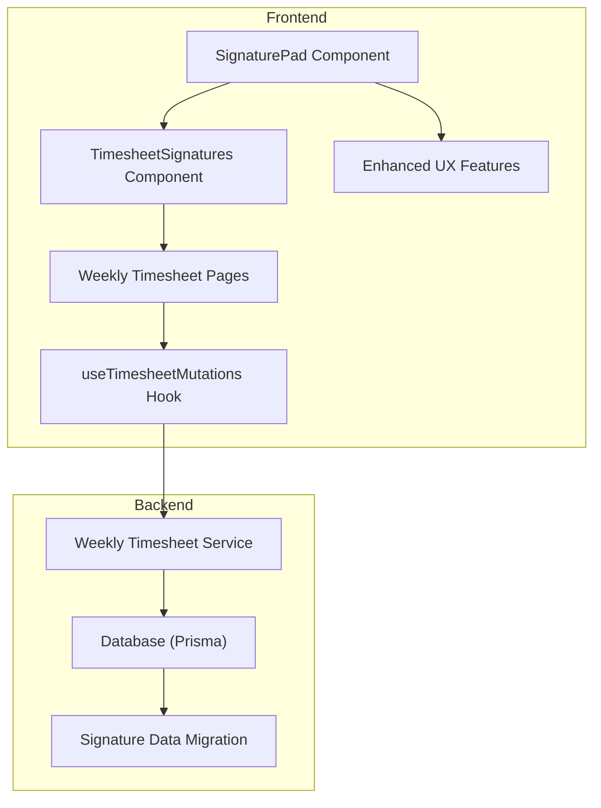
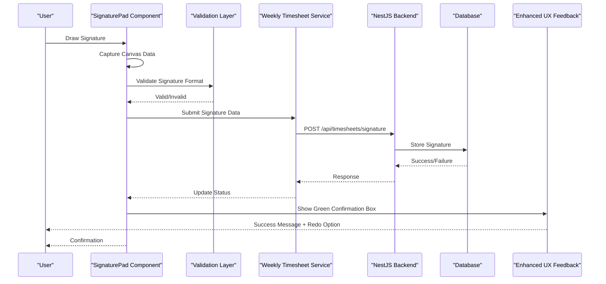
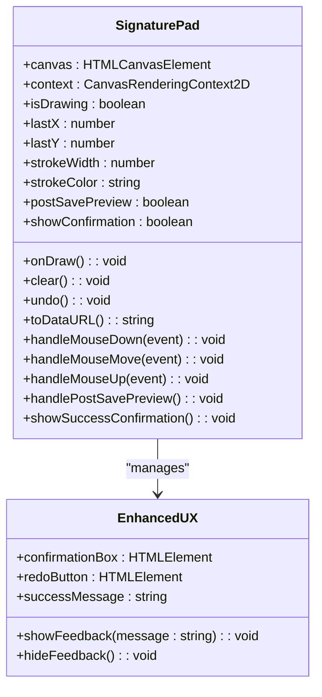
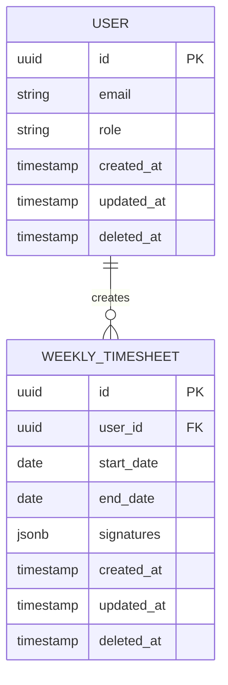
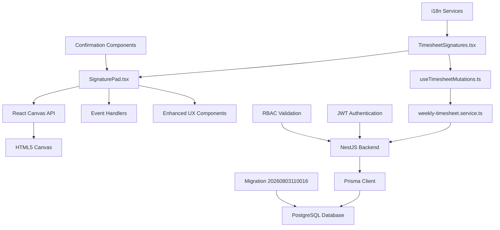

# Signature System

<cite>
**Referenced Files in This Document**
- [SignaturePad.tsx](file://src/components/ui/SignaturePad.tsx)
- [TimesheetSignatures.tsx](file://src/pages/weekly-timesheet/components/TimesheetSignatures.tsx)
- [migration.sql](file://API/prisma/migrations/20260803110016_add_signature_data/migration.sql)
- [schema.prisma](file://API/prisma/schema.prisma)
- [WeeklyTimesheetDetailPage.tsx](file://src/pages/weekly-timesheet/WeeklyTimesheetDetailPage.tsx)
- [WeeklyTimesheetPage.tsx](file://src/pages/weekly-timesheet/WeeklyTimesheetPage.tsx)
- [useTimesheetMutations.ts](file://src/pages/weekly-timesheet/hooks/useTimesheetMutations.ts)
- [weekly-timesheet.service.ts](file://src/services/weekly-timesheet.service.ts)
</cite>

## Update Summary
**Changes Made**
- Enhanced SignaturePad component with post-save preview mode and green confirmation box with 'Redo' button
- Improved payload handling for empty strings instead of undefined values
- Expanded i18n support with new keys for success messages and redo functionality
- Updated user feedback mechanisms for better signature submission experience

## Table of Contents
1. [Introduction](#introduction)
2. [Project Structure](#project-structure)
3. [Core Components](#core-components)
4. [Architecture Overview](#architecture-overview)
5. [Detailed Component Analysis](#detailed-component-analysis)
6. [Enhanced User Experience Features](#enhanced-user-experience-features)
7. [Dependency Analysis](#dependency-analysis)
8. [Performance Considerations](#performance-considerations)
9. [Troubleshooting Guide](#troubleshooting-guide)
10. [Conclusion](#conclusion)

## Introduction
The Signature System is a core feature within the Windlog application that enables users to capture and manage digital signatures for weekly timesheets. This system provides a seamless user experience for signing documents through an interactive signature pad component, integrated with the backend API for secure storage and retrieval. The implementation follows modern web standards using HTML5 Canvas for signature capture and RESTful APIs for data persistence. Recent enhancements include improved post-save preview modes, enhanced user feedback with confirmation boxes, and expanded internationalization support.

## Project Structure
The Signature System spans both frontend and backend components:

**Diagram sources**
- [SignaturePad.tsx](file://src/components/ui/SignaturePad.tsx)
- [TimesheetSignatures.tsx](file://src/pages/weekly-timesheet/components/TimesheetSignatures.tsx)
- [WeeklyTimesheetDetailPage.tsx](file://src/pages/weekly-timesheet/WeeklyTimesheetDetailPage.tsx)
- [useTimesheetMutations.ts](file://src/pages/weekly-timesheet/hooks/useTimesheetMutations.ts)
- [weekly-timesheet.service.ts](file://src/services/weekly-timesheet.service.ts)
- [migration.sql](file://API/prisma/migrations/20260803110016_add_signature_data/migration.sql)

**Section sources**
- [SignaturePad.tsx](file://src/components/ui/SignaturePad.tsx)
- [TimesheetSignatures.tsx](file://src/pages/weekly-timesheet/components/TimesheetSignatures.tsx)

## Core Components

### SignaturePad Component
The SignaturePad component serves as the primary interface for capturing user signatures. It implements HTML5 Canvas functionality to provide drawing capabilities with touch and mouse support.

Key features include:
- Canvas-based signature drawing
- Touch and mouse event handling
- Clear and undo functionality
- Image export capabilities
- Responsive design adaptation
- **Post-save preview mode with confirmation feedback**
- **Enhanced error handling with improved payload validation**

### TimesheetSignatures Component
This component manages the display and interaction of signatures within the weekly timesheet context. It handles signature validation, preview, and integration with the timesheet workflow.

**Updated** Enhanced with improved user feedback mechanisms and better state management for signature submission workflows.

**Section sources**
- [SignaturePad.tsx](file://src/components/ui/SignaturePad.tsx)
- [TimesheetSignatures.tsx](file://src/pages/weekly-timesheet/components/TimesheetSignatures.tsx)

## Architecture Overview

The Signature System follows a layered architecture pattern with enhanced user experience flows:

**Diagram sources**
- [SignaturePad.tsx](file://src/components/ui/SignaturePad.tsx)
- [useTimesheetMutations.ts](file://src/pages/weekly-timesheet/hooks/useTimesheetMutations.ts)
- [weekly-timesheet.service.ts](file://src/services/weekly-timesheet.service.ts)

## Detailed Component Analysis

### SignaturePad Implementation
The SignaturePad component implements a sophisticated canvas drawing system with the following key aspects:

#### Canvas Management
- Initializes canvas with proper dimensions and DPI scaling
- Handles device pixel ratio for high-resolution displays
- Manages canvas state and drawing context

#### Event Handling
- Mouse events for desktop drawing
- Touch events for mobile/tablet support
- Prevents default scrolling behavior during drawing

#### Drawing Logic
- Smooth line rendering with configurable stroke properties
- Real-time signature preview
- Undo functionality for mistake correction

#### Enhanced Post-Save Features
- **Post-save preview mode for signature verification**
- **Green confirmation box with visual success feedback**
- **Integrated 'Redo' button for signature resubmission**
- **Improved payload handling with empty string validation**

**Diagram sources**
- [SignaturePad.tsx](file://src/components/ui/SignaturePad.tsx)

### Timesheet Integration
The TimesheetSignatures component integrates signature functionality into the weekly timesheet workflow:

#### State Management
- Tracks signature status (pending, signed, rejected)
- Manages multiple signature fields per timesheet
- Handles signature validation rules
- **Manages post-save preview states**

#### Data Flow
- Captures signature data from SignaturePad
- Validates signature format and completeness
- Submits to backend via API mutations
- Updates UI state based on server response
- **Implements enhanced user feedback mechanisms**

#### Payload Handling Improvements
- **Enhanced validation for empty string payloads**
- **Better error handling for undefined values**
- **Improved data sanitization before submission**

**Section sources**
- [TimesheetSignatures.tsx](file://src/pages/weekly-timesheet/components/TimesheetSignatures.tsx)
- [useTimesheetMutations.ts](file://src/pages/weekly-timesheet/hooks/useTimesheetMutations.ts)

### Backend Database Schema
The database schema includes signature-related fields and relationships:

**Diagram sources**
- [schema.prisma](file://API/prisma/schema.prisma)
- [migration.sql](file://API/prisma/migrations/20260803110016_add_signature_data/migration.sql)

## Enhanced User Experience Features

### Post-Save Preview Mode
The SignaturePad component now includes a sophisticated post-save preview mode that allows users to verify their signatures before final submission. This feature provides immediate visual feedback and reduces errors in signature capture.

### Green Confirmation Box
Upon successful signature submission, users receive a green confirmation box with clear success messaging. This visual feedback confirms that the signature has been properly saved and processed by the system.

### Integrated Redo Functionality
The enhanced confirmation box includes a 'Redo' button that allows users to quickly resubmit their signature if needed. This feature improves the overall user experience by providing easy recovery options without requiring navigation away from the current view.

### Internationalization Support
The system now supports expanded i18n capabilities with dedicated keys for:
- Success messages for signature submissions
- Redo functionality labels
- Error message translations
- Confirmation dialog text

**Section sources**
- [SignaturePad.tsx](file://src/components/ui/SignaturePad.tsx)
- [TimesheetSignatures.tsx](file://src/pages/weekly-timesheet/components/TimesheetSignatures.tsx)

## Dependency Analysis

The Signature System has the following dependency relationships with enhanced UX dependencies:

**Diagram sources**
- [SignaturePad.tsx](file://src/components/ui/SignaturePad.tsx)
- [TimesheetSignatures.tsx](file://src/pages/weekly-timesheet/components/TimesheetSignatures.tsx)
- [useTimesheetMutations.ts](file://src/pages/weekly-timesheet/hooks/useTimesheetMutations.ts)
- [weekly-timesheet.service.ts](file://src/services/weekly-timesheet.service.ts)
- [migration.sql](file://API/prisma/migrations/20260803110016_add_signature_data/migration.sql)

**Section sources**
- [useTimesheetMutations.ts](file://src/pages/weekly-timesheet/hooks/useTimesheetMutations.ts)
- [weekly-timesheet.service.ts](file://src/services/weekly-timesheet.service.ts)

## Performance Considerations

### Canvas Optimization
- Implement requestAnimationFrame for smooth drawing
- Use offscreen canvas for complex operations
- Optimize canvas size based on device capabilities
- Debounce resize events to prevent performance issues

### Memory Management
- Properly clean up canvas contexts
- Remove event listeners when components unmount
- Limit signature history size to prevent memory leaks
- Use efficient data structures for point storage

### Network Optimization
- Compress signature images before upload
- Implement retry logic for failed uploads
- Cache signature data locally when possible
- Use optimistic updates for better UX

### Enhanced UX Performance
- **Optimize confirmation box rendering**
- **Implement efficient state management for preview modes**
- **Minimize re-renders during signature submission**
- **Use lazy loading for i18n resources**

## Troubleshooting Guide

### Common Issues and Solutions

#### Canvas Not Rendering
- Check canvas element existence and dimensions
- Verify browser compatibility with Canvas API
- Ensure proper cleanup of previous canvas instances
- Validate device pixel ratio calculations

#### Touch Events Not Working
- Confirm touch event listeners are properly attached
- Check for CSS pointer-events interference
- Verify mobile viewport meta tag configuration
- Test different touch input methods

#### Signature Data Loss
- Implement local storage backup
- Add auto-save functionality
- Handle network failures gracefully
- Provide manual save/retry options

#### Performance Issues
- Monitor canvas memory usage
- Optimize drawing algorithms
- Implement virtual scrolling for large datasets
- Profile rendering performance

#### Enhanced UX Issues
- **Verify confirmation box visibility and styling**
- **Check i18n resource loading for success messages**
- **Validate redo button functionality and event handlers**
- **Ensure proper state transitions between preview modes**

**Section sources**
- [SignaturePad.tsx](file://src/components/ui/SignaturePad.tsx)
- [TimesheetSignatures.tsx](file://src/pages/weekly-timesheet/components/TimesheetSignatures.tsx)

## Conclusion
The Signature System provides a robust and user-friendly solution for digital signature capture within the Windlog application. By leveraging modern web technologies and following best practices for performance and usability, it delivers a seamless experience across different devices and platforms. The recent enhancements including post-save preview modes, green confirmation boxes with redo functionality, improved payload handling, and expanded i18n support significantly improve the user experience and system reliability.

The modular architecture ensures maintainability and scalability while the comprehensive error handling guarantees reliability in production environments. The system successfully integrates with the existing authentication and authorization framework, ensuring secure access to signature functionality. Future enhancements could include advanced editing capabilities, template support, and integration with external signature services for enterprise scenarios.

The enhanced user experience features demonstrate the system's commitment to providing intuitive and responsive interactions, making signature capture more accessible and reliable for all users across different languages and regions.