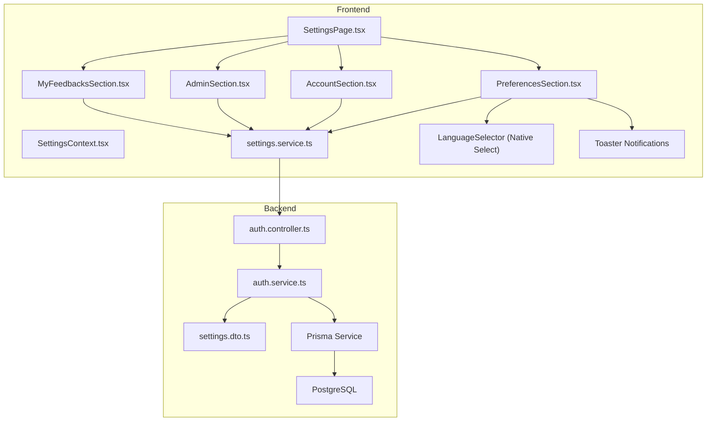
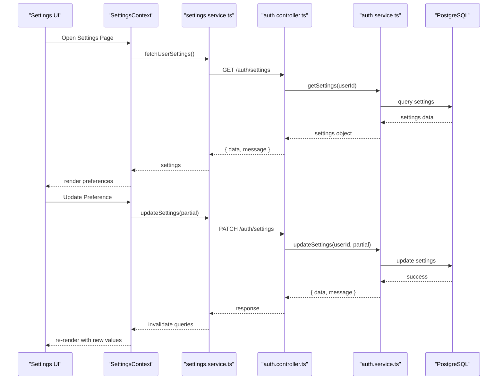
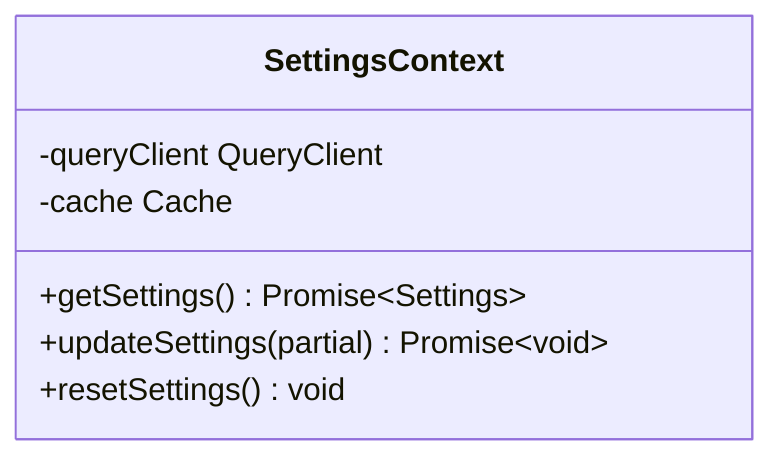
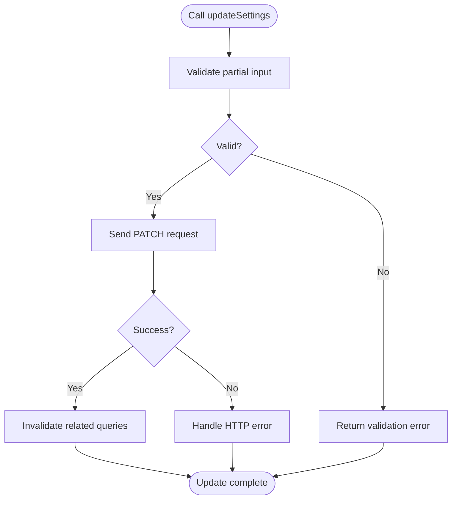
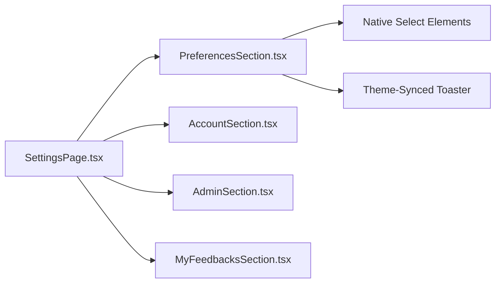
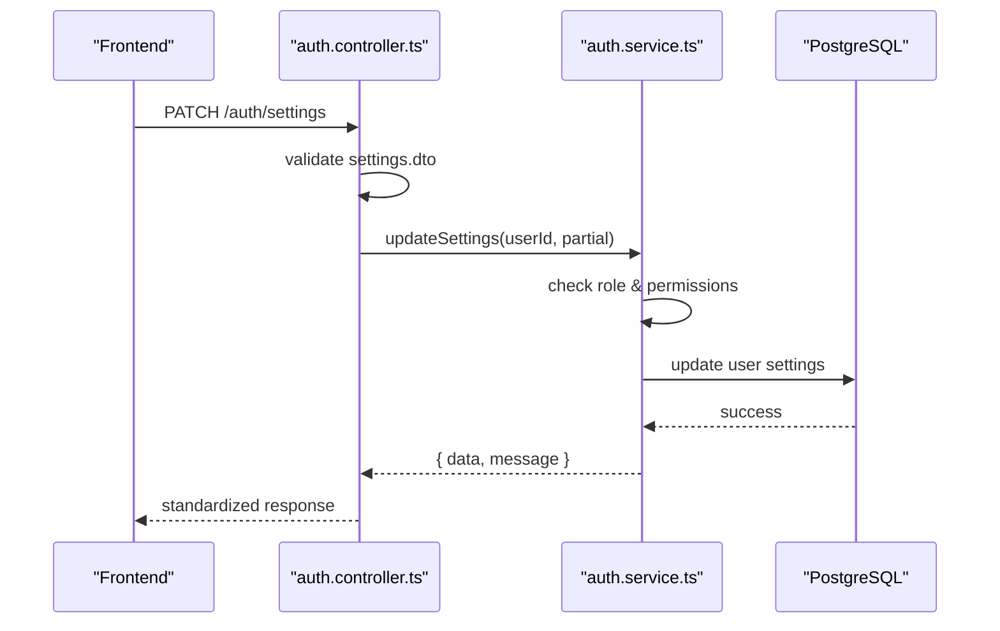
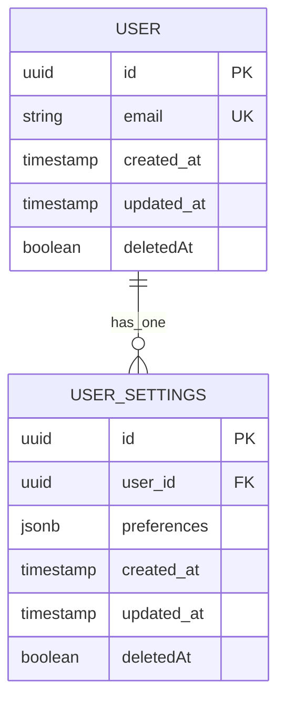
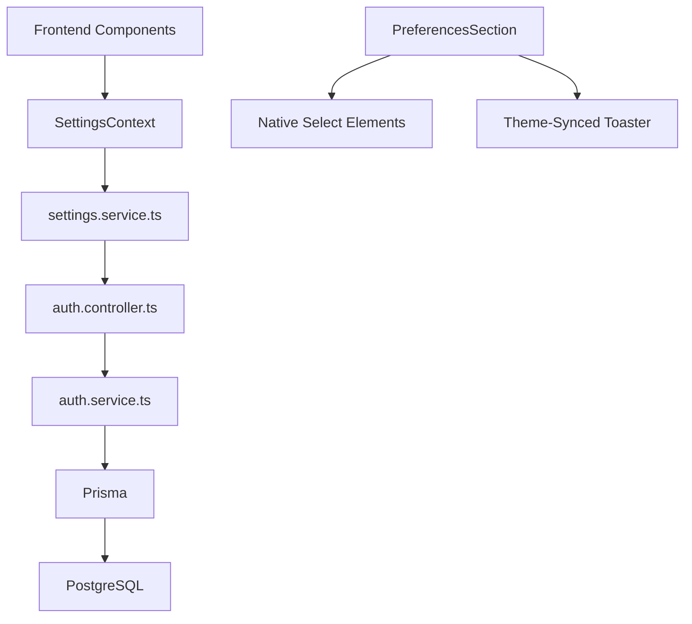

# User Preferences System

<cite>
**Referenced Files in This Document**
- [SettingsContext.tsx](file://src/contexts/SettingsContext.tsx)
- [settings.service.ts](file://src/services/settings.service.ts)
- [SettingsPage.tsx](file://src/pages/settings/SettingsPage.tsx)
- [PreferencesSection.tsx](file://src/pages/settings/components/PreferencesSection.tsx)
- [AccountSection.tsx](file://src/pages/settings/components/AccountSection.tsx)
- [AdminSection.tsx](file://src/pages/settings/components/AdminSection.tsx)
- [MyFeedbacksSection.tsx](file://src/pages/settings/components/MyFeedbacksSection.tsx)
- [auth.controller.ts](file://API/src/modules/auth/auth.controller.ts)
- [auth.service.ts](file://API/src/modules/auth/auth.service.ts)
- [settings.dto.ts](file://API/src/modules/auth/dto/settings.dto.ts)
- [schema.prisma](file://API/prisma/schema.prisma)
- [20260804183827_add_user_settings_preferences/migration.sql](file://API/prisma/migrations/20260804183827_add_user_settings_preferences/migration.sql)
</cite>

## Update Summary
**Changes Made**
- Updated Language Selector implementation from custom dropdown to native HTML select element for improved accessibility and browser integration
- Enhanced Toaster notification system synchronization with theme system for consistent user experience
- Improved accessibility compliance and cross-browser compatibility for language selection interface

## Table of Contents
1. [Introduction](#introduction)
2. [Project Structure](#project-structure)
3. [Core Components](#core-components)
4. [Architecture Overview](#architecture-overview)
5. [Detailed Component Analysis](#detailed-component-analysis)
6. [Dependency Analysis](#dependency-analysis)
7. [Performance Considerations](#performance-considerations)
8. [Troubleshooting Guide](#troubleshooting-guide)
9. [Conclusion](#conclusion)

## Introduction
This document explains the User Preferences System within Windlog, a web-based management platform for wind energy technicians. The system enables users to manage personal settings and preferences through a React frontend backed by a NestJS API. It covers data models, API endpoints, client-side state management, UI sections, and integration points such as authentication and logging.

Key characteristics:
- Frontend uses React with TanStack Query for caching and mutations.
- Backend is NestJS with Prisma ORM and PostgreSQL.
- Authentication via JWT Bearer tokens; user identity derived from token payload.
- RBAC roles: ADMIN, HR, STANDARD.
- Standardized API responses and comprehensive logging.
- **Updated**: Native HTML select elements for improved accessibility and browser integration.
- **Updated**: Synchronized toaster notifications with theme system for consistent user experience.

## Project Structure
The User Preferences System spans both frontend and backend:
- Frontend: Settings page and sections, context provider, and service layer.
- Backend: Auth module controllers/services handling settings DTOs and persistence.
- Database: Prisma schema and migrations defining user settings/preferences.

**Diagram sources**
- [SettingsPage.tsx](file://src/pages/settings/SettingsPage.tsx)
- [PreferencesSection.tsx](file://src/pages/settings/components/PreferencesSection.tsx)
- [AccountSection.tsx](file://src/pages/settings/components/AccountSection.tsx)
- [AdminSection.tsx](file://src/pages/settings/components/AdminSection.tsx)
- [MyFeedbacksSection.tsx](file://src/pages/settings/components/MyFeedbacksSection.tsx)
- [SettingsContext.tsx](file://src/contexts/SettingsContext.tsx)
- [settings.service.ts](file://src/services/settings.service.ts)
- [auth.controller.ts](file://API/src/modules/auth/auth.controller.ts)
- [auth.service.ts](file://API/src/modules/auth/auth.service.ts)
- [settings.dto.ts](file://API/src/modules/auth/dto/settings.dto.ts)

**Section sources**
- [SettingsPage.tsx](file://src/pages/settings/SettingsPage.tsx)
- [SettingsContext.tsx](file://src/contexts/SettingsContext.tsx)
- [settings.service.ts](file://src/services/settings.service.ts)
- [auth.controller.ts](file://API/src/modules/auth/auth.controller.ts)
- [auth.service.ts](file://API/src/modules/auth/auth.service.ts)
- [settings.dto.ts](file://API/src/modules/auth/dto/settings.dto.ts)
- [schema.prisma](file://API/prisma/schema.prisma)
- [20260804183827_add_user_settings_preferences/migration.sql](file://API/prisma/migrations/20260804183827_add_user_settings_preferences/migration.sql)

## Core Components
- Settings Context (client state): Provides global access to user settings and methods to update them across the app.
- Settings Service (HTTP client): Encapsulates REST calls to backend endpoints for fetching and updating preferences.
- Settings Page and Sections: UI components that render preference forms and trigger mutations.
- Backend Auth Module: Handles authenticated requests, validates DTOs, and persists changes to the database.
- Data Model: Prisma schema defines user settings/preferences fields and relationships.

Responsibilities:
- SettingsContext: Holds current settings, exposes setters, integrates with TanStack Query cache invalidation.
- settings.service.ts: Defines typed methods for GET/POST operations on settings endpoints.
- PreferencesSection: Renders language, theme, notifications, and other user preferences with native select elements.
- AccountSection: Manages profile-related settings like phone, documents, PPE, bank accounts.
- AdminSection: Restricted area for admin-only configuration.
- MyFeedbacksSection: Displays and manages user feedback entries.
- Auth Controller/Service: Enforces authentication, maps DTOs to entities, logs actions, and returns standardized responses.

**Updated**: Language selector now uses native HTML select elements for better accessibility and browser integration.
**Updated**: Toaster notifications are synchronized with the theme system for consistent visual presentation.

**Section sources**
- [SettingsContext.tsx](file://src/contexts/SettingsContext.tsx)
- [settings.service.ts](file://src/services/settings.service.ts)
- [PreferencesSection.tsx](file://src/pages/settings/components/PreferencesSection.tsx)
- [AccountSection.tsx](file://src/pages/settings/components/AccountSection.tsx)
- [AdminSection.tsx](file://src/pages/settings/components/AdminSection.tsx)
- [MyFeedbacksSection.tsx](file://src/pages/settings/components/MyFeedbacksSection.tsx)
- [auth.controller.ts](file://API/src/modules/auth/auth.controller.ts)
- [auth.service.ts](file://API/src/modules/auth/auth.service.ts)
- [settings.dto.ts](file://API/src/modules/auth/dto/settings.dto.ts)

## Architecture Overview
The User Preferences System follows a layered architecture:
- Presentation Layer: React components render forms and display settings.
- State Layer: SettingsContext provides reactive state and cache coordination.
- Service Layer: HTTP client abstracts API calls and error handling.
- API Layer: NestJS controller receives requests, validates input, and delegates to service.
- Domain Layer: Service orchestrates business logic, permissions, and logging.
- Persistence Layer: Prisma interacts with PostgreSQL.

**Diagram sources**
- [SettingsContext.tsx](file://src/contexts/SettingsContext.tsx)
- [settings.service.ts](file://src/services/settings.service.ts)
- [auth.controller.ts](file://API/src/modules/auth/auth.controller.ts)
- [auth.service.ts](file://API/src/modules/auth/auth.service.ts)

## Detailed Component Analysis

### SettingsContext (Client State)
- Purpose: Centralizes user settings state and provides methods to update preferences.
- Behavior: Integrates with TanStack Query to keep local state and server cache consistent.
- Key methods:
  - getSettings(): Fetches current settings if not cached.
  - updateSettings(partial): Applies partial updates and invalidates related queries.
  - resetSettings(): Resets to initial values or server state.

**Diagram sources**
- [SettingsContext.tsx](file://src/contexts/SettingsContext.tsx)

**Section sources**
- [SettingsContext.tsx](file://src/contexts/SettingsContext.tsx)

### settings.service.ts (HTTP Client)
- Purpose: Encapsulates REST interactions for settings endpoints.
- Methods:
  - fetchUserSettings(): GET request to retrieve user settings.
  - updateUserSettings(partial): PATCH request to update preferences.
- Error handling: Translates network errors into user-friendly messages and triggers cache invalidation.

**Diagram sources**
- [settings.service.ts](file://src/services/settings.service.ts)

**Section sources**
- [settings.service.ts](file://src/services/settings.service.ts)

### SettingsPage and Sections (UI)
- SettingsPage: Orchestrates layout and tabs for different sections.
- PreferencesSection: Renders user-specific preferences like language, theme, notification toggles with native select elements.
- AccountSection: Manages profile-related data including phone numbers, documents, PPE, and bank accounts.
- AdminSection: Restricted section for administrative configurations.
- MyFeedbacksSection: Displays user feedback history and details.

**Updated**: Language selector now implements native HTML select elements for improved accessibility and browser integration.
**Updated**: Toaster notifications are synchronized with the theme system for consistent visual presentation across light and dark modes.

**Diagram sources**
- [SettingsPage.tsx](file://src/pages/settings/SettingsPage.tsx)
- [PreferencesSection.tsx](file://src/pages/settings/components/PreferencesSection.tsx)
- [AccountSection.tsx](file://src/pages/settings/components/AccountSection.tsx)
- [AdminSection.tsx](file://src/pages/settings/components/AdminSection.tsx)
- [MyFeedbacksSection.tsx](file://src/pages/settings/components/MyFeedbacksSection.tsx)

**Section sources**
- [SettingsPage.tsx](file://src/pages/settings/SettingsPage.tsx)
- [PreferencesSection.tsx](file://src/pages/settings/components/PreferencesSection.tsx)
- [AccountSection.tsx](file://src/pages/settings/components/AccountSection.tsx)
- [AdminSection.tsx](file://src/pages/settings/components/AdminSection.tsx)
- [MyFeedbacksSection.tsx](file://src/pages/settings/components/MyFeedbacksSection.tsx)

### Backend Auth Module (Controller/Service)
- auth.controller.ts: Exposes endpoints for settings CRUD operations under /auth/settings.
- auth.service.ts: Implements business logic, validates DTOs, enforces RBAC, logs actions, and persists changes.
- settings.dto.ts: Defines input/output structures for settings endpoints.

**Diagram sources**
- [auth.controller.ts](file://API/src/modules/auth/auth.controller.ts)
- [auth.service.ts](file://API/src/modules/auth/auth.service.ts)
- [settings.dto.ts](file://API/src/modules/auth/dto/settings.dto.ts)

**Section sources**
- [auth.controller.ts](file://API/src/modules/auth/auth.controller.ts)
- [auth.service.ts](file://API/src/modules/auth/auth.service.ts)
- [settings.dto.ts](file://API/src/modules/auth/dto/settings.dto.ts)

### Data Model and Migration
- Prisma schema defines user settings/preferences fields and relationships.
- Migration adds user settings/preferences table with timestamps and soft delete support.

**Diagram sources**
- [schema.prisma](file://API/prisma/schema.prisma)
- [20260804183827_add_user_settings_preferences/migration.sql](file://API/prisma/migrations/20260804183827_add_user_settings_preferences/migration.sql)

**Section sources**
- [schema.prisma](file://API/prisma/schema.prisma)
- [20260804183827_add_user_settings_preferences/migration.sql](file://API/prisma/migrations/20260804183827_add_user_settings_preferences/migration.sql)

## Dependency Analysis
The User Preferences System has clear dependencies between layers:
- Frontend components depend on SettingsContext for state.
- SettingsContext depends on settings.service.ts for HTTP operations.
- settings.service.ts depends on NestJS endpoints exposed by auth.controller.ts.
- auth.controller.ts depends on auth.service.ts for business logic.
- auth.service.ts depends on Prisma and PostgreSQL for persistence.

**Updated**: Language selector component now relies on native HTML select elements instead of custom dropdown implementations.
**Updated**: Toaster notification system is integrated with the theme system for consistent styling.

**Diagram sources**
- [SettingsContext.tsx](file://src/contexts/SettingsContext.tsx)
- [settings.service.ts](file://src/services/settings.service.ts)
- [auth.controller.ts](file://API/src/modules/auth/auth.controller.ts)
- [auth.service.ts](file://API/src/modules/auth/auth.service.ts)
- [schema.prisma](file://API/prisma/schema.prisma)

**Section sources**
- [SettingsContext.tsx](file://src/contexts/SettingsContext.tsx)
- [settings.service.ts](file://src/services/settings.service.ts)
- [auth.controller.ts](file://API/src/modules/auth/auth.controller.ts)
- [auth.service.ts](file://API/src/modules/auth/auth.service.ts)
- [schema.prisma](file://API/prisma/schema.prisma)

## Performance Considerations
- Use TanStack Query caching to minimize redundant API calls.
- Implement optimistic updates where appropriate to improve perceived performance.
- Debounce frequent preference updates to reduce server load.
- Ensure proper indexing on frequently queried fields in the database.
- Leverage partial updates to transfer only changed preferences.
- **Updated**: Native select elements provide better performance than custom dropdown implementations.
- **Updated**: Theme-synced toaster notifications reduce rendering overhead through shared styling.

## Troubleshooting Guide
Common issues and resolutions:
- Authentication failures: Verify JWT token validity and expiration.
- Permission errors: Check user roles and ensure proper RBAC enforcement.
- Validation errors: Inspect settings.dto.ts constraints and frontend form validation.
- Network errors: Review HTTP status codes and implement retry logic.
- Cache inconsistencies: Invalidate relevant queries after mutations.
- **Updated**: Language selector issues: Ensure native select elements are properly styled and accessible.
- **Updated**: Toaster notification problems: Verify theme system integration and notification queue management.

**Section sources**
- [auth.controller.ts](file://API/src/modules/auth/auth.controller.ts)
- [auth.service.ts](file://API/src/modules/auth/auth.service.ts)
- [settings.dto.ts](file://API/src/modules/auth/dto/settings.dto.ts)
- [SettingsContext.tsx](file://src/contexts/SettingsContext.tsx)

## Conclusion
The User Preferences System in Windlog provides a robust foundation for managing user settings through a well-structured frontend-backend architecture. By leveraging React, TanStack Query, NestJS, and Prisma, it ensures efficient data flow, strong typing, and maintainable code. The system supports RBAC, standardized responses, and comprehensive logging, making it suitable for enterprise-grade applications.

**Updated**: Recent improvements include native HTML select elements for enhanced accessibility and browser integration, along with theme-synchronized toaster notifications for a consistent user experience across different visual themes.