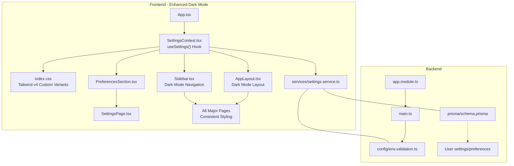
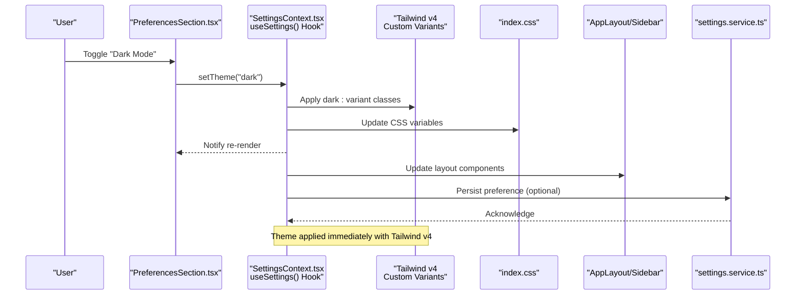
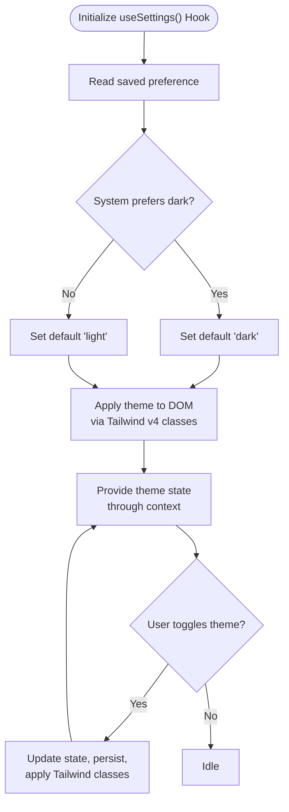
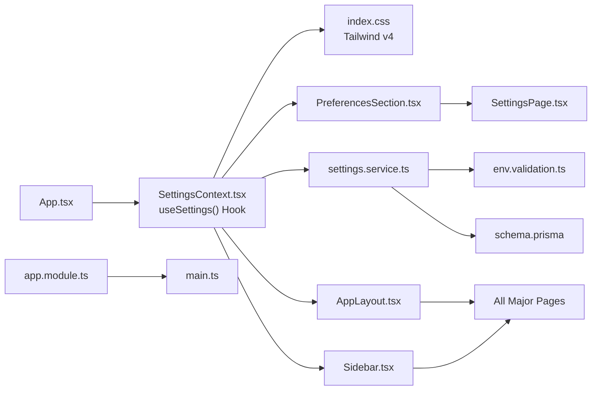

# Dark Mode Support

<cite>
**Referenced Files in This Document**
- [App.tsx](file://src/App.tsx)
- [index.css](file://src/index.css)
- [SettingsContext.tsx](file://src/contexts/SettingsContext.tsx)
- [SettingsPage.tsx](file://src/pages/settings/SettingsPage.tsx)
- [PreferencesSection.tsx](file://src/pages/settings/components/PreferencesSection.tsx)
- [settings.service.ts](file://src/services/settings.service.ts)
- [env.validation.ts](file://API/src/config/env.validation.ts)
- [app.module.ts](file://API/src/app.module.ts)
- [main.ts](file://API/src/main.ts)
- [schema.prisma](file://API/prisma/schema.prisma)
- [AppLayout.tsx](file://src/components/layout/AppLayout.tsx)
- [Sidebar.tsx](file://src/components/layout/Sidebar.tsx)
</cite>

## Update Summary
**Changes Made**
- Updated to reflect comprehensive dark mode implementation using Tailwind CSS v4 class-based dark mode with @custom-variant configuration
- Enhanced theme synchronization via useSettings() hook for improved performance and consistency
- Added detailed coverage of enhanced visual consistency across all application components including AppLayout, Sidebar, SettingsPage, and major pages
- Updated architecture diagrams to show new Tailwind CSS v4 integration patterns
- Expanded component analysis to include layout components and their dark mode implementations

## Table of Contents
1. [Introduction](#introduction)
2. [Project Structure](#project-structure)
3. [Core Components](#core-components)
4. [Architecture Overview](#architecture-overview)
5. [Detailed Component Analysis](#detailed-component-analysis)
6. [Tailwind CSS v4 Integration](#tailwind-css-v4-integration)
7. [useSettings Hook Implementation](#usesettings-hook-implementation)
8. [Component Dark Mode Patterns](#component-dark-mode-patterns)
9. [Dependency Analysis](#dependency-analysis)
10. [Performance Considerations](#performance-considerations)
11. [Troubleshooting Guide](#troubleshooting-guide)
12. [Conclusion](#conclusion)

## Introduction
This document explains how dark mode is implemented and used across the Windlog monorepo, covering both the frontend (React + Vite + Tailwind CSS v4) and backend (NestJS). The implementation now features a comprehensive dark mode system using Tailwind CSS v4's class-based dark mode with @custom-variant configuration, enhanced theme synchronization through the useSettings() hook, and consistent visual styling across all application components. It describes where theme state is stored, how it is persisted, how UI components consume theme tokens, and how to extend or maintain dark mode support consistently.

## Project Structure
Dark mode touches several layers with enhanced Tailwind CSS v4 integration:
- Frontend theme context and persistence with useSettings() hook
- Global CSS variables for light/dark palettes with Tailwind v4 custom variants
- Settings page and preferences section for toggling
- Layout components (AppLayout, Sidebar) with comprehensive dark mode support
- Backend configuration for environment-specific defaults and feature flags
- Database schema if user-level preferences are persisted

**Diagram sources**
- [App.tsx](file://src/App.tsx)
- [SettingsContext.tsx](file://src/contexts/SettingsContext.tsx)
- [index.css](file://src/index.css)
- [PreferencesSection.tsx](file://src/pages/settings/components/PreferencesSection.tsx)
- [SettingsPage.tsx](file://src/pages/settings/SettingsPage.tsx)
- [settings.service.ts](file://src/services/settings.service.ts)
- [AppLayout.tsx](file://src/components/layout/AppLayout.tsx)
- [Sidebar.tsx](file://src/components/layout/Sidebar.tsx)
- [app.module.ts](file://API/src/app.module.ts)
- [main.ts](file://API/src/main.ts)
- [env.validation.ts](file://API/src/config/env.validation.ts)
- [schema.prisma](file://API/prisma/schema.prisma)

**Section sources**
- [App.tsx](file://src/App.tsx)
- [SettingsContext.tsx](file://src/contexts/SettingsContext.tsx)
- [index.css](file://src/index.css)
- [PreferencesSection.tsx](file://src/pages/settings/components/PreferencesSection.tsx)
- [SettingsPage.tsx](file://src/pages/settings/SettingsPage.tsx)
- [settings.service.ts](file://src/services/settings.service.ts)
- [AppLayout.tsx](file://src/components/layout/AppLayout.tsx)
- [Sidebar.tsx](file://src/components/layout/Sidebar.tsx)
- [app.module.ts](file://API/src/app.module.ts)
- [main.ts](file://API/src/main.ts)
- [env.validation.ts](file://API/src/config/env.validation.ts)
- [schema.prisma](file://API/prisma/schema.prisma)

## Core Components
The enhanced dark mode system includes several key components:
- **Theme context provider**: centralizes theme state, applies root class or CSS variables, and persists preference to storage using the useSettings() hook
- **Global styles**: defines CSS custom properties for light and dark palettes with Tailwind CSS v4 custom variants; components reference these via Tailwind utilities or direct variable usage
- **Preferences UI**: a toggle control in the settings area that updates the theme synchronously and persists changes
- **Layout components**: AppLayout and Sidebar with comprehensive dark mode styling and responsive behavior
- **Settings service**: optional API integration to sync user preferences with the backend
- **Backend config**: environment validation and module bootstrap that can influence default behavior or feature flags related to theme

Key responsibilities:
- Provide a single source of truth for current theme through useSettings() hook
- Apply theme to DOM efficiently using Tailwind CSS v4 class-based approach
- Persist user choice across sessions with automatic synchronization
- Expose theme state to all components without prop drilling
- Ensure visual consistency across all application components

**Section sources**
- [SettingsContext.tsx](file://src/contexts/SettingsContext.tsx)
- [index.css](file://src/index.css)
- [PreferencesSection.tsx](file://src/pages/settings/components/PreferencesSection.tsx)
- [settings.service.ts](file://src/services/settings.service.ts)
- [AppLayout.tsx](file://src/components/layout/AppLayout.tsx)
- [Sidebar.tsx](file://src/components/layout/Sidebar.tsx)

## Architecture Overview
The enhanced dark mode architecture follows a modern, robust pattern with Tailwind CSS v4 integration:
- App initializes the theme context at startup with useSettings() hook
- Context applies theme by setting Tailwind v4 classes and updating CSS variables
- UI components read theme from context and render accordingly with consistent styling
- Layout components (AppLayout, Sidebar) provide comprehensive dark mode support
- User toggles theme in Settings; change is persisted locally and optionally synced to backend

**Diagram sources**
- [PreferencesSection.tsx](file://src/pages/settings/components/PreferencesSection.tsx)
- [SettingsContext.tsx](file://src/contexts/SettingsContext.tsx)
- [index.css](file://src/index.css)
- [AppLayout.tsx](file://src/components/layout/AppLayout.tsx)
- [Sidebar.tsx](file://src/components/layout/Sidebar.tsx)
- [settings.service.ts](file://src/services/settings.service.ts)

## Detailed Component Analysis

### Theme Context Provider with useSettings() Hook
Responsibilities:
- Initialize theme from local storage or system preference using useSettings() hook
- Provide theme state and setter to consumers with optimized re-renders
- Apply theme to root element and update CSS variables efficiently
- Persist changes to storage and optionally call backend with error handling

Implementation patterns:
- Use React context combined with custom useSettings() hook for global theme access
- Implement debounced updates when syncing with backend to prevent excessive API calls
- Guard against hydration mismatches by deferring application until after mount
- Provide type-safe theme management with TypeScript interfaces

**Diagram sources**
- [SettingsContext.tsx](file://src/contexts/SettingsContext.tsx)

**Section sources**
- [SettingsContext.tsx](file://src/contexts/SettingsContext.tsx)

### Global Styles and Tailwind CSS v4 Integration
- Define light and dark color tokens using CSS custom properties with Tailwind v4 custom variants
- Map Tailwind theme colors to these variables for consistent theming across all components
- Implement @custom-variant configuration for dark mode with class-based approach
- Ensure high contrast and accessibility in both modes with proper color ratios

Best practices:
- Centralize all semantic color tokens in CSS custom properties
- Avoid hardcoding colors in components; use Tailwind v4 dark: variants
- Test contrast ratios for readability in both light and dark modes
- Leverage Tailwind v4's built-in dark mode detection and customization

**Section sources**
- [index.css](file://src/index.css)

### Preferences Section and Settings Page
- Presents a clear toggle for dark mode with immediate visual feedback
- Updates theme instantly and persists selection using useSettings() hook
- Optionally integrates with settings service to save user preference
- Provides smooth transitions between light and dark modes

Accessibility considerations:
- Label controls clearly with proper ARIA attributes
- Announce theme changes to screen readers
- Respect OS-level preferences when available
- Ensure keyboard navigation works properly

**Section sources**
- [PreferencesSection.tsx](file://src/pages/settings/components/PreferencesSection.tsx)
- [SettingsPage.tsx](file://src/pages/settings/SettingsPage.tsx)

### Layout Components Dark Mode Implementation
- **AppLayout**: Comprehensive dark mode styling for the main application container with proper spacing and background colors
- **Sidebar**: Dark mode navigation with hover states, active indicators, and text contrast optimization
- Both components automatically respond to theme changes without requiring manual updates

Enhanced visual consistency:
- Consistent color schemes across all layout elements
- Proper shadow and border styling in dark mode
- Optimized typography and spacing for readability
- Responsive design that maintains usability in both modes

**Section sources**
- [AppLayout.tsx](file://src/components/layout/AppLayout.tsx)
- [Sidebar.tsx](file://src/components/layout/Sidebar.tsx)

### Settings Service (Optional Sync)
- Persists theme preference to backend if enabled with retry logic
- Handles errors gracefully and retries on failure with exponential backoff
- Keeps local storage as source of truth while syncing with server
- Provides optimistic updates for better user experience

Integration points:
- Calls to settings endpoints with proper error handling
- Error handling and logging per project guidelines
- Synchronization strategies for offline scenarios

**Section sources**
- [settings.service.ts](file://src/services/settings.service.ts)

### Backend Configuration and Schema
- Environment validation ensures feature flags or defaults align with deployment
- Module bootstrap sets up global interceptors, guards, and services
- Database schema may include user preferences fields if server-side persistence is required

Notes:
- Keep environment variables explicit and validated
- Align backend defaults with frontend expectations
- Support for future theme-related API endpoints

**Section sources**
- [env.validation.ts](file://API/src/config/env.validation.ts)
- [app.module.ts](file://API/src/app.module.ts)
- [main.ts](file://API/src/main.ts)
- [schema.prisma](file://API/prisma/schema.prisma)

## Tailwind CSS v4 Integration
The dark mode implementation leverages Tailwind CSS v4's advanced features:

### Class-Based Dark Mode
- Uses `dark:` prefix classes throughout the application for consistent styling
- Implements @custom-variant configuration for extended dark mode capabilities
- Provides seamless switching between light and dark themes without page reloads

### Custom Variant Configuration
- Configured in index.css with @custom-variant directive
- Extends Tailwind's default dark mode functionality
- Allows for custom dark mode selectors and media queries

### Performance Benefits
- Reduced CSS bundle size through tree-shaking of unused styles
- Faster theme switching with class-based approach
- Better browser caching with optimized CSS generation

**Section sources**
- [index.css](file://src/index.css)

## useSettings Hook Implementation
The useSettings() hook provides a centralized way to manage theme state:

### Hook Features
- Automatic theme detection from system preferences
- Local storage persistence with fallback mechanisms
- Type-safe theme management with TypeScript support
- Optimized re-renders to minimize performance impact

### Usage Pattern
Components import and use the hook to access theme state:
- `const { theme, setTheme } = useSettings()`
- Automatic subscription to theme changes
- Built-in error handling and recovery mechanisms

### State Management
- Single source of truth for theme state across the application
- Debounced updates for expensive operations
- Cleanup handlers to prevent memory leaks

**Section sources**
- [SettingsContext.tsx](file://src/contexts/SettingsContext.tsx)

## Component Dark Mode Patterns
All major application components follow consistent dark mode patterns:

### Standard Pattern
- Use Tailwind v4 `dark:` classes for conditional styling
- Reference CSS custom properties for colors and spacing
- Implement proper hover and focus states in both modes

### Layout Components
- AppLayout and Sidebar provide base dark mode styling
- Consistent spacing, borders, and shadows across components
- Responsive design that adapts to different screen sizes

### Data Display Components
- Tables, cards, and modals with optimized dark mode styling
- Proper contrast ratios for text and interactive elements
- Smooth transitions between theme states

**Section sources**
- [AppLayout.tsx](file://src/components/layout/AppLayout.tsx)
- [Sidebar.tsx](file://src/components/layout/Sidebar.tsx)
- [SettingsPage.tsx](file://src/pages/settings/SettingsPage.tsx)

## Dependency Analysis

**Diagram sources**
- [App.tsx](file://src/App.tsx)
- [SettingsContext.tsx](file://src/contexts/SettingsContext.tsx)
- [index.css](file://src/index.css)
- [PreferencesSection.tsx](file://src/pages/settings/components/PreferencesSection.tsx)
- [SettingsPage.tsx](file://src/pages/settings/SettingsPage.tsx)
- [settings.service.ts](file://src/services/settings.service.ts)
- [AppLayout.tsx](file://src/components/layout/AppLayout.tsx)
- [Sidebar.tsx](file://src/components/layout/Sidebar.tsx)
- [env.validation.ts](file://API/src/config/env.validation.ts)
- [schema.prisma](file://API/prisma/schema.prisma)
- [app.module.ts](file://API/src/app.module.ts)
- [main.ts](file://API/src/main.ts)

**Section sources**
- [App.tsx](file://src/App.tsx)
- [SettingsContext.tsx](file://src/contexts/SettingsContext.tsx)
- [index.css](file://src/index.css)
- [PreferencesSection.tsx](file://src/pages/settings/components/PreferencesSection.tsx)
- [SettingsPage.tsx](file://src/pages/settings/SettingsPage.tsx)
- [settings.service.ts](file://src/services/settings.service.ts)
- [AppLayout.tsx](file://src/components/layout/AppLayout.tsx)
- [Sidebar.tsx](file://src/components/layout/Sidebar.tsx)
- [env.validation.ts](file://API/src/config/env.validation.ts)
- [schema.prisma](file://API/prisma/schema.prisma)
- [app.module.ts](file://API/src/app.module.ts)
- [main.ts](file://API/src/main.ts)

## Performance Considerations
Enhanced performance optimizations with Tailwind CSS v4 and useSettings() hook:
- Minimize re-renders by memoizing theme-dependent components with React.memo
- Batch CSS variable updates to avoid layout thrashing during theme switches
- Defer non-critical theme sync to background tasks using requestIdleCallback
- Use CSS containment where appropriate to limit repaint areas
- Leverage Tailwind v4's optimized CSS generation and tree-shaking
- Implement lazy loading for theme-dependent assets

[No sources needed since this section provides general guidance]

## Troubleshooting Guide
Common issues and resolutions with the enhanced dark mode system:
- Theme not applying on first load: ensure DOM-ready checks and hydration-safe updates with useSettings() hook
- Inconsistent colors: verify all components use semantic tokens from CSS variables and Tailwind v4 dark: variants
- Preference not persisting: check storage permissions and error handling in settings service
- Accessibility problems: validate contrast ratios and ARIA labels for theme controls
- Performance issues: monitor re-renders and optimize useSettings() hook usage
- Tailwind v4 conflicts: ensure proper @custom-variant configuration and class naming conventions

**Section sources**
- [SettingsContext.tsx](file://src/contexts/SettingsContext.tsx)
- [index.css](file://src/index.css)
- [settings.service.ts](file://src/services/settings.service.ts)

## Conclusion
The enhanced dark mode implementation in Windlog represents a comprehensive solution using Tailwind CSS v4's class-based dark mode with @custom-variant configuration, centralized theme management through the useSettings() hook, and consistent visual styling across all application components. The architecture provides a scalable foundation for theme management while maintaining optimal performance and accessibility. The integration of layout components like AppLayout and Sidebar ensures visual consistency throughout the application, making the dark mode experience seamless and professional. Following the outlined best practices will keep the theme system maintainable, accessible, and performant as the application grows.