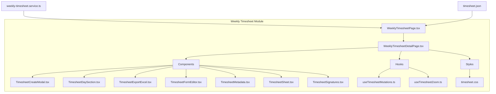
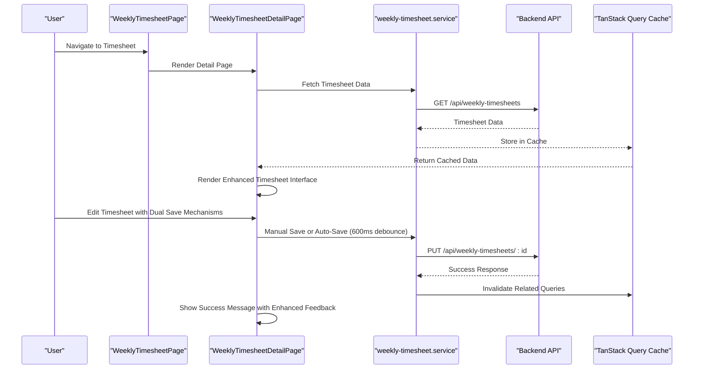
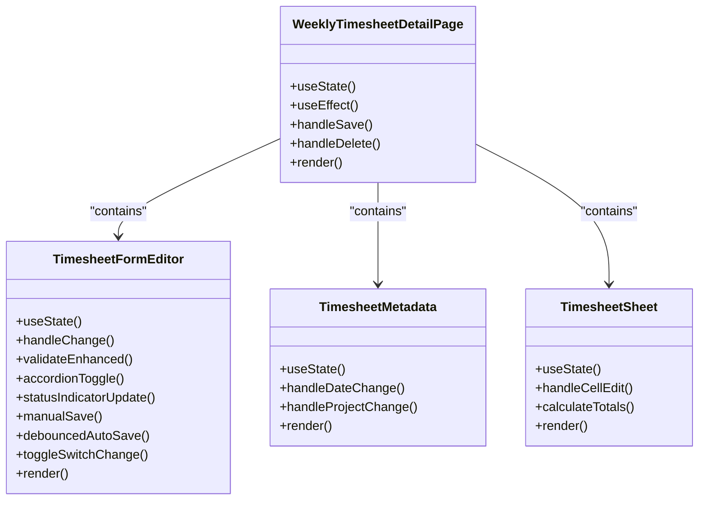
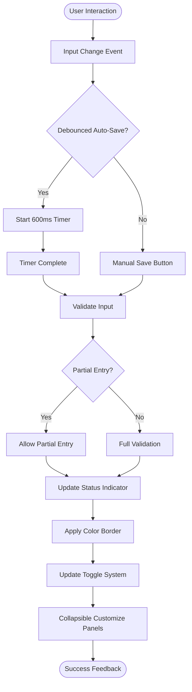
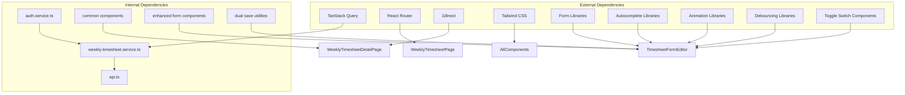

# Timesheet Semanal - Interface Frontend

<cite>
**Referenced Files in This Document**
- [WeeklyTimesheetPage.tsx](file://src/pages/weekly-timesheet/WeeklyTimesheetPage.tsx)
- [WeeklyTimesheetDetailPage.tsx](file://src/pages/weekly-timesheet/WeeklyTimesheetDetailPage.tsx)
- [weekly-timesheet.service.ts](file://src/services/weekly-timesheet.service.ts)
- [timesheet.json](file://src/i18n/locales/pt/timesheet.json)
- [useTimesheetMutations.ts](file://src/pages/weekly-timesheet/hooks/useTimesheetMutations.ts)
- [useTimesheetZoom.ts](file://src/pages/weekly-timesheet/hooks/useTimesheetZoom.ts)
- [TimesheetCreateModal.tsx](file://src/pages/weekly-timesheet/components/TimesheetCreateModal.tsx)
- [TimesheetDaySection.tsx](file://src/pages/weekly-timesheet/components/TimesheetDaySection.tsx)
- [TimesheetExportExcel.tsx](file://src/pages/weekly-timesheet/components/TimesheetExportExcel.tsx)
- [TimesheetFormEditor.tsx](file://src/pages/weekly-timesheet/components/TimesheetFormEditor.tsx)
- [TimesheetMetadata.tsx](file://src/pages/weekly-timesheet/components/TimesheetMetadata.tsx)
- [TimesheetSheet.tsx](file://src/pages/weekly-timesheet/components/TimesheetSheet.tsx)
- [TimesheetSignatures.tsx](file://src/pages/weekly-timesheet/components/TimesheetSignatures.tsx)
- [timesheet.css](file://src/pages/weekly-timesheet/styles/timesheet.css)
</cite>

## Update Summary
**Changes Made**
- Updated TimesheetFormEditor component analysis to reflect major enhancements including manual save button, debounced auto-save (600ms), improved UI with toggle switches and collapsible customize panels, bug fixes for shared values synchronization, and internationalization support
- Enhanced component architecture documentation with dual save mechanisms (manual + automatic) and better user feedback systems
- Updated troubleshooting guide with new validation and user experience considerations for the enhanced save functionality
- Added detailed analysis of the improved form interaction patterns with debounced auto-save and toggle switch implementations

## Table of Contents
1. [Introduction](#introduction)
2. [Project Structure](#project-structure)
3. [Core Components](#core-components)
4. [Architecture Overview](#architecture-overview)
5. [Detailed Component Analysis](#detailed-component-analysis)
6. [Dependency Analysis](#dependency-analysis)
7. [Performance Considerations](#performance-considerations)
8. [Troubleshooting Guide](#troubleshooting-guide)
9. [Conclusion](#conclusion)

## Introduction

The Timesheet Semanal (Weekly Timesheet) interface is a comprehensive React-based frontend component that allows wind energy technicians to manage their weekly work hours and activities. Built with Vite and following modern React patterns, it provides an intuitive user experience for tracking time spent on various projects and tasks.

The implementation follows the project's design principles inspired by Apple's design system - minimalist, clean, with generous spacing and neutral colors with blue accents. The interface uses Tailwind CSS v4 with utility classes and implements internationalization (i18n) throughout all user-facing text.

**Updated** Major enhancements have been applied to the TimesheetFormEditor component, introducing dual save mechanisms with manual save button and debounced auto-save (600ms), improved UI with toggle switches and collapsible customize panels, bug fixes for shared values synchronization, and expanded internationalization support. The form now provides better user feedback and data persistence through these enhanced save mechanisms.

## Project Structure

The weekly timesheet feature is organized within the `src/pages/weekly-timesheet/` directory, following a modular architecture pattern:

**Diagram sources**
- [WeeklyTimesheetPage.tsx](file://src/pages/weekly-timesheet/WeeklyTimesheetPage.tsx)
- [WeeklyTimesheetDetailPage.tsx](file://src/pages/weekly-timesheet/WeeklyTimesheetDetailPage.tsx)
- [weekly-timesheet.service.ts](file://src/services/weekly-timesheet.service.ts)
- [timesheet.json](file://src/i18n/locales/pt/timesheet.json)

**Section sources**
- [WeeklyTimesheetPage.tsx](file://src/pages/weekly-timesheet/WeeklyTimesheetPage.tsx)
- [WeeklyTimesheetDetailPage.tsx](file://src/pages/weekly-timesheet/WeeklyTimesheetDetailPage.tsx)

## Core Components

The weekly timesheet interface consists of several key components that work together to provide a seamless user experience:

### Main Pages
- **WeeklyTimesheetPage**: Entry point for the timesheet module, handles routing and initial data loading
- **WeeklyTimesheetDetailPage**: Main interface for viewing and editing individual timesheets

### UI Components
- **TimesheetCreateModal**: Modal interface for creating new timesheets
- **TimesheetDaySection**: Individual day sections within the timesheet editor with accordion functionality
- **TimesheetFormEditor**: Comprehensive form editor with enhanced accordion-based day entry system, visual status indicators, improved validation logic, and dual save mechanisms
- **TimesheetMetadata**: Displays and manages metadata like project selection and dates
- **TimesheetSheet**: Main spreadsheet-like interface for timesheet data
- **TimesheetSignatures**: Handles signature collection and validation
- **TimesheetExportExcel**: Excel export functionality for timesheet data

### Hooks and Utilities
- **useTimesheetMutations**: Custom hook for handling timesheet CRUD operations
- **useTimesheetZoom**: Hook for managing zoom levels in the timesheet view

**Updated** The TimesheetFormEditor component has been significantly enhanced with dual save mechanisms including a manual save button and debounced auto-save (600ms). The component now features improved UI with toggle switches and collapsible customize panels, bug fixes for shared values synchronization, and expanded internationalization support. These enhancements provide better user feedback and data persistence.

**Section sources**
- [TimesheetCreateModal.tsx](file://src/pages/weekly-timesheet/components/TimesheetCreateModal.tsx)
- [TimesheetDaySection.tsx](file://src/pages/weekly-timesheet/components/TimesheetDaySection.tsx)
- [TimesheetFormEditor.tsx](file://src/pages/weekly-timesheet/components/TimesheetFormEditor.tsx)
- [TimesheetMetadata.tsx](file://src/pages/weekly-timesheet/components/TimesheetMetadata.tsx)
- [TimesheetSheet.tsx](file://src/pages/weekly-timesheet/components/TimesheetSheet.tsx)
- [TimesheetSignatures.tsx](file://src/pages/weekly-timesheet/components/TimesheetSignatures.tsx)
- [TimesheetExportExcel.tsx](file://src/pages/weekly-timesheet/components/TimesheetExportExcel.tsx)
- [useTimesheetMutations.ts](file://src/pages/weekly-timesheet/hooks/useTimesheetMutations.ts)
- [useTimesheetZoom.ts](file://src/pages/weekly-timesheet/hooks/useTimesheetZoom.ts)

## Architecture Overview

The weekly timesheet interface follows a modern React architecture pattern with clear separation of concerns:

**Updated** The enhanced architecture now includes dual save mechanisms with manual save button and debounced auto-save (600ms), improved user interaction patterns with toggle switches and collapsible panels, and more sophisticated validation workflows with better user feedback.

**Diagram sources**
- [WeeklyTimesheetPage.tsx](file://src/pages/weekly-timesheet/WeeklyTimesheetPage.tsx)
- [WeeklyTimesheetDetailPage.tsx](file://src/pages/weekly-timesheet/WeeklyTimesheetDetailPage.tsx)
- [weekly-timesheet.service.ts](file://src/services/weekly-timesheet.service.ts)

## Detailed Component Analysis

### WeeklyTimesheetDetailPage

The main detail page serves as the central hub for timesheet operations, managing state and coordinating between various child components.

#### Key Features:
- **Data Management**: Uses TanStack Query for efficient data fetching and caching
- **State Coordination**: Manages complex state across multiple components
- **Validation**: Implements comprehensive form validation with enhanced error handling
- **Error Handling**: Provides user-friendly error messages and recovery options

#### Component Hierarchy:

**Updated** The component hierarchy now includes enhanced form editor capabilities with dual save mechanisms (manual + debounced auto-save), toggle switch functionality, collapsible customize panels, and improved validation methods.

**Diagram sources**
- [WeeklyTimesheetDetailPage.tsx](file://src/pages/weekly-timesheet/WeeklyTimesheetDetailPage.tsx)
- [TimesheetFormEditor.tsx](file://src/pages/weekly-timesheet/components/TimesheetFormEditor.tsx)
- [TimesheetMetadata.tsx](file://src/pages/weekly-timesheet/components/TimesheetMetadata.tsx)
- [TimesheetSheet.tsx](file://src/pages/weekly-timesheet/components/TimesheetSheet.tsx)

### Enhanced TimesheetFormEditor Component

The TimesheetFormEditor component has undergone significant enhancements to improve user experience and functionality:

#### Key Enhancements:
- **Dual Save Mechanisms**: Manual save button and debounced auto-save (600ms) for optimal user control and data persistence
- **Improved UI Components**: Toggle switches and collapsible customize panels for better user interaction
- **Bug Fixes**: Resolved shared values synchronization issues for consistent data handling
- **Enhanced Internationalization**: Expanded i18n support for all new UI elements
- **Better User Feedback**: Improved success and error messaging for save operations
- **Optimized Performance**: Debounced auto-save prevents excessive API calls while maintaining responsiveness

#### Implementation Pattern:

**Updated** The component now provides dual save mechanisms with manual control and automatic background saving, improved UI with toggle switches and collapsible panels, and enhanced internationalization support for better user experience.

**Diagram sources**
- [TimesheetFormEditor.tsx](file://src/pages/weekly-timesheet/components/TimesheetFormEditor.tsx)

### useTimesheetMutations Hook

This custom hook encapsulates all mutation logic for timesheet operations, providing a clean API for components to interact with the backend.

#### Functionality:
- **CRUD Operations**: Create, Read, Update, Delete timesheets
- **Query Invalidation**: Automatically invalidates related queries after mutations
- **Error Handling**: Centralized error handling and user feedback
- **Loading States**: Manages loading states for better UX
- **Dual Save Support**: Optimized for both manual and debounced auto-save operations

#### Implementation Pattern:

**Section sources**
- [WeeklyTimesheetDetailPage.tsx](file://src/pages/weekly-timesheet/WeeklyTimesheetDetailPage.tsx)
- [useTimesheetMutations.ts](file://src/pages/weekly-timesheet/hooks/useTimesheetMutations.ts)
- [timesheet.json](file://src/i18n/locales/pt/timesheet.json)

## Dependency Analysis

The weekly timesheet module has well-defined dependencies that follow React best practices:

**Updated** New dependencies have been added to support the enhanced form editor functionality, including debouncing libraries for auto-save functionality, toggle switch components for improved UI, and dual save utilities for managing both manual and automatic save operations.

**Diagram sources**
- [weekly-timesheet.service.ts](file://src/services/weekly-timesheet.service.ts)
- [WeeklyTimesheetPage.tsx](file://src/pages/weekly-timesheet/WeeklyTimesheetPage.tsx)
- [WeeklyTimesheetDetailPage.tsx](file://src/pages/weekly-timesheet/WeeklyTimesheetDetailPage.tsx)
- [TimesheetFormEditor.tsx](file://src/pages/weekly-timesheet/components/TimesheetFormEditor.tsx)

**Section sources**
- [weekly-timesheet.service.ts](file://src/services/weekly-timesheet.service.ts)
- [WeeklyTimesheetPage.tsx](file://src/pages/weekly-timesheet/WeeklyTimesheetPage.tsx)

## Performance Considerations

The weekly timesheet interface implements several performance optimizations:

### Data Caching
- **TanStack Query**: Efficient caching and background refetching
- **Selective Refetching**: Only relevant queries are invalidated after mutations
- **Optimistic Updates**: Immediate UI updates while waiting for server confirmation

### Component Optimization
- **Memoization**: Strategic use of React.memo and useMemo for expensive computations
- **Lazy Loading**: Components loaded only when needed
- **Virtual Scrolling**: For large datasets in timesheet sheets
- **Accordion Optimization**: Efficient accordion state management to minimize re-renders

### State Management
- **Local State**: Minimal state at component level
- **Global State**: TanStack Query for shared data
- **Form State**: Optimized form libraries for complex forms with enhanced validation

### Enhanced Performance Features
- **Debounced Auto-Save**: 600ms delay prevents excessive API calls while maintaining responsiveness
- **Real-time Status Updates**: Efficient visual feedback without full component re-rendering
- **Intelligent Validation**: Client-side validation reduces unnecessary API calls
- **Autocomplete Debouncing**: Optimized search functionality for technician selection
- **Toggle Switch Optimization**: Lightweight state management for UI toggles
- **Collapsible Panel Efficiency**: Minimized re-renders when panels are collapsed

## Troubleshooting Guide

### Common Issues and Solutions

#### Data Loading Problems
- **Symptom**: Timesheet data not loading or showing stale data
- **Solution**: Check network requests and cache invalidation
- **Debug**: Use React DevTools to inspect query state

#### Form Validation Errors
- **Symptom**: Form submission failing without clear error messages
- **Solution**: Verify validation rules and error handling
- **Debug**: Check browser console for validation errors

#### i18n Issues
- **Symptom**: Missing translations or incorrect language display
- **Solution**: Ensure translation keys exist and locale is properly configured
- **Debug**: Check i18n configuration and loaded namespaces

#### Performance Issues
- **Symptom**: Slow rendering or unresponsive interface
- **Solution**: Identify bottlenecks using React Profiler
- **Debug**: Monitor memory usage and re-renders

#### Enhanced Form Issues
- **Symptom**: Accordion sections not toggling correctly
- **Solution**: Check accordion state management and event handlers
- **Debug**: Inspect component state and event propagation

#### Status Indicator Problems
- **Symptom**: Visual status indicators not updating properly
- **Solution**: Verify validation logic and state synchronization
- **Debug**: Check color class application and conditional rendering

#### Technician Autocomplete Issues
- **Symptom**: Role auto-population not working correctly
- **Solution**: Verify autocomplete data structure and role mapping
- **Debug**: Check API responses and data transformation

#### Dual Save Mechanism Issues
- **Symptom**: Auto-save not triggering or manual save not working
- **Solution**: Check debouncing timer implementation and manual save event handlers
- **Debug**: Verify 600ms debounce timing and save function execution

#### Toggle Switch Problems
- **Symptom**: Toggle switches not responding or state not persisting
- **Solution**: Verify toggle state management and event handlers
- **Debug**: Check component state updates and prop passing

#### Collapsible Panel Issues
- **Symptom**: Panels not collapsing/expanding correctly
- **Solution**: Check panel state management and CSS transitions
- **Debug**: Inspect animation classes and state synchronization

**Updated** New troubleshooting categories have been added to address the enhanced form editor features, including dual save mechanisms, debounced auto-save functionality, toggle switches, collapsible panels, and improved user feedback systems.

**Section sources**
- [weekly-timesheet.service.ts](file://src/services/weekly-timesheet.service.ts)
- [useTimesheetMutations.ts](file://src/pages/weekly-timesheet/hooks/useTimesheetMutations.ts)
- [TimesheetFormEditor.tsx](file://src/pages/weekly-timesheet/components/TimesheetFormEditor.tsx)

## Conclusion

The Timesheet Semanal interface represents a well-architected React application that effectively manages weekly timesheet operations for wind energy technicians. The implementation follows modern React patterns, includes comprehensive internationalization, and provides a user-friendly interface for complex data entry tasks.

Key strengths include:
- **Modular Architecture**: Clear separation of concerns with reusable components
- **Performance Optimization**: Efficient data management with TanStack Query
- **Internationalization**: Complete support for Portuguese language
- **User Experience**: Intuitive interface with proper error handling and feedback
- **Maintainability**: Well-structured codebase following React best practices

**Updated** Recent enhancements have significantly improved the user experience through the introduction of dual save mechanisms with manual save button and debounced auto-save (600ms), improved UI with toggle switches and collapsible customize panels, bug fixes for shared values synchronization, and expanded internationalization support. These improvements make the system more accessible and efficient for technicians while providing powerful features for time tracking and project management with better data persistence and user feedback.

The system successfully balances complexity with usability, making it accessible to technicians while providing powerful features for time tracking and project management with enhanced save mechanisms and improved user interaction patterns.