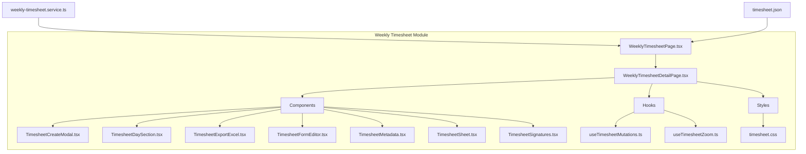
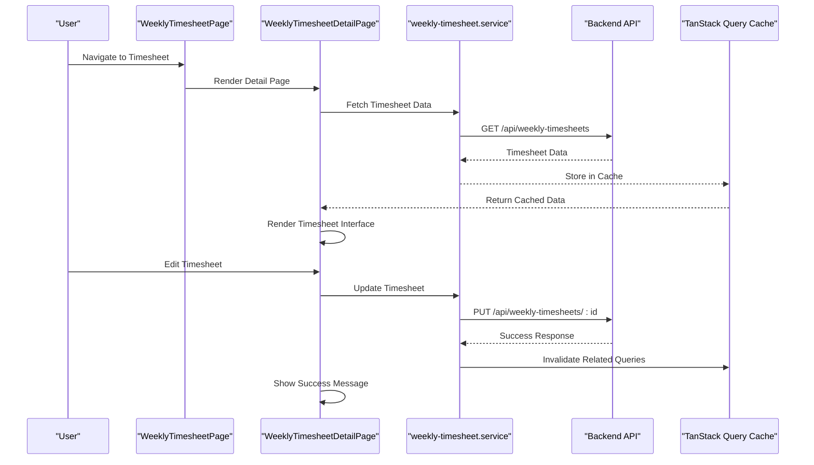
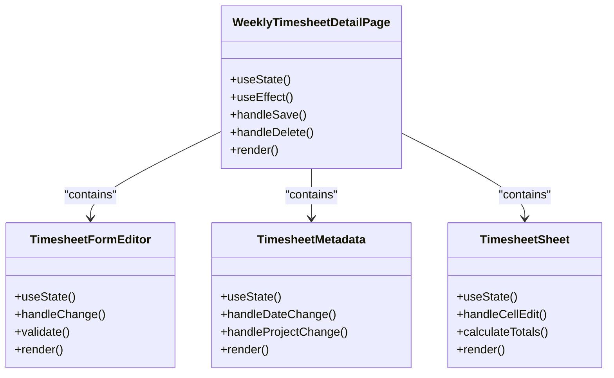
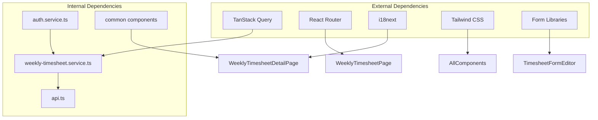

# Timesheet Semanal - Interface Frontend

<cite>
**Referenced Files in This Document**
- [WeeklyTimesheetPage.tsx](file://src/pages/weekly-timesheet/WeeklyTimesheetPage.tsx)
- [WeeklyTimesheetDetailPage.tsx](file://src/pages/weekly-timesheet/WeeklyTimesheetDetailPage.tsx)
- [weekly-timesheet.service.ts](file://src/services/weekly-timesheet.service.ts)
- [timesheet.json](file://src/i18n/locales/pt/timesheet.json)
- [useTimesheetMutations.ts](file://src/pages/weekly-timesheet/hooks/useTimesheetMutations.ts)
- [useTimesheetZoom.ts](file://src/pages/weekly-timesheet/hooks/useTimesheetZoom.ts)
- [TimesheetCreateModal.tsx](file://src/pages/weekly-timesheet/components/TimesheetCreateModal.tsx)
- [TimesheetDaySection.tsx](file://src/pages/weekly-timesheet/components/TimesheetDaySection.tsx)
- [TimesheetExportExcel.tsx](file://src/pages/weekly-timesheet/components/TimesheetExportExcel.tsx)
- [TimesheetFormEditor.tsx](file://src/pages/weekly-timesheet/components/TimesheetFormEditor.tsx)
- [TimesheetMetadata.tsx](file://src/pages/weekly-timesheet/components/TimesheetMetadata.tsx)
- [TimesheetSheet.tsx](file://src/pages/weekly-timesheet/components/TimesheetSheet.tsx)
- [TimesheetSignatures.tsx](file://src/pages/weekly-timesheet/components/TimesheetSignatures.tsx)
- [timesheet.css](file://src/pages/weekly-timesheet/styles/timesheet.css)
</cite>

## Table of Contents
1. [Introduction](#introduction)
2. [Project Structure](#project-structure)
3. [Core Components](#core-components)
4. [Architecture Overview](#architecture-overview)
5. [Detailed Component Analysis](#detailed-component-analysis)
6. [Dependency Analysis](#dependency-analysis)
7. [Performance Considerations](#performance-considerations)
8. [Troubleshooting Guide](#troubleshooting-guide)
9. [Conclusion](#conclusion)

## Introduction

The Timesheet Semanal (Weekly Timesheet) interface is a comprehensive React-based frontend component that allows wind energy technicians to manage their weekly work hours and activities. Built with Vite and following modern React patterns, it provides an intuitive user experience for tracking time spent on various projects and tasks.

The implementation follows the project's design principles inspired by Apple's design system - minimalist, clean, with generous spacing and neutral colors with blue accents. The interface uses Tailwind CSS v4 with utility classes and implements internationalization (i18n) throughout all user-facing text.

## Project Structure

The weekly timesheet feature is organized within the `src/pages/weekly-timesheet/` directory, following a modular architecture pattern:

**Diagram sources**
- [WeeklyTimesheetPage.tsx](file://src/pages/weekly-timesheet/WeeklyTimesheetPage.tsx)
- [WeeklyTimesheetDetailPage.tsx](file://src/pages/weekly-timesheet/WeeklyTimesheetDetailPage.tsx)
- [weekly-timesheet.service.ts](file://src/services/weekly-timesheet.service.ts)
- [timesheet.json](file://src/i18n/locales/pt/timesheet.json)

**Section sources**
- [WeeklyTimesheetPage.tsx](file://src/pages/weekly-timesheet/WeeklyTimesheetPage.tsx)
- [WeeklyTimesheetDetailPage.tsx](file://src/pages/weekly-timesheet/WeeklyTimesheetDetailPage.tsx)

## Core Components

The weekly timesheet interface consists of several key components that work together to provide a seamless user experience:

### Main Pages
- **WeeklyTimesheetPage**: Entry point for the timesheet module, handles routing and initial data loading
- **WeeklyTimesheetDetailPage**: Main interface for viewing and editing individual timesheets

### UI Components
- **TimesheetCreateModal**: Modal interface for creating new timesheets
- **TimesheetDaySection**: Individual day sections within the timesheet editor
- **TimesheetFormEditor**: Comprehensive form editor for timesheet data entry
- **TimesheetMetadata**: Displays and manages metadata like project selection and dates
- **TimesheetSheet**: Main spreadsheet-like interface for timesheet data
- **TimesheetSignatures**: Handles signature collection and validation
- **TimesheetExportExcel**: Excel export functionality for timesheet data

### Hooks and Utilities
- **useTimesheetMutations**: Custom hook for handling timesheet CRUD operations
- **useTimesheetZoom**: Hook for managing zoom levels in the timesheet view

**Section sources**
- [TimesheetCreateModal.tsx](file://src/pages/weekly-timesheet/components/TimesheetCreateModal.tsx)
- [TimesheetDaySection.tsx](file://src/pages/weekly-timesheet/components/TimesheetDaySection.tsx)
- [TimesheetFormEditor.tsx](file://src/pages/weekly-timesheet/components/TimesheetFormEditor.tsx)
- [TimesheetMetadata.tsx](file://src/pages/weekly-timesheet/components/TimesheetMetadata.tsx)
- [TimesheetSheet.tsx](file://src/pages/weekly-timesheet/components/TimesheetSheet.tsx)
- [TimesheetSignatures.tsx](file://src/pages/weekly-timesheet/components/TimesheetSignatures.tsx)
- [TimesheetExportExcel.tsx](file://src/pages/weekly-timesheet/components/TimesheetExportExcel.tsx)
- [useTimesheetMutations.ts](file://src/pages/weekly-timesheet/hooks/useTimesheetMutations.ts)
- [useTimesheetZoom.ts](file://src/pages/weekly-timesheet/hooks/useTimesheetZoom.ts)

## Architecture Overview

The weekly timesheet interface follows a modern React architecture pattern with clear separation of concerns:

**Diagram sources**
- [WeeklyTimesheetPage.tsx](file://src/pages/weekly-timesheet/WeeklyTimesheetPage.tsx)
- [WeeklyTimesheetDetailPage.tsx](file://src/pages/weekly-timesheet/WeeklyTimesheetDetailPage.tsx)
- [weekly-timesheet.service.ts](file://src/services/weekly-timesheet.service.ts)

## Detailed Component Analysis

### WeeklyTimesheetDetailPage

The main detail page serves as the central hub for timesheet operations, managing state and coordinating between various child components.

#### Key Features:
- **Data Management**: Uses TanStack Query for efficient data fetching and caching
- **State Coordination**: Manages complex state across multiple components
- **Validation**: Implements comprehensive form validation
- **Error Handling**: Provides user-friendly error messages and recovery options

#### Component Hierarchy:

**Diagram sources**
- [WeeklyTimesheetDetailPage.tsx](file://src/pages/weekly-timesheet/WeeklyTimesheetDetailPage.tsx)
- [TimesheetFormEditor.tsx](file://src/pages/weekly-timesheet/components/TimesheetFormEditor.tsx)
- [TimesheetMetadata.tsx](file://src/pages/weekly-timesheet/components/TimesheetMetadata.tsx)
- [TimesheetSheet.tsx](file://src/pages/weekly-timesheet/components/TimesheetSheet.tsx)

### useTimesheetMutations Hook

This custom hook encapsulates all mutation logic for timesheet operations, providing a clean API for components to interact with the backend.

#### Functionality:
- **CRUD Operations**: Create, Read, Update, Delete timesheets
- **Query Invalidation**: Automatically invalidates related queries after mutations
- **Error Handling**: Centralized error handling and user feedback
- **Loading States**: Manages loading states for better UX

#### Implementation Pattern:

**Diagram sources**
- [useTimesheetMutations.ts](file://src/pages/weekly-timesheet/hooks/useTimesheetMutations.ts)

### Internationalization (i18n)

The timesheet interface fully supports internationalization with Portuguese as the primary language. All user-facing text is managed through JSON translation files.

#### Translation Structure:
- **Namespace Organization**: Separate namespace for timesheet-related strings
- **Contextual Keys**: Descriptive keys for better maintainability
- **Dynamic Content**: Support for dynamic content insertion

**Section sources**
- [WeeklyTimesheetDetailPage.tsx](file://src/pages/weekly-timesheet/WeeklyTimesheetDetailPage.tsx)
- [useTimesheetMutations.ts](file://src/pages/weekly-timesheet/hooks/useTimesheetMutations.ts)
- [timesheet.json](file://src/i18n/locales/pt/timesheet.json)

## Dependency Analysis

The weekly timesheet module has well-defined dependencies that follow React best practices:

**Diagram sources**
- [weekly-timesheet.service.ts](file://src/services/weekly-timesheet.service.ts)
- [WeeklyTimesheetPage.tsx](file://src/pages/weekly-timesheet/WeeklyTimesheetPage.tsx)
- [WeeklyTimesheetDetailPage.tsx](file://src/pages/weekly-timesheet/WeeklyTimesheetDetailPage.tsx)

**Section sources**
- [weekly-timesheet.service.ts](file://src/services/weekly-timesheet.service.ts)
- [WeeklyTimesheetPage.tsx](file://src/pages/weekly-timesheet/WeeklyTimesheetPage.tsx)

## Performance Considerations

The weekly timesheet interface implements several performance optimizations:

### Data Caching
- **TanStack Query**: Efficient caching and background refetching
- **Selective Refetching**: Only relevant queries are invalidated after mutations
- **Optimistic Updates**: Immediate UI updates while waiting for server confirmation

### Component Optimization
- **Memoization**: Strategic use of React.memo and useMemo for expensive computations
- **Lazy Loading**: Components loaded only when needed
- **Virtual Scrolling**: For large datasets in timesheet sheets

### State Management
- **Local State**: Minimal state at component level
- **Global State**: TanStack Query for shared data
- **Form State**: Optimized form libraries for complex forms

## Troubleshooting Guide

### Common Issues and Solutions

#### Data Loading Problems
- **Symptom**: Timesheet data not loading or showing stale data
- **Solution**: Check network requests and cache invalidation
- **Debug**: Use React DevTools to inspect query state

#### Form Validation Errors
- **Symptom**: Form submission failing without clear error messages
- **Solution**: Verify validation rules and error handling
- **Debug**: Check browser console for validation errors

#### i18n Issues
- **Symptom**: Missing translations or incorrect language display
- **Solution**: Ensure translation keys exist and locale is properly configured
- **Debug**: Check i18n configuration and loaded namespaces

#### Performance Issues
- **Symptom**: Slow rendering or unresponsive interface
- **Solution**: Identify bottlenecks using React Profiler
- **Debug**: Monitor memory usage and re-renders

**Section sources**
- [weekly-timesheet.service.ts](file://src/services/weekly-timesheet.service.ts)
- [useTimesheetMutations.ts](file://src/pages/weekly-timesheet/hooks/useTimesheetMutations.ts)

## Conclusion

The Timesheet Semanal interface represents a well-architected React application that effectively manages weekly timesheet operations for wind energy technicians. The implementation follows modern React patterns, includes comprehensive internationalization, and provides a user-friendly interface for complex data entry tasks.

Key strengths include:
- **Modular Architecture**: Clear separation of concerns with reusable components
- **Performance Optimization**: Efficient data management with TanStack Query
- **Internationalization**: Complete support for Portuguese language
- **User Experience**: Intuitive interface with proper error handling and feedback
- **Maintainability**: Well-structured codebase following React best practices

The system successfully balances complexity with usability, making it accessible to technicians while providing powerful features for time tracking and project management.