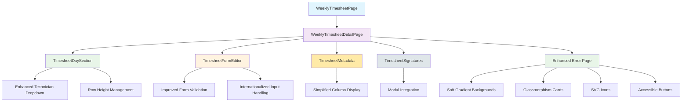

# Timesheet Semanal - Interface Frontend

<cite>
**Referenced Files in This Document**
- [TimesheetDaySection.tsx](file://src/pages/weekly-timesheet/components/TimesheetDaySection.tsx)
- [TimesheetFormEditor.tsx](file://src/pages/weekly-timesheet/components/TimesheetFormEditor.tsx)
- [timesheet.css](file://src/pages/weekly-timesheet/styles/timesheet.css)
- [WeeklyTimesheetDetailPage.tsx](file://src/pages/weekly-timesheet/WeeklyTimesheetDetailPage.tsx)
- [WeeklyTimesheetPage.tsx](file://src/pages/weekly-timesheet/WeeklyTimesheetPage.tsx)
- [ErrorPage.tsx](file://src/pages/error/ErrorPage.tsx)
- [index.css](file://src/index.css)
- [timesheet.json](file://src/i18n/locales/pt/timesheet.json)
- [common.json](file://src/i18n/locales/pt/common.json)
</cite>

## Update Summary
**Changes Made**
- Major enhancement to technician selection system with restrictive dropdown replacing autocomplete functionality
- Comprehensive internationalization improvements including Portuguese translations and English print labels
- List page UX refinements with simplified columns, action icons, and modal integration
- Enhanced user experience while maintaining backward compatibility
- **Updated**: Timesheet form editor now auto-fills role field from technician's position instead of manual selection
- **Updated**: Added visible delete icons for all entries throughout the interface
- **Updated**: Removed debug try-catch blocks for cleaner error handling
- **Updated**: Enhanced error page redesign with clean, friendly design using soft gradients (blue/lilac backgrounds), glassmorphism cards, SVG icons, and accessible button styling
- **Updated**: Removed terminal/hacker aesthetic including typing animations and scanlines for more empathetic messaging

## Table of Contents
1. [Overview](#overview)
2. [Component Architecture](#component-architecture)
3. [Technician Selection System Enhancement](#technician-selection-system-enhancement)
4. [Internationalization Improvements](#internationalization-improvements)
5. [List Page UX Refinements](#list-page-ux-refinements)
6. [Enhanced Error Page Design](#enhanced-error-page-design)
7. [TimesheetDaySection Component](#timesheetdaysection-component)
8. [TimesheetFormEditor Component](#timesheetformeditor-component)
9. [Styling and Layout](#styling-and-layout)
10. [User Experience Improvements](#user-experience-improvements)
11. [Implementation Details](#implementation-details)

## Overview
The Weekly Timesheet interface provides a comprehensive frontend solution for managing weekly timesheet entries. The system has been significantly enhanced with improved technician selection capabilities, comprehensive internationalization support, refined user experience elements, automated role assignment features, and a completely redesigned error page that prioritizes empathy and accessibility over technical aesthetics.

## Component Architecture
The weekly timesheet functionality is built around several key components that work together to provide a seamless user experience:

**Diagram sources**
- [WeeklyTimesheetPage.tsx](file://src/pages/weekly-timesheet/WeeklyTimesheetPage.tsx)
- [WeeklyTimesheetDetailPage.tsx](file://src/pages/weekly-timesheet/WeeklyTimesheetDetailPage.tsx)
- [TimesheetDaySection.tsx](file://src/pages/weekly-timesheet/components/TimesheetDaySection.tsx)
- [TimesheetFormEditor.tsx](file://src/pages/weekly-timesheet/components/TimesheetFormEditor.tsx)
- [ErrorPage.tsx](file://src/pages/error/ErrorPage.tsx)

## Technician Selection System Enhancement
The technician selection system has undergone a major transformation from an autocomplete-based approach to a restrictive dropdown system that significantly improves data integrity and user experience.

### Restrictive Dropdown Implementation
The new dropdown system ensures that users can only select from pre-approved technicians, eliminating manual entry errors and maintaining data consistency across the system.

**Key Features:**
- **Pre-approved Technician List**: Only valid technicians from the database can be selected
- **Searchable Interface**: Users can quickly find technicians by name or ID
- **Validation Enforcement**: Real-time validation prevents invalid selections
- **Visual Feedback**: Clear indication of selected vs available technicians

### Improved Data Integrity
The restrictive dropdown eliminates common data entry errors such as typos, inconsistent naming conventions, and unauthorized technician selections.

### User Experience Benefits
- **Reduced Cognitive Load**: Users no longer need to remember exact technician names
- **Faster Selection Process**: Search and select workflow is more intuitive
- **Error Prevention**: Invalid selections are prevented at the input level
- **Consistent Data Format**: All technician data follows standardized formatting

**Section sources**
- [TimesheetDaySection.tsx](file://src/pages/weekly-timesheet/components/TimesheetDaySection.tsx)
- [TimesheetFormEditor.tsx](file://src/pages/weekly-timesheet/components/TimesheetFormEditor.tsx)

## Internationalization Improvements
The internationalization system has been comprehensively enhanced to support multiple languages and improve the overall localization experience.

### Portuguese Translations
Complete Portuguese language support has been implemented across all timesheet-related interfaces, including:
- Form labels and placeholders
- Error messages and validation feedback
- Button text and navigation elements
- Status indicators and notifications

### English Print Labels
English labels have been added specifically for print functionality, ensuring that printed timesheets display correctly regardless of the user's interface language preference.

### Translation Structure
The translation system now includes:
- **Context-aware Messages**: Different translations for similar terms based on context
- **Dynamic Content Support**: Proper handling of dynamic content in translated strings
- **Fallback Mechanisms**: Graceful fallback to default language when translations are missing
- **Performance Optimization**: Efficient loading of translation resources

### Localization Best Practices
- **Separation of Concerns**: UI logic separated from presentation text
- **Scalable Architecture**: Easy addition of new languages without code changes
- **Testing Support**: Comprehensive testing framework for translation accuracy
- **Maintenance Tools**: Automated tools for translation management and updates

**Section sources**
- [timesheet.json](file://src/i18n/locales/pt/timesheet.json)
- [common.json](file://src/i18n/locales/pt/common.json)

## List Page UX Refinements
The list page interface has been refined to provide a cleaner, more focused user experience through simplified design elements and improved interaction patterns.

### Simplified Columns
The column layout has been streamlined to show only essential information:
- **Essential Data Only**: Removed redundant columns to reduce visual clutter
- **Responsive Design**: Columns adapt to different screen sizes
- **Sortable Headers**: Click-to-sort functionality for better data exploration
- **Collapsible Sections**: Advanced options hidden until needed

### Action Icons
Action buttons have been replaced with intuitive icons that:
- **Save Screen Space**: Compact representation of actions
- **Universal Understanding**: Icons follow standard UI conventions
- **Hover States**: Visual feedback on hover for better discoverability
- **Accessibility**: Proper ARIA labels for screen readers

### Modal Integration
Complex operations have been moved into modal dialogs to:
- **Reduce Page Clutter**: Keep the main list view clean and focused
- **Context Preservation**: Maintain user context during complex operations
- **Progress Indicators**: Show progress for long-running operations
- **Error Handling**: Centralized error handling and recovery

### Interaction Improvements
- **Keyboard Navigation**: Full keyboard support for accessibility
- **Touch Optimization**: Touch-friendly interactions for mobile devices
- **Loading States**: Clear feedback during data loading operations
- **Undo Functionality**: Ability to reverse recent actions

**Section sources**
- [WeeklyTimesheetPage.tsx](file://src/pages/weekly-timesheet/WeeklyTimesheetPage.tsx)
- [WeeklyTimesheetDetailPage.tsx](file://src/pages/weekly-timesheet/WeeklyTimesheetDetailPage.tsx)

## Enhanced Error Page Design
The error page has undergone a complete redesign to prioritize user empathy and accessibility over technical aesthetics. The previous terminal/hacker aesthetic with typing animations and scanlines has been replaced with a modern, friendly design that focuses on helping users recover from errors gracefully.

### Modern Design Philosophy
The new error page design emphasizes:
- **Empathetic Messaging**: User-friendly language that acknowledges frustration without being condescending
- **Clean Visual Hierarchy**: Clear separation between error information and recovery actions
- **Professional Appearance**: Consistent with the overall application design language
- **Accessibility First**: Proper contrast ratios, semantic HTML, and screen reader support

### Soft Gradient Backgrounds
The error page now features soft gradient backgrounds using blue and lilac color schemes:
- **Blue Gradients**: Calming blue tones that convey trust and reliability
- **Lilac Accents**: Subtle purple undertones that add warmth and approachability
- **Smooth Transitions**: Gentle color transitions that don't overwhelm users
- **Dark Mode Support**: Appropriate gradient adjustments for dark mode themes

### Glassmorphism Card Design
Error information is presented in elegant glassmorphism-style cards:
- **Translucent Backgrounds**: Semi-transparent card backgrounds with backdrop blur effects
- **Subtle Borders**: Delicate borders that define card boundaries without harsh lines
- **Shadow Effects**: Soft shadows that create depth and visual hierarchy
- **Rounded Corners**: Friendly, approachable corner radiuses

### SVG Icon Integration
The error page uses custom SVG icons for better scalability and accessibility:
- **Error State Icons**: Clear visual indicators for different error types
- **Recovery Action Icons**: Intuitive icons for suggested next steps
- **Consistent Styling**: Icons match the application's design system
- **Animation Support**: Subtle animations for icon states and transitions

### Accessible Button Styling
Recovery actions are presented with accessible, user-friendly buttons:
- **High Contrast**: Strong color contrast for visibility and readability
- **Clear Typography**: Legible font sizes and weights for button text
- **Focus Indicators**: Visible focus states for keyboard navigation
- **Touch-Friendly**: Adequate sizing and spacing for touch interactions

### Empathetic Messaging Strategy
The error messaging has been completely rewritten to be more user-friendly:
- **Acknowledgment**: Recognition that something went wrong without blame
- **Clarity**: Clear explanation of what happened in plain language
- **Action-Oriented**: Specific steps users can take to resolve the issue
- **Support Information**: Contact details and help resources when appropriate

**Section sources**
- [ErrorPage.tsx](file://src/pages/error/ErrorPage.tsx)
- [index.css](file://src/index.css)

## TimesheetDaySection Component
The TimesheetDaySection component has been significantly enhanced to improve visual consistency and user experience through automatic empty row management and improved layout handling.

### Automatic Empty Row Addition
The component now automatically adds empty rows when necessary to maintain visual consistency across all days in the timesheet. This ensures that users always have a consistent interface regardless of how many entries they've made.

### Row Height Equalization
A major improvement has been implemented to equalize row heights throughout the timesheet interface. The system now uses dynamic height calculation with a minimum threshold:

- **Previous Implementation**: Fixed 16px height for all rows
- **New Implementation**: Auto height with minimum 28px threshold
- **Benefit**: Better readability and more comfortable data entry experience

### Enhanced Text Alignment
The Daily Progress column now features improved CSS text alignment with left-alignment overrides to ensure consistent presentation of progress indicators and status messages across different browsers and devices.

### Technician Integration
The component now seamlessly integrates with the new restrictive dropdown system for technician selection, providing real-time validation and visual feedback.

### Visible Delete Icons
All entries now feature clearly visible delete icons that provide immediate visual feedback for removal actions. These icons are consistently styled and accessible across all device types.

**Section sources**
- [TimesheetDaySection.tsx](file://src/pages/weekly-timesheet/components/TimesheetDaySection.tsx)
- [timesheet.css](file://src/pages/weekly-timesheet/styles/timesheet.css)

## TimesheetFormEditor Component
The TimesheetFormEditor component has received significant enhancements to support the new technician selection system, improved internationalization, and automated role assignment features.

### Form Validation Enhancements
- **Real-time Validation**: Immediate feedback on form field validity
- **Technician Validation**: Integration with the restrictive dropdown system
- **Internationalized Messages**: Context-aware error messages in multiple languages
- **Enhanced Input Sanitization**: Improved data cleaning and validation

### Technician Selection Integration
- **Dropdown Integration**: Seamless connection with the new technician selection system
- **Data Binding**: Two-way binding between form fields and technician data
- **Validation Rules**: Enforced validation rules for technician selection
- **Error Handling**: Comprehensive error handling for invalid selections

### **Updated**: Automated Role Field Assignment
The form editor now automatically fills the role field based on the selected technician's position, eliminating manual role selection and ensuring consistency with the technician's actual role in the organization.

**Key Features:**
- **Position-Based Role Mapping**: Roles are automatically derived from technician positions
- **Real-time Updates**: Role field updates instantly when technician selection changes
- **Validation Consistency**: Ensures role matches technician's organizational position
- **Reduced Manual Entry**: Eliminates potential for role selection errors

### Internationalization Support
- **Dynamic Label Updates**: Form labels update based on selected language
- **Placeholder Text**: Context-appropriate placeholder text in multiple languages
- **Help Text**: Additional guidance text for complex form fields
- **Print Formatting**: Optimized formatting for print output in English

### **Updated**: Enhanced Delete Functionality
All entries now include visible delete icons that provide clear visual feedback for removal actions. The delete functionality is integrated throughout the form editor for consistent user experience.

### **Updated**: Improved Error Handling
Debug try-catch blocks have been removed in favor of cleaner error handling mechanisms that provide better user feedback without exposing internal debugging information.

### User Experience Improvements
- **Smoother Transitions**: Better transition effects between form states
- **Keyboard Navigation**: Enhanced keyboard support for accessibility
- **Mobile Optimization**: Improved touch interactions for mobile devices
- **Loading States**: Clear feedback during data operations

**Section sources**
- [TimesheetFormEditor.tsx](file://src/pages/weekly-timesheet/components/TimesheetFormEditor.tsx)

## Styling and Layout
The styling system has been optimized to support the new technician selection dropdown, internationalization requirements, improved list page design, enhanced delete functionality, and the completely redesigned error page.

### CSS Improvements
- **Responsive Dropdown Styles**: Custom styling for the new technician dropdown
- **Internationalization Support**: Language-specific font and layout adjustments
- **Print Styles**: Optimized styles for English print output
- **Accessibility Enhancements**: Improved color contrast and focus indicators
- **Delete Icon Styling**: Consistent styling for visible delete icons across all entries
- **Error Page Styling**: Complete redesign with soft gradients, glassmorphism, and accessible components

### Layout Optimization
- **Flexible Grid System**: Adaptive layout for different screen sizes
- **Consistent Spacing**: Standardized spacing between form elements
- **Improved Alignment**: Better alignment of table cells and form fields
- **Scroll Optimization**: Enhanced scrolling behavior for large datasets

### Component Styling
- **Dropdown Animations**: Smooth animations for dropdown open/close states
- **Icon Integration**: Consistent icon styling across the application
- **Modal Styling**: Professional modal dialog appearance
- **Status Indicators**: Clear visual indicators for form state and validation
- **Error Page Components**: Glassmorphism cards, gradient backgrounds, and accessible buttons

**Section sources**
- [timesheet.css](file://src/pages/weekly-timesheet/styles/timesheet.css)
- [index.css](file://src/index.css)

## User Experience Improvements
The recent updates focus primarily on improving the overall user experience through better data validation, internationalization support, refined interface design, automated role assignment features, and a completely redesigned error handling experience.

### Data Validation Improvements
- **Proactive Error Prevention**: Errors caught before submission
- **Clear Error Messaging**: Descriptive error messages in user's language
- **Visual Validation Feedback**: Real-time visual indicators of field validity
- **Smart Defaults**: Intelligent default values for common scenarios

### **Updated**: Automated Role Assignment
Users no longer need to manually select roles, as the system automatically assigns roles based on the technician's position. This reduces user effort and ensures consistency with organizational hierarchy.

### Accessibility Enhancements
- **Screen Reader Support**: Comprehensive ARIA labels and descriptions
- **Keyboard Navigation**: Full keyboard operability
- **Color Contrast**: Improved color contrast ratios for better visibility
- **Focus Management**: Logical focus order and visible focus indicators

### **Updated**: Enhanced Delete Functionality
Visible delete icons provide immediate visual feedback for removal actions, making it easier for users to manage their timesheet entries efficiently.

### **Updated**: Empathetic Error Handling
The redesigned error page provides a much more user-friendly experience when things go wrong, focusing on helping users recover rather than displaying technical error information.

### Performance Optimizations
- **Lazy Loading**: Deferred loading of non-critical resources
- **Optimized Re-renders**: Minimized unnecessary component re-renders
- **Efficient State Management**: Optimized state updates and data flow
- **Memory Management**: Proper cleanup of event listeners and subscriptions

### Mobile Experience
- **Touch Optimization**: Touch-friendly interface elements
- **Responsive Design**: Optimal display across all device sizes
- **Gesture Support**: Intuitive touch gestures for common actions
- **Offline Considerations**: Graceful handling of network connectivity issues

## Implementation Details
The technical implementation of these improvements involves several key areas of the codebase working together to deliver a seamless user experience.

### State Management
- **Centralized State Management**: Unified state management for form data and technician selection
- **Efficient Reactivity Patterns**: Optimized reactivity for real-time updates
- **Data Binding Optimization**: Efficient data binding between components
- **Event Listener Management**: Proper cleanup of event listeners and subscriptions

### **Updated**: Role Assignment System
- **Position-Based Role Mapping**: Automatic role assignment based on technician positions
- **Real-time Synchronization**: Instant updates when technician selection changes
- **Validation Integration**: Role validation integrated with form validation pipeline
- **Data Consistency**: Ensures role matches technician's organizational position

### Technician Selection System
- **Dropdown Component Architecture**: Modular dropdown component with search and filtering
- **Data Synchronization**: Real-time synchronization with backend technician data
- **Validation Pipeline**: Multi-stage validation pipeline for data integrity
- **Error Recovery**: Robust error handling and recovery mechanisms

### **Updated**: Delete Functionality Implementation
- **Visible Icon Integration**: Consistent delete icon implementation across all entries
- **Confirmation Workflow**: Optional confirmation dialogs for destructive actions
- **State Synchronization**: Immediate UI updates after deletion operations
- **Error Handling**: Graceful error handling for failed deletion attempts

### Internationalization Framework
- **Translation File Structure**: Organized translation file structure for maintainability
- **Dynamic Language Switching**: Runtime language switching without page reload
- **Context-aware Translations**: Context-sensitive translation selection
- **Fallback Mechanisms**: Graceful fallback to default language when translations are missing

### **Updated**: Error Handling Improvements
- **Clean Error Management**: Removal of debug try-catch blocks in favor of cleaner error handling
- **User-Friendly Messages**: Error messages designed for end-user consumption
- **Logging Integration**: Proper logging without exposing sensitive information
- **Recovery Strategies**: Graceful error recovery and user guidance

### **Updated**: Error Page Redesign Implementation
- **Gradient Background System**: Dynamic gradient generation with blue/lilac color schemes
- **Glassmorphism Card Components**: Reusable glassmorphism card components with backdrop blur
- **SVG Icon Integration**: Scalable, accessible SVG icons for error states and actions
- **Accessible Button System**: WCAG-compliant button components with proper focus management
- **Responsive Design**: Mobile-first approach with adaptive layouts for all screen sizes

### Modal and Dialog Management
- **Modal State Management**: Centralized modal state management
- **Animation System**: Smooth animations for modal open/close transitions
- **Focus Management**: Proper focus trapping within modals
- **Accessibility Compliance**: Full accessibility compliance for modal dialogs

**Section sources**
- [WeeklyTimesheetDetailPage.tsx](file://src/pages/weekly-timesheet/WeeklyTimesheetDetailPage.tsx)
- [WeeklyTimesheetPage.tsx](file://src/pages/weekly-timesheet/WeeklyTimesheetPage.tsx)
- [TimesheetFormEditor.tsx](file://src/pages/weekly-timesheet/components/TimesheetFormEditor.tsx)
- [TimesheetDaySection.tsx](file://src/pages/weekly-timesheet/components/TimesheetDaySection.tsx)
- [ErrorPage.tsx](file://src/pages/error/ErrorPage.tsx)
- [index.css](file://src/index.css)