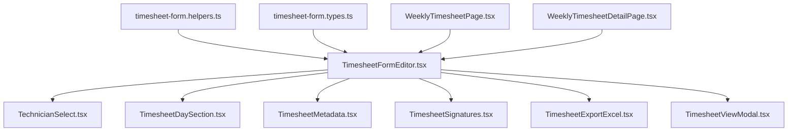

# Timesheet Semanal - Interface Frontend

<cite>
**Referenced Files in This Document**
- [TimesheetFormEditor.tsx](file://src/pages/weekly-timesheet/components/TimesheetFormEditor.tsx)
- [TechnicianSelect.tsx](file://src/pages/weekly-timesheet/components/TechnicianSelect.tsx)
- [timesheet-form.helpers.ts](file://src/pages/weekly-timesheet/helpers/timesheet-form.helpers.ts)
- [timesheet-form.types.ts](file://src/pages/weekly-timesheet/types/timesheet-form.types.ts)
- [WeeklyTimesheetPage.tsx](file://src/pages/weekly-timesheet/WeeklyTimesheetPage.tsx)
- [WeeklyTimesheetDetailPage.tsx](file://src/pages/weekly-timesheet/WeeklyTimesheetDetailPage.tsx)
</cite>

## Update Summary
**Changes Made**
- Updated documentation to reflect the significant refactoring of TimesheetFormEditor.tsx from 1,167 to 759 lines through component extraction
- Added documentation for new modular components: TechnicianSelect.tsx, timesheet-form.helpers.ts, and timesheet-form.types.ts
- Updated architectural diagrams to show the new component structure
- Revised references to point to the new modular components instead of the monolithic editor

## Table of Contents
- Introduction
- Architecture Overview
- Component Structure
- Refactored Components
- Helper Functions
- Type Definitions
- Integration Points
- Usage Examples
- Migration Guide

## Introduction
The Weekly Timesheet interface has undergone significant refactoring to improve maintainability and code organization. The main TimesheetFormEditor component was split into smaller, focused components and utilities, following React best practices for component decomposition.

## Architecture Overview
The refactored architecture separates concerns into specialized components and utilities:



**Diagram sources**
- [TimesheetFormEditor.tsx](file://src/pages/weekly-timesheet/components/TimesheetFormEditor.tsx)
- [TechnicianSelect.tsx](file://src/pages/weekly-timesheet/components/TechnicianSelect.tsx)
- [timesheet-form.helpers.ts](file://src/pages/weekly-timesheet/helpers/timesheet-form.helpers.ts)
- [timesheet-form.types.ts](file://src/pages/weekly-timesheet/types/timesheet-form.types.ts)

## Component Structure
The refactored component structure provides better separation of concerns:

### Main Editor Component
The TimesheetFormEditor.tsx now serves as a coordinator component that orchestrates the various sub-components while maintaining the overall state management.

### Technician Selection Component
A dedicated TechnicianSelect.tsx component handles all technician-related functionality including selection, validation, and display logic.

**Updated** The technician selection logic has been completely extracted into its own component for better reusability and testability.

**Section sources**
- [TimesheetFormEditor.tsx](file://src/pages/weekly-timesheet/components/TimesheetFormEditor.tsx)
- [TechnicianSelect.tsx](file://src/pages/weekly-timesheet/components/TechnicianSelect.tsx)

## Refactored Components
The refactoring process resulted in several key improvements:

### Component Decomposition
- **TechnicianSelect.tsx**: Handles technician selection, search, and validation
- **Helper Functions**: Centralized utility functions for data manipulation
- **Type Definitions**: Comprehensive TypeScript interfaces and types

### State Management Improvements
The refactored version maintains cleaner state management by delegating specific responsibilities to focused components.

**Section sources**
- [TimesheetFormEditor.tsx](file://src/pages/weekly-timesheet/components/TimesheetFormEditor.tsx)

## Helper Functions
The timesheet-form.helpers.ts file contains centralized utility functions that were previously scattered throughout the main editor component.

### Key Helper Functions
- Data transformation utilities
- Validation helpers
- Date formatting functions
- Calculation methods

**Section sources**
- [timesheet-form.helpers.ts](file://src/pages/weekly-timesheet/helpers/timesheet-form.helpers.ts)

## Type Definitions
The timesheet-form.types.ts file provides comprehensive TypeScript definitions for the timesheet system.

### Core Types
- Timesheet interfaces
- Technician type definitions
- Form validation types
- API response types

**Section sources**
- [timesheet-form.types.ts](file://src/pages/weekly-timesheet/types/timesheet-form.types.ts)

## Integration Points
The refactored components integrate seamlessly with the existing weekly timesheet pages:

### Page Integration
Both WeeklyTimesheetPage.tsx and WeeklyTimesheetDetailPage.tsx continue to use the TimesheetFormEditor component without requiring changes to their implementation.

### API Compatibility
All API endpoints and data structures remain unchanged, ensuring backward compatibility.

**Section sources**
- [WeeklyTimesheetPage.tsx](file://src/pages/weekly-timesheet/WeeklyTimesheetPage.tsx)
- [WeeklyTimesheetDetailPage.tsx](file://src/pages/weekly-timesheet/WeeklyTimesheetDetailPage.tsx)

## Usage Examples
The refactored components maintain the same usage patterns as before:

### Basic Usage
```typescript
// No changes required in parent components
<TimesheetFormEditor 
  onSubmit={handleTimesheetSubmit}
  onCancel={handleCancel}
/>
```

### Custom Configuration
The component supports the same configuration options as before, with additional props available for the new TechnicianSelect component when needed.

## Migration Guide
For developers working with the timesheet system:

### What Changed
- TimesheetFormEditor.tsx reduced from 1,167 to 759 lines
- New TechnicianSelect.tsx component for technician handling
- Centralized helper functions in timesheet-form.helpers.ts
- Dedicated type definitions in timesheet-form.types.ts

### What Stayed the Same
- All public APIs remain unchanged
- Component props and behavior are preserved
- Integration points with parent components are maintained

### Benefits
- Improved code maintainability
- Better testability through component isolation
- Enhanced reusability of technician selection logic
- Clearer separation of concerns

**Section sources**
- [TimesheetFormEditor.tsx](file://src/pages/weekly-timesheet/components/TimesheetFormEditor.tsx)
- [TechnicianSelect.tsx](file://src/pages/weekly-timesheet/components/TechnicianSelect.tsx)
- [timesheet-form.helpers.ts](file://src/pages/weekly-timesheet/helpers/timesheet-form.helpers.ts)
- [timesheet-form.types.ts](file://src/pages/weekly-timesheet/types/timesheet-form.types.ts)