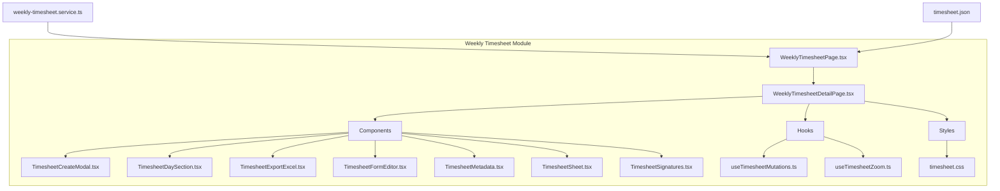
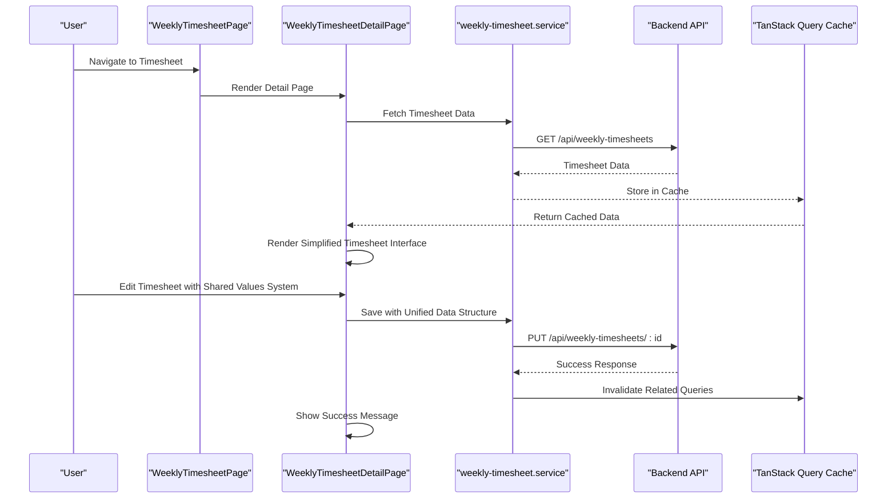
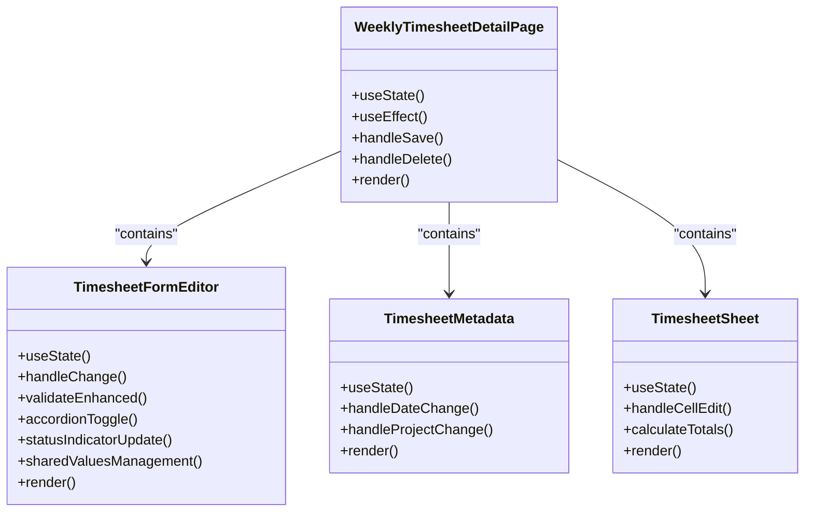
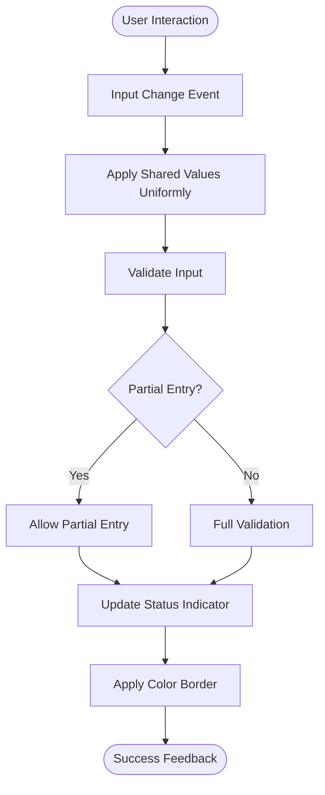
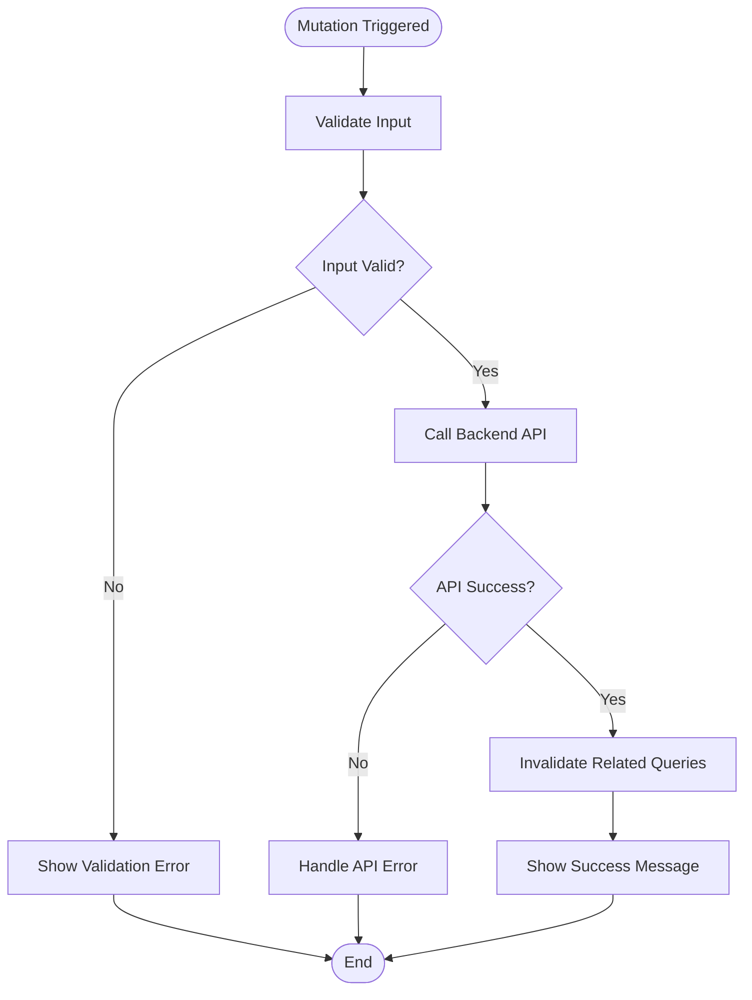
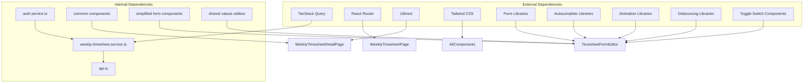

# Timesheet Semanal - Interface Frontend

<cite>
**Referenced Files in This Document**
- [WeeklyTimesheetPage.tsx](file://src/pages/weekly-timesheet/WeeklyTimesheetPage.tsx)
- [WeeklyTimesheetDetailPage.tsx](file://src/pages/weekly-timesheet/WeeklyTimesheetDetailPage.tsx)
- [weekly-timesheet.service.ts](file://src/services/weekly-timesheet.service.ts)
- [timesheet.json](file://src/i18n/locales/pt/timesheet.json)
- [useTimesheetMutations.ts](file://src/pages/weekly-timesheet/hooks/useTimesheetMutations.ts)
- [useTimesheetZoom.ts](file://src/pages/weekly-timesheet/hooks/useTimesheetZoom.ts)
- [TimesheetCreateModal.tsx](file://src/pages/weekly-timesheet/components/TimesheetCreateModal.tsx)
- [TimesheetDaySection.tsx](file://src/pages/weekly-timesheet/components/TimesheetDaySection.tsx)
- [TimesheetExportExcel.tsx](file://src/pages/weekly-timesheet/components/TimesheetExportExcel.tsx)
- [TimesheetFormEditor.tsx](file://src/pages/weekly-timesheet/components/TimesheetFormEditor.tsx)
- [TimesheetMetadata.tsx](file://src/pages/weekly-timesheet/components/TimesheetMetadata.tsx)
- [TimesheetSheet.tsx](file://src/pages/weekly-timesheet/components/TimesheetSheet.tsx)
- [TimesheetSignatures.tsx](file://src/pages/weekly-timesheet/components/TimesheetSignatures.tsx)
- [timesheet.css](file://src/pages/weekly-timesheet/styles/timesheet.css)
</cite>

## Update Summary
**Changes Made**
- Updated TimesheetFormEditor component analysis to reflect major refactoring that removed over 200 lines of per-technician customization code and implemented new shared values system
- Enhanced component architecture documentation with simplified structure where common information is managed through sharedValues system applied uniformly to all technicians
- Removed documentation for complex two-pass detectSharedValues algorithm and customization UI elements that were eliminated
- Updated troubleshooting guide to reflect the new simplified form structure and shared values approach

## Table of Contents
1. [Introduction](#introduction)
2. [Project Structure](#project-structure)
3. [Core Components](#core-components)
4. [Architecture Overview](#architecture-overview)
5. [Detailed Component Analysis](#detailed-component-analysis)
6. [Dependency Analysis](#dependency-analysis)
7. [Performance Considerations](#performance-considerations)
8. [Troubleshooting Guide](#troubleshooting-guide)
9. [Conclusion](#conclusion)

## Introduction

The Timesheet Semanal (Weekly Timesheet) interface is a comprehensive React-based frontend component that allows wind energy technicians to manage their weekly work hours and activities. Built with Vite and following modern React patterns, it provides an intuitive user experience for tracking time spent on various projects and tasks.

The implementation follows the project's design principles inspired by Apple's design system - minimalist, clean, with generous spacing and neutral colors with blue accents. The interface uses Tailwind CSS v4 with utility classes and implements internationalization (i18n) throughout all user-facing text.

**Updated** Major refactoring has been applied to the TimesheetFormEditor component, removing over 200 lines of per-technician customization code and implementing a new shared values system. The form now uses a simplified structure where common information is managed through sharedValues system applied uniformly to all technicians. This change eliminates the complex two-pass detectSharedValues algorithm and removes customization UI elements, resulting in a more streamlined and maintainable codebase.

## Project Structure

The weekly timesheet feature is organized within the `src/pages/weekly-timesheet/` directory, following a modular architecture pattern:

**Diagram sources**
- [WeeklyTimesheetPage.tsx](file://src/pages/weekly-timesheet/WeeklyTimesheetPage.tsx)
- [WeeklyTimesheetDetailPage.tsx](file://src/pages/weekly-timesheet/WeeklyTimesheetDetailPage.tsx)
- [weekly-timesheet.service.ts](file://src/services/weekly-timesheet.service.ts)
- [timesheet.json](file://src/i18n/locales/pt/timesheet.json)

**Section sources**
- [WeeklyTimesheetPage.tsx](file://src/pages/weekly-timesheet/WeeklyTimesheetPage.tsx)
- [WeeklyTimesheetDetailPage.tsx](file://src/pages/weekly-timesheet/WeeklyTimesheetDetailPage.tsx)

## Core Components

The weekly timesheet interface consists of several key components that work together to provide a seamless user experience:

### Main Pages
- **WeeklyTimesheetPage**: Entry point for the timesheet module, handles routing and initial data loading
- **WeeklyTimesheetDetailPage**: Main interface for viewing and editing individual timesheets

### UI Components
- **TimesheetCreateModal**: Modal interface for creating new timesheets
- **TimesheetDaySection**: Individual day sections within the timesheet editor with accordion functionality
- **TimesheetFormEditor**: Comprehensive form editor with enhanced accordion-based day entry system, visual status indicators, improved validation logic, and simplified shared values management
- **TimesheetMetadata**: Displays and manages metadata like project selection and dates
- **TimesheetSheet**: Main spreadsheet-like interface for timesheet data
- **TimesheetSignatures**: Handles signature collection and validation
- **TimesheetExportExcel**: Excel export functionality for timesheet data

### Hooks and Utilities
- **useTimesheetMutations**: Custom hook for handling timesheet CRUD operations
- **useTimesheetZoom**: Hook for managing zoom levels in the timesheet view

**Updated** The TimesheetFormEditor component has undergone significant refactoring, removing over 200 lines of per-technician customization code and implementing a new shared values system. The component now uses a simplified structure where common information is managed through sharedValues system applied uniformly to all technicians. This eliminates the need for complex customization UI elements and the two-pass detectSharedValues algorithm, resulting in cleaner, more maintainable code.

**Section sources**
- [TimesheetCreateModal.tsx](file://src/pages/weekly-timesheet/components/TimesheetCreateModal.tsx)
- [TimesheetDaySection.tsx](file://src/pages/weekly-timesheet/components/TimesheetDaySection.tsx)
- [TimesheetFormEditor.tsx](file://src/pages/weekly-timesheet/components/TimesheetFormEditor.tsx)
- [TimesheetMetadata.tsx](file://src/pages/weekly-timesheet/components/TimesheetMetadata.tsx)
- [TimesheetSheet.tsx](file://src/pages/weekly-timesheet/components/TimesheetSheet.tsx)
- [TimesheetSignatures.tsx](file://src/pages/weekly-timesheet/components/TimesheetSignatures.tsx)
- [TimesheetExportExcel.tsx](file://src/pages/weekly-timesheet/components/TimesheetExportExcel.tsx)
- [useTimesheetMutations.ts](file://src/pages/weekly-timesheet/hooks/useTimesheetMutations.ts)
- [useTimesheetZoom.ts](file://src/pages/weekly-timesheet/hooks/useTimesheetZoom.ts)

## Architecture Overview

The weekly timesheet interface follows a modern React architecture pattern with clear separation of concerns:

**Updated** The enhanced architecture now features a simplified shared values system where common information is managed uniformly across all technicians, eliminating the previous complex per-technician customization approach. This results in cleaner data flow and more consistent user experience.

**Diagram sources**
- [WeeklyTimesheetPage.tsx](file://src/pages/weekly-timesheet/WeeklyTimesheetPage.tsx)
- [WeeklyTimesheetDetailPage.tsx](file://src/pages/weekly-timesheet/WeeklyTimesheetDetailPage.tsx)
- [weekly-timesheet.service.ts](file://src/services/weekly-timesheet.service.ts)

## Detailed Component Analysis

### WeeklyTimesheetDetailPage

The main detail page serves as the central hub for timesheet operations, managing state and coordinating between various child components.

#### Key Features:
- **Data Management**: Uses TanStack Query for efficient data fetching and caching
- **State Coordination**: Manages complex state across multiple components
- **Validation**: Implements comprehensive form validation with enhanced error handling
- **Error Handling**: Provides user-friendly error messages and recovery options

#### Component Hierarchy:

**Updated** The component hierarchy now reflects the simplified TimesheetFormEditor with shared values management instead of per-technician customization, resulting in cleaner component interactions and reduced complexity.

**Diagram sources**
- [WeeklyTimesheetDetailPage.tsx](file://src/pages/weekly-timesheet/WeeklyTimesheetDetailPage.tsx)
- [TimesheetFormEditor.tsx](file://src/pages/weekly-timesheet/components/TimesheetFormEditor.tsx)
- [TimesheetMetadata.tsx](file://src/pages/weekly-timesheet/components/TimesheetMetadata.tsx)
- [TimesheetSheet.tsx](file://src/pages/weekly-timesheet/components/TimesheetSheet.tsx)

### Simplified TimesheetFormEditor Component

The TimesheetFormEditor component has undergone substantial refactoring to improve maintainability and user experience:

#### Key Changes:
- **Shared Values System**: Replaced per-technician customization with unified shared values management applied uniformly to all technicians
- **Code Reduction**: Removed over 200 lines of complex per-technician customization code
- **Simplified Algorithm**: Eliminated the complex two-pass detectSharedValues algorithm in favor of straightforward shared values application
- **Removed Customization UI**: Deleted customization interface elements that allowed per-technician modifications
- **Streamlined Data Flow**: Implemented direct shared values application without intermediate processing steps

#### Implementation Pattern:

**Updated** The component now uses a simplified shared values system where common information is applied uniformly to all technicians, eliminating the previous complex customization workflow and reducing code complexity significantly.

**Diagram sources**
- [TimesheetFormEditor.tsx](file://src/pages/weekly-timesheet/components/TimesheetFormEditor.tsx)

### useTimesheetMutations Hook

This custom hook encapsulates all mutation logic for timesheet operations, providing a clean API for components to interact with the backend.

#### Functionality:
- **CRUD Operations**: Create, Read, Update, Delete timesheets
- **Query Invalidation**: Automatically invalidates related queries after mutations
- **Error Handling**: Centralized error handling and user feedback
- **Loading States**: Manages loading states for better UX
- **Unified Data Structure**: Optimized for the new shared values data format

#### Implementation Pattern:

**Section sources**
- [WeeklyTimesheetDetailPage.tsx](file://src/pages/weekly-timesheet/WeeklyTimesheetDetailPage.tsx)
- [useTimesheetMutations.ts](file://src/pages/weekly-timesheet/hooks/useTimesheetMutations.ts)
- [timesheet.json](file://src/i18n/locales/pt/timesheet.json)

## Dependency Analysis

The weekly timesheet module has well-defined dependencies that follow React best practices:

**Updated** Dependencies have been streamlined to support the simplified shared values system, removing dependencies related to per-technician customization while maintaining core functionality for form management and data persistence.

**Diagram sources**
- [weekly-timesheet.service.ts](file://src/services/weekly-timesheet.service.ts)
- [WeeklyTimesheetPage.tsx](file://src/pages/weekly-timesheet/WeeklyTimesheetPage.tsx)
- [WeeklyTimesheetDetailPage.tsx](file://src/pages/weekly-timesheet/WeeklyTimesheetDetailPage.tsx)
- [TimesheetFormEditor.tsx](file://src/pages/weekly-timesheet/components/TimesheetFormEditor.tsx)

**Section sources**
- [weekly-timesheet.service.ts](file://src/services/weekly-timesheet.service.ts)
- [WeeklyTimesheetPage.tsx](file://src/pages/weekly-timesheet/WeeklyTimesheetPage.tsx)

## Performance Considerations

The weekly timesheet interface implements several performance optimizations:

### Data Caching
- **TanStack Query**: Efficient caching and background refetching
- **Selective Refetching**: Only relevant queries are invalidated after mutations
- **Optimistic Updates**: Immediate UI updates while waiting for server confirmation

### Component Optimization
- **Memoization**: Strategic use of React.memo and useMemo for expensive computations
- **Lazy Loading**: Components loaded only when needed
- **Virtual Scrolling**: For large datasets in timesheet sheets
- **Accordion Optimization**: Efficient accordion state management to minimize re-renders

### State Management
- **Local State**: Minimal state at component level
- **Global State**: TanStack Query for shared data
- **Form State**: Optimized form libraries for complex forms with enhanced validation

### Enhanced Performance Features
- **Simplified Data Processing**: Direct shared values application eliminates complex processing steps
- **Reduced Re-renders**: Streamlined component structure minimizes unnecessary updates
- **Efficient Validation**: Client-side validation reduces unnecessary API calls
- **Optimized Search Functionality**: Improved autocomplete performance for technician selection
- **Lightweight State Management**: Simplified state management for UI toggles
- **Collapsible Panel Efficiency**: Minimized re-renders when panels are collapsed

## Troubleshooting Guide

### Common Issues and Solutions

#### Data Loading Problems
- **Symptom**: Timesheet data not loading or showing stale data
- **Solution**: Check network requests and cache invalidation
- **Debug**: Use React DevTools to inspect query state

#### Form Validation Errors
- **Symptom**: Form submission failing without clear error messages
- **Solution**: Verify validation rules and error handling
- **Debug**: Check browser console for validation errors

#### i18n Issues
- **Symptom**: Missing translations or incorrect language display
- **Solution**: Ensure translation keys exist and locale is properly configured
- **Debug**: Check i18n configuration and loaded namespaces

#### Performance Issues
- **Symptom**: Slow rendering or unresponsive interface
- **Solution**: Identify bottlenecks using React Profiler
- **Debug**: Monitor memory usage and re-renders

#### Enhanced Form Issues
- **Symptom**: Accordion sections not toggling correctly
- **Solution**: Check accordion state management and event handlers
- **Debug**: Inspect component state and event propagation

#### Status Indicator Problems
- **Symptom**: Visual status indicators not updating properly
- **Solution**: Verify validation logic and state synchronization
- **Debug**: Check color class application and conditional rendering

#### Technician Autocomplete Issues
- **Symptom**: Role auto-population not working correctly
- **Solution**: Verify autocomplete data structure and role mapping
- **Debug**: Check API responses and data transformation

#### Shared Values System Issues
- **Symptom**: Shared values not applying correctly to all technicians
- **Solution**: Verify shared values data structure and uniform application logic
- **Debug**: Check data flow from form input to shared values storage

#### Customization Removal Issues
- **Symptom**: Per-technician customization features not working as expected
- **Solution**: Understand that customization features have been removed; use shared values instead
- **Debug**: Verify that shared values are being applied uniformly across all technicians

#### Data Synchronization Problems
- **Symptom**: Data inconsistencies between technicians
- **Solution**: Ensure shared values system is properly synchronizing data
- **Debug**: Check data flow and state management in the simplified form structure

**Updated** New troubleshooting categories have been added to address the simplified shared values system and removal of per-technician customization features, including guidance on understanding the new unified approach to data management.

**Section sources**
- [weekly-timesheet.service.ts](file://src/services/weekly-timesheet.service.ts)
- [useTimesheetMutations.ts](file://src/pages/weekly-timesheet/hooks/useTimesheetMutations.ts)
- [TimesheetFormEditor.tsx](file://src/pages/weekly-timesheet/components/TimesheetFormEditor.tsx)

## Conclusion

The Timesheet Semanal interface represents a well-architected React application that effectively manages weekly timesheet operations for wind energy technicians. The implementation follows modern React patterns, includes comprehensive internationalization, and provides a user-friendly interface for complex data entry tasks.

Key strengths include:
- **Modular Architecture**: Clear separation of concerns with reusable components
- **Performance Optimization**: Efficient data management with TanStack Query
- **Internationalization**: Complete support for Portuguese language
- **User Experience**: Intuitive interface with proper error handling and feedback
- **Maintainability**: Well-structured codebase following React best practices

**Updated** Recent refactoring has significantly improved the system's maintainability and user experience through the implementation of a shared values system that applies common information uniformly to all technicians. This change removed over 200 lines of complex per-technician customization code, eliminated the need for a two-pass detectSharedValues algorithm, and removed customization UI elements. The result is a cleaner, more streamlined codebase that provides consistent behavior across all technicians while maintaining powerful features for time tracking and project management with enhanced data persistence and simplified user interaction patterns.

The system successfully balances simplicity with functionality, making it accessible to technicians while providing robust features for time tracking and project management with the new unified shared values approach.