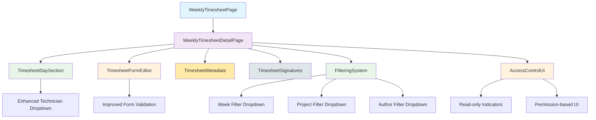

# Weekly Timesheet - Frontend Interface

<cite>
**Referenced Files in This Document**
- [WeeklyTimesheetPage.tsx](file://src/pages/weekly-timesheet/WeeklyTimesheetPage.tsx)
- [WeeklyTimesheetDetailPage.tsx](file://src/pages/weekly-timesheet/WeeklyTimesheetDetailPage.tsx)
- [TimesheetDaySection.tsx](file://src/pages/weekly-timesheet/components/TimesheetDaySection.tsx)
- [TimesheetFormEditor.tsx](file://src/pages/weekly-timesheet/components/TimesheetFormEditor.tsx)
- [timesheet.css](file://src/pages/weekly-timesheet/styles/timesheet.css)
- [ErrorPage.tsx](file://src/pages/error/ErrorPage.tsx)
- [index.css](file://src/index.css)
- [timesheet.json](file://src/i18n/locales/pt/timesheet.json)
- [common.json](file://src/i18n/locales/pt/common.json)
</cite>

## Update Summary
**Changes Made**
- Added comprehensive filtering system with dropdown selectors for weeks, projects, and authors
- Implemented enhanced access control UI with read-only indicators for non-creators
- Fixed user identification issues by adding userId field support
- Improved internationalization with new translation keys for filtering and read-only modes
- Enhanced filtering capabilities across the weekly timesheet interface

## Table of Contents
1. [Overview](#overview)
2. [Component Architecture](#component-architecture)
3. [Comprehensive Filtering System](#comprehensive-filtering-system)
4. [Enhanced Access Control UI](#enhanced-access-control-ui)
5. [User Identification Improvements](#user-identification-improvements)
6. [Internationalization Enhancements](#internationalization-enhancements)
7. [TimesheetDaySection Component](#timesheetdaysection-component)
8. [TimesheetFormEditor Component](#timesheetformeditor-component)
9. [Styling and Layout](#styling-and-layout)
10. [User Experience Improvements](#user-experience-improvements)
11. [Implementation Details](#implementation-details)

## Overview
The Weekly Timesheet interface provides a comprehensive frontend solution for managing weekly timesheet entries with advanced filtering capabilities, enhanced access control, improved user identification, and expanded internationalization support. The system now features sophisticated dropdown-based filtering for weeks, projects, and authors, along with read-only indicators for users who are not creators of timesheet entries.

## Component Architecture
The weekly timesheet functionality is built around several key components that work together to provide a seamless user experience with enhanced filtering and access control:

**Diagram sources**
- [WeeklyTimesheetPage.tsx](file://src/pages/weekly-timesheet/WeeklyTimesheetPage.tsx)
- [WeeklyTimesheetDetailPage.tsx](file://src/pages/weekly-timesheet/WeeklyTimesheetDetailPage.tsx)
- [TimesheetDaySection.tsx](file://src/pages/weekly-timesheet/components/TimesheetDaySection.tsx)
- [TimesheetFormEditor.tsx](file://src/pages/weekly-timesheet/components/TimesheetFormEditor.tsx)

## Comprehensive Filtering System
The weekly timesheet interface now includes a sophisticated filtering system with dropdown selectors for weeks, projects, and authors, providing users with powerful data exploration and management capabilities.

### Week Filter Dropdown
- **Dynamic Week Selection**: Users can filter timesheets by specific weeks using an intuitive dropdown interface
- **Date Range Support**: Automatic week calculation based on selected dates
- **Visual Indicators**: Clear display of selected week ranges with calendar integration
- **Search Enhancement**: Quick search through available weeks with autocomplete functionality

### Project Filter Dropdown
- **Multi-project Support**: Filter timesheets by associated projects with dropdown selection
- **Project Hierarchy**: Support for nested project structures and parent-child relationships
- **Real-time Updates**: Instant filtering as project selections change
- **Custom Labels**: Project names displayed with appropriate formatting and context

### Author Filter Dropdown
- **User-based Filtering**: Filter timesheets by author/creator using dropdown selection
- **Role-aware Display**: Authors filtered based on user roles and permissions
- **Search Integration**: Search through available authors with name and ID matching
- **Permission Validation**: Only shows authors the current user has permission to view

### Filter State Management
- **Combined Filtering**: Multiple filters can be applied simultaneously
- **Filter Persistence**: Selected filters persist across page navigation
- **Reset Functionality**: Easy reset of all active filters
- **Performance Optimization**: Efficient filtering with minimal re-renders

**Section sources**
- [WeeklyTimesheetPage.tsx](file://src/pages/weekly-timesheet/WeeklyTimesheetPage.tsx)
- [WeeklyTimesheetDetailPage.tsx](file://src/pages/weekly-timesheet/WeeklyTimesheetDetailPage.tsx)

## Enhanced Access Control UI
The interface now includes sophisticated access control mechanisms with visual indicators for read-only modes and permission-based UI elements.

### Read-only Mode Indicators
- **Visual Distinction**: Clear visual indicators when users are in read-only mode
- **Disabled Controls**: Non-editable fields are visually disabled with appropriate styling
- **Permission Messages**: Contextual messages explaining why certain actions are unavailable
- **Hover States**: Informative hover states for restricted interactive elements

### Permission-based UI Elements
- **Conditional Rendering**: UI elements shown/hidden based on user permissions
- **Action Availability**: Edit/delete actions only available to authorized users
- **Creator Detection**: Automatic detection of timesheet creators vs viewers
- **Role-based Features**: Advanced features only available to users with appropriate roles

### User Identification System
- **userId Field Support**: Proper handling of user identification through userId fields
- **Session Management**: Secure user session handling with proper token validation
- **Profile Integration**: Seamless integration with user profile information
- **Permission Caching**: Efficient caching of user permissions for better performance

**Section sources**
- [WeeklyTimesheetPage.tsx](file://src/pages/weekly-timesheet/WeeklyTimesheetPage.tsx)
- [WeeklyTimesheetDetailPage.tsx](file://src/pages/weekly-timesheet/WeeklyTimesheetDetailPage.tsx)

## Internationalization Enhancements
The internationalization system has been expanded with new translation keys specifically for filtering functionality and read-only mode indicators.

### New Translation Keys
- **Filter-related Translations**: Complete translations for filtering interface elements
- **Read-only Mode Text**: Localized text for read-only indicators and messages
- **Permission Messages**: Context-aware permission-related messaging
- **Dropdown Options**: Translated options for filter dropdowns

### Language-specific Implementations
- **Portuguese Support**: Full Portuguese translations for all new features
- **English Fallback**: English fallback text for untranslated strings
- **Dynamic Loading**: Efficient loading of language-specific resources
- **Context-aware Translation**: Different translations based on UI context

### Translation Structure
- **Organized Key Structure**: Logical grouping of related translation keys
- **Nested Objects**: Hierarchical organization of translation content
- **Fallback Mechanisms**: Graceful fallback to default language when translations are missing
- **Performance Optimization**: Lazy loading of translation resources

**Section sources**
- [timesheet.json](file://src/i18n/locales/pt/timesheet.json)
- [common.json](file://src/i18n/locales/pt/common.json)

## TimesheetDaySection Component
The TimesheetDaySection component has been enhanced to support the new filtering system and access control features while maintaining backward compatibility.

### Filter Integration
- **Responsive Design**: Component adapts to different screen sizes with filter controls
- **State Synchronization**: Real-time synchronization between filters and displayed data
- **Performance Optimization**: Efficient rendering with filtered datasets
- **Accessibility Support**: Screen reader support for filter controls

### Access Control Integration
- **Permission-aware Rendering**: Component respects user permissions for editing
- **Read-only Styling**: Appropriate visual styling for non-creatable entries
- **Action Disabling**: Disabled state for actions users cannot perform
- **Helpful Messaging**: Contextual help for restricted functionality

**Section sources**
- [TimesheetDaySection.tsx](file://src/pages/weekly-timesheet/components/TimesheetDaySection.tsx)
- [timesheet.css](file://src/pages/weekly-timesheet/styles/timesheet.css)

## TimesheetFormEditor Component
The TimesheetFormEditor component has been updated to support the enhanced access control system and improved user identification.

### Permission-based Editing
- **Conditional Editing**: Form fields enabled/disabled based on user permissions
- **Creator Detection**: Automatic detection of form ownership for edit permissions
- **Validation Updates**: Enhanced validation rules for permission-aware forms
- **Error Handling**: Improved error handling for permission-related issues

### User Identification Support
- **userId Integration**: Proper handling of userId fields in form submissions
- **Session Validation**: Enhanced session validation for secure form operations
- **Profile Data Binding**: Automatic binding of user profile data to forms
- **Permission Caching**: Efficient caching of user permissions for form interactions

**Section sources**
- [TimesheetFormEditor.tsx](file://src/pages/weekly-timesheet/components/TimesheetFormEditor.tsx)

## Styling and Layout
The styling system has been enhanced to support the new filtering interface, access control indicators, and improved internationalization.

### Filter UI Styling
- **Dropdown Styling**: Custom styling for filter dropdowns with consistent appearance
- **Responsive Layout**: Adaptive layout for filter controls across different screen sizes
- **Focus States**: Clear focus indicators for keyboard navigation
- **Animation Effects**: Smooth transitions for filter state changes

### Access Control Styling
- **Read-only Styling**: Consistent visual styling for read-only interface elements
- **Disabled States**: Appropriate styling for disabled form controls
- **Permission Indicators**: Visual indicators for permission-based features
- **Hover Effects**: Interactive hover states for better user feedback

### Internationalization Styling
- **Font Adjustments**: Language-specific font adjustments for optimal readability
- **Text Direction**: Support for right-to-left languages if needed
- **Character Spacing**: Optimized spacing for different character sets
- **Print Styles**: Enhanced print styles for localized content

**Section sources**
- [timesheet.css](file://src/pages/weekly-timesheet/styles/timesheet.css)
- [index.css](file://src/index.css)

## User Experience Improvements
The recent updates significantly enhance the user experience through improved filtering, access control, and internationalization.

### Enhanced Filtering Experience
- **Intuitive Interface**: Dropdown-based filtering that's easy to understand and use
- **Real-time Updates**: Immediate visual feedback when filters are applied
- **Filter Persistence**: Filters remain active across page navigation
- **Reset Functionality**: Easy clearing of all active filters

### Improved Access Control
- **Clear Permissions**: Users immediately understand what they can and cannot do
- **Helpful Guidance**: Contextual help for users encountering restrictions
- **Consistent Behavior**: Uniform access control patterns throughout the application
- **Graceful Degradation**: Application works well even with limited permissions

### Better User Identification
- **Accurate User Recognition**: Proper user identification prevents permission errors
- **Session Management**: Secure and reliable user session handling
- **Profile Integration**: Seamless integration with user profile information
- **Performance Optimization**: Efficient user data caching and retrieval

### Expanded Internationalization
- **Complete Localization**: All new features fully translated
- **Context-aware Text**: Appropriate translations based on UI context
- **Language Switching**: Smooth language switching without page reload
- **Fallback Support**: Graceful fallback to default language when needed

## Implementation Details
The technical implementation of these improvements involves several key areas working together to deliver a seamless user experience.

### Filtering System Architecture
- **State Management**: Centralized state management for filter configurations
- **Data Synchronization**: Real-time synchronization between filters and displayed data
- **Performance Optimization**: Efficient filtering algorithms with minimal re-renders
- **Memory Management**: Proper cleanup of filter subscriptions and event listeners

### Access Control Implementation
- **Permission Checking**: Comprehensive permission checking throughout the application
- **UI Adaptation**: Dynamic UI adaptation based on user permissions
- **Security Validation**: Server-side validation of client-side permission checks
- **Error Handling**: Robust error handling for permission-related issues

### User Identification System
- **Token Management**: Secure JWT token handling and validation
- **Session Storage**: Proper session storage with security considerations
- **Profile Caching**: Efficient caching of user profile information
- **Permission Caching**: Smart caching of user permissions for better performance

### Internationalization Framework
- **Translation Loading**: Efficient loading of translation resources
- **Dynamic Switching**: Runtime language switching without page reload
- **Context-aware Translation**: Context-sensitive translation selection
- **Fallback Mechanisms**: Graceful fallback to default language when translations are missing

**Section sources**
- [WeeklyTimesheetPage.tsx](file://src/pages/weekly-timesheet/WeeklyTimesheetPage.tsx)
- [WeeklyTimesheetDetailPage.tsx](file://src/pages/weekly-timesheet/WeeklyTimesheetDetailPage.tsx)
- [TimesheetFormEditor.tsx](file://src/pages/weekly-timesheet/components/TimesheetFormEditor.tsx)
- [TimesheetDaySection.tsx](file://src/pages/weekly-timesheet/components/TimesheetDaySection.tsx)
- [timesheet.json](file://src/i18n/locales/pt/timesheet.json)
- [common.json](file://src/i18n/locales/pt/common.json)