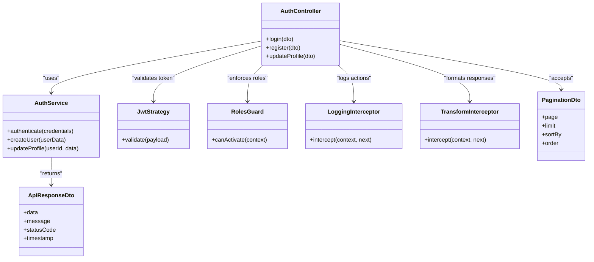
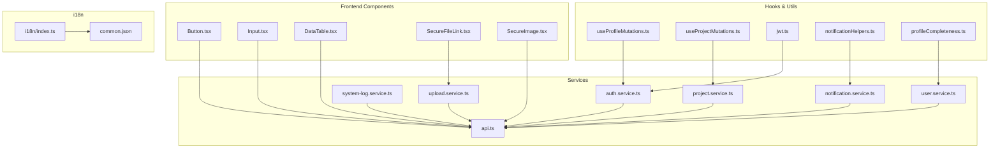
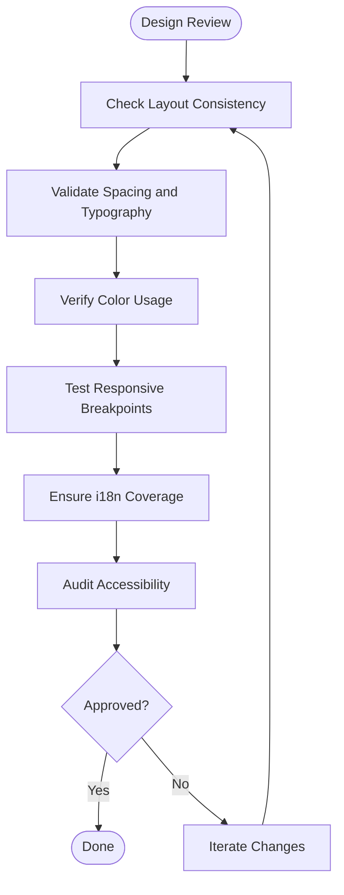

# Best Practices

<cite>
**Referenced Files in This Document**
- [app.module.ts](file://API/src/app.module.ts)
- [main.ts](file://API/src/main.ts)
- [auth.controller.ts](file://API/src/modules/auth/auth.controller.ts)
- [auth.service.ts](file://API/src/modules/auth/auth.service.ts)
- [jwt.strategy.ts](file://API/src/modules/auth/strategies/jwt.strategy.ts)
- [roles.guard.ts](file://API/src/common/guards/roles.guard.ts)
- [roles.decorator.ts](file://API/src/common/decorators/roles.decorator.ts)
- [http-exception.filter.ts](file://API/src/common/filters/http-exception.filter.ts)
- [logging.interceptor.ts](file://API/src/common/interceptors/logging.interceptor.ts)
- [transform.interceptor.ts](file://API/src/common/interceptors/transform.interceptor.ts)
- [api-response.dto.ts](file://API/src/common/dto/api-response.dto.ts)
- [pagination.dto.ts](file://API/src/common/dto/pagination.dto.ts)
- [env.validation.ts](file://API/src/config/env.validation.ts)
- [prisma.service.ts](file://API/src/database/prisma.service.ts)
- [schema.prisma](file://API/prisma/schema.prisma)
- [App.tsx](file://src/App.tsx)
- [main.tsx](file://src/main.tsx)
- [api.ts](file://src/services/api.ts)
- [auth.service.ts](file://src/services/auth.service.ts)
- [project.service.ts](file://src/services/project.service.ts)
- [notification.service.ts](file://src/services/notification.service.ts)
- [system-log.service.ts](file://src/services/system-log.service.ts)
- [upload.service.ts](file://src/services/upload.service.ts)
- [user.service.ts](file://src/services/user.service.ts)
- [HomePage.tsx](file://src/pages/home/HomePage.tsx)
- [LoginPage.tsx](file://src/pages/login/LoginPage.tsx)
- [ProjectsPage.tsx](file://src/pages/projects/ProjectsPage.tsx)
- [UsersPage.tsx](file://src/pages/users/UsersPage.tsx)
- [LogsPage.tsx](file://src/pages/logs/LogsPage.tsx)
- [NotificationDetailPage.tsx](file://src/pages/notifications/NotificationDetailPage.tsx)
- [ChangeTempPasswordPage.tsx](file://src/pages/change-password/ChangeTempPasswordPage.tsx)
- [ErrorPage.tsx](file://src/pages/error/ErrorPage.tsx)
- [Button.tsx](file://src/components/ui/Button.tsx)
- [Input.tsx](file://src/components/ui/Input.tsx)
- [DataTable.tsx](file://src/components/ui/DataTable.tsx)
- [SecureFileLink.tsx](file://src/components/ui/SecureFileLink.tsx)
- [SecureImage.tsx](file://src/components/ui/SecureImage.tsx)
- [useProfileMutations.ts](file://src/pages/profile/hooks/useProfileMutations.ts)
- [useProjectMutations.ts](file://src/pages/projects/detail/hooks/useProjectMutations.ts)
- [jwt.ts](file://src/utils/jwt.ts)
- [notificationHelpers.ts](file://src/utils/notificationHelpers.ts)
- [profileCompleteness.ts](file://src/utils/profileCompleteness.ts)
- [index.ts](file://src/i18n/index.ts)
- [common.json](file://src/i18n/locales/pt/common.json)
</cite>

## Table of Contents
## Regras Obrigatórias
## Princípios SOLID Aplicados
## Reutilização de Código
## Performance
## Responsividade e Design

## Regras Obrigatórias
- Language and documentation
  - Code identifiers must be in English. Comments and documentation should be in Brazilian Portuguese (PT-BR), didactic and explanatory.
  - All user-visible text must be internationalized via i18n namespaces; never hardcode UI strings in English or any other language.
- Authentication and authorization
  - Use JWT Bearer tokens for all authenticated requests. The payload contains sub (userId), email, and role. Always use sub as the user identifier; never rely on user.id.
  - Enforce RBAC with roles ADMIN, HR, STANDARD using @Roles() decorators and RolesGuard. Validate permissions at controller endpoints.
- Data modeling and persistence
  - Primary entities must use UUIDs as IDs and implement soft delete via a deletedAt field. Persist timestamps in UTC.
  - Centralize database access through Prisma service; avoid direct client usage outside services.
- API contracts
  - Success responses follow { data, message, statusCode, timestamp }; error responses follow { error, message, statusCode, timestamp, path }.
  - Pagination DTOs must be used for list endpoints to standardize query parameters and response shape.
- Logging and observability
  - Log every user action with context: userId, action, entity, IP, duration. Use LoggingInterceptor and SystemLogService consistently.
- File uploads
  - Use Multer with MIME type and size validation. Serve files via temporary URLs through /upload/files/:token. Never expose raw file paths.
- Currency and locale
  - Official currency is Euro (€). Default locale is pt-PT for number and date formatting.
- Frontend data management
  - Use TanStack Query for fetching and caching. Invalidate related queries after mutations to keep cache consistent.
- Security
  - Validate environment variables at startup. Sanitize inputs and outputs. Avoid logging sensitive data.

**Section sources**
- [auth.controller.ts:1-200](file://API/src/modules/auth/auth.controller.ts#L1-L200)
- [auth.service.ts:1-300](file://API/src/modules/auth/auth.service.ts#L1-L300)
- [jwt.strategy.ts:1-150](file://API/src/modules/auth/strategies/jwt.strategy.ts#L1-L150)
- [roles.guard.ts:1-120](file://API/src/common/guards/roles.guard.ts#L1-L120)
- [roles.decorator.ts:1-60](file://API/src/common/decorators/roles.decorator.ts#L1-L60)
- [api-response.dto.ts:1-120](file://API/src/common/dto/api-response.dto.ts#L1-L120)
- [pagination.dto.ts:1-100](file://API/src/common/dto/pagination.dto.ts#L1-L100)
- [logging.interceptor.ts:1-150](file://API/src/common/interceptors/logging.interceptor.ts#L1-L150)
- [transform.interceptor.ts:1-120](file://API/src/common/interceptors/transform.interceptor.ts#L1-L120)
- [env.validation.ts:1-120](file://API/src/config/env.validation.ts#L1-L120)
- [prisma.service.ts:1-100](file://API/src/database/prisma.service.ts#L1-L100)
- [schema.prisma:1-400](file://API/prisma/schema.prisma#L1-L400)
- [api.ts:1-200](file://src/services/api.ts#L1-L200)
- [auth.service.ts:1-250](file://src/services/auth.service.ts#L1-L250)
- [project.service.ts:1-200](file://src/services/project.service.ts#L1-L200)
- [notification.service.ts:1-150](file://src/services/notification.service.ts#L1-L150)
- [system-log.service.ts:1-150](file://src/services/system-log.service.ts#L1-L150)
- [upload.service.ts:1-200](file://src/services/upload.service.ts#L1-L200)
- [user.service.ts:1-200](file://src/services/user.service.ts#L1-L200)

## Princípios SOLID Aplicados
- Single Responsibility Principle
  - Controllers handle HTTP concerns only; business logic resides in services. DTOs define request/response shapes. Interceptors and guards encapsulate cross-cutting concerns like logging and authorization.
- Open/Closed Principle
  - Extend behavior via interceptors, filters, and guards without modifying core controllers. Strategy pattern for authentication (JWT strategy) allows swapping mechanisms cleanly.
- Liskov Substitution Principle
  - Services implement consistent interfaces; consumers depend on abstractions rather than concrete implementations.
- Interface Segregation Principle
  - Small, focused DTOs per domain feature reduce coupling and improve clarity.
- Dependency Inversion Principle
  - High-level modules depend on abstractions (Prisma service, HTTP clients) rather than low-level details.

**Diagram sources**
- [auth.controller.ts:1-200](file://API/src/modules/auth/auth.controller.ts#L1-L200)
- [auth.service.ts:1-300](file://API/src/modules/auth/auth.service.ts#L1-L300)
- [jwt.strategy.ts:1-150](file://API/src/modules/auth/strategies/jwt.strategy.ts#L1-L150)
- [roles.guard.ts:1-120](file://API/src/common/guards/roles.guard.ts#L1-L120)
- [logging.interceptor.ts:1-150](file://API/src/common/interceptors/logging.interceptor.ts#L1-L150)
- [transform.interceptor.ts:1-120](file://API/src/common/interceptors/transform.interceptor.ts#L1-L120)
- [api-response.dto.ts:1-120](file://API/src/common/dto/api-response.dto.ts#L1-L120)
- [pagination.dto.ts:1-100](file://API/src/common/dto/pagination.dto.ts#L1-L100)

**Section sources**
- [auth.controller.ts:1-200](file://API/src/modules/auth/auth.controller.ts#L1-L200)
- [auth.service.ts:1-300](file://API/src/modules/auth/auth.service.ts#L1-L300)
- [jwt.strategy.ts:1-150](file://API/src/modules/auth/strategies/jwt.strategy.ts#L1-L150)
- [roles.guard.ts:1-120](file://API/src/common/guards/roles.guard.ts#L1-L120)
- [logging.interceptor.ts:1-150](file://API/src/common/interceptors/logging.interceptor.ts#L1-L150)
- [transform.interceptor.ts:1-120](file://API/src/common/interceptors/transform.interceptor.ts#L1-L120)
- [api-response.dto.ts:1-120](file://API/src/common/dto/api-response.dto.ts#L1-L120)
- [pagination.dto.ts:1-100](file://API/src/common/dto/pagination.dto.ts#L1-L100)

## Reutilização de Código
- Shared components
  - Button, Input, DataTable, SecureFileLink, SecureImage provide consistent UI primitives across pages.
- Services layer
  - api.ts centralizes HTTP configuration; domain services encapsulate REST calls and transformations.
- Hooks and utilities
  - useProfileMutations and useProjectMutations encapsulate mutation logic and cache invalidation.
  - jwt.ts, notificationHelpers.ts, profileCompleteness.ts offer reusable utilities.
- i18n resources
  - i18n index and common.json ensure consistent translations and shared text reuse.

**Diagram sources**
- [Button.tsx:1-200](file://src/components/ui/Button.tsx#L1-L200)
- [Input.tsx:1-200](file://src/components/ui/Input.tsx#L1-L200)
- [DataTable.tsx:1-300](file://src/components/ui/DataTable.tsx#L1-L300)
- [SecureFileLink.tsx:1-150](file://src/components/ui/SecureFileLink.tsx#L1-L150)
- [SecureImage.tsx:1-150](file://src/components/ui/SecureImage.tsx#L1-L150)
- [api.ts:1-200](file://src/services/api.ts#L1-L200)
- [auth.service.ts:1-250](file://src/services/auth.service.ts#L1-L250)
- [project.service.ts:1-200](file://src/services/project.service.ts#L1-L200)
- [notification.service.ts:1-150](file://src/services/notification.service.ts#L1-L150)
- [system-log.service.ts:1-150](file://src/services/system-log.service.ts#L1-L150)
- [upload.service.ts:1-200](file://src/services/upload.service.ts#L1-L200)
- [user.service.ts:1-200](file://src/services/user.service.ts#L1-L200)
- [useProfileMutations.ts:1-200](file://src/pages/profile/hooks/useProfileMutations.ts#L1-L200)
- [useProjectMutations.ts:1-200](file://src/pages/projects/detail/hooks/useProjectMutations.ts#L1-L200)
- [jwt.ts:1-100](file://src/utils/jwt.ts#L1-L100)
- [notificationHelpers.ts:1-150](file://src/utils/notificationHelpers.ts#L1-L150)
- [profileCompleteness.ts:1-150](file://src/utils/profileCompleteness.ts#L1-L150)
- [index.ts:1-100](file://src/i18n/index.ts#L1-L100)
- [common.json:1-200](file://src/i18n/locales/pt/common.json#L1-L200)

**Section sources**
- [Button.tsx:1-200](file://src/components/ui/Button.tsx#L1-L200)
- [Input.tsx:1-200](file://src/components/ui/Input.tsx#L1-L200)
- [DataTable.tsx:1-300](file://src/components/ui/DataTable.tsx#L1-L300)
- [SecureFileLink.tsx:1-150](file://src/components/ui/SecureFileLink.tsx#L1-L150)
- [SecureImage.tsx:1-150](file://src/components/ui/SecureImage.tsx#L1-L150)
- [api.ts:1-200](file://src/services/api.ts#L1-L200)
- [auth.service.ts:1-250](file://src/services/auth.service.ts#L1-L250)
- [project.service.ts:1-200](file://src/services/project.service.ts#L1-L200)
- [notification.service.ts:1-150](file://src/services/notification.service.ts#L1-L150)
- [system-log.service.ts:1-150](file://src/services/system-log.service.ts#L1-L150)
- [upload.service.ts:1-200](file://src/services/upload.service.ts#L1-L200)
- [user.service.ts:1-200](file://src/services/user.service.ts#L1-L200)
- [useProfileMutations.ts:1-200](file://src/pages/profile/hooks/useProfileMutations.ts#L1-L200)
- [useProjectMutations.ts:1-200](file://src/pages/projects/detail/hooks/useProjectMutations.ts#L1-L200)
- [jwt.ts:1-100](file://src/utils/jwt.ts#L1-L100)
- [notificationHelpers.ts:1-150](file://src/utils/notificationHelpers.ts#L1-L150)
- [profileCompleteness.ts:1-150](file://src/utils/profileCompleteness.ts#L1-L150)
- [index.ts:1-100](file://src/i18n/index.ts#L1-L100)
- [common.json:1-200](file://src/i18n/locales/pt/common.json#L1-L200)

## Performance
- Backend
  - Use pagination DTOs to limit payload sizes and reduce DB load.
  - Cache frequently accessed data where appropriate; invalidate caches on mutations.
  - Keep interceptors lightweight; avoid heavy computations in request pipeline.
  - Centralize error handling via HttpExceptionFilter to minimize overhead.
- Frontend
  - Leverage TanStack Query for efficient caching, background refetching, and deduplication.
  - Invalidate queries after mutations to prevent stale data and unnecessary re-renders.
  - Use memoization and lazy loading for large datasets and complex components.
  - Optimize images and secure file links to reduce bandwidth.

**Section sources**
- [pagination.dto.ts:1-100](file://API/src/common/dto/pagination.dto.ts#L1-L100)
- [http-exception.filter.ts:1-120](file://API/src/common/filters/http-exception.filter.ts#L1-L120)
- [api.ts:1-200](file://src/services/api.ts#L1-L200)
- [useProfileMutations.ts:1-200](file://src/pages/profile/hooks/useProfileMutations.ts#L1-L200)
- [useProjectMutations.ts:1-200](file://src/pages/projects/detail/hooks/useProjectMutations.ts#L1-L200)

## Responsividade e Design
- Design system
  - Follow Apple-inspired minimalism: clean layouts, generous spacing, neutral colors with blue accents.
  - Use Tailwind CSS v4 utility classes consistently across components.
- Responsive patterns
  - Build mobile-first layouts; test breakpoints for tablets and desktops.
  - Ensure touch-friendly interactions and accessible focus states.
- Internationalization
  - Provide PT-BR translations for all user-facing text; maintain common namespace for shared strings.
- Accessibility
  - Maintain semantic HTML, ARIA attributes, and keyboard navigation support.

[No sources needed since this diagram shows conceptual workflow, not actual code structure]

**Section sources**
- [Button.tsx:1-200](file://src/components/ui/Button.tsx#L1-L200)
- [Input.tsx:1-200](file://src/components/ui/Input.tsx#L1-L200)
- [DataTable.tsx:1-300](file://src/components/ui/DataTable.tsx#L1-L300)
- [index.ts:1-100](file://src/i18n/index.ts#L1-L100)
- [common.json:1-200](file://src/i18n/locales/pt/common.json#L1-L200)