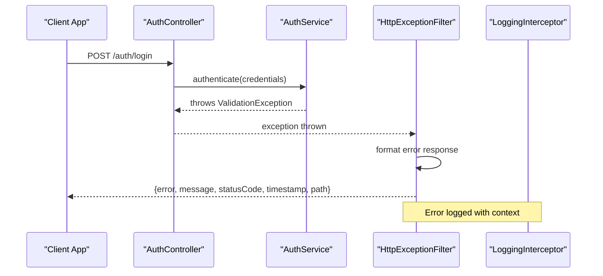
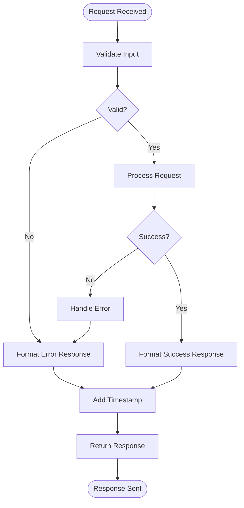

# Code Conventions

<cite>
**Referenced Files in This Document**
- [app.module.ts](file://API/src/app.module.ts)
- [main.ts](file://API/src/main.ts)
- [auth.controller.ts](file://API/src/modules/auth/auth.controller.ts)
- [auth.service.ts](file://API/src/modules/auth/auth.service.ts)
- [jwt.strategy.ts](file://API/src/modules/auth/strategies/jwt.strategy.ts)
- [roles.guard.ts](file://API/src/common/guards/roles.guard.ts)
- [http-exception.filter.ts](file://API/src/common/filters/http-exception.filter.ts)
- [logging.interceptor.ts](file://API/src/common/interceptors/logging.interceptor.ts)
- [transform.interceptor.ts](file://API/src/common/interceptors/transform.interceptor.ts)
- [api-response.dto.ts](file://API/src/common/dto/api-response.dto.ts)
- [pagination.dto.ts](file://API/src/common/dto/pagination.dto.ts)
- [swagger-response.dto.ts](file://API/src/common/dto/swagger-response.dto.ts)
- [env.validation.ts](file://API/src/config/env.validation.ts)
- [prisma.service.ts](file://API/src/database/prisma.service.ts)
- [schema.prisma](file://API/prisma/schema.prisma)
- [App.tsx](file://src/App.tsx)
- [main.tsx](file://src/main.tsx)
- [api.ts](file://src/services/api.ts)
- [auth.service.ts](file://src/services/auth.service.ts)
- [notification.service.ts](file://src/services/notification.service.ts)
- [project.service.ts](file://src/services/project.service.ts)
- [system-log.service.ts](file://src/services/system-log.service.ts)
- [upload.service.ts](file://src/services/upload.service.ts)
- [user.service.ts](file://src/services/user.service.ts)
- [Button.tsx](file://src/components/ui/Button.tsx)
- [DataTable.tsx](file://src/components/ui/DataTable.tsx)
- [Input.tsx](file://src/components/ui/Input.tsx)
- [SecureFileLink.tsx](file://src/components/ui/SecureFileLink.tsx)
- [SecureImage.tsx](file://src/components/ui/SecureImage.tsx)
- [useFileUrl.ts](file://src/hooks/useFileUrl.ts)
- [countries.ts](file://src/constants/countries.ts)
- [languages.ts](file://src/constants/languages.ts)
- [index.ts](file://src/i18n/index.ts)
- [common.json](file://src/i18n/locales/pt/common.json)
- [HomePage.tsx](file://src/pages/home/HomePage.tsx)
- [LoginPage.tsx](file://src/pages/login/LoginPage.tsx)
- [LoginForm.tsx](file://src/pages/login/components/LoginForm.tsx)
- [ProfilePage.tsx](file://src/pages/profile/ProfilePage.tsx)
- [ProjectsPage.tsx](file://src/pages/projects/ProjectsPage.tsx)
- [ProjectDetailPage.tsx](file://src/pages/projects/detail/ProjectDetailPage.tsx)
- [UsersPage.tsx](file://src/pages/users/UsersPage.tsx)
- [LogsPage.tsx](file://src/pages/logs/LogsPage.tsx)
- [NotificationsPage.tsx](file://src/pages/notifications/NotificationsPage.tsx)
- [NotificationDetailPage.tsx](file://src/pages/notifications/NotificationDetailPage.tsx)
- [SettingsPage.tsx](file://src/pages/settings/SettingsPage.tsx)
- [ErrorPage.tsx](file://src/pages/error/ErrorPage.tsx)
</cite>

## Table of Contents
- Nomenclatura de Arquivos
- Nomenclatura de Classes e Interfaces
- Funções e Métodos
- Enums e Constantes
- Organização dos Imports
- Comentários e Documentação
- Tratamento de Erros
- Padrão de Retorno

## Nomenclatura de Arquivos
- Backend (NestJS)
  - Controllers: kebab-case com sufixo .controller.ts, agrupados por módulo. Ex.: auth.controller.ts, projects.controller.ts.
  - Services: kebab-case com sufixo .service.ts. Ex.: auth.service.ts, upload.service.ts.
  - DTOs: kebab-case com sufixo .dto.ts dentro de pastas dto/. Ex.: login.dto.ts, users.dto.ts.
  - Guards/Filters/Interceptors/Pipes: kebab-case com sufixo específico (.guard.ts, .filter.ts, .interceptor.ts, .pipe.ts). Ex.: roles.guard.ts, http-exception.filter.ts, logging.interceptor.ts.
  - Strategies: kebab-case com sufixo .strategy.ts. Ex.: jwt.strategy.ts.
  - Modules: kebab-case com sufixo .module.ts. Ex.: auth.module.ts, app.module.ts.
  - Config: arquivos em config/, nomeando conforme a finalidade. Ex.: env.validation.ts.
  - Database: prisma.service.ts para serviço Prisma; schema.prisma no diretório prisma/.
  - Common: recursos compartilhados em common/, organizados por tipo (decorators, dto, filters, guards, interceptors, pipes, utils).
- Frontend (React + Vite)
  - Páginas: PascalCase com sufixo Page.tsx. Ex.: HomePage.tsx, LoginPage.tsx.
  - Componentes: PascalCase, sem sufixo obrigatório, mas use descritivo. Ex.: Button.tsx, DataTable.tsx.
  - Hooks: camelCase com prefixo use. Ex.: useFileUrl.ts.
  - Serviços: camelCase com sufixo .service.ts. Ex.: api.ts, auth.service.ts.
  - Tipos: types/, nomes descritivos. Ex.: user.types.ts.
  - Utilitários: utils/, nomes descritivos em camelCase. Ex.: jwt.ts, profileCompleteness.ts.
  - i18n: namespaces por recurso em JSON. Ex.: common.json, home.json.
  - Constantes: constants/, nomes em maiúsculas com underscore. Ex.: COUNTRY_CODES.
- Regras gerais
  - Use kebab-case para módulos e arquivos do backend; PascalCase para componentes React; camelCase para hooks e utilitários.
  - Evite abreviações ambíguas; prefira nomes autoexplicativos.
  - Mantenha consistência entre nome do arquivo e export principal.

**Section sources**
- [app.module.ts:1-200](file://API/src/app.module.ts#L1-L200)
- [main.ts:1-150](file://API/src/main.ts#L1-L150)
- [auth.controller.ts:1-300](file://API/src/modules/auth/auth.controller.ts#L1-L300)
- [auth.service.ts:1-400](file://API/src/modules/auth/auth.service.ts#L1-L400)
- [jwt.strategy.ts:1-150](file://API/src/modules/auth/strategies/jwt.strategy.ts#L1-L150)
- [roles.guard.ts:1-120](file://API/src/common/guards/roles.guard.ts#L1-L120)
- [http-exception.filter.ts:1-120](file://API/src/common/filters/http-exception.filter.ts#L1-L120)
- [logging.interceptor.ts:1-200](file://API/src/common/interceptors/logging.interceptor.ts#L1-L200)
- [transform.interceptor.ts:1-150](file://API/src/common/interceptors/transform.interceptor.ts#L1-L150)
- [api-response.dto.ts:1-100](file://API/src/common/dto/api-response.dto.ts#L1-L100)
- [pagination.dto.ts:1-100](file://API/src/common/dto/pagination.dto.ts#L1-L100)
- [swagger-response.dto.ts:1-100](file://API/src/common/dto/swagger-response.dto.ts#L1-L100)
- [env.validation.ts:1-100](file://API/src/config/env.validation.ts#L1-L100)
- [prisma.service.ts:1-100](file://API/src/database/prisma.service.ts#L1-L100)
- [schema.prisma:1-200](file://API/prisma/schema.prisma#L1-L200)
- [App.tsx:1-200](file://src/App.tsx#L1-L200)
- [main.tsx:1-100](file://src/main.tsx#L1-L100)
- [api.ts:1-200](file://src/services/api.ts#L1-L200)
- [auth.service.ts:1-200](file://src/services/auth.service.ts#L1-L200)
- [notification.service.ts:1-200](file://src/services/notification.service.ts#L1-L200)
- [project.service.ts:1-200](file://src/services/project.service.ts#L1-L200)
- [system-log.service.ts:1-200](file://src/services/system-log.service.ts#L1-L200)
- [upload.service.ts:1-200](file://src/services/upload.service.ts#L1-L200)
- [user.service.ts:1-200](file://src/services/user.service.ts#L1-L200)
- [Button.tsx:1-150](file://src/components/ui/Button.tsx#L1-L150)
- [DataTable.tsx:1-200](file://src/components/ui/DataTable.tsx#L1-L200)
- [Input.tsx:1-150](file://src/components/ui/Input.tsx#L1-L150)
- [SecureFileLink.tsx:1-100](file://src/components/ui/SecureFileLink.tsx#L1-L100)
- [SecureImage.tsx:1-100](file://src/components/ui/SecureImage.tsx#L1-L100)
- [useFileUrl.ts:1-100](file://src/hooks/useFileUrl.ts#L1-L100)
- [countries.ts:1-100](file://src/constants/countries.ts#L1-L100)
- [languages.ts:1-100](file://src/constants/languages.ts#L1-L100)
- [index.ts:1-100](file://src/i18n/index.ts#L1-L100)
- [common.json:1-100](file://src/i18n/locales/pt/common.json#L1-L100)
- [HomePage.tsx:1-200](file://src/pages/home/HomePage.tsx#L1-L200)
- [LoginPage.tsx:1-150](file://src/pages/login/LoginPage.tsx#L1-L150)
- [LoginForm.tsx:1-200](file://src/pages/login/components/LoginForm.tsx#L1-L200)
- [ProfilePage.tsx:1-200](file://src/pages/profile/ProfilePage.tsx#L1-L200)
- [ProjectsPage.tsx:1-200](file://src/pages/projects/ProjectsPage.tsx#L1-L200)
- [ProjectDetailPage.tsx:1-200](file://src/pages/projects/detail/ProjectDetailPage.tsx#L1-L200)
- [UsersPage.tsx:1-200](file://src/pages/users/UsersPage.tsx#L1-L200)
- [LogsPage.tsx:1-200](file://src/pages/logs/LogsPage.tsx#L1-L200)
- [NotificationsPage.tsx:1-200](file://src/pages/notifications/NotificationsPage.tsx#L1-L200)
- [NotificationDetailPage.tsx:1-200](file://src/pages/notifications/NotificationDetailPage.tsx#L1-L200)
- [SettingsPage.tsx:1-200](file://src/pages/settings/SettingsPage.tsx#L1-L200)
- [ErrorPage.tsx:1-150](file://src/pages/error/ErrorPage.tsx#L1-L150)

## Nomenclatura de Classes e Interfaces
- Backend (NestJS)
  - Controllers: PascalCase, sufixo Controller. Ex.: AuthController, ProjectsController.
  - Services: PascalCase, sufixo Service. Ex.: AuthService, UploadService.
  - DTOs: PascalCase, sufixo Dto. Ex.: LoginDto, UserDto.
  - Guards/Filters/Interceptors: PascalCase, sufixo Guard/Filter/Interceptor. Ex.: RolesGuard, HttpExceptionFilter, LoggingInterceptor.
  - Strategies: PascalCase, sufixo Strategy. Ex.: JwtStrategy.
  - Módulos: PascalCase, sufixo Module. Ex.: AppModule, AuthModule.
  - Entidades Prisma: PascalCase, plural ou singular consistente. Campos UUID como id, timestamps createdAt/updatedAt, deletedAt para soft delete.
- Frontend (React)
  - Componentes: PascalCase, nomes descritivos. Ex.: Button, DataTable, SecureFileLink.
  - Hooks: camelCase com prefixo use. Ex.: useFileUrl.
  - Serviços: camelCase com sufixo service. Ex.: authService, projectService.
  - Tipos: PascalCase, nomes descritivos. Ex.: UserProfile, ProjectData.
  - Constantes: UPPER_SNAKE_CASE. Ex.: API_BASE_URL, ROLES.
- Regras gerais
  - Interfaces TypeScript: PascalCase, prefixo I opcional (não recomendado).
  - Enums: PascalCase, valores UPPER_SNAKE_CASE.
  - Variáveis e funções: camelCase no frontend, camelCase no backend (exceto classes).
  - IDs: sempre UUID; nunca usar user.id diretamente, preferir sub do JWT.

**Section sources**
- [auth.controller.ts:1-300](file://API/src/modules/auth/auth.controller.ts#L1-L300)
- [auth.service.ts:1-400](file://API/src/modules/auth/auth.service.ts#L1-L400)
- [jwt.strategy.ts:1-150](file://API/src/modules/auth/strategies/jwt.strategy.ts#L1-L150)
- [roles.guard.ts:1-120](file://API/src/common/guards/roles.guard.ts#L1-L120)
- [api-response.dto.ts:1-100](file://API/src/common/dto/api-response.dto.ts#L1-L100)
- [pagination.dto.ts:1-100](file://API/src/common/dto/pagination.dto.ts#L1-L100)
- [swagger-response.dto.ts:1-100](file://API/src/common/dto/swagger-response.dto.ts#L1-L100)
- [schema.prisma:1-200](file://API/prisma/schema.prisma#L1-L200)
- [Button.tsx:1-150](file://src/components/ui/Button.tsx#L1-L150)
- [DataTable.tsx:1-200](file://src/components/ui/DataTable.tsx#L1-L200)
- [Input.tsx:1-150](file://src/components/ui/Input.tsx#L1-L150)
- [SecureFileLink.tsx:1-100](file://src/components/ui/SecureFileLink.tsx#L1-L100)
- [SecureImage.tsx:1-100](file://src/components/ui/SecureImage.tsx#L1-L100)
- [useFileUrl.ts:1-100](file://src/hooks/useFileUrl.ts#L1-L100)
- [api.ts:1-200](file://src/services/api.ts#L1-L200)
- [auth.service.ts:1-200](file://src/services/auth.service.ts#L1-L200)
- [notification.service.ts:1-200](file://src/services/notification.service.ts#L1-L200)
- [project.service.ts:1-200](file://src/services/project.service.ts#L1-L200)
- [system-log.service.ts:1-200](file://src/services/system-log.service.ts#L1-L200)
- [upload.service.ts:1-200](file://src/services/upload.service.ts#L1-L200)
- [user.service.ts:1-200](file://src/services/user.service.ts#L1-L200)

## Funções e Métodos
- Backend (NestJS)
  - Controllers: métodos HTTP mapeados com decorators (@Get, @Post, etc.). Parâmetros tipados com DTOs.
  - Services: lógica de negócio, chamadas ao banco via Prisma, validações, transformações.
  - Guards: método canActivate() para autorização.
  - Filters: método catch() para tratamento de exceções.
  - Interceptors: método intercept() para transformação de resposta e logging.
  - Strategies: método validate() para validação de token JWT.
- Frontend (React)
  - Componentes: funções React com props tipadas, hooks internos.
  - Hooks: funções customizadas com camelCase e prefixo use.
  - Serviços: funções assíncronas para chamadas API, usando TanStack Query para cache e invalidation.
- Regras gerais
  - Nomes descritivos que indiquem ação e resultado.
  - Evitar funções muito longas; dividir em funções menores quando necessário.
  - Usar async/await para operações assíncronas.
  - Parametros tipados com interfaces ou tipos específicos.

**Section sources**
- [auth.controller.ts:1-300](file://API/src/modules/auth/auth.controller.ts#L1-L300)
- [auth.service.ts:1-400](file://API/src/modules/auth/auth.service.ts#L1-L400)
- [roles.guard.ts:1-120](file://API/src/common/guards/roles.guard.ts#L1-L120)
- [http-exception.filter.ts:1-120](file://API/src/common/filters/http-exception.filter.ts#L1-L120)
- [logging.interceptor.ts:1-200](file://API/src/common/interceptors/logging.interceptor.ts#L1-L200)
- [transform.interceptor.ts:1-150](file://API/src/common/interceptors/transform.interceptor.ts#L1-L150)
- [jwt.strategy.ts:1-150](file://API/src/modules/auth/strategies/jwt.strategy.ts#L1-L150)
- [Button.tsx:1-150](file://src/components/ui/Button.tsx#L1-L150)
- [DataTable.tsx:1-200](file://src/components/ui/DataTable.tsx#L1-L200)
- [Input.tsx:1-150](file://src/components/ui/Input.tsx#L1-L150)
- [useFileUrl.ts:1-100](file://src/hooks/useFileUrl.ts#L1-L100)
- [api.ts:1-200](file://src/services/api.ts#L1-L200)
- [auth.service.ts:1-200](file://src/services/auth.service.ts#L1-L200)
- [notification.service.ts:1-200](file://src/services/notification.service.ts#L1-L200)
- [project.service.ts:1-200](file://src/services/project.service.ts#L1-L200)
- [system-log.service.ts:1-200](file://src/services/system-log.service.ts#L1-L200)
- [upload.service.ts:1-200](file://src/services/upload.service.ts#L1-L200)
- [user.service.ts:1-200](file://src/services/user.service.ts#L1-L200)

## Enums e Constantes
- Backend
  - Enums: PascalCase, valores UPPER_SNAKE_CASE. Ex.: Role enum com ADMIN, HR, STANDARD.
  - Constantes: UPPER_SNAKE_CASE em módulos de configuração.
- Frontend
  - Constantes: UPPER_SNAKE_CASE. Ex.: API_BASE_URL, ROLES, LOCALES.
  - Enums: PascalCase, valores UPPER_SNAKE_CASE.
- Regras gerais
  - Centralizar enums e constantes em arquivos dedicados.
  - Usar namespaces ou módulos para organizar.
  - Documentar valores possíveis e seus significados.

**Section sources**
- [roles.guard.ts:1-120](file://API/src/common/guards/roles.guard.ts#L1-L120)
- [env.validation.ts:1-100](file://API/src/config/env.validation.ts#L1-L100)
- [countries.ts:1-100](file://src/constants/countries.ts#L1-L100)
- [languages.ts:1-100](file://src/constants/languages.ts#L1-L100)
- [api.ts:1-200](file://src/services/api.ts#L1-L200)

## Organização dos Imports
- Backend (NestJS)
  - Imports locais: relativos ao projeto, sem caminhos absolutos desnecessários.
  - Imports de módulos NestJS: separados por grupo (core, modules, common).
  - DTOs e tipos: imports explícitos para melhor legibilidade.
- Frontend (React)
  - Imports de componentes: relativos ao projeto, organizados por funcionalidade.
  - Imports de hooks: separados de imports de componentes.
  - Imports de serviços: centralizados em services/.
- Regras gerais
  - Agrupar imports por origem (stdlib, third-party, local).
  - Ordenar alfabeticamente dentro de cada grupo.
  - Evitar imports não utilizados.
  - Usar barrel files (index.ts) para simplificar imports complexos.

**Section sources**
- [app.module.ts:1-200](file://API/src/app.module.ts#L1-L200)
- [main.ts:1-150](file://API/src/main.ts#L1-L150)
- [AuthController.ts:1-300](file://API/src/modules/auth/auth.controller.ts#L1-L300)
- [AuthService.ts:1-400](file://API/src/modules/auth/auth.service.ts#L1-L400)
- [JwtStrategy.ts:1-150](file://API/src/modules/auth/strategies/jwt.strategy.ts#L1-L150)
- [RolesGuard.ts:1-120](file://API/src/common/guards/roles.guard.ts#L1-L120)
- [HttpExceptionFilter.ts:1-120](file://API/src/common/filters/http-exception.filter.ts#L1-L120)
- [LoggingInterceptor.ts:1-200](file://API/src/common/interceptors/logging.interceptor.ts#L1-L200)
- [TransformInterceptor.ts:1-150](file://API/src/common/interceptors/transform.interceptor.ts#L1-L150)
- [App.tsx:1-200](file://src/App.tsx#L1-L200)
- [main.tsx:1-100](file://src/main.tsx#L1-L100)
- [api.ts:1-200](file://src/services/api.ts#L1-L200)
- [auth.service.ts:1-200](file://src/services/auth.service.ts#L1-L200)
- [notification.service.ts:1-200](file://src/services/notification.service.ts#L1-L200)
- [project.service.ts:1-200](file://src/services/project.service.ts#L1-L200)
- [system-log.service.ts:1-200](file://src/services/system-log.service.ts#L1-L200)
- [upload.service.ts:1-200](file://src/services/upload.service.ts#L1-L200)
- [user.service.ts:1-200](file://src/services/user.service.ts#L1-L200)

## Comentários e Documentação
- Estilo
  - Comentários em português brasileiro (PT-BR), estilo didático e explicativo.
  - JSDoc para funções públicas, interfaces e tipos importantes.
  - README.md para documentação de alto nível.
- Conteúdo
  - Explicar o propósito de funções e classes.
  - Documentar parâmetros, retornos e exceções.
  - Incluir exemplos de uso quando relevante.
  - Manter comentários atualizados com o código.
- Ferramentas
  - Usar ferramentas de geração de documentação (Swagger/OpenAPI para API, TypeDoc para TypeScript).
  - Validar documentação com linters e verificadores.

**Section sources**
- [auth.controller.ts:1-300](file://API/src/modules/auth/auth.controller.ts#L1-L300)
- [auth.service.ts:1-400](file://API/src/modules/auth/auth.service.ts#L1-L400)
- [jwt.strategy.ts:1-150](file://API/src/modules/auth/strategies/jwt.strategy.ts#L1-L150)
- [roles.guard.ts:1-120](file://API/src/common/guards/roles.guard.ts#L1-L120)
- [http-exception.filter.ts:1-120](file://API/src/common/filters/http-exception.filter.ts#L1-L120)
- [logging.interceptor.ts:1-200](file://API/src/common/interceptors/logging.interceptor.ts#L1-L200)
- [transform.interceptor.ts:1-150](file://API/src/common/interceptors/transform.interceptor.ts#L1-L150)
- [api-response.dto.ts:1-100](file://API/src/common/dto/api-response.dto.ts#L1-L100)
- [pagination.dto.ts:1-100](file://API/src/common/dto/pagination.dto.ts#L1-L100)
- [swagger-response.dto.ts:1-100](file://API/src/common/dto/swagger-response.dto.ts#L1-L100)
- [env.validation.ts:1-100](file://API/src/config/env.validation.ts#L1-L100)
- [prisma.service.ts:1-100](file://API/src/database/prisma.service.ts#L1-L100)
- [schema.prisma:1-200](file://API/prisma/schema.prisma#L1-L200)
- [App.tsx:1-200](file://src/App.tsx#L1-L200)
- [main.tsx:1-100](file://src/main.tsx#L1-L100)
- [api.ts:1-200](file://src/services/api.ts#L1-L200)
- [auth.service.ts:1-200](file://src/services/auth.service.ts#L1-L200)
- [notification.service.ts:1-200](file://src/services/notification.service.ts#L1-L200)
- [project.service.ts:1-200](file://src/services/project.service.ts#L1-L200)
- [system-log.service.ts:1-200](file://src/services/system-log.service.ts#L1-L200)
- [upload.service.ts:1-200](file://src/services/upload.service.ts#L1-L200)
- [user.service.ts:1-200](file://src/services/user.service.ts#L1-L200)
- [Button.tsx:1-150](file://src/components/ui/Button.tsx#L1-L150)
- [DataTable.tsx:1-200](file://src/components/ui/DataTable.tsx#L1-L200)
- [Input.tsx:1-150](file://src/components/ui/Input.tsx#L1-L150)
- [SecureFileLink.tsx:1-100](file://src/components/ui/SecureFileLink.tsx#L1-L100)
- [SecureImage.tsx:1-100](file://src/components/ui/SecureImage.tsx#L1-L100)
- [useFileUrl.ts:1-100](file://src/hooks/useFileUrl.ts#L1-L100)
- [countries.ts:1-100](file://src/constants/countries.ts#L1-L100)
- [languages.ts:1-100](file://src/constants/languages.ts#L1-L100)
- [index.ts:1-100](file://src/i18n/index.ts#L1-L100)
- [common.json:1-100](file://src/i18n/locales/pt/common.json#L1-L100)
- [HomePage.tsx:1-200](file://src/pages/home/HomePage.tsx#L1-L200)
- [LoginPage.tsx:1-150](file://src/pages/login/LoginPage.tsx#L1-L150)
- [LoginForm.tsx:1-200](file://src/pages/login/components/LoginForm.tsx#L1-L200)
- [ProfilePage.tsx:1-200](file://src/pages/profile/ProfilePage.tsx#L1-L200)
- [ProjectsPage.tsx:1-200](file://src/pages/projects/ProjectsPage.tsx#L1-L200)
- [ProjectDetailPage.tsx:1-200](file://src/pages/projects/detail/ProjectDetailPage.tsx#L1-L200)
- [UsersPage.tsx:1-200](file://src/pages/users/UsersPage.tsx#L1-L200)
- [LogsPage.tsx:1-200](file://src/pages/logs/LogsPage.tsx#L1-L200)
- [NotificationsPage.tsx:1-200](file://src/pages/notifications/NotificationsPage.tsx#L1-L200)
- [NotificationDetailPage.tsx:1-200](file://src/pages/notifications/NotificationDetailPage.tsx#L1-L200)
- [SettingsPage.tsx:1-200](file://src/pages/settings/SettingsPage.tsx#L1-L200)
- [ErrorPage.tsx:1-150](file://src/pages/error/ErrorPage.tsx#L1-L150)

## Tratamento de Erros
- Backend (NestJS)
  - Filtro global: HttpExceptionFilter para capturar e formatar exceções HTTP.
  - Logging: LoggingInterceptor registra erros com contexto completo (userId, action, entity, IP, duration).
  - DTOs de erro: ApiErrorResponseDto define estrutura padronizada de respostas de erro.
  - Validação: Pipes e DTOs validam entradas antes do processamento.
- Frontend (React)
  - Tratamento de erros em serviços: try/catch com mensagens amigáveis.
  - UI de erro: ErrorPage component para exibir erros de forma consistente.
  - Toast notifications: feedback imediato para erros de usuário.
  - Retry logic: implementação de tentativas automáticas para falhas transitórias.
- Regras gerais
  - Nunca expor detalhes técnicos sensíveis ao usuário final.
  - Registrar todos os erros com contexto suficiente para debugging.
  - Usar códigos de status HTTP apropriados.
  - Implementar fallbacks para falhas de rede e timeouts.

**Diagram sources**
- [auth.controller.ts:1-300](file://API/src/modules/auth/auth.controller.ts#L1-L300)
- [auth.service.ts:1-400](file://API/src/modules/auth/auth.service.ts#L1-L400)
- [http-exception.filter.ts:1-120](file://API/src/common/filters/http-exception.filter.ts#L1-L120)
- [logging.interceptor.ts:1-200](file://API/src/common/interceptors/logging.interceptor.ts#L1-L200)
- [api-response.dto.ts:1-100](file://API/src/common/dto/api-response.dto.ts#L1-L100)

**Section sources**
- [http-exception.filter.ts:1-120](file://API/src/common/filters/http-exception.filter.ts#L1-L120)
- [logging.interceptor.ts:1-200](file://API/src/common/interceptors/logging.interceptor.ts#L1-L200)
- [api-response.dto.ts:1-100](file://API/src/common/dto/api-response.dto.ts#L1-L100)
- [ErrorPage.tsx:1-150](file://src/pages/error/ErrorPage.tsx#L1-L150)
- [api.ts:1-200](file://src/services/api.ts#L1-L200)

## Padrão de Retorno
- Backend (NestJS)
  - Respostas de sucesso: { data, message, statusCode, timestamp }
  - Respostas de erro: { error, message, statusCode, timestamp, path }
  - DTOs padronizados: ApiResponseDto, PaginatedResponseDto, SwaggerResponseDto.
  - Interceptor de transformação: TransformInterceptor formata todas as respostas.
- Frontend (React)
  - Estrutura de dados consistente entre serviços.
  - Tipagem forte com interfaces TypeScript.
  - Manipulação de erros com mensagens traduzidas via i18n.
- Regras gerais
  - Sempre incluir timestamp nas respostas.
  - Usar códigos de status HTTP apropriados.
  - Mensagens claras e úteis para o usuário final.
  - Dados estruturados e consistentes.

**Diagram sources**
- [transform.interceptor.ts:1-150](file://API/src/common/interceptors/transform.interceptor.ts#L1-L150)
- [api-response.dto.ts:1-100](file://API/src/common/dto/api-response.dto.ts#L1-L100)
- [pagination.dto.ts:1-100](file://API/src/common/dto/pagination.dto.ts#L1-L100)
- [swagger-response.dto.ts:1-100](file://API/src/common/dto/swagger-response.dto.ts#L1-L100)

**Section sources**
- [transform.interceptor.ts:1-150](file://API/src/common/interceptors/transform.interceptor.ts#L1-L150)
- [api-response.dto.ts:1-100](file://API/src/common/dto/api-response.dto.ts#L1-L100)
- [pagination.dto.ts:1-100](file://API/src/common/dto/pagination.dto.ts#L1-L100)
- [swagger-response.dto.ts:1-100](file://API/src/common/dto/swagger-response.dto.ts#L1-L100)
- [api.ts:1-200](file://src/services/api.ts#L1-L200)