# Estrutura do Projeto

<cite>
**Referenced Files in This Document**
- [API/src/main.ts](file://API/src/main.ts)
- [API/src/app.module.ts](file://API/src/app.module.ts)
- [API/prisma/schema.prisma](file://API/prisma/schema.prisma)
- [src/main.tsx](file://src/main.tsx)
- [src/App.tsx](file://src/App.tsx)
- [API/src/modules/auth/auth.controller.ts](file://API/src/modules/auth/auth.controller.ts)
- [API/src/modules/projects/projects.controller.ts](file://API/src/modules/projects/projects.controller.ts)
- [API/src/modules/users/users.controller.ts](file://API/src/modules/users/users.controller.ts)
- [API/src/common/guards/roles.guard.ts](file://API/src/common/guards/roles.guard.ts)
- [API/src/common/decorators/roles.decorator.ts](file://API/src/common/decorators/roles.decorator.ts)
- [API/src/database/prisma.service.ts](file://API/src/database/prisma.service.ts)
- [src/services/api.ts](file://src/services/api.ts)
- [src/services/auth.service.ts](file://src/services/auth.service.ts)
- [src/pages/home/HomePage.tsx](file://src/pages/home/HomePage.tsx)
- [src/components/layout/AppLayout.tsx](file://src/components/layout/AppLayout.tsx)
</cite>

## Table of Contents
1. [Estrutura do Backend (API/)](#estrutura-do-backend-api)
2. [Estrutura do Frontend (src/)](#estrutura-do-frontend-src)
3. [Arquivos de Configuração](#arquivos-de-configuração)
4. [Responsabilidade por Diretório](#responsabilidade-por-diretório)

## Estrutura do Backend (API/)

O backend do Windlog é construído com NestJS, seguindo uma arquitetura modular baseada em features. A estrutura organiza o código por funcionalidades, facilitando a manutenção e escalabilidade.

### Arquitetura Principal

```mermaid
graph TB
subgraph "API Root"
main[main.ts] --> appModule[app.module.ts]
end
subgraph "Common Layer"
common[common/] --> decorators[decorators/]
common --> dto[dto/]
common --> filters[filters/]
common --> guards[guards/]
common --> interceptors[interceptors/]
common --> pipes[pipes/]
common --> utils[utils/]
end
subgraph "Core Modules"
auth[auth/] --> authController[auth.controller.ts]
auth --> authService[auth.service.ts]
auth --> authModule[auth.module.ts]
projects[projects/] --> projectsController[projects.controller.ts]
projects --> projectsService[projects.service.ts]
projects --> projectsModule[projects.module.ts]
users[users/] --> usersController[users.controller.ts]
users --> usersService[users.service.ts]
users --> usersModule[users.module.ts]
notifications[notifications/] --> notificationController[notification.controller.ts]
notifications --> notificationService[notification.service.ts]
notifications --> notificationModule[notification.module.ts]
systemLog[system-log/] --> systemLogController[SystemLogController]
systemLog --> systemLogService[SystemLogService]
systemLog --> systemLogModule[SystemLogModule]
upload[upload/] --> uploadController[upload.controller.ts]
upload --> uploadService[upload.service.ts]
upload --> uploadModule[upload.module.ts]
end
subgraph "Infrastructure"
database[database/] --> prismaService[prisma.service.ts]
config[config/] --> envValidation[env.validation.ts]
end
appModule --> common
appModule --> auth
appModule --> projects
appModule --> users
appModule --> notifications
appModule --> systemLog
appModule --> upload
appModule --> database
appModule --> config
```

**Diagram sources**
- [API/src/main.ts:1-50](file://API/src/main.ts#L1-L50)
- [API/src/app.module.ts:1-100](file://API/src/app.module.ts#L1-L100)

### Módulos Principais

#### Módulo de Autenticação (auth/)
Responsável pela gestão de autenticação e autorização do sistema:
- **DTOs**: Validação de dados para login, registro, atualização de perfil
- **Strategies**: Implementação de JWT Strategy para autenticação stateless
- **Types**: Definições de tipos TypeScript para usuários e tokens
- **Controller**: Endpoints REST para autenticação
- **Service**: Lógica de negócio para autenticação e autorização
- **Module**: Configuração do módulo e dependências

#### Módulo de Projetos (projects/)
Gerencia projetos eólicos e suas relações:
- **DTOs**: Validação de dados de projetos
- **Controller**: CRUD completo de projetos
- **Service**: Lógica de negócios complexa para projetos
- **Module**: Configuração específica do módulo

#### Módulo de Usuários (users/)
Administração de usuários do sistema:
- **DTOs**: Validação de dados de usuários
- **Controller**: Operações CRUD de usuários
- **Service**: Lógica de negócio para gestão de usuários
- **Module**: Configuração do módulo de usuários

#### Módulo de Notificações (notifications/)
Sistema de notificações do usuário:
- **DTOs**: Estrutura de notificações
- **Controller**: Gerenciamento de notificações
- **Service**: Lógica de envio e gerenciamento
- **Module**: Configuração do módulo

#### Módulo de Logs do Sistema (system-log/)
Registro e auditoria de ações do sistema:
- **DTOs**: Estrutura de logs
- **Controller**: Consulta e filtragem de logs
- **Service**: Persistência e processamento de logs
- **Module**: Configuração do módulo

#### Módulo de Upload (upload/)
Upload e gerenciamento de arquivos:
- **DTOs**: Validação de uploads
- **Multer Config**: Configuração de upload seguro
- **Controller**: Endpoints de upload
- **Service**: Processamento e validação de arquivos
- **Module**: Configuração do módulo

**Section sources**
- [API/src/modules/auth/auth.controller.ts:1-100](file://API/src/modules/auth/auth.controller.ts#L1-L100)
- [API/src/modules/projects/projects.controller.ts:1-150](file://API/src/modules/projects/projects.controller.ts#L1-L150)
- [API/src/modules/users/users.controller.ts:1-120](file://API/src/modules/users/users.controller.ts#L1-L120)

## Estrutura do Frontend (src/)

O frontend é construído com React + Vite, seguindo uma arquitetura orientada a componentes e páginas. Utiliza TanStack Query para gerenciamento de estado assíncrono e Tailwind CSS para estilização.

### Arquitetura do Frontend

```mermaid
graph TB
subgraph "Entry Points"
mainTSX[main.tsx] --> appTSX[App.tsx]
end
subgraph "Pages (Feature-based)"
home[home/] --> homeComponents[components/]
home --> homePage[HomePage.tsx]
login[login/] --> loginComponents[components/]
login --> loginPage[LoginPage.tsx]
projects[projects/] --> projectComponents[components/]
projects --> projectDetail[detail/]
projects --> projectsPage[ProjectsPage.tsx]
users[users/] --> userComponents[components/]
users --> usersPage[UsersPage.tsx]
settings[settings/] --> settingsComponents[components/]
settings --> settingsPage[SettingsPage.tsx]
logs[logs/] --> logComponents[components/]
logs --> logsPage[LogsPage.tsx]
notifications[notifications/] --> notificationDetail[NotificationDetailPage.tsx]
notifications --> notificationsPage[NotificationsPage.tsx]
profile[profile/] --> profileHooks[hooks/]
profile --> profilePage[ProfilePage.tsx]
changePassword[change-password/] --> changePasswordPage[ChangeTempPasswordPage.tsx]
error[error/] --> errorPage[ErrorPage.tsx]
end
subgraph "Shared Components"
components[components/] --> layout[layout/]
components --> ui[ui/]
components --> notifications[notifications/]
end
subgraph "Services & API"
services[services/] --> api[api.ts]
services --> authService[auth.service.ts]
services --> projectService[project.service.ts]
services --> userService[user.service.ts]
services --> notificationService[notification.service.ts]
services --> systemLogService[system-log.service.ts]
services --> uploadService[upload.service.ts]
end
subgraph "Utilities"
utils[utils/] --> jwtUtils[jwt.ts]
utils --> notificationHelpers[notificationHelpers.ts]
utils --> profileCompleteness[profileCompleteness.ts]
end
subgraph "Internationalization"
i18n[i18n/] --> locales[locales/pt/]
i18n --> i18nIndex[index.ts]
end
subgraph "Constants & Types"
constants[constants/] --> countries[countries.ts]
constants --> languages[languages.ts]
types[types/] --> userType[user.types.ts]
end
appTSX --> pages
appTSX --> components
appTSX --> services
appTSX --> i18n
appTSX --> utils
```

**Diagram sources**
- [src/main.tsx:1-50](file://src/main.tsx#L1-L50)
- [src/App.tsx:1-100](file://src/App.tsx#L1-L100)

### Páginas Principais

#### Página Inicial (home/)
Dashboard principal do sistema com visão geral do usuário:
- **Components**: Componentes específicos do dashboard
  - AvatarUpload: Upload de avatar do usuário
  - ProfileCard: Cartão de resumo do perfil
  - SummaryCards: Cards de resumo estatístico
  - ProfileWizard: Wizard de configuração de perfil
  - Seções específicas: BankAccount, Certification, Document, Language, Phone
- **HomePage**: Componente principal que orquestra todas as seções

#### Página de Login (login/)
Autenticação de usuários:
- **LoginForm**: Formulário de login com validação
- **LoginPage**: Container principal da página de login

#### Gestão de Projetos (projects/)
CRUD completo de projetos eólicos:
- **Components**: Filtros, tabela e modais de projeto
- **Detail**: Página detalhada com abas (Info, Members, Turbines, Files)
- **ProjectsPage**: Listagem principal de projetos

#### Gestão de Usuários (users/)
Administração de usuários do sistema:
- **Components**: Filtros, tabela e modais de usuário
- **UsersPage**: Interface administrativa completa

#### Configurações (settings/)
Configurações da conta e administração:
- **AccountSection**: Configurações da conta pessoal
- **AdminSection**: Ferramentas administrativas
- **SettingsPage**: Container principal das configurações

#### Logs do Sistema (logs/)
Visualização e análise de logs:
- **Components**: Filtros, tabela, estatísticas e linhas de log
- **LogsPage**: Dashboard de logs do sistema

#### Notificações (notifications/)
Sistema de notificações:
- **NotificationDetailPage**: Visualização detalhada de notificação
- **NotificationsPage**: Lista de notificações do usuário

#### Perfil do Usuário (profile/)
Gestão avançada do perfil:
- **hooks**: Hooks personalizados para mutações de perfil
- **ProfilePage**: Interface completa de gestão de perfil

**Section sources**
- [src/pages/home/HomePage.tsx:1-200](file://src/pages/home/HomePage.tsx#L1-L200)
- [src/pages/login/LoginPage.tsx:1-100](file://src/pages/login/LoginPage.tsx#L1-L100)
- [src/pages/projects/ProjectsPage.tsx:1-150](file://src/pages/projects/ProjectsPage.tsx#L1-L150)

## Arquivos de Configuração

### Configuração do Backend

#### Prisma Schema (API/prisma/schema.prisma)
Define o modelo de dados do banco de dados:
- Modelos principais: User, Project, Notification, SystemLog
- Relacionamentos entre entidades
- Campos comuns: UUID como ID, soft delete (deletedAt), timestamps UTC
- Configuração do provider PostgreSQL

#### Validação de Ambiente (API/src/config/env.validation.ts)
Validação de variáveis de ambiente usando Joi:
- Variáveis obrigatórias para conexão com banco
- Configuração de JWT e segurança
- Validação de portas e URLs

#### Serviço Prisma (API/src/database/prisma.service.ts)
Serviço singleton para acesso ao banco de dados:
- Conexão gerenciada com Prisma Client
- Ciclo de vida da aplicação
- Tratamento de erros de conexão

### Configuração do Frontend

#### Entry Point (src/main.tsx)
Inicialização da aplicação React:
- Configuração do Provider do TanStack Query
- Configuração do i18n
- Renderização do componente App
- Configuração de estilos globais

#### Aplicação Principal (src/App.tsx)
Componente raiz da aplicação:
- Roteamento principal
- Layout global
- Providers necessários
- Proteção de rotas

#### Serviço de API (src/services/api.ts)
Cliente HTTP centralizado:
- Configuração do Axios
- Interceptors para autenticação
- Tratamento de erros global
- Headers padrão

**Section sources**
- [API/prisma/schema.prisma:1-200](file://API/prisma/schema.prisma#L1-L200)
- [API/src/config/env.validation.ts:1-100](file://API/src/config/env.validation.ts#L1-L100)
- [API/src/database/prisma.service.ts:1-80](file://API/src/database/prisma.service.ts#L1-L80)
- [src/main.tsx:1-100](file://src/main.tsx#L1-L100)
- [src/App.tsx:1-150](file://src/App.tsx#L1-L150)
- [src/services/api.ts:1-120](file://src/services/api.ts#L1-L120)

## Responsabilidade por Diretório

### Backend (API/)

#### API/src/common/
Camadas transversais reutilizáveis:
- **decorators/**: Decoradores personalizados (@Roles(), @CurrentUser())
- **dto/**: DTOs compartilhados (ApiResponse, Pagination, SwaggerResponse)
- **filters/**: Filtros de exceções HTTP
- **guards/**: Guards de autorização (RolesGuard)
- **interceptors/**: Interceptores (LoggingInterceptor, TransformInterceptor)
- **pipes/**: Pipes de validação
- **utils/**: Funções utilitárias compartilhadas

#### API/src/modules/
Módulos de negócio organizados por feature:
- Cada módulo contém: controller, service, module, dto/, strategies/, types/
- Separação clara de responsabilidades
- Dependências injetadas via NestJS DI

#### API/src/config/
Configurações da aplicação:
- **env.validation.ts**: Validação de variáveis de ambiente

#### API/src/database/
Acesso ao banco de dados:
- **prisma.service.ts**: Serviço Prisma singleton

### Frontend (src/)

#### src/components/
Componentes reutilizáveis:
- **layout/**: Layouts da aplicação (AppLayout, Sidebar)
- **ui/**: Componentes UI básicos (Button, Input, DataTable, etc.)
- **notifications/**: Componentes de notificação

#### src/pages/
Páginas completas da aplicação:
- Organização por feature (home, login, projects, users, etc.)
- Cada página pode ter seus próprios components e hooks
- Separados por responsabilidade de negócio

#### src/services/
Serviços de comunicação com API:
- **api.ts**: Cliente HTTP centralizado
- Serviços específicos por domínio (auth, project, user, etc.)
- Encapsulamento de chamadas API

#### src/utils/
Funções utilitárias:
- **jwt.ts**: Manipulação de tokens JWT
- **notificationHelpers.ts**: Helpers de notificação
- **profileCompleteness.ts**: Cálculo de completude do perfil

#### src/i18n/
Internacionalização:
- **locales/pt/**: Traduções em português
- **index.ts**: Configuração do i18n

#### src/constants/
Constantes da aplicação:
- **countries.ts**: Lista de países
- **languages.ts**: Lista de idiomas suportados

#### src/types/
Definições de tipos TypeScript:
- **user.types.ts**: Tipos relacionados a usuários

**Section sources**
- [API/src/common/index.ts:1-50](file://API/src/common/index.ts#L1-L50)
- [src/components/layout/AppLayout.tsx:1-100](file://src/components/layout/AppLayout.tsx#L1-L100)
- [src/services/auth.service.ts:1-150](file://src/services/auth.service.ts#L1-L150)
- [src/utils/jwt.ts:1-80](file://src/utils/jwt.ts#L1-L80)

Este documento fornece uma visão completa da estrutura do projeto Windlog, destacando a separação clara de responsabilidades entre backend e frontend, a organização modular do código e as boas práticas implementadas para facilitar a manutenção e escalabilidade do sistema.