# Project Structure

<cite>
**Referenced Files in This Document**
- [API/src/main.ts](file://API/src/main.ts)
- [API/src/app.module.ts](file://API/src/app.module.ts)
- [API/prisma/schema.prisma](file://API/prisma/schema.prisma)
- [src/main.tsx](file://src/main.tsx)
- [src/App.tsx](file://src/App.tsx)
- [API/src/modules/auth/auth.controller.ts](file://API/src/modules/auth/auth.controller.ts)
- [API/src/modules/projects/projects.controller.ts](file://API/src/modules/projects/projects.controller.ts)
- [API/src/modules/users/users.controller.ts](file://API/src/modules/users/users.controller.ts)
- [API/src/common/guards/roles.guard.ts](file://API/src/common/guards/roles.guard.ts)
- [API/src/common/decorators/roles.decorator.ts](file://API/src/common/decorators/roles.decorator.ts)
- [API/src/database/prisma.service.ts](file://API/src/database/prisma.service.ts)
- [src/services/api.ts](file://src/services/api.ts)
- [src/services/auth.service.ts](file://src/services/auth.service.ts)
- [src/pages/home/HomePage.tsx](file://src/pages/home/HomePage.tsx)
- [src/components/layout/AppLayout.tsx](file://src/components/layout/AppLayout.tsx)
- [src/utils/profileCompleteness.ts](file://src/utils/profileCompleteness.ts)
- [src/pages/home/components/ProfileCompleteness.tsx](file://src/pages/home/components/ProfileCompleteness.tsx)
</cite>

## Update Summary
**Changes Made**
- Updated Profile Completeness UI section to reflect visual redesign from gradient gauge to simple gray card with check icon
- Enhanced documentation for profile completeness functionality with new UI implementation details
- Added specific references to the updated ProfileCompleteness component and utility functions

## Table of Contents
1. [Backend Structure (API/)](#backend-structure-api)
2. [Frontend Structure (src/)](#frontend-structure-src)
3. [Configuration Files](#configuration-files)
4. [Directory Responsibilities](#directory-responsibilities)

## Backend Structure (API/)

The Windlog backend is built with NestJS, following a modular architecture based on features. The structure organizes code by functionality, facilitating maintenance and scalability.

### Main Architecture

```mermaid
graph TB
subgraph "API Root"
main[main.ts] --> appModule[app.module.ts]
end
subgraph "Common Layer"
common[common/] --> decorators[decorators/]
common --> dto[dto/]
common --> filters[filters/]
common --> guards[guards/]
common --> interceptors[interceptors/]
common --> pipes[pipes/]
common --> utils[utils/]
end
subgraph "Core Modules"
auth[auth/] --> authController[auth.controller.ts]
auth --> authService[auth.service.ts]
auth --> authModule[auth.module.ts]
projects[projects/] --> projectsController[projects.controller.ts]
projects --> projectsService[projects.service.ts]
projects --> projectsModule[projects.module.ts]
users[users/] --> usersController[users.controller.ts]
users --> usersService[users.service.ts]
users --> usersModule[users.module.ts]
notifications[notifications/] --> notificationController[notification.controller.ts]
notifications --> notificationService[notification.service.ts]
notifications --> notificationModule[notification.module.ts]
systemLog[system-log/] --> systemLogController[SystemLogController]
systemLog --> systemLogService[SystemLogService]
systemLog --> systemLogModule[SystemLogModule]
upload[upload/] --> uploadController[upload.controller.ts]
upload --> uploadService[upload.service.ts]
upload --> uploadModule[upload.module.ts]
end
subgraph "Infrastructure"
database[database/] --> prismaService[prisma.service.ts]
config[config/] --> envValidation[env.validation.ts]
end
appModule --> common
appModule --> auth
appModule --> projects
appModule --> users
appModule --> notifications
appModule --> systemLog
appModule --> upload
appModule --> database
appModule --> config
```

**Diagram sources**
- [API/src/main.ts:1-50](file://API/src/main.ts#L1-L50)
- [API/src/app.module.ts:1-100](file://API/src/app.module.ts#L1-L100)

### Core Modules

#### Authentication Module (auth/)
Responsible for system authentication and authorization management:
- **DTOs**: Data validation for login, registration, profile updates
- **Strategies**: JWT Strategy implementation for stateless authentication
- **Types**: TypeScript definitions for users and tokens
- **Controller**: REST endpoints for authentication
- **Service**: Business logic for authentication and authorization
- **Module**: Module configuration and dependencies

#### Projects Module (projects/)
Manages wind projects and their relationships:
- **DTOs**: Project data validation
- **Controller**: Complete CRUD operations for projects
- **Service**: Complex business logic for projects
- **Module**: Specific module configuration

#### Users Module (users/)
System user administration:
- **DTOs**: User data validation
- **Controller**: User CRUD operations
- **Service**: User management business logic
- **Module**: Users module configuration

#### Notifications Module (notifications/)
User notification system:
- **DTOs**: Notification structure
- **Controller**: Notification management
- **Service**: Sending and management logic
- **Module**: Module configuration

#### System Log Module (system-log/)
System action logging and auditing:
- **DTOs**: Log structure
- **Controller**: Log querying and filtering
- **Service**: Log persistence and processing
- **Module**: Module configuration

#### Upload Module (upload/)
File upload and management:
- **DTOs**: Upload validation
- **Multer Config**: Secure upload configuration
- **Controller**: Upload endpoints
- **Service**: File processing and validation
- **Module**: Module configuration

**Section sources**
- [API/src/modules/auth/auth.controller.ts:1-100](file://API/src/modules/auth/auth.controller.ts#L1-L100)
- [API/src/modules/projects/projects.controller.ts:1-150](file://API/src/modules/projects/projects.controller.ts#L1-L150)
- [API/src/modules/users/users.controller.ts:1-120](file://API/src/modules/users/users.controller.ts#L1-L120)

## Frontend Structure (src/)

The frontend is built with React + Vite, following a component-based and page-oriented architecture. It uses TanStack Query for asynchronous state management and Tailwind CSS for styling.

### Frontend Architecture

```mermaid
graph TB
subgraph "Entry Points"
mainTSX[main.tsx] --> appTSX[App.tsx]
end
subgraph "Pages (Feature-based)"
home[home/] --> homeComponents[components/]
home --> homePage[HomePage.tsx]
login[login/] --> loginComponents[components/]
login --> loginPage[LoginPage.tsx]
projects[projects/] --> projectComponents[components/]
projects --> projectDetail[detail/]
projects --> projectsPage[ProjectsPage.tsx]
users[users/] --> userComponents[components/]
users --> usersPage[UsersPage.tsx]
settings[settings/] --> settingsComponents[components/]
settings --> settingsPage[SettingsPage.tsx]
logs[logs/] --> logComponents[components/]
logs --> logsPage[LogsPage.tsx]
notifications[notifications/] --> notificationDetail[NotificationDetailPage.tsx]
notifications --> notificationsPage[NotificationsPage.tsx]
profile[profile/] --> profileHooks[hooks/]
profile --> profilePage[ProfilePage.tsx]
changePassword[change-password/] --> changePasswordPage[ChangeTempPasswordPage.tsx]
error[error/] --> errorPage[ErrorPage.tsx]
end
subgraph "Shared Components"
components[components/] --> layout[layout/]
components --> ui[ui/]
components --> notifications[notifications/]
end
subgraph "Services & API"
services[services/] --> api[api.ts]
services --> authService[auth.service.ts]
services --> projectService[project.service.ts]
services --> userService[user.service.ts]
services --> notificationService[notification.service.ts]
services --> systemLogService[system-log.service.ts]
services --> uploadService[upload.service.ts]
end
subgraph "Utilities"
utils[utils/] --> jwtUtils[jwt.ts]
utils --> notificationHelpers[notificationHelpers.ts]
utils --> profileCompleteness[profileCompleteness.ts]
end
subgraph "Internationalization"
i18n[i18n/] --> locales[locales/pt/]
i18n --> i18nIndex[index.ts]
end
subgraph "Constants & Types"
constants[constants/] --> countries[countries.ts]
constants --> languages[languages.ts]
types[types/] --> userType[user.types.ts]
end
appTSX --> pages
appTSX --> components
appTSX --> services
appTSX --> i18n
appTSX --> utils
```

**Diagram sources**
- [src/main.tsx:1-50](file://src/main.tsx#L1-L50)
- [src/App.tsx:1-100](file://src/App.tsx#L1-L100)

### Main Pages

#### Home Page (home/)
Main system dashboard with user overview:
- **Components**: Dashboard-specific components
  - AvatarUpload: User avatar upload
  - ProfileCard: Profile summary card
  - SummaryCards: Statistical summary cards
  - ProfileWizard: Profile setup wizard
  - Specific sections: BankAccount, Certification, Document, Language, Phone
- **HomePage**: Main component orchestrating all sections

#### Login Page (login/)
User authentication:
- **LoginForm**: Login form with validation
- **LoginPage**: Main login page container

#### Project Management (projects/)
Complete CRUD for wind projects:
- **Components**: Filters, table and project modals
- **Detail**: Detailed page with tabs (Info, Members, Turbines, Files)
- **ProjectsPage**: Main project listing

#### User Management (users/)
System user administration:
- **Components**: Filters, table and user modals
- **UsersPage**: Complete administrative interface

#### Settings (settings/)
Account and administration settings:
- **AccountSection**: Personal account settings
- **AdminSection**: Administrative tools
- **SettingsPage**: Main settings container

#### System Logs (logs/)
Log viewing and analysis:
- **Components**: Filters, table, statistics and log rows
- **LogsPage**: System logs dashboard

#### Notifications (notifications/)
Notification system:
- **NotificationDetailPage**: Detailed notification viewing
- **NotificationsPage**: User notification list

#### User Profile (profile/)
Advanced profile management:
- **hooks**: Custom hooks for profile mutations
- **ProfilePage**: Complete profile management interface

### Profile Completeness Feature

**Updated** The profile completeness feature has been redesigned with a cleaner user interface. The previous gradient gauge visualization has been replaced with a simple gray card design featuring a check icon, providing a more streamlined user experience while maintaining the same functionality.

The profile completeness calculation is handled by dedicated utility functions that determine the completion status of various profile sections including personal information, documents, certifications, bank accounts, and safety equipment.

**Section sources**
- [src/pages/home/HomePage.tsx:1-200](file://src/pages/home/HomePage.tsx#L1-L200)
- [src/pages/login/LoginPage.tsx:1-100](file://src/pages/login/LoginPage.tsx#L1-L100)
- [src/pages/projects/ProjectsPage.tsx:1-150](file://src/pages/projects/ProjectsPage.tsx#L1-L150)
- [src/utils/profileCompleteness.ts:1-100](file://src/utils/profileCompleteness.ts#L1-L100)
- [src/pages/home/components/ProfileCompleteness.tsx:1-150](file://src/pages/home/components/ProfileCompleteness.tsx#L1-L150)

## Configuration Files

### Backend Configuration

#### Prisma Schema (API/prisma/schema.prisma)
Defines the database data model:
- Main models: User, Project, Notification, SystemLog
- Entity relationships
- Common fields: UUID as ID, soft delete (deletedAt), UTC timestamps
- PostgreSQL provider configuration

#### Environment Validation (API/src/config/env.validation.ts)
Environment variable validation using Joi:
- Required variables for database connection
- JWT and security configuration
- Port and URL validation

#### Prisma Service (API/src/database/prisma.service.ts)
Singleton service for database access:
- Managed Prisma Client connection
- Application lifecycle
- Connection error handling

### Frontend Configuration

#### Entry Point (src/main.tsx)
React application initialization:
- TanStack Query Provider configuration
- i18n configuration
- App component rendering
- Global styles configuration

#### Main Application (src/App.tsx)
Application root component:
- Main routing
- Global layout
- Required providers
- Route protection

#### API Service (src/services/api.ts)
Centralized HTTP client:
- Axios configuration
- Authentication interceptors
- Global error handling
- Default headers

**Section sources**
- [API/prisma/schema.prisma:1-200](file://API/prisma/schema.prisma#L1-L200)
- [API/src/config/env.validation.ts:1-100](file://API/src/config/env.validation.ts#L1-L100)
- [API/src/database/prisma.service.ts:1-80](file://API/src/database/prisma.service.ts#L1-L80)
- [src/main.tsx:1-100](file://src/main.tsx#L1-L100)
- [src/App.tsx:1-150](file://src/App.tsx#L1-L150)
- [src/services/api.ts:1-120](file://src/services/api.ts#L1-L120)

## Directory Responsibilities

### Backend (API/)

#### API/src/common/
Reusable cross-cutting layers:
- **decorators/**: Custom decorators (@Roles(), @CurrentUser())
- **dto/**: Shared DTOs (ApiResponse, Pagination, SwaggerResponse)
- **filters/**: HTTP exception filters
- **guards/**: Authorization guards (RolesGuard)
- **interceptors/**: Interceptors (LoggingInterceptor, TransformInterceptor)
- **pipes/**: Validation pipes
- **utils/**: Shared utility functions

#### API/src/modules/
Business modules organized by feature:
- Each module contains: controller, service, module, dto/, strategies/, types/
- Clear separation of responsibilities
- Dependencies injected via NestJS DI

#### API/src/config/
Application configuration:
- **env.validation.ts**: Environment variable validation

#### API/src/database/
Database access:
- **prisma.service.ts**: Singleton Prisma service

### Frontend (src/)

#### src/components/
Reusable components:
- **layout/**: Application layouts (AppLayout, Sidebar)
- **ui/**: Basic UI components (Button, Input, DataTable, etc.)
- **notifications/**: Notification components

#### src/pages/
Complete application pages:
- Feature-based organization (home, login, projects, users, etc.)
- Each page can have its own components and hooks
- Separated by business responsibility

#### src/services/
API communication services:
- **api.ts**: Centralized HTTP client
- Domain-specific services (auth, project, user, etc.)
- API call encapsulation

#### src/utils/
Utility functions:
- **jwt.ts**: JWT token manipulation
- **notificationHelpers.ts**: Notification helpers
- **profileCompleteness.ts**: Profile completeness calculation

#### src/i18n/
Internationalization:
- **locales/pt/**: Portuguese translations
- **index.ts**: i18n configuration

#### src/constants/
Application constants:
- **countries.ts**: Country list
- **languages.ts**: Supported language list

#### src/types/
TypeScript type definitions:
- **user.types.ts**: User-related types

**Section sources**
- [API/src/common/index.ts:1-50](file://API/src/common/index.ts#L1-L50)
- [src/components/layout/AppLayout.tsx:1-100](file://src/components/layout/AppLayout.tsx#L1-L100)
- [src/services/auth.service.ts:1-150](file://src/services/auth.service.ts#L1-150)
- [src/utils/jwt.ts:1-80](file://src/utils/jwt.ts#L1-80)

This document provides a comprehensive overview of the Windlog project structure, highlighting the clear separation of responsibilities between backend and frontend, the modular code organization, and the best practices implemented to facilitate system maintenance and scalability.