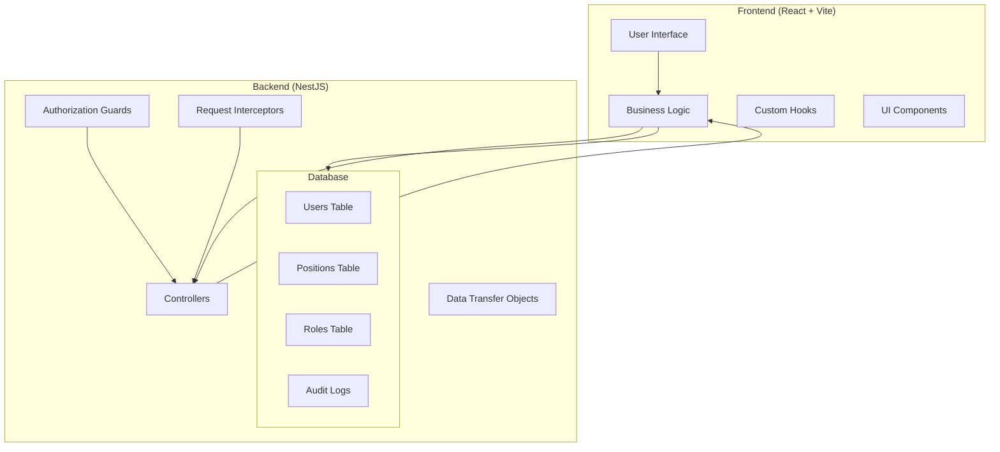
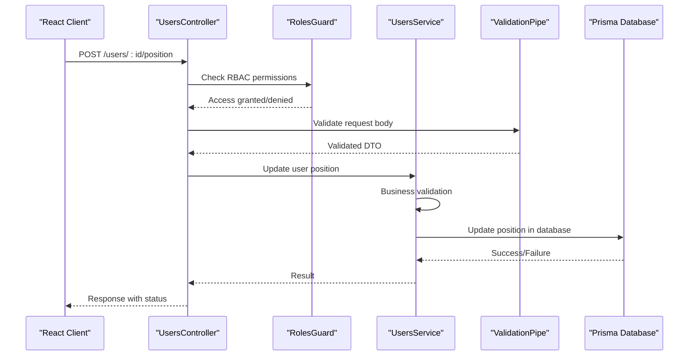
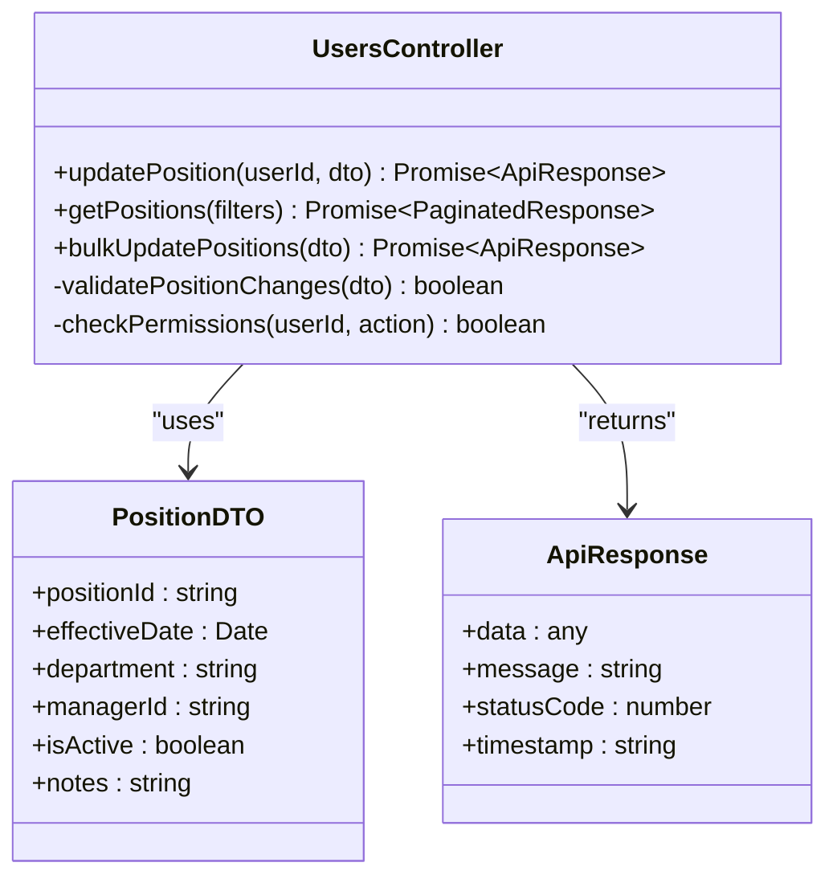
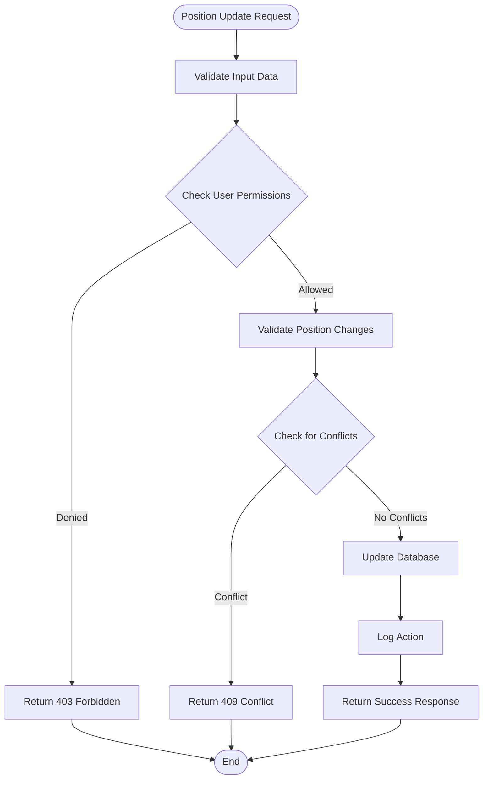
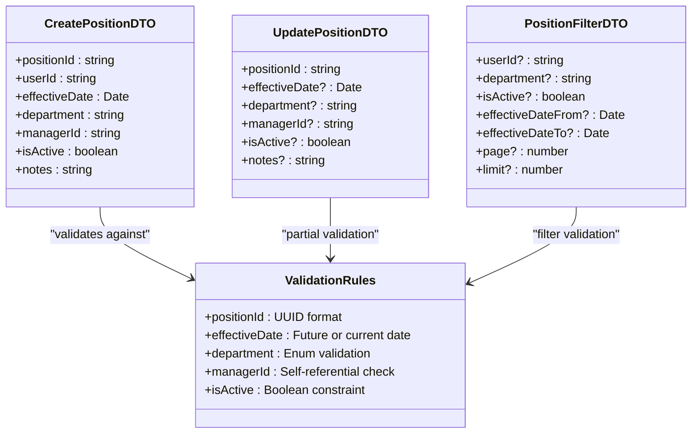
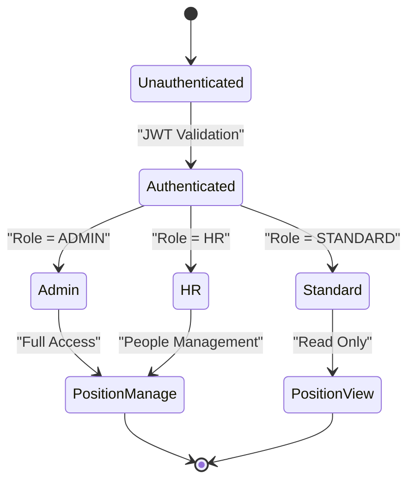
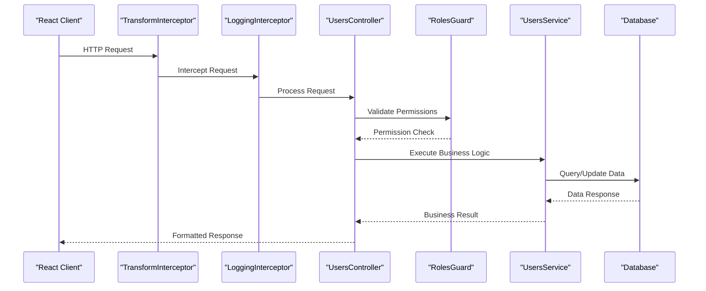

# User Position Management with Validation

<cite>
**Referenced Files in This Document**
- [users.controller.ts](file://API/src/modules/users/users.controller.ts)
- [users.service.ts](file://API/src/modules/users/users.service.ts)
- [users.dto.ts](file://API/src/modules/users/dto/users.dto.ts)
- [schema.prisma](file://API/prisma/schema.prisma)
- [user.service.ts](file://src/services/user.service.ts)
- [auth.service.ts](file://src/services/auth.service.ts)
- [roles.guard.ts](file://API/src/common/guards/roles.guard.ts)
- [current-user.decorator.ts](file://API/src/common/decorators/current-user.decorator.ts)
- [http-exception.filter.ts](file://API/src/common/filters/http-exception.filter.ts)
- [logging.interceptor.ts](file://API/src/common/interceptors/logging.interceptor.ts)
- [transform.interceptor.ts](file://API/src/common/interceptors/transform.interceptor.ts)
</cite>

## Table of Contents
1. [Introduction](#introduction)
2. [Project Structure Overview](#project-structure-overview)
3. [Core Components](#core-components)
4. [Architecture Overview](#architecture-overview)
5. [Detailed Component Analysis](#detailed-component-analysis)
6. [Validation System](#validation-system)
7. [Security and Authorization](#security-and-authorization)
8. [Data Flow and Processing](#data-flow-and-processing)
9. [Error Handling](#error-handling)
10. [Performance Considerations](#performance-considerations)
11. [Troubleshooting Guide](#troubleshooting-guide)
12. [Conclusion](#conclusion)

## Introduction

This document provides comprehensive documentation for the User Position Management system with validation capabilities in Windlog, a web-based management system for wind energy technicians. The system implements a robust NestJS backend with React frontend, featuring secure user position management through role-based access control (RBAC), comprehensive validation, and audit logging.

The system supports three distinct roles: ADMIN (full access), HR (people management), and STANDARD (restricted access), ensuring proper authorization for position-related operations while maintaining data integrity through multi-layered validation.

## Project Structure Overview

The Windlog application follows a modular architecture with clear separation between frontend and backend concerns:



**Diagram sources**
- [users.controller.ts](file://API/src/modules/users/users.controller.ts)
- [users.service.ts](file://API/src/modules/users/users.service.ts)
- [schema.prisma](file://API/prisma/schema.prisma)

**Section sources**
- [README.md](file://README.md)

## Core Components

### User Position Management Architecture

The user position management system consists of several key components working together to provide secure and validated position operations:

#### Backend Components
- **Users Controller**: Handles HTTP requests for position management endpoints
- **Users Service**: Implements business logic for position validation and management
- **DTOs**: Define request/response schemas with validation rules
- **Guards**: Enforce role-based access control
- **Interceptors**: Handle logging, transformation, and error processing

#### Frontend Components
- **User Service**: Manages API communication and state synchronization
- **Hooks**: Provide reusable logic for mutations and queries
- **Components**: Handle user interface interactions and form validation

**Section sources**
- [users.controller.ts](file://API/src/modules/users/users.controller.ts)
- [users.service.ts](file://API/src/modules/users/users.service.ts)
- [users.dto.ts](file://API/src/modules/users/dto/users.dto.ts)

## Architecture Overview

The system follows a layered architecture pattern with clear separation of concerns:



**Diagram sources**
- [users.controller.ts](file://API/src/modules/users/users.controller.ts)
- [roles.guard.ts](file://API/src/common/guards/roles.guard.ts)
- [users.service.ts](file://API/src/modules/users/users.service.ts)

## Detailed Component Analysis

### Users Controller Analysis

The users controller serves as the entry point for all position management operations, implementing RESTful endpoints with proper HTTP semantics:



**Diagram sources**
- [users.controller.ts](file://API/src/modules/users/users.controller.ts)
- [users.dto.ts](file://API/src/modules/users/dto/users.dto.ts)

Key responsibilities:
- Request validation using DTOs
- Role-based authorization checks
- Delegation to service layer for business logic
- Consistent response formatting

**Section sources**
- [users.controller.ts](file://API/src/modules/users/users.controller.ts)

### Users Service Analysis

The users service contains the core business logic for position management, including validation rules and data integrity checks:



**Diagram sources**
- [users.service.ts](file://API/src/modules/users/users.service.ts)

Validation rules implemented:
- Position hierarchy validation
- Effective date constraints
- Manager-subordinate relationship checks
- Department consistency validation
- Active position conflict resolution

**Section sources**
- [users.service.ts](file://API/src/modules/users/users.service.ts)

### DTO Validation System

The DTOs define strict validation schemas for all position-related operations:



**Diagram sources**
- [users.dto.ts](file://API/src/modules/users/dto/users.dto.ts)

**Section sources**
- [users.dto.ts](file://API/src/modules/users/dto/users.dto.ts)

## Validation System

The validation system operates at multiple layers to ensure data integrity and security:

### Request-Level Validation
- **DTO Validation**: Strict schema validation using class-validator decorators
- **Parameter Validation**: URL parameter and query string validation
- **Header Validation**: Authentication and content-type validation

### Business Logic Validation
- **Position Hierarchy**: Ensures proper reporting relationships
- **Temporal Constraints**: Validates effective dates and overlapping positions
- **Department Rules**: Enforces department-specific position policies
- **Manager Validation**: Prevents circular reporting relationships

### Database-Level Validation
- **Foreign Key Constraints**: Maintains referential integrity
- **Unique Constraints**: Prevents duplicate active positions
- **Check Constraints**: Enforces business rules at database level

**Section sources**
- [users.dto.ts](file://API/src/modules/users/dto/users.dto.ts)
- [users.service.ts](file://API/src/modules/users/users.service.ts)

## Security and Authorization

### Role-Based Access Control (RBAC)

The system implements a three-tier RBAC model:



**Diagram sources**
- [roles.guard.ts](file://API/src/common/guards/roles.guard.ts)
- [current-user.decorator.ts](file://API/src/common/decorators/current-user.decorator.ts)

### JWT Token Validation
- **Token Format**: Bearer token with standard claims
- **Payload Structure**: Contains userId, email, and role information
- **Expiration Handling**: Automatic token refresh and validation
- **Security Headers**: Proper CORS and security header configuration

**Section sources**
- [roles.guard.ts](file://API/src/common/guards/roles.guard.ts)
- [current-user.decorator.ts](file://API/src/common/decorators/current-user.decorator.ts)

## Data Flow and Processing

### Request Processing Pipeline



**Diagram sources**
- [logging.interceptor.ts](file://API/src/common/interceptors/logging.interceptor.ts)
- [transform.interceptor.ts](file://API/src/common/interceptors/transform.interceptor.ts)
- [users.controller.ts](file://API/src/modules/users/users.controller.ts)

### Data Transformation
- **Input Transformation**: Request body sanitization and normalization
- **Output Transformation**: Consistent response formatting
- **Error Transformation**: Standardized error responses
- **Pagination Handling**: Efficient data retrieval with filtering

**Section sources**
- [logging.interceptor.ts](file://API/src/common/interceptors/logging.interceptor.ts)
- [transform.interceptor.ts](file://API/src/common/interceptors/transform.interceptor.ts)

## Error Handling

The system implements comprehensive error handling across all layers:

### Exception Filter
- **HTTP Exceptions**: Centralized HTTP error handling
- **Validation Errors**: Structured validation error responses
- **Business Errors**: Domain-specific error messages
- **System Errors**: Graceful degradation and logging

### Error Response Format
All errors follow a consistent format:
```json
{
  "error": "Error Category",
  "message": "Human-readable message",
  "statusCode": 400,
  "timestamp": "2024-01-01T00:00:00Z",
  "path": "/api/users/position"
}
```

**Section sources**
- [http-exception.filter.ts](file://API/src/common/filters/http-exception.filter.ts)

## Performance Considerations

### Database Optimization
- **Indexing Strategy**: Optimized indexes for common queries
- **Query Optimization**: Efficient Prisma queries with proper relations
- **Connection Pooling**: Configured database connection management
- **Caching Strategy**: Redis caching for frequently accessed data

### API Performance
- **Response Caching**: HTTP caching headers for static data
- **Pagination**: Efficient pagination for large datasets
- **Lazy Loading**: Deferred loading of related entities
- **Batch Operations**: Bulk operations for multiple updates

### Frontend Optimization
- **Query Caching**: TanStack Query for efficient data caching
- **Optimistic Updates**: Immediate UI feedback for user actions
- **Code Splitting**: Lazy loading of route components
- **Image Optimization**: Compressed and cached media assets

## Troubleshooting Guide

### Common Issues and Solutions

#### Authentication Problems
- **Invalid Token**: Verify JWT token expiration and signature
- **Permission Denied**: Check user role and endpoint permissions
- **Session Issues**: Clear browser cache and re-authenticate

#### Validation Errors
- **Schema Validation**: Ensure DTO fields match expected types
- **Business Rules**: Review position hierarchy and temporal constraints
- **Database Constraints**: Check foreign key relationships

#### Performance Issues
- **Slow Queries**: Analyze database query plans and add indexes
- **Memory Leaks**: Monitor memory usage and garbage collection
- **Network Latency**: Optimize API calls and implement caching

### Debugging Tools
- **Logging**: Comprehensive request/response logging
- **Error Tracking**: Centralized error monitoring and alerting
- **Performance Monitoring**: APM integration for bottleneck identification
- **Database Profiling**: Query performance analysis

**Section sources**
- [http-exception.filter.ts](file://API/src/common/filters/http-exception.filter.ts)
- [logging.interceptor.ts](file://API/src/common/interceptors/logging.interceptor.ts)

## Conclusion

The User Position Management system with validation in Windlog provides a robust, secure, and scalable solution for managing user positions within the wind energy management platform. The implementation follows best practices for NestJS development, including proper separation of concerns, comprehensive validation, role-based access control, and thorough error handling.

Key strengths of the system include:
- Multi-layered validation ensuring data integrity
- Flexible RBAC supporting different user roles
- Comprehensive audit logging for compliance
- Efficient database operations with proper indexing
- Responsive frontend with optimistic updates
- Scalable architecture supporting future growth

The system is designed to handle complex organizational hierarchies while maintaining data consistency and providing an excellent user experience for HR administrators managing wind energy technician positions.