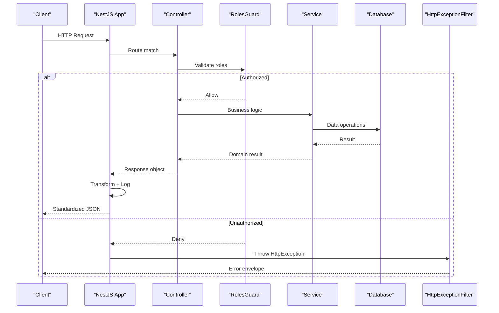
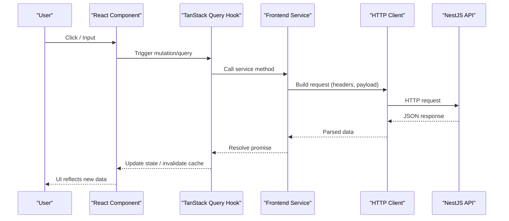
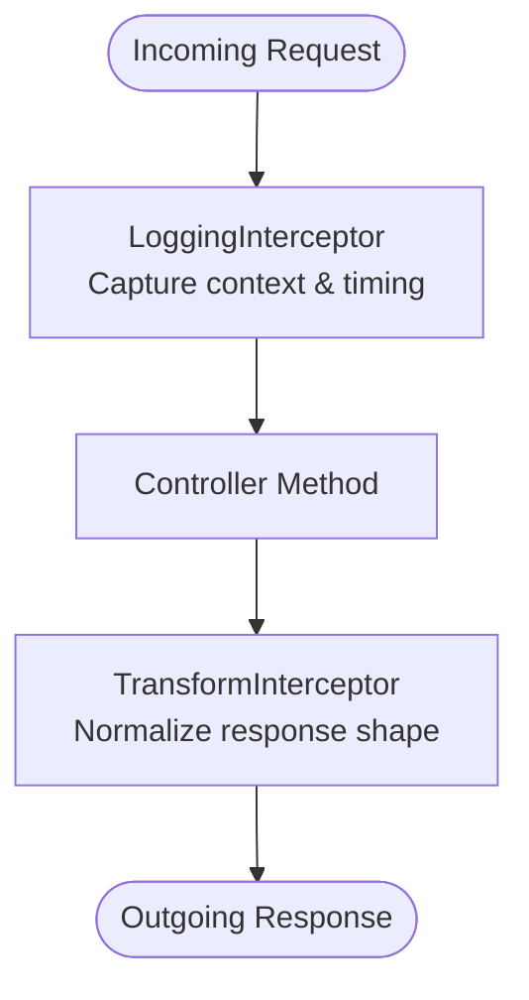
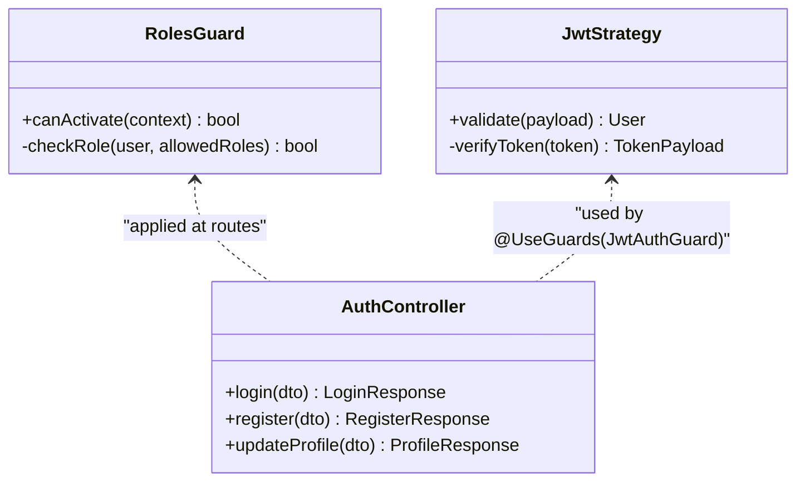

# Request Flow

<cite>
**Referenced Files in This Document**
- [main.ts](file://API/src/main.ts)
- [app.module.ts](file://API/src/app.module.ts)
- [auth.controller.ts](file://API/src/modules/auth/auth.controller.ts)
- [auth.service.ts](file://API/src/modules/auth/auth.service.ts)
- [jwt.strategy.ts](file://API/src/modules/auth/strategies/jwt.strategy.ts)
- [roles.guard.ts](file://API/src/common/guards/roles.guard.ts)
- [logging.interceptor.ts](file://API/src/common/interceptors/logging.interceptor.ts)
- [transform.interceptor.ts](file://API/src/common/interceptors/transform.interceptor.ts)
- [http-exception.filter.ts](file://API/src/common/filters/http-exception.filter.ts)
- [api.ts](file://src/services/api.ts)
- [auth.service.ts](file://src/services/auth.service.ts)
</cite>

## Table of Contents
- Fluxo Backend (Request → Response)
- Fluxo Frontend (User Action → UI Update)
- Pipeline de Interceptors
- Middleware e Guards

## Fluxo Backend (Request → Response)
This section explains how a NestJS request travels from the HTTP server to the controller, through guards and interceptors, into the service layer, and back to the client with a standardized response.

Key steps:
- Application bootstrap registers global interceptors, filters, and authentication strategy.
- Incoming HTTP requests are routed by controllers based on path and HTTP method.
- Guards validate authorization (e.g., roles).
- Interceptors transform responses and log execution details.
- Services perform business logic and data access.
- A global exception filter normalizes error responses.

**Section sources**
- [main.ts](file://API/src/main.ts)
- [app.module.ts](file://API/src/app.module.ts)
- [auth.controller.ts](file://API/src/modules/auth/auth.controller.ts)
- [auth.service.ts](file://API/src/modules/auth/auth.service.ts)
- [roles.guard.ts](file://API/src/common/guards/roles.guard.ts)
- [logging.interceptor.ts](file://API/src/common/interceptors/logging.interceptor.ts)
- [transform.interceptor.ts](file://API/src/common/interceptors/transform.interceptor.ts)
- [http-exception.filter.ts](file://API/src/common/filters/http-exception.filter.ts)

## Fluxo Frontend (User Action → UI Update)
This section describes how a user interaction in the React frontend triggers an API call via TanStack Query, handles success/error states, and updates the UI.

Typical flow:
- User action triggers a mutation or query hook.
- The service layer builds the HTTP request using the configured API client.
- TanStack Query manages caching, retries, and invalidation.
- On success, components re-render with updated data; on error, they display messages.

**Section sources**
- [api.ts](file://src/services/api.ts)
- [auth.service.ts](file://src/services/auth.service.ts)

## Pipeline de Interceptors
Interceptors wrap controller execution to add cross-cutting concerns such as logging and response transformation.

- LoggingInterceptor records request metadata and duration for auditability.
- TransformInterceptor standardizes response envelopes and maps errors consistently.

**Section sources**
- [logging.interceptor.ts](file://API/src/common/interceptors/logging.interceptor.ts)
- [transform.interceptor.ts](file://API/src/common/interceptors/transform.interceptor.ts)

## Middleware e Guards
Guards enforce authorization policies before controller methods execute. In this project, RBAC is implemented via a roles guard that validates the role claim from the JWT payload.

- RolesGuard checks the authenticated user’s role against the required roles defined on the route/controller.
- Authentication is handled by a JWT strategy that extracts and validates tokens from the Authorization header.

**Section sources**
- [roles.guard.ts](file://API/src/common/guards/roles.guard.ts)
- [jwt.strategy.ts](file://API/src/modules/auth/strategies/jwt.strategy.ts)
- [auth.controller.ts](file://API/src/modules/auth/auth.controller.ts)