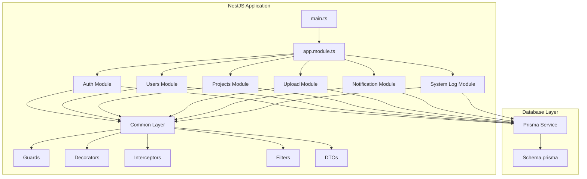
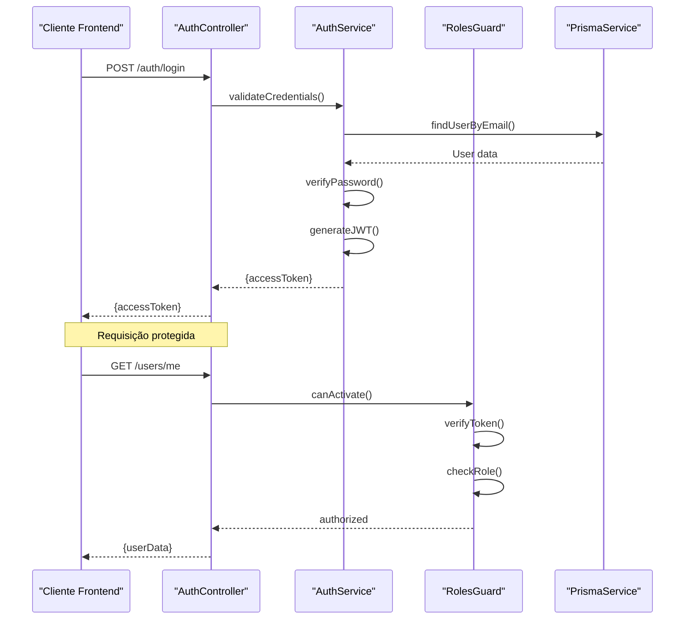
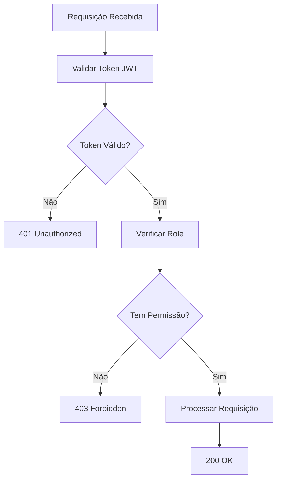

# Guia para Agentes de IA

<cite>
**Referenced Files in This Document**
- [API/src/main.ts](file://API/src/main.ts)
- [API/src/app.module.ts](file://API/src/app.module.ts)
- [API/prisma/schema.prisma](file://API/prisma/schema.prisma)
- [src/App.tsx](file://src/App.tsx)
- [API/src/common/guards/roles.guard.ts](file://API/src/common/guards/roles.guard.ts)
- [API/src/config/env.validation.ts](file://API/src/config/env.validation.ts)
- [API/src/database/prisma.service.ts](file://API/src/database/prisma.service.ts)
- [src/services/api.ts](file://src/services/api.ts)
- [API/src/modules/auth/auth.controller.ts](file://API/src/modules/auth/auth.controller.ts)
- [API/src/modules/auth/auth.service.ts](file://API/src/modules/auth/auth.service.ts)
- [API/src/common/decorators/roles.decorator.ts](file://API/src/common/decorators/roles.decorator.ts)
- [API/src/common/interceptors/logging.interceptor.ts](file://API/src/common/interceptors/logging.interceptor.ts)
- [API/src/common/filters/http-exception.filter.ts](file://API/src/common/filters/http-exception.filter.ts)
- [src/utils/jwt.ts](file://src/utils/jwt.ts)
- [src/i18n/index.ts](file://src/i18n/index.ts)
</cite>

## Antes de Modificar Código

### Pré-requisitos Essenciais

Antes de qualquer modificação no código, os agentes de IA devem compreender e seguir estas regras fundamentais:

**Idioma do Código**: 
- Variáveis, funções e classes devem ser escritas em inglês
- Comentários e documentação devem ser em português brasileiro (PT-BR)
- Estilo didático e explicativo nos comentários

**Arquitetura do Projeto**:
- Monorepo com frontend React (Vite) e backend NestJS
- Comunicação via REST API
- Autenticação JWT Bearer Token
- RBAC (Role-Based Access Control) com 3 roles: ADMIN, HR, STANDARD

**Padrões de Dados**:
- UUID como ID principal de todas as entidades
- Soft delete com campo `deletedAt`
- Timestamps sempre em UTC
- Moeda oficial: Euro (€)
- Locale padrão: pt-PT para formatação

**Formato de Respostas**:
- Sucesso: `{ data, message, statusCode, timestamp }`
- Erro: `{ error, message, statusCode, timestamp, path }`

### Ambiente de Desenvolvimento

**Variáveis de Ambiente**:
- Configuração validada via `env.validation.ts`
- Conexão com banco de dados via Prisma
- Configurações de upload de arquivos
- Chaves de autenticação JWT

**Dependências Críticas**:
- NestJS framework para backend
- React + Vite para frontend
- TanStack Query para gerenciamento de estado
- Prisma ORM para banco de dados
- Multer para upload de arquivos

**Section sources**
- [API/src/config/env.validation.ts](file://API/src/config/env.validation.ts)
- [API/src/database/prisma.service.ts](file://API/src/database/prisma.service.ts)
- [src/services/api.ts](file://src/services/api.ts)

## Regras de Arquitetura

### Estrutura Modular Backend

O backend segue uma arquitetura modular estrita com NestJS:

**Diagram sources**
- [API/src/app.module.ts](file://API/src/app.module.ts)
- [API/prisma/schema.prisma](file://API/prisma/schema.prisma)

### Fluxo de Autenticação e Autorização

**Diagram sources**
- [API/src/modules/auth/auth.controller.ts](file://API/src/modules/auth/auth.controller.ts)
- [API/src/modules/auth/auth.service.ts](file://API/src/modules/auth/auth.service.ts)
- [API/src/common/guards/roles.guard.ts](file://API/src/common/guards/roles.guard.ts)

### Padrões de Middleware e Interceptores

**Logging Interceptor**:
- Captura todas as requisições HTTP
- Registra tempo de processamento
- Armazena logs no sistema de logging centralizado

**Transform Interceptor**:
- Padroniza respostas da API
- Aplica formato consistente de sucesso/erro

**HTTP Exception Filter**:
- Centraliza tratamento de erros
- Formata mensagens de erro consistentemente

**Section sources**
- [API/src/common/interceptors/logging.interceptor.ts](file://API/src/common/interceptors/logging.interceptor.ts)
- [API/src/common/filters/http-exception.filter.ts](file://API/src/common/filters/http-exception.filter.ts)

## Regras de Nomenclatura

### Convenções de Nomenclatura Backend

**Classes e Módulos**:
- PascalCase para classes: `AuthService`, `UserController`, `ProjectService`
- Sufixo `Module` para módulos NestJS: `AuthModule`, `UsersModule`
- Sufixo `Controller` para controladores: `AuthController`, `UsersController`
- Sufixo `Service` para serviços: `AuthService`, `UserService`

**Arquivos e Diretórios**:
- camelCase para arquivos: `auth.controller.ts`, `user.service.ts`
- Diretórios em plural: `modules/users/`, `modules/projects/`
- DTOs em diretório `dto/`: `login.dto.ts`, `register.dto.ts`

**Variáveis e Funções**:
- camelCase para variáveis: `userId`, `userName`, `isActive`
- camelCase para funções: `getUserById()`, `validateEmail()`
- Booleanos com prefixo `is`, `has`, `can`: `isValid`, `hasPermission`

### Convenções de Nomenclatura Frontend

**Componentes React**:
- PascalCase para componentes: `UserProfile.tsx`, `LoginForm.tsx`
- Sufixo `Page` para páginas: `HomePage.tsx`, `SettingsPage.tsx`
- Sufixo `Component` ou nome descritivo para componentes reutilizáveis

**Hooks Personalizados**:
- Prefixo `use`: `useProfileMutations`, `useFileUrl`
- camelCase para nomes: `useAuth`, `useNotifications`

**Serviços e Utilitários**:
- camelCase para serviços: `api.ts`, `auth.service.ts`
- Sufixo `.service.ts` para serviços de API
- Sufixo `.utils.ts` para utilitários

### Nomenclatura de Banco de Dados

**Tabelas**:
- Plural em snake_case: `users`, `projects`, `notifications`
- Campos relacionais: `user_id`, `project_id`
- Timestamps: `created_at`, `updated_at`, `deleted_at`

**Campos Especiais**:
- UUID: `id` (primary key)
- Soft delete: `deleted_at`
- Status: `status`, `is_active`
- JSON fields: `metadata`, `settings`

**Section sources**
- [API/src/modules/auth/auth.controller.ts](file://API/src/modules/auth/auth.controller.ts)
- [API/src/modules/users/users.controller.ts](file://API/src/modules/users/users.controller.ts)
- [src/pages/home/HomePage.tsx](file://src/pages/home/HomePage.tsx)
- [src/hooks/useProfileMutations.ts](file://src/hooks/useProfileMutations.ts)

## Regras de Segurança

### Autenticação e Autorização

**JWT Configuration**:
- Tokens expiram após tempo configurado
- Payload contém: `{ sub: userId, email, role }`
- Nunca usar `user.id` - sempre usar `sub` do token JWT
- Segredo JWT armazenado em variáveis de ambiente

**RBAC Implementation**:

**Diagram sources**
- [API/src/common/guards/roles.guard.ts](file://API/src/common/guards/roles.guard.ts)
- [API/src/common/decorators/roles.decorator.ts](file://API/src/common/decorators/roles.decorator.ts)

**Roles e Permissões**:
- `ADMIN`: Acesso total ao sistema
- `HR`: Gestão de usuários e configurações de RH
- `STANDARD`: Acesso restrito a funcionalidades básicas

### Validação de Entrada

**DTO Validation**:
- Todas as entradas devem ser validadas via DTOs
- Uso de class-validator para validação
- Mensagens de erro em PT-BR via i18n
- Sanitização de inputs antes do processamento

**Upload de Arquivos**:
- Validação de MIME type
- Limite de tamanho configurável
- Nome de arquivo sanitizado
- Armazenamento seguro em servidor

### Proteção de Rotas

**Rotas Públicas**:
- `/auth/login`
- `/auth/register`
- `/upload/files/:token` (temporário)

**Rotas Protegidas**:
- Todas as outras rotas requerem autenticação
- Verificação de role via decorator `@Roles()`
- Logging de tentativas de acesso não autorizado

**Section sources**
- [API/src/modules/auth/auth.service.ts](file://API/src/modules/auth/auth.service.ts)
- [src/utils/jwt.ts](file://src/utils/jwt.ts)
- [API/src/modules/upload/upload.controller.ts](file://API/src/modules/upload/upload.controller.ts)

## Validação Pós-Modificação

### Checklist de Qualidade

**Backend**:
- [ ] Todas as rotas têm validação de entrada via DTOs
- [ ] Tratamento de erros implementado em todos os endpoints
- [ ] Logs adequados para auditoria e debugging
- [ ] Testes unitários cobrem lógica crítica
- [ ] Documentação Swagger atualizada
- [ ] Variáveis de ambiente validadas

**Frontend**:
- [ ] Componentes seguem padrões de nomenclatura
- [ ] Hooks personalizados usam convenção `use*`
- [ ] Textos localizados via i18n
- [ ] Tratamento de erros de API implementado
- [ ] Loading states gerenciados corretamente
- [ ] Acessibilidade verificada

**Segurança**:
- [ ] Nenhuma informação sensível em logs
- [ ] Validação de input em todas as entradas
- [ ] Headers de segurança configurados
- [ ] CORS configurado corretamente
- [ ] Senhas hashadas adequadamente

### Testes e Debugging

**Testes Unitários**:
- Cobertura mínima de 80% para lógica de negócio
- Mock de dependências externas
- Testes de integração para endpoints críticos

**Debugging**:
- Logging estruturado com contexto completo
- Tracing de requisições através do sistema
- Métricas de performance coletadas

**Deploy**:
- Build otimizado para produção
- Variáveis de ambiente validadas
- Rollback strategy definida
- Monitoramento ativo

### Integração Contínua

**Pipeline de CI/CD**:
- Linting automático
- Testes automatizados
- Build verificado
- Deploy automatizado em staging

**Monitoramento**:
- Health checks implementados
- Métricas de performance
- Alertas para erros críticos
- Logs centralizados

**Section sources**
- [API/src/common/interceptors/logging.interceptor.ts](file://API/src/common/interceptors/logging.interceptor.ts)
- [API/src/common/filters/http-exception.filter.ts](file://API/src/common/filters/http-exception.filter.ts)
- [src/services/api.ts](file://src/services/api.ts)