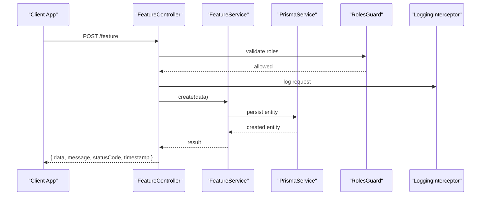
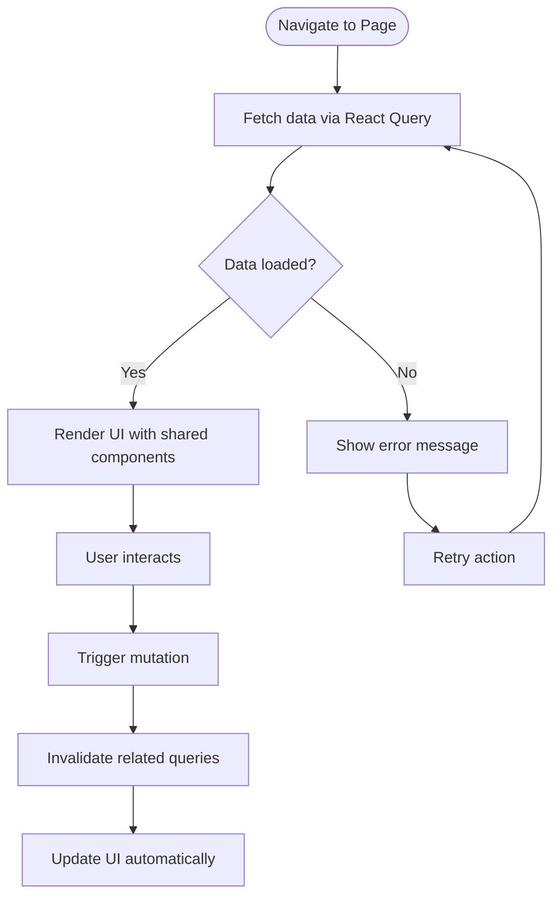
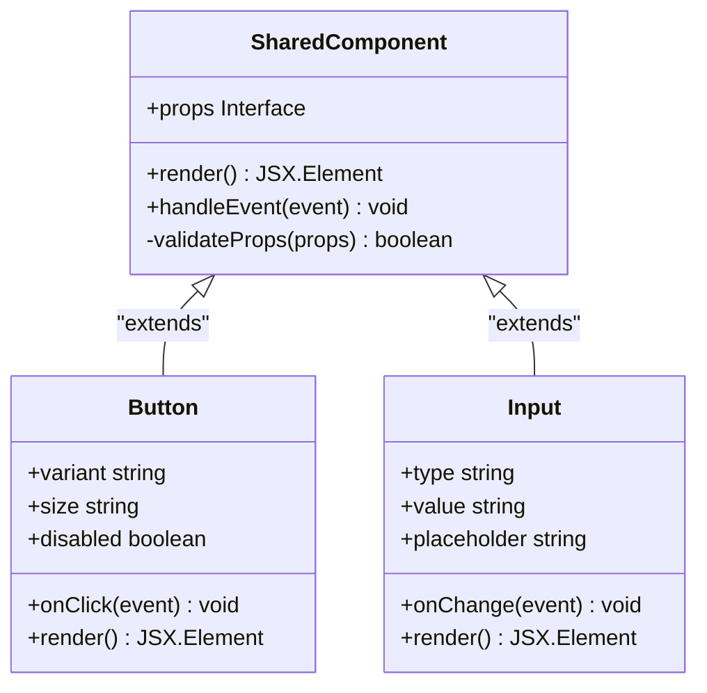
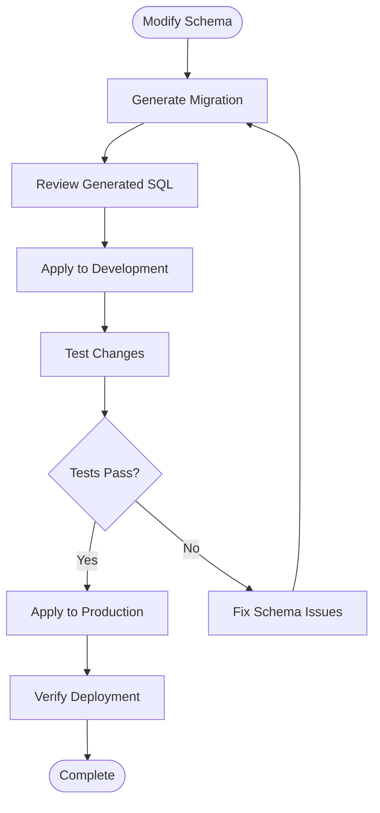

# Guide for New Features

<cite>
**Referenced Files in This Document**
- [app.module.ts](file://API/src/app.module.ts)
- [main.ts](file://API/src/main.ts)
- [auth.controller.ts](file://API/src/modules/auth/auth.controller.ts)
- [auth.service.ts](file://API/src/modules/auth/auth.service.ts)
- [auth.module.ts](file://API/src/modules/auth/auth.module.ts)
- [jwt.strategy.ts](file://API/src/modules/auth/strategies/jwt.strategy.ts)
- [roles.guard.ts](file://API/src/common/guards/roles.guard.ts)
- [roles.decorator.ts](file://API/src/common/decorators/roles.decorator.ts)
- [http-exception.filter.ts](file://API/src/common/filters/http-exception.filter.ts)
- [logging.interceptor.ts](file://API/src/common/interceptors/logging.interceptor.ts)
- [transform.interceptor.ts](file://API/src/common/interceptors/transform.interceptor.ts)
- [api-response.dto.ts](file://API/src/common/dto/api-response.dto.ts)
- [pagination.dto.ts](file://API/src/common/dto/pagination.dto.ts)
- [env.validation.ts](file://API/src/config/env.validation.ts)
- [prisma.service.ts](file://API/src/database/prisma.service.ts)
- [schema.prisma](file://API/prisma/schema.prisma)
- [App.tsx](file://src/App.tsx)
- [main.tsx](file://src/main.tsx)
- [api.ts](file://src/services/api.ts)
- [auth.service.ts](file://src/services/auth.service.ts)
- [project.service.ts](file://src/services/project.service.ts)
- [NotificationBell.tsx](file://src/components/notifications/NotificationBell.tsx)
- [Button.tsx](file://src/components/ui/Button.tsx)
- [DataTable.tsx](file://src/components/ui/DataTable.tsx)
- [Input.tsx](file://src/components/ui/Input.tsx)
- [HomePage.tsx](file://src/pages/home/HomePage.tsx)
- [ProjectsPage.tsx](file://src/pages/projects/ProjectsPage.tsx)
- [ProjectDetailPage.tsx](file://src/pages/projects/detail/ProjectDetailPage.tsx)
- [useProfileMutations.ts](file://src/pages/profile/hooks/useProfileMutations.ts)
- [i18n/index.ts](file://src/i18n/index.ts)
- [common.json](file://src/i18n/locales/pt/common.json)
- [projects.json](file://src/i18n/locales/pt/projects.json)
- [jwt.ts](file://src/utils/jwt.ts)
- [notificationHelpers.ts](file://src/utils/notificationHelpers.ts)
</cite>

## Table of Contents
- Novo Endpoint Backend
- Nova Página Frontend
- Novo Componente Compartilhado
- Nova Migration
- Checklist de Entrega

## Novo Endpoint Backend
This section explains how to add a new NestJS API endpoint following the project’s patterns: module, controller, service, DTOs, guards, interceptors, and response formatting.

- Create a feature module
  - Define a module file with providers (service), controllers, and imports (PrismaService, JWT strategy if needed).
  - Register the module in the application root module so routes are discovered at startup.
  - Ensure dependency injection is consistent across controllers and services.

- Implement controller endpoints
  - Use decorators for route definitions, request validation via DTOs, and role-based access control (@Roles + RolesGuard).
  - Apply global interceptors for logging and response transformation where appropriate.
  - Return standardized responses using the common API response DTO.

- Implement service logic
  - Encapsulate business rules and data access through PrismaService.
  - Validate inputs, handle errors, and return structured results.
  - Keep side effects (like logging user actions) explicit and traceable.

- Authentication and authorization
  - Protect endpoints with JWT Bearer tokens; extract user context from the token payload (sub = userId, email, role).
  - Enforce RBAC using @Roles() decorator and RolesGuard.
  - Never use user.id; always use sub from the JWT payload as the user identifier.

- Validation and error handling
  - Use DTOs with class-validator decorators for input validation.
  - Centralize HTTP exceptions via the custom filter to ensure consistent error payloads.
  - Log all requests/responses and important actions via LoggingInterceptor and SystemLogService.

- Response format
  - Success: { data, message, statusCode, timestamp }
  - Error: { error, message, statusCode, timestamp, path }
  - Use transform interceptor to normalize responses and errors.

- Pagination and filtering
  - Use pagination DTOs for list endpoints to support page, limit, and sort parameters.
  - Apply filters consistently across list endpoints.

- File uploads
  - Use Multer configuration for secure uploads with MIME type and size validation.
  - Provide temporary URLs via /upload/files/:token for safe access.

- Environment configuration
  - Validate environment variables at startup to prevent runtime issues.
  - Store secrets securely and reference them in services/controllers.

**Section sources**
- [app.module.ts](file://API/src/app.module.ts)
- [main.ts](file://API/src/main.ts)
- [auth.controller.ts](file://API/src/modules/auth/auth.controller.ts)
- [auth.service.ts](file://API/src/modules/auth/auth.service.ts)
- [auth.module.ts](file://API/src/modules/auth/auth.module.ts)
- [jwt.strategy.ts](file://API/src/modules/auth/strategies/jwt.strategy.ts)
- [roles.guard.ts](file://API/src/common/guards/roles.guard.ts)
- [roles.decorator.ts](file://API/src/common/decorators/roles.decorator.ts)
- [http-exception.filter.ts](file://API/src/common/filters/http-exception.filter.ts)
- [logging.interceptor.ts](file://API/src/common/interceptors/logging.interceptor.ts)
- [transform.interceptor.ts](file://API/src/common/interceptors/transform.interceptor.ts)
- [api-response.dto.ts](file://API/src/common/dto/api-response.dto.ts)
- [pagination.dto.ts](file://API/src/common/dto/pagination.dto.ts)
- [env.validation.ts](file://API/src/config/env.validation.ts)
- [prisma.service.ts](file://API/src/database/prisma.service.ts)

## Nova Página Frontend
This section outlines how to add a new React page following the project’s structure, state management, i18n, and design system conventions.

- Page structure
  - Create a new folder under src/pages with a main page component and optional subcomponents.
  - Follow naming conventions: PascalCase for components, kebab-case for folders.

- Routing and navigation
  - Register the new route in the application router.
  - Ensure proper layout wrapping (AppLayout) and breadcrumbs if applicable.

- Data fetching and caching
  - Use TanStack Query (React Query) for data operations.
  - Wrap API calls with query hooks for automatic caching, refetching, and error handling.
  - Invalidate related queries after mutations to keep UI in sync.

- State management
  - Use local state for UI-only data and global cache for server state.
  - For complex forms, consider form libraries with validation integrated with TanStack Form or similar.

- Internationalization (i18n)
  - Add translations under src/i18n/locales/pt for all visible text.
  - Use namespace 'common' for shared texts; avoid hardcoded strings.

- Design system
  - Use Tailwind CSS v4 utility classes for styling.
  - Reuse shared UI components (Button, Input, DataTable) for consistency.
  - Follow Apple-inspired minimalism: clean spacing, neutral colors, blue accents.

- Error handling and loading states
  - Display user-friendly messages using notification helpers.
  - Show loading indicators during async operations.

**Section sources**
- [App.tsx](file://src/App.tsx)
- [main.tsx](file://src/main.tsx)
- [api.ts](file://src/services/api.ts)
- [auth.service.ts](file://src/services/auth.service.ts)
- [project.service.ts](file://src/services/project.service.ts)
- [HomePage.tsx](file://src/pages/home/HomePage.tsx)
- [ProjectsPage.tsx](file://src/pages/projects/ProjectsPage.tsx)
- [ProjectDetailPage.tsx](file://src/pages/projects/detail/ProjectDetailPage.tsx)
- [useProfileMutations.ts](file://src/pages/profile/hooks/useProfileMutations.ts)
- [i18n/index.ts](file://src/i18n/index.ts)
- [common.json](file://src/i18n/locales/pt/common.json)
- [projects.json](file://src/i18n/locales/pt/projects.json)

## Novo Componente Compartilhado
This section describes how to create reusable UI components that follow the project’s design system and TypeScript standards.

- Component structure
  - Place components in src/components/ui for shared UI elements.
  - Use functional components with TypeScript interfaces for props.
  - Export components with default or named exports as appropriate.

- Props and validation
  - Define strict prop types with TypeScript interfaces.
  - Use PropTypes or runtime validation if needed for edge cases.

- Styling conventions
  - Use Tailwind CSS utility classes for consistent styling.
  - Follow the Apple-inspired design system: minimal, clean, generous spacing, neutral colors with blue accents.

- Accessibility
  - Ensure components are accessible (ARIA attributes, keyboard navigation).
  - Test with screen readers and accessibility tools.

- Testing
  - Write unit tests for component behavior and edge cases.
  - Use testing libraries compatible with React and TypeScript.

- Documentation
  - Include JSDoc comments for public APIs.
  - Provide usage examples in Storybook or documentation files.

**Section sources**
- [Button.tsx](file://src/components/ui/Button.tsx)
- [Input.tsx](file://src/components/ui/Input.tsx)
- [DataTable.tsx](file://src/components/ui/DataTable.tsx)
- [NotificationBell.tsx](file://src/components/notifications/NotificationBell.tsx)

## Nova Migration
This section explains how to add database migrations following Prisma conventions and project standards.

- Schema changes
  - Modify schema.prisma to add, update, or remove models and fields.
  - Use UUID for primary keys and implement soft delete with deletedAt field.
  - Ensure timestamps are in UTC format.

- Migration process
  - Generate migration files using Prisma CLI commands.
  - Review generated SQL for correctness and performance implications.
  - Apply migrations to development and production environments separately.

- Data integrity
  - Use transactions for complex migrations that modify multiple tables.
  - Implement rollback strategies for failed migrations.
  - Validate data constraints and relationships before applying migrations.

- Backward compatibility
  - Plan migrations to maintain API compatibility during transitions.
  - Use feature flags for gradual rollout of schema changes.
  - Document breaking changes in migration notes.

**Section sources**
- [schema.prisma](file://API/prisma/schema.prisma)
- [prisma.service.ts](file://API/src/database/prisma.service.ts)

## Checklist de Entrega
Use this checklist to ensure all aspects of a new feature are properly implemented and tested.

### Backend Checklist
- [ ] Module created and registered in app.module.ts
- [ ] Controller with proper route decorators and validation
- [ ] Service with business logic and Prisma integration
- [ ] DTOs for request/response validation
- [ ] JWT authentication and RBAC implementation
- [ ] Error handling with custom HTTP exception filter
- [ ] Logging with LoggingInterceptor and SystemLogService
- [ ] Standardized response format implementation
- [ ] Environment variable validation
- [ ] Unit and integration tests written

### Frontend Checklist
- [ ] Page component created with proper routing
- [ ] React Query hooks for data fetching and caching
- [ ] Mutations with proper query invalidation
- [ ] i18n translations added for all visible text
- [ ] Shared UI components used consistently
- [ ] Error handling and loading states implemented
- [ ] Accessibility features included
- [ ] Unit tests for components and hooks
- [ ] Responsive design verified

### Database Checklist
- [ ] Schema changes documented and reviewed
- [ ] Migration files generated and validated
- [ ] Data integrity constraints implemented
- [ ] Rollback strategy defined
- [ ] Performance impact assessed
- [ ] Backward compatibility maintained

### Testing Checklist
- [ ] Unit tests for all new functions and components
- [ ] Integration tests for API endpoints
- [ ] E2E tests for critical user flows
- [ ] Performance tests for heavy operations
- [ ] Security tests for authentication and authorization
- [ ] Accessibility tests completed

### Documentation Checklist
- [ ] API documentation updated with new endpoints
- [ ] Component documentation with usage examples
- [ ] Migration notes and deployment instructions
- [ ] Troubleshooting guide for common issues
- [ ] Code comments and JSDoc documentation

**Section sources**
- [api-response.dto.ts](file://API/src/common/dto/api-response.dto.ts)
- [pagination.dto.ts](file://API/src/common/dto/pagination.dto.ts)
- [jwt.ts](file://src/utils/jwt.ts)
- [notificationHelpers.ts](file://src/utils/notificationHelpers.ts)