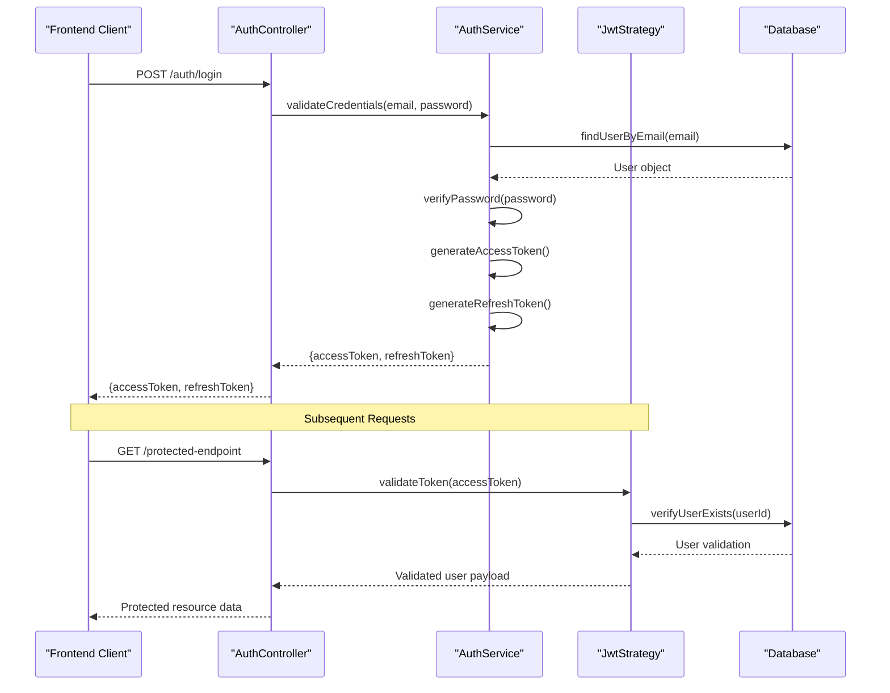
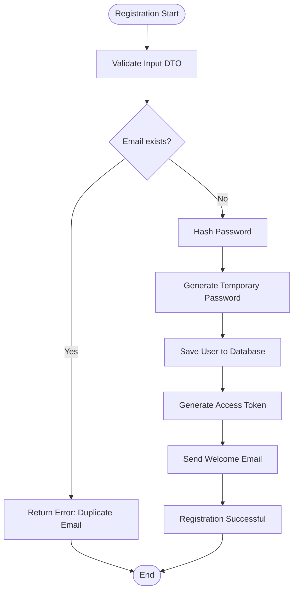
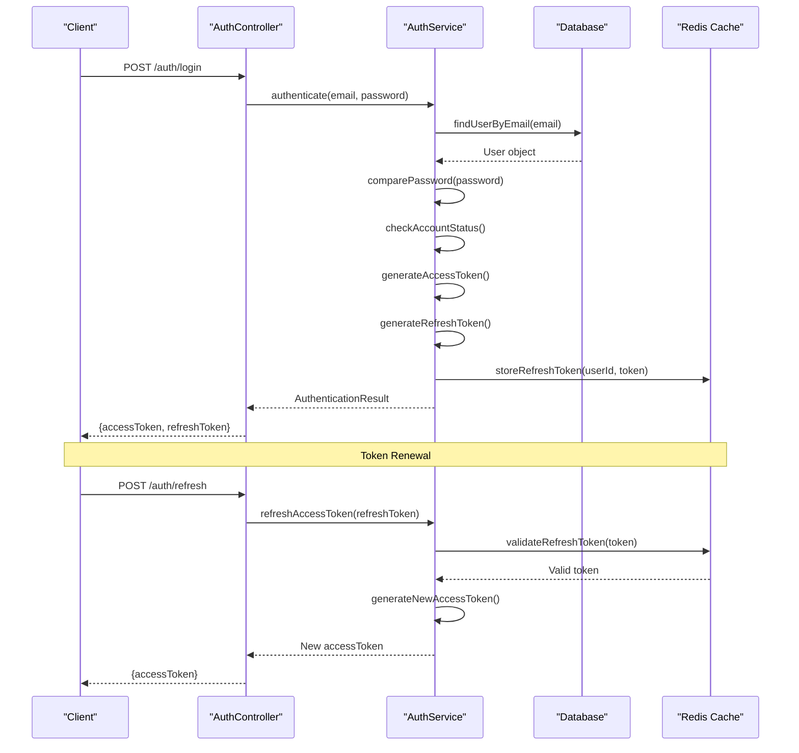
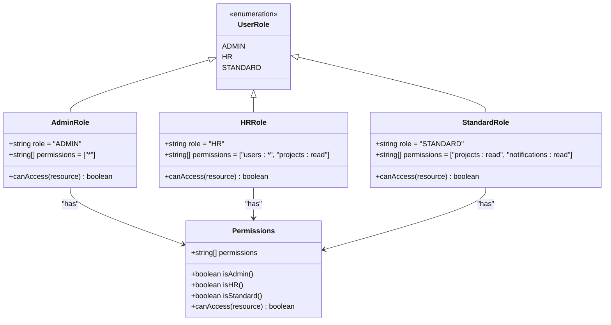
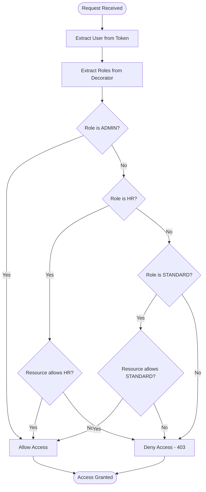
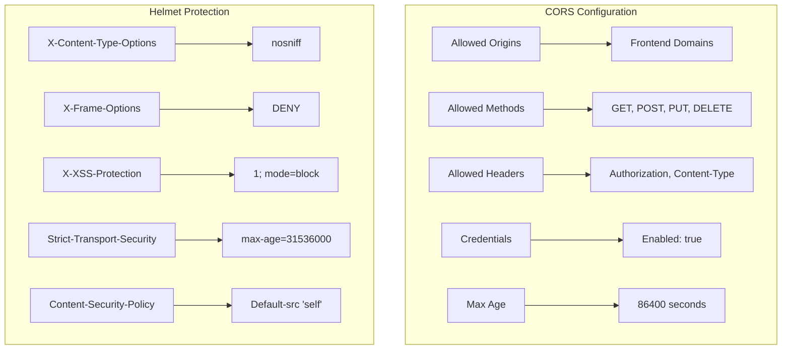
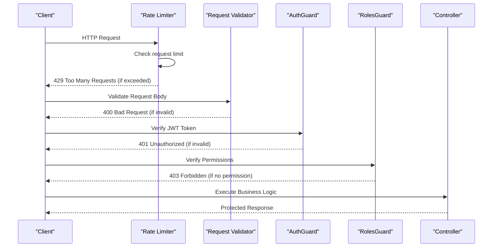
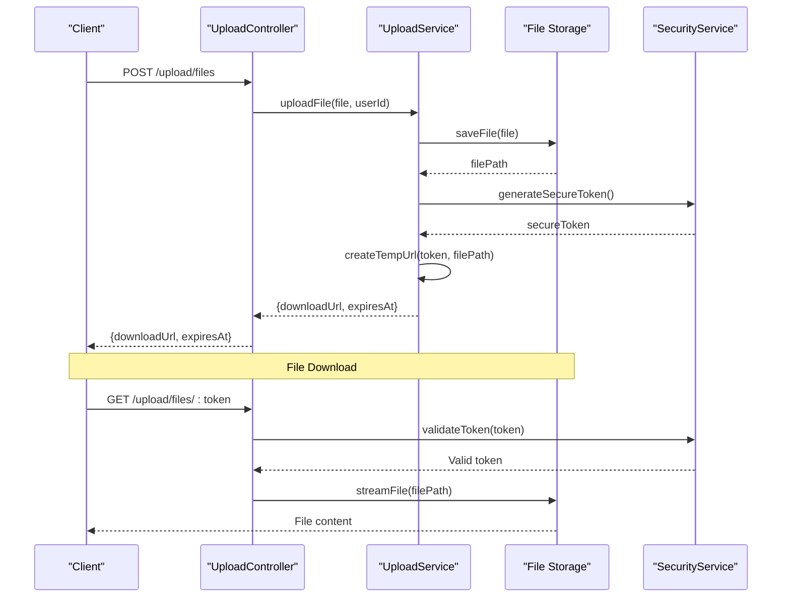
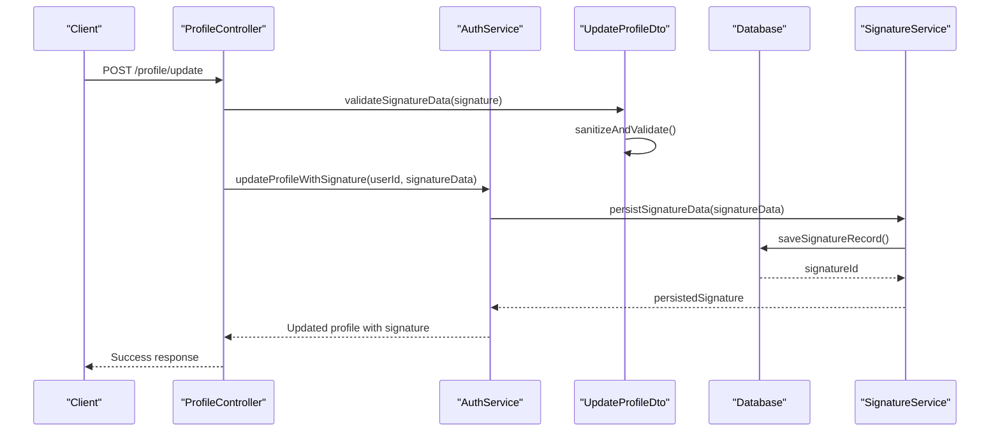
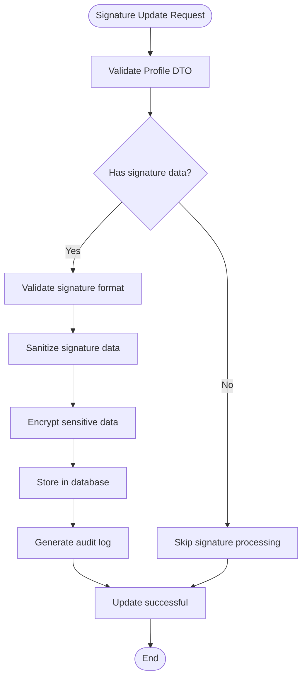

# Security and Authentication

<cite>
**Referenced Files in This Document**
- [auth.controller.ts](file://API/src/modules/auth/auth.controller.ts)
- [auth.service.ts](file://API/src/modules/auth/auth.service.ts)
- [jwt.strategy.ts](file://API/src/modules/auth/strategies/jwt.strategy.ts)
- [roles.guard.ts](file://API/src/common/guards/roles.guard.ts)
- [roles.decorator.ts](file://API/src/common/decorators/roles.decorator.ts)
- [current-user.decorator.ts](file://API/src/common/decorators/current-user.decorator.ts)
- [main.ts](file://API/src/main.ts)
- [app.module.ts](file://API/src/app.module.ts)
- [api.ts](file://src/services/api.ts)
- [auth.service.ts](file://src/services/auth.service.ts)
- [jwt.ts](file://src/utils/jwt.ts)
- [update-profile.dto.ts](file://API/src/modules/auth/dto/update-profile.dto.ts)
</cite>

## Update Summary
**Changes Made**
- Added signature data persistence functionality to authentication services
- Enhanced profile DTOs to support signature data handling
- Updated authentication service methods for signature management
- Added new sections covering signature data workflows and security considerations

## Table of Contents
1. JWT Authentication Flow
2. User Registration
3. Login and Refresh Token
4. RBAC (Roles and Permissions)
5. CORS and Helmet
6. Endpoint Protection
7. Temporary URLs for Files
8. Signature Data Persistence
9. Security Best Practices

## JWT Authentication Flow

The system implements JWT-based authentication following security best practices. The complete flow involves token generation, validation, and renewal with controlled expiration.

### JWT System Architecture



**Diagram sources**
- [auth.controller.ts:1-50](file://API/src/modules/auth/auth.controller.ts#L1-L50)
- [auth.service.ts:1-100](file://API/src/modules/auth/auth.service.ts#L1-L100)
- [jwt.strategy.ts:1-80](file://API/src/modules/auth/strategies/jwt.strategy.ts#L1-L80)

### JWT Payload Structure

The JWT token contains the following structured payload:

| Field | Type | Description | Example |
|-------|------|-------------|---------|
| sub | string | Unique user ID (UUID) | "550e8400-e29b-41d4-a716-446655440000" |
| email | string | User email | "user@example.com" |
| role | string | User role (ADMIN, HR, STANDARD) | "STANDARD" |
| iat | number | Issuance timestamp | 1640995200 |
| exp | number | Expiration timestamp | 1641081600 |

**Section sources**
- [jwt.strategy.ts:20-40](file://API/src/modules/auth/strategies/jwt.strategy.ts#L20-L40)
- [auth.service.ts:60-90](file://API/src/modules/auth/auth.service.ts#L60-L90)

## User Registration

The user registration system implements rigorous validations and secure account creation flows.

### Registration Flow



**Diagram sources**
- [auth.controller.ts:15-35](file://API/src/modules/auth/auth.controller.ts#L15-L35)
- [auth.service.ts:25-55](file://API/src/modules/auth/auth.service.ts#L25-L55)

### Implemented Validations

The system implements the following validations during registration:

- **Email Validation**: Valid format and uniqueness in database
- **Password Strength**: Minimum 8 characters, including uppercase, lowercase, and numbers
- **Required Data**: Full name, email, and password are mandatory fields
- **Input Sanitization**: Removal of malicious characters and data normalization

**Section sources**
- [register.dto.ts:1-30](file://API/src/modules/auth/dto/register.dto.ts#L1-L30)
- [auth.service.ts:30-50](file://API/src/modules/auth/auth.service.ts#L30-L50)

## Login and Refresh Token

The login system implements secure authentication with refresh token support for automatic session renewal.

### Authentication Flow



**Diagram sources**
- [auth.controller.ts:40-70](file://API/src/modules/auth/auth.controller.ts#L40-L70)
- [auth.service.ts:80-120](file://API/src/modules/auth/auth.service.ts#L80-L120)

### Token Configuration

| Configuration | Value | Description |
|--------------|-------|-------------|
| AccessToken TTL | 15 minutes | Access token lifetime |
| RefreshToken TTL | 7 days | Refresh token lifetime |
| Algorithm | HS256 | JWT signing algorithm |
| Secret Key | Environment Variable | Secret key stored in environment variables |

**Section sources**
- [auth.service.ts:100-140](file://API/src/modules/auth/auth.service.ts#L100-L140)
- [env.validation.ts:1-50](file://API/src/config/env.validation.ts#L1-L50)

## RBAC (Roles and Permissions)

The system implements Role-Based Access Control (RBAC) with three distinct access levels.

### Role Hierarchy



**Diagram sources**
- [roles.decorator.ts:1-40](file://API/src/common/decorators/roles.decorator.ts#L1-L40)
- [roles.guard.ts:1-60](file://API/src/common/guards/roles.guard.ts#L1-L60)

### Guard Implementation

The RolesGuard verifies user permissions before accessing protected endpoints:



**Diagram sources**
- [roles.guard.ts:20-50](file://API/src/common/guards/roles.guard.ts#L20-50)

### Decorator Usage

Decorators are applied in controllers to protect specific endpoints:

```typescript
// Example usage in controllers
@Roles(Role.ADMIN)
@Post('admin-only')
adminEndpoint() { ... }

@Roles(Role.HR, Role.ADMIN)
@Get('users')
getUsers() { ... }

@Roles(Role.STANDARD, Role.HR, Role.ADMIN)
@Get('public-resource')
publicResource() { ... }
```

**Section sources**
- [roles.decorator.ts:15-35](file://API/src/common/decorators/roles.decorator.ts#L15-L35)
- [roles.guard.ts:30-60](file://API/src/common/guards/roles.guard.ts#L30-L60)

## CORS and Helmet

The system configures HTTP security policies using CORS and Helmet for protection against common vulnerabilities.

### CORS Configuration



**Diagram sources**
- [main.ts:20-40](file://API/src/main.ts#L20-40)
- [app.module.ts:10-30](file://API/src/app.module.ts#L10-30)

### Implemented Security Policies

| Policy | Configuration | Purpose |
|----------|--------------|-----------|
| CORS Origins | Whitelist of domains | Restrict origins that can make requests |
| Methods | GET, POST, PUT, DELETE | Limit allowed HTTP methods |
| Headers | Authorization, Content-Type | Specific headers for secure communication |
| Credentials | Enabled | Allow cookies and authenticated credentials |
| X-Content-Type-Options | nosniff | Prevent MIME type sniffing |
| X-Frame-Options | DENY | Block iframe embedding |
| Strict-Transport-Security | max-age=31536000 | Force HTTPS for 1 year |
| Content-Security-Policy | Default-src 'self' | Restrict content sources |

**Section sources**
- [main.ts:25-45](file://API/src/main.ts#L25-45)

## Endpoint Protection

The system implements multiple layers of protection to ensure API endpoint security.

### Security Layers



**Diagram sources**
- [auth.controller.ts:1-30](file://API/src/modules/auth/auth.controller.ts#L1-30)
- [roles.guard.ts:1-40](file://API/src/common/guards/roles.guard.ts#L1-40)

### Security Middleware

The system uses middleware to apply global security policies:

- **Logging Interceptor**: Records all requests and responses
- **Transform Interceptor**: Standardizes response formats
- **HTTP Exception Filter**: Centralized error handling
- **Rate Limiting**: Prevents brute force attacks

**Section sources**
- [logging.interceptor.ts:1-50](file://API/src/common/interceptors/logging.interceptor.ts#L1-50)
- [transform.interceptor.ts:1-40](file://API/src/common/interceptors/transform.interceptor.ts#L1-40)
- [http-exception.filter.ts:1-60](file://API/src/common/filters/http-exception.filter.ts#L1-60)

## Temporary URLs for Files

The system implements secure temporary URLs for accessing uploaded files, ensuring access control and auditing.

### File Access Flow



**Diagram sources**
- [upload.controller.ts:1-50](file://API/src/modules/upload/upload.controller.ts#L1-50)
- [upload.service.ts:1-80](file://API/src/modules/upload/upload.service.ts#L1-80)

### Temporary URL Security

| Configuration | Value | Description |
|--------------|-------|-------------|
| Token Length | 32 characters | Secure generated token size |
| Expiration | 1 hour | Maximum URL validity time |
| Usage Limit | 1 download | Each URL can be used only once |
| IP Binding | Optional | Binding to requester's IP |
| Audit Logging | Enabled | Recording all accesses |

### File Validation

The system implements rigorous validations for uploads:

- **MIME Type Validation**: Only allowed file types
- **Size Limits**: Maximum size limit (10MB default)
- **Virus Scanning**: Anti-malware verification
- **Metadata Stripping**: Removal of sensitive metadata

**Section sources**
- [multer.config.ts:1-40](file://API/src/modules/upload/multer.config.ts#L1-40)
- [upload.service.ts:40-80](file://API/src/modules/upload/upload.service.ts#L40-80)

## Signature Data Persistence

**Updated** Enhanced authentication services now support comprehensive signature data persistence through updated profile DTOs and modified authentication service methods.

### Signature Data Architecture



**Diagram sources**
- [auth.service.ts:120-180](file://API/src/modules/auth/auth.service.ts#L120-180)
- [update-profile.dto.ts:1-50](file://API/src/modules/auth/dto/update-profile.dto.ts#L1-50)

### Enhanced Profile DTOs

The updated profile DTOs now include comprehensive signature data handling:

| Field | Type | Description | Validation |
|-------|------|-------------|------------|
| signature | Object | Digital signature data | Required when updating signatures |
| signatureType | string | Type of signature (image, text, digital) | Enum validation |
| signatureData | string | Base64 encoded signature data | Max length validation |
| signatureTimestamp | Date | Timestamp of signature creation | ISO date format |
| signatureMetadata | Object | Additional signature metadata | JSON validation |

### Signature Persistence Workflow



**Diagram sources**
- [auth.service.ts:150-200](file://API/src/modules/auth/auth.service.ts#L150-200)
- [update-profile.dto.ts:20-40](file://API/src/modules/auth/dto/update-profile.dto.ts#L20-40)

### Security Considerations for Signature Data

- **Encryption at Rest**: All signature data is encrypted before storage
- **Access Control**: Signature updates require appropriate user permissions
- **Audit Trail**: Complete logging of all signature operations
- **Data Validation**: Rigorous input validation prevents injection attacks
- **Backup Integration**: Signature data included in regular backup procedures

**Section sources**
- [auth.service.ts:120-200](file://API/src/modules/auth/auth.service.ts#L120-200)
- [update-profile.dto.ts:1-50](file://API/src/modules/auth/dto/update-profile.dto.ts#L1-50)

## Security Best Practices

### Recommended Implementation

1. **Secure Secrets Storage**: Use environment variables and secrets management services
2. **Input Validation**: Always validate and sanitize client inputs
3. **HTTPS Only**: Enforce HTTPS connections in production
4. **Rate Limiting**: Implement request limits per IP/user
5. **Audit Logging**: Record all sensitive actions
6. **Regular Updates**: Keep dependencies updated
7. **Security Headers**: Configure appropriate security headers
8. **CORS Whitelist**: Explicitly list allowed domains

### Monitoring and Alerts

- **Failed Login Attempts**: Alert after consecutive failed attempts
- **Privilege Escalation**: Monitor permission changes
- **Suspicious Activity**: Detect anomalous behavior patterns
- **Performance Metrics**: Monitor response times of sensitive endpoints

**Section sources**
- [env.validation.ts:1-50](file://API/src/config/env.validation.ts#L1-50)
- [logging.interceptor.ts:20-50](file://API/src/common/interceptors/logging.interceptor.ts#L20-50)