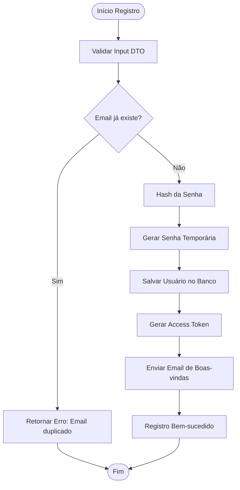
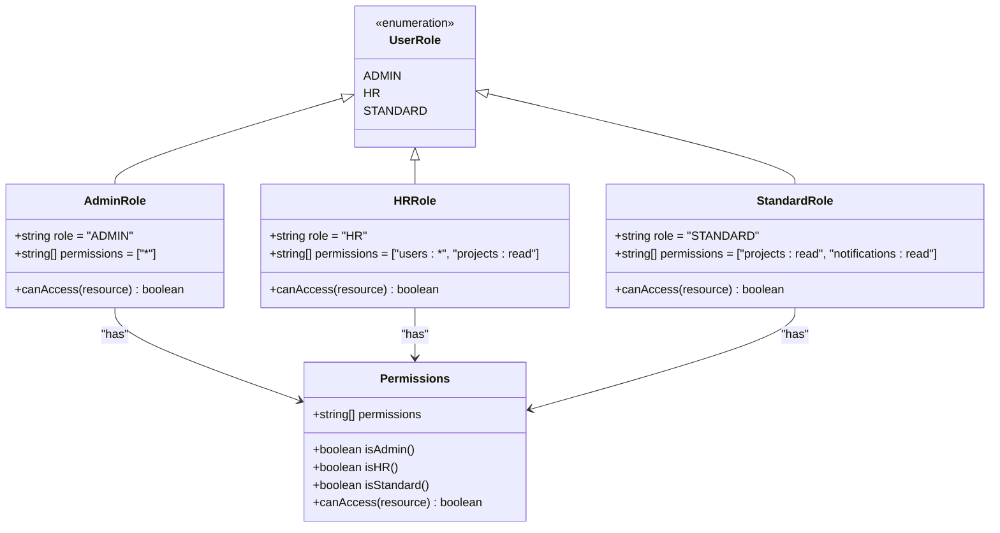
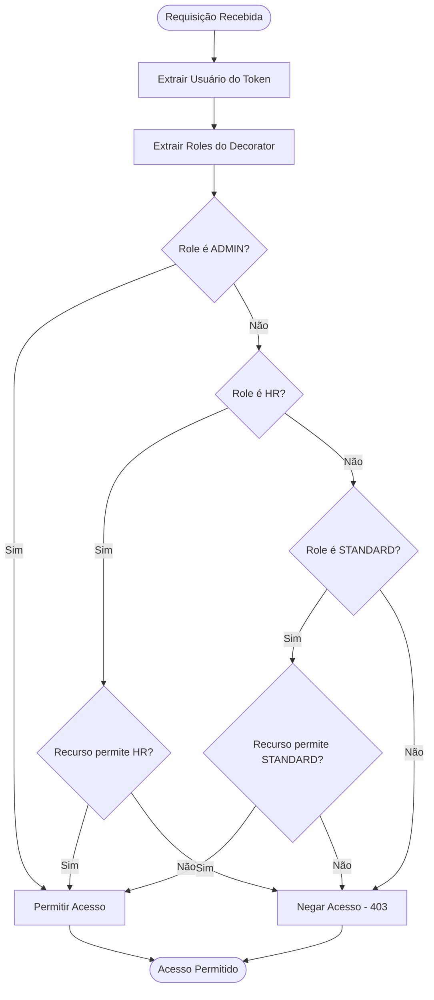
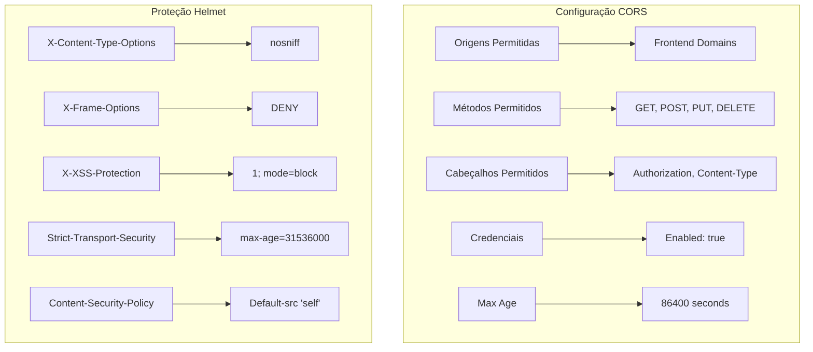
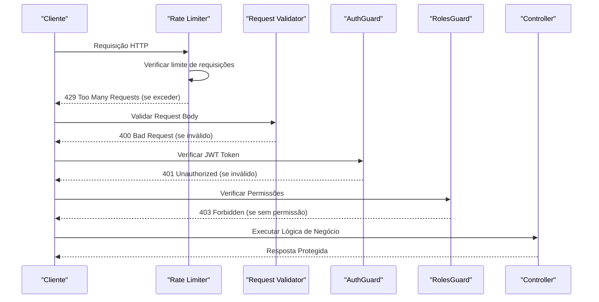
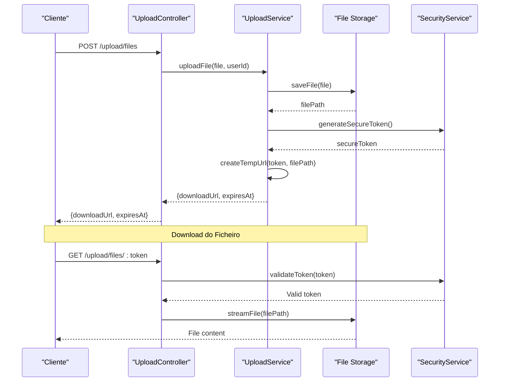

# Segurança e Autenticação

<cite>
**Referenced Files in This Document**
- [auth.controller.ts](file://API/src/modules/auth/auth.controller.ts)
- [auth.service.ts](file://API/src/modules/auth/auth.service.ts)
- [jwt.strategy.ts](file://API/src/modules/auth/strategies/jwt.strategy.ts)
- [roles.guard.ts](file://API/src/common/guards/roles.guard.ts)
- [roles.decorator.ts](file://API/src/common/decorators/roles.decorator.ts)
- [current-user.decorator.ts](file://API/src/common/decorators/current-user.decorator.ts)
- [main.ts](file://API/src/main.ts)
- [app.module.ts](file://API/src/app.module.ts)
- [api.ts](file://src/services/api.ts)
- [auth.service.ts](file://src/services/auth.service.ts)
- [jwt.ts](file://src/utils/jwt.ts)
</cite>

## Table of Contents
1. Fluxo de Autenticação JWT
2. Registro de Usuário
3. Login e Refresh Token
4. RBAC (Roles e Permissões)
5. CORS e Helmet
6. Proteção de Endpoints
7. URLs Temporárias para Ficheiros

## Fluxo de Autenticação JWT

O sistema implementa autenticação baseada em JWT (JSON Web Tokens) seguindo as melhores práticas de segurança. O fluxo completo envolve geração, validação e renovação de tokens com expiração controlada.

### Arquitetura do Sistema JWT


**Diagram sources**
- [auth.controller.ts:1-50](file://API/src/modules/auth/auth.controller.ts#L1-L50)
- [auth.service.ts:1-100](file://API/src/modules/auth/auth.service.ts#L1-L100)
- [jwt.strategy.ts:1-80](file://API/src/modules/auth/strategies/jwt.strategy.ts#L1-L80)

### Estrutura do Payload JWT

O token JWT contém o seguinte payload estruturado:

| Campo | Tipo | Descrição | Exemplo |
|-------|------|-----------|---------|
| sub | string | ID único do usuário (UUID) | "550e8400-e29b-41d4-a716-446655440000" |
| email | string | Email do usuário | "user@example.com" |
| role | string | Role do usuário (ADMIN, HR, STANDARD) | "STANDARD" |
| iat | number | Timestamp de emissão | 1640995200 |
| exp | number | Timestamp de expiração | 1641081600 |

**Section sources**
- [jwt.strategy.ts:20-40](file://API/src/modules/auth/strategies/jwt.strategy.ts#L20-L40)
- [auth.service.ts:60-90](file://API/src/modules/auth/auth.service.ts#L60-L90)

## Registro de Usuário

O sistema de registro de usuários implementa validações rigorosas e fluxos seguros de criação de contas.

### Fluxo de Registro



**Diagram sources**
- [auth.controller.ts:15-35](file://API/src/modules/auth/auth.controller.ts#L15-L35)
- [auth.service.ts:25-55](file://API/src/modules/auth/auth.service.ts#L25-L55)

### Validações Implementadas

O sistema implementa as seguintes validações durante o registro:

- **Validação de Email**: Formato válido e unicidade no banco de dados
- **Força de Senha**: Mínimo de 8 caracteres, incluindo letras maiúsculas, minúsculas e números
- **Dados Obrigatórios**: Nome completo, email e senha são campos obrigatórios
- **Sanitização de Input**: Remoção de caracteres maliciosos e normalização de dados

**Section sources**
- [register.dto.ts:1-30](file://API/src/modules/auth/dto/register.dto.ts#L1-L30)
- [auth.service.ts:30-50](file://API/src/modules/auth/auth.service.ts#L30-L50)

## Login e Refresh Token

O sistema de login implementa autenticação segura com suporte a refresh tokens para renovação automática de sessões.

### Fluxo de Autenticação


**Diagram sources**
- [auth.controller.ts:40-70](file://API/src/modules/auth/auth.controller.ts#L40-L70)
- [auth.service.ts:80-120](file://API/src/modules/auth/auth.service.ts#L80-L120)

### Configuração de Tokens

| Configuração | Valor | Descrição |
|--------------|-------|-----------|
| AccessToken TTL | 15 minutos | Tempo de vida do access token |
| RefreshToken TTL | 7 dias | Tempo de vida do refresh token |
| Algorithm | HS256 | Algoritmo de assinatura JWT |
| Secret Key | Environment Variable | Chave secreta armazenada em variáveis de ambiente |

**Section sources**
- [auth.service.ts:100-140](file://API/src/modules/auth/auth.service.ts#L100-L140)
- [env.validation.ts:1-50](file://API/src/config/env.validation.ts#L1-L50)

## RBAC (Roles e Permissões)

O sistema implementa Controle Baseado em Funções (RBAC) com três níveis de acesso distintos.

### Hierarquia de Roles



**Diagram sources**
- [roles.decorator.ts:1-40](file://API/src/common/decorators/roles.decorator.ts#L1-L40)
- [roles.guard.ts:1-60](file://API/src/common/guards/roles.guard.ts#L1-L60)

### Implementação do Guard

O RolesGuard verifica as permissões do usuário antes de acessar endpoints protegidos:



**Diagram sources**
- [roles.guard.ts:20-50](file://API/src/common/guards/roles.guard.ts#L20-L50)

### Uso dos Decoradores

Os decorators são aplicados nos controllers para proteger endpoints específicos:

```typescript
// Exemplo de uso nos controllers
@Roles(Role.ADMIN)
@Post('admin-only')
adminEndpoint() { ... }

@Roles(Role.HR, Role.ADMIN)
@Get('users')
getUsers() { ... }

@Roles(Role.STANDARD, Role.HR, Role.ADMIN)
@Get('public-resource')
publicResource() { ... }
```

**Section sources**
- [roles.decorator.ts:15-35](file://API/src/common/decorators/roles.decorator.ts#L15-L35)
- [roles.guard.ts:30-60](file://API/src/common/guards/roles.guard.ts#L30-L60)

## CORS e Helmet

O sistema configura políticas de segurança HTTP usando CORS e Helmet para proteção contra vulnerabilidades comuns.

### Configuração CORS



**Diagram sources**
- [main.ts:20-40](file://API/src/main.ts#L20-L40)
- [app.module.ts:10-30](file://API/src/app.module.ts#L10-L30)

### Políticas de Segurança Implementadas

| Política | Configuração | Propósito |
|----------|--------------|-----------|
| CORS Origins | Lista branca de domínios | Restringir origens que podem fazer requisições |
| Methods | GET, POST, PUT, DELETE | Limitar métodos HTTP permitidos |
| Headers | Authorization, Content-Type | Cabeçalhos específicos para comunicação segura |
| Credentials | Enabled | Permitir cookies e credenciais autenticadas |
| X-Content-Type-Options | nosniff | Prevenir sniffing de MIME type |
| X-Frame-Options | DENY | Bloquear iframe embedding |
| Strict-Transport-Security | max-age=31536000 | Forçar HTTPS por 1 ano |
| Content-Security-Policy | Default-src 'self' | Restringir fontes de conteúdo |

**Section sources**
- [main.ts:25-45](file://API/src/main.ts#L25-L45)

## Proteção de Endpoints

O sistema implementa múltiplas camadas de proteção para garantir a segurança dos endpoints da API.

### Camadas de Segurança



**Diagram sources**
- [auth.controller.ts:1-30](file://API/src/modules/auth/auth.controller.ts#L1-L30)
- [roles.guard.ts:1-40](file://API/src/common/guards/roles.guard.ts#L1-L40)

### Middleware de Segurança

O sistema utiliza middleware para aplicar políticas de segurança globalmente:

- **Logging Interceptor**: Registra todas as requisições e respostas
- **Transform Interceptor**: Padroniza formatos de resposta
- **HTTP Exception Filter**: Centraliza tratamento de erros
- **Rate Limiting**: Previne ataques de força bruta

**Section sources**
- [logging.interceptor.ts:1-50](file://API/src/common/interceptors/logging.interceptor.ts#L1-L50)
- [transform.interceptor.ts:1-40](file://API/src/common/interceptors/transform.interceptor.ts#L1-L40)
- [http-exception.filter.ts:1-60](file://API/src/common/filters/http-exception.filter.ts#L1-L60)

## URLs Temporárias para Ficheiros

O sistema implementa URLs temporárias seguras para acesso a ficheiros uploadados, garantindo controle de acesso e auditoria.

### Fluxo de Acesso a Ficheiros



**Diagram sources**
- [upload.controller.ts:1-50](file://API/src/modules/upload/upload.controller.ts#L1-L50)
- [upload.service.ts:1-80](file://API/src/modules/upload/upload.service.ts#L1-L80)

### Segurança de URLs Temporárias

| Configuração | Valor | Descrição |
|--------------|-------|-----------|
| Token Length | 32 caracteres | Tamanho seguro do token gerado |
| Expiration | 1 hora | Tempo máximo de validade da URL |
| Usage Limit | 1 download | Cada URL pode ser usada apenas uma vez |
| IP Binding | Optional | Vinculação ao IP do solicitante |
| Audit Logging | Enabled | Registro de todos os acessos |

### Validação de Arquivos

O sistema implementa validações rigorosas para uploads:

- **MIME Type Validation**: Apenas tipos de ficheiros permitidos
- **Size Limits**: Limite máximo de tamanho (10MB padrão)
- **Virus Scanning**: Verificação anti-malware
- **Metadata Stripping**: Remoção de metadados sensíveis

**Section sources**
- [multer.config.ts:1-40](file://API/src/modules/upload/multer.config.ts#L1-L40)
- [upload.service.ts:40-80](file://API/src/modules/upload/upload.service.ts#L40-L80)

## Boas Práticas de Segurança

### Implementação Recomendada

1. **Armazenamento Seguro de Secrets**: Usar variáveis de ambiente e serviços de secrets management
2. **Validação de Input**: Sempre validar e sanitizar inputs do cliente
3. **HTTPS Only**: Forçar conexões HTTPS em produção
4. **Rate Limiting**: Implementar limites de requisições por IP/usuário
5. **Audit Logging**: Registrar todas as ações sensíveis
6. **Regular Updates**: Manter dependências atualizadas
7. **Security Headers**: Configurar headers de segurança adequados
8. **CORS Whitelist**: Listar explicitamente domínios permitidos

### Monitoramento e Alertas

- **Failed Login Attempts**: Alertar após tentativas falhas consecutivas
- **Privilege Escalation**: Monitorar mudanças de permissões
- **Suspicious Activity**: Detectar padrões de comportamento anômalos
- **Performance Metrics**: Monitorar tempo de resposta de endpoints sensíveis

**Section sources**
- [env.validation.ts:1-50](file://API/src/config/env.validation.ts#L1-L50)
- [logging.interceptor.ts:20-50](file://API/src/common/interceptors/logging.interceptor.ts#L20-L50)