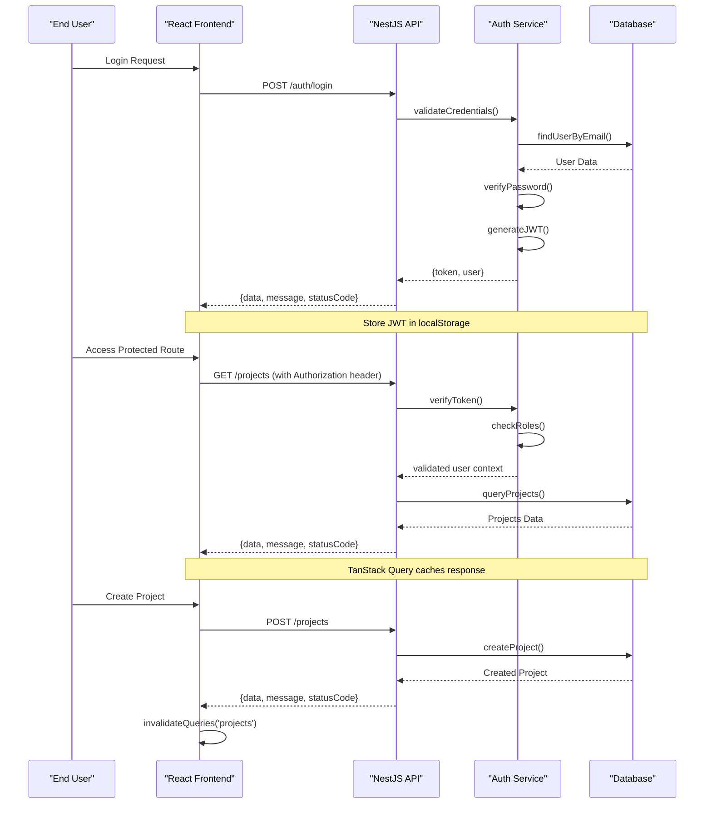

# Project Overview

<cite>
**Referenced Files in This Document**
- [API/src/main.ts](file://API/src/main.ts)
- [API/src/app.module.ts](file://API/src/app.module.ts)
- [API/prisma/schema.prisma](file://API/prisma/schema.prisma)
- [src/App.tsx](file://src/App.tsx)
- [src/main.tsx](file://src/main.tsx)
- [API/src/modules/auth/auth.controller.ts](file://API/src/modules/auth/auth.controller.ts)
- [API/src/modules/projects/projects.controller.ts](file://API/src/modules/projects/projects.controller.ts)
- [API/src/modules/users/users.controller.ts](file://API/src/modules/users/users.controller.ts)
- [API/src/common/guards/roles.guard.ts](file://API/src/common/guards/roles.guard.ts)
- [API/src/common/decorators/roles.decorator.ts](file://API/src/common/decorators/roles.decorator.ts)
- [API/src/config/env.validation.ts](file://API/src/config/env.validation.ts)
- [API/src/database/prisma.service.ts](file://API/src/database/prisma.service.ts)
- [src/services/api.ts](file://src/services/api.ts)
- [src/services/auth.service.ts](file://src/services/auth.service.ts)
- [src/i18n/index.ts](file://src/i18n/index.ts)
</cite>

## Application Objective
Windlog is a comprehensive web-based management system designed specifically for wind energy technicians. The application serves as a centralized platform for managing wind energy projects, user profiles, system logs, notifications, and administrative functions. It provides a complete solution for wind energy professionals to manage their technical operations, collaborate on projects, and maintain comprehensive records of their work in the renewable energy sector.

The system focuses on streamlining wind energy project management through intuitive interfaces, robust data handling, and secure authentication mechanisms tailored for technical professionals working in the wind energy industry.

## Target Audience and Roles
Windlog targets three distinct user roles within the wind energy ecosystem:

### ADMIN Role (Full Access)
Administrators have complete system access including user management, project administration, system configuration, and monitoring capabilities. They can manage all aspects of the platform including user accounts, project settings, system logs, and global configurations.

### HR Role (People Management)
Human Resources personnel focus on user management, profile administration, and organizational structure. They can manage user accounts, handle profile completions, certifications, and user-related administrative tasks without accessing sensitive system configurations.

### STANDARD Role (Restricted Access)
Standard users are wind energy technicians who primarily interact with project management features, personal profiles, and operational tools. Their access is limited to project-related functionalities and personal account management.

The role-based access control (RBAC) system ensures appropriate permissions through JWT token validation and decorator-based authorization checks.

## General Architecture (Monorepo)
Windlog follows a modern monorepo architecture separating frontend and backend concerns while maintaining clear communication boundaries:

```mermaid
graph TB
subgraph "Frontend (React + Vite)"
UI[User Interface<br/>React Components]
Router[Client Router<br/>Page Navigation]
Services[API Services<br/>HTTP Client Layer]
State[State Management<br/>TanStack Query]
i18n[Internationalization<br/>Multi-language Support]
end
subgraph "Backend (NestJS)"
API[REST API Server<br/>Express.js Based]
Auth[Authentication Module<br/>JWT Bearer Tokens]
RBAC[Role-Based Access Control<br/>@Roles() Decorators]
Database[Database Layer<br/>Prisma ORM]
Storage[File Storage<br/>Multer Uploads]
Logging[System Logging<br/>Audit Trail]
end
subgraph "Infrastructure"
DB[(PostgreSQL Database)]
Cache[Session Cache<br/>Redis Optional]
StorageFS[File System<br/>Secure File Storage]
end
UI --> Router
Router --> Services
Services --> State
Services --> i18n
Services --> API
API --> Auth
API --> RBAC
API --> Database
API --> Storage
API --> Logging
Database --> DB
Storage --> StorageFS
```

**Diagram sources**
- [API/src/main.ts:1-50](file://API/src/main.ts#L1-L50)
- [src/App.tsx:1-30](file://src/App.tsx#L1-L30)
- [API/src/app.module.ts:1-40](file://API/src/app.module.ts#L1-L40)

The architecture emphasizes separation of concerns with clear module boundaries, standardized API responses, and comprehensive error handling throughout the stack.

## Technology Stack
Windlog leverages modern, production-ready technologies optimized for performance and developer experience:

### Backend Technologies
- **NestJS**: Enterprise-grade Node.js framework providing structured architecture with dependency injection
- **TypeScript**: Type-safe JavaScript development with enhanced IDE support
- **Prisma ORM**: Modern database toolkit with type-safe queries and schema management
- **PostgreSQL**: Robust relational database with UUID support and JSON capabilities
- **JWT Authentication**: Secure token-based authentication with role-based authorization
- **Multer**: File upload handling with MIME type validation and size restrictions
- **Swagger/OpenAPI**: Comprehensive API documentation generation

### Frontend Technologies  
- **React 18**: Modern component-based UI library with hooks and concurrent features
- **Vite**: Lightning-fast build tool and development server
- **TypeScript**: Full type safety across the entire frontend codebase
- **TanStack Query**: Advanced data fetching, caching, and state synchronization
- **Tailwind CSS v4**: Utility-first CSS framework with Apple-inspired design principles
- **i18next**: Internationalization framework supporting multiple languages
- **React Router**: Client-side routing with nested routes and lazy loading

### Development & Infrastructure
- **Docker**: Containerized deployment environment
- **ESLint + Prettier**: Code quality and formatting standards
- **Jest**: Unit testing framework with comprehensive coverage
- **GitHub Actions**: CI/CD pipeline automation
- **Environment Validation**: Runtime configuration validation and security

**Section sources**
- [API/src/main.ts:1-100](file://API/src/main.ts#L1-L100)
- [src/main.tsx:1-50](file://src/main.tsx#L1-L50)
- [API/src/config/env.validation.ts:1-80](file://API/src/config/env.validation.ts#L1-L80)
- [API/src/database/prisma.service.ts:1-60](file://API/src/database/prisma.service.ts#L1-L60)

## General Application Flow
Windlog implements a comprehensive user journey from authentication through core functionality:



**Diagram sources**
- [API/src/modules/auth/auth.controller.ts:1-120](file://API/src/modules/auth/auth.controller.ts#L1-L120)
- [src/services/auth.service.ts:1-100](file://src/services/auth.service.ts#L1-L100)
- [API/src/modules/projects/projects.controller.ts:1-80](file://API/src/modules/projects/projects.controller.ts#L1-L80)

### Key Workflow Characteristics:
- **Authentication Flow**: JWT-based with bearer tokens containing user ID, email, and role information
- **Data Fetching**: TanStack Query manages caching, background updates, and optimistic updates
- **Error Handling**: Centralized exception filters with standardized error response format
- **File Uploads**: Secure multipart uploads with MIME validation and temporary URL generation
- **Internationalization**: Complete multi-language support with dynamic locale switching
- **Logging**: Comprehensive audit trail capturing user actions, IP addresses, and timestamps

The application maintains consistency through standardized DTOs, interceptors for request/response transformation, and comprehensive validation at every layer of the stack.